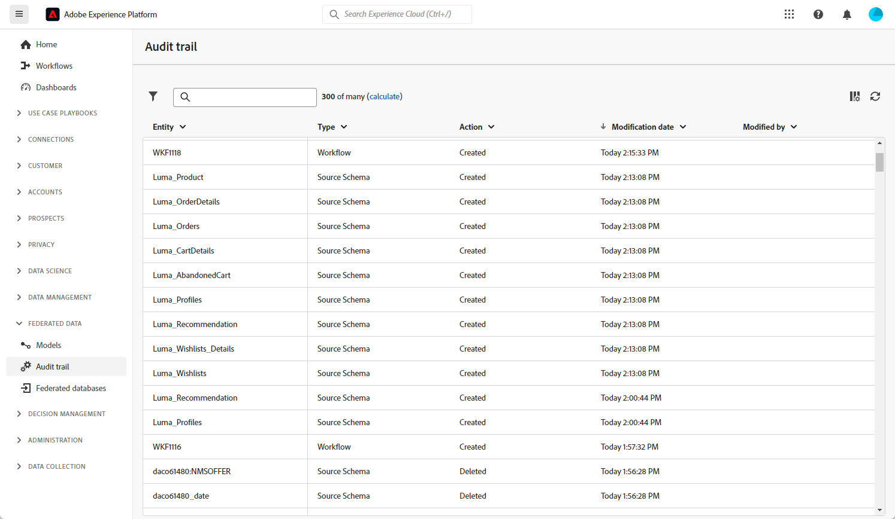

# 稽核軌跡 {#audit-trail}

>[!CONTEXTUALHELP]
>id="dc_audit_trail"
>title="稽核軌跡"
>abstract="稽核軌跡功能會針對您在 Adobe Experience Platform 聯合客群組成環境的所有動作和事件，即時提供按時間順序排列的詳細記錄。"

**[!UICONTROL 稽核軌跡]**&#x200B;功能會持續即時記錄Adobe Federated Composition執行個體中發生的動作和事件的詳細記錄。 它提供一種便利的方法，可存取按時間順序排列的資料記錄，並解決以下查詢：工作流程的狀態、要修改它們的最新個人，或使用者在執行個體內執行的活動。

+++ 深入瞭解稽核軌跡可用實體

* **Source結構描述稽核軌跡**&#x200B;可讓您在Adobe同盟對象構成執行個體中監視活動以及最近對結構描述所做的修改。

  如需結構描述的詳細資訊，請參閱此[頁面](../customer/schemas.md)。

* **工作流程稽核軌跡**&#x200B;可讓您追蹤活動及最近對工作流程所做的變更，包括其目前狀態，例如：

   * 開始
   * 暫停
   * 停止
   * 重新啟動
   * 清除等於動作清除歷史記錄
   * 模擬在模擬模式下等於動作「開始」的專案
   * 立即喚醒等於動作執行擱置中的工作
   * 無條件停止

  如需工作流程的詳細資訊，請參閱此[頁面](../compositions/gs-compositions.md)。

* **外部帳戶**&#x200B;可讓您檢查對Adobe對象構成執行個體中的外部帳戶所做的修改。

  如需外部帳戶的詳細資訊，請參閱此[頁面](../connections/federated-db.md)。

+++

## 存取稽核軌跡 {#accessing-audit-trail}

若要存取執行個體的&#x200B;**[!UICONTROL 稽核軌跡]**：

1. 在&#x200B;**[!UICONTROL 同盟資料]**&#x200B;功能表下，選取&#x200B;**[!UICONTROL 稽核軌跡]**。

1. **[!UICONTROL 稽核軌跡]**&#x200B;視窗會開啟，其中包含您實體的清單。 Federated Audience Composition會稽核工作流程、選項、傳遞和結構的建立、編輯和刪除動作。

   

1. **[!UICONTROL 稽核實體]**&#x200B;視窗會提供您所選實體的詳細資訊，例如：

   * **[!UICONTROL 型別]**：工作流程、選項、傳遞或結構描述。
   * **[!UICONTROL 實體]**：活動的內部名稱。
   * **[!UICONTROL 修改者]**：上次修改此實體的人員使用者名稱。
   * **[!UICONTROL 動作]**：此實體上執行的最後一個動作，已建立、已修改或已刪除。
   * **[!UICONTROL 修改日期]**：在此實體上執行最後動作的日期。
