# 活動概觀

在Federated Audience Composition中，您可以新增有助於定義對象的活動和轉變。

## 活動 {#activities}

活動可讓您定義對象內的元件。

有&#x200B;**兩種**&#x200B;不同型別的活動可用於同盟對象構成：目標定位活動和流量控制活動。

### 目標定位活動 {#targeting}

目標定位活動可讓您定義構成構成對象的內容。

#### 建置客群

>[!CONTEXTUALHELP]
>id="dc_orchestration_build_audience_audienceselector"
>title="客群"
>abstract="選取您的客群。"

**建立對象**&#x200B;活動可讓您定義構成的目標母體。 您可以選取現有客群，或是使用查詢建模工具，定義自己的查詢。

+++ 設定詳細資料

將&#x200B;**建立對象**&#x200B;活動新增至組合畫布後，請為對象命名。 您現在可以指定是要建立對象或使用現有對象。

>[!BEGINTABS]

>[!TAB 建立新對象]

選取&#x200B;**建立對象**&#x200B;之後，請為您的對象選擇&#x200B;**結構描述**。 綱要可讓您定義作業的目標母體，例如收件者、合約受益者、運運算元或訂閱者。 依預設，會從收件者中選取結構。

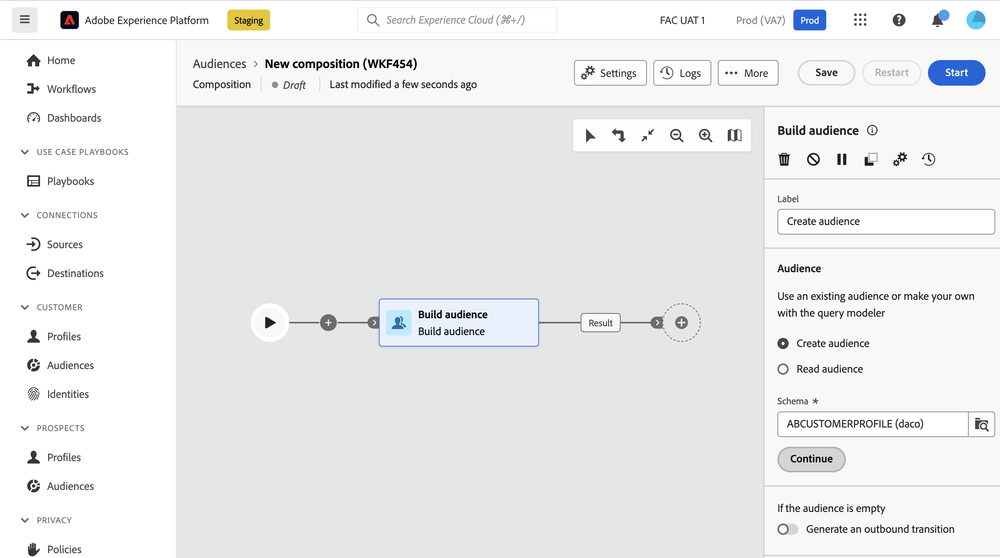

選擇結構描述後，選取&#x200B;**繼續**。 您現在可以在查詢Modeler中定義對象的定義。 如需有關使用「查詢Modeler」的詳細資訊，請閱讀[查詢Modeler概觀](../query/home.md)。

>[!TAB 使用現有的對象]

選取&#x200B;**讀取對象**&#x200B;之後，請選擇&#x200B;**繼續**。

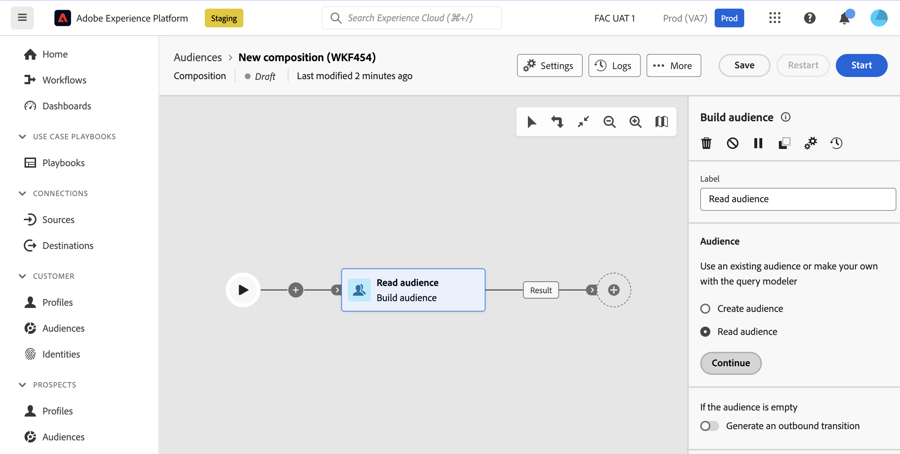

您現在可以選取要用於構成的對象。

>[!ENDTABS]

選取選項之後，您可以選擇&#x200B;**產生出站轉變**。 選取此專案可讓您新增出站轉變，如果對象母體為空，則會在活動執行結束時啟動。

+++

#### 變更資料來源

**變更資料來源**&#x200B;活動可讓您變更構成正在使用的資料來源。

+++ 設定詳細資料

將&#x200B;**變更資料來源**&#x200B;活動新增至構成畫布後，您可以定義將用於構成的資料來源。

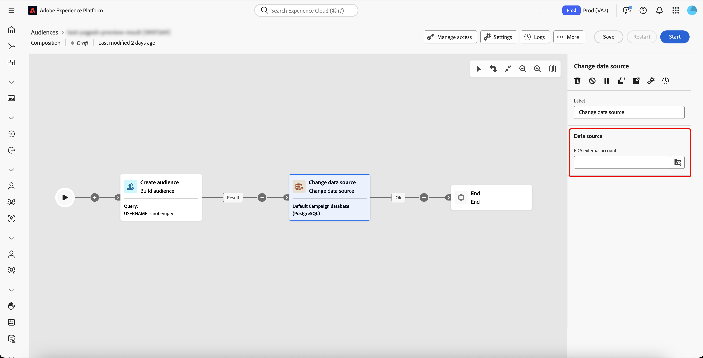{zoomable="yes"}{width="70%"}

| 來源 | 說明 |
| ------ | ----------- |
| FDA外部帳戶 | 外部雲端資料庫已連線至同盟對象構成。 |

選取&#x200B;**[!UICONTROL FDA外部帳戶]**&#x200B;後，您可以選擇您要連線的外部帳戶。

{zoomable="yes"}{width="70%"}

+++

#### 變更維度

>[!CONTEXTUALHELP]
>id="dc_orchestration_dimension_complement"
>title="產生補集"
>abstract="您可以使用剩餘群體 (其已因重複而排除) 產生額外的傳出轉變。若要這樣做，請開啟「**[!UICONTROL 產生補集]**」選項"

>[!CONTEXTUALHELP]
>id="dc_orchestration_change_dimension"
>title="變更維度活動"
>abstract="此活動可讓您在建立客群時變更結構描述 (又名目標市場選擇維度)。此活動會根據資料範本和輸入結構描述來移動軸。例如，您可以從「合約」結構描述切換到「用戶端」結構描述。"

**變更維度**&#x200B;活動可讓您變更構成的結構描述（也稱為目標維度）。

+++ 設定詳細資料

將&#x200B;**變更維度**&#x200B;活動新增至構成畫布後，您可以定義新的結構描述來取代先前的結構描述。 在此結構描述變更期間，將保留所有記錄。

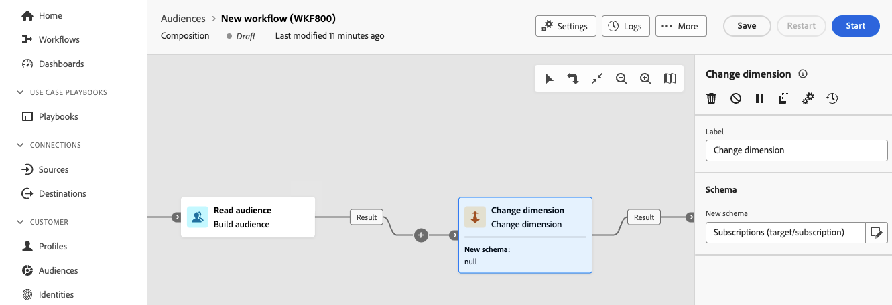

執行構成後，您的結果將會更新。

+++

#### 合併

>[!CONTEXTUALHELP]
>id="dc_orchestration_combine"
>title="組合活動"
>abstract="「**組合**」活動可讓您對傳入群體執行分段。您因此可以組合好幾個群體、排除其中的一部分或僅保留幾個目標通用資料。"

>[!CONTEXTUALHELP]
>id="dc_orchestration_intersection_merging_options"
>title="交集合併選項"
>abstract="「**交集**」活動可讓您僅保留活動中不同傳入群體的通用元素。在「**要加入的集合**」一節中，勾選您之前想要加入的所有活動。"

>[!CONTEXTUALHELP]
>id="dc_orchestration_exclusion_merging_options"
>title="排除合併選項"
>abstract="**排除**&#x200B;可讓您根據特定條件從一個母體中排除元素。 在「**要加入的集合**」一節中，勾選您之前想要加入的所有活動。"

>[!CONTEXTUALHELP]
>id="dc_orchestration_combine_options"
>title="選取分段類型"
>abstract="選取如何合併對象：聯合、交集或排除。"

>[!CONTEXTUALHELP]
>id="dc_orchestration_intersection_reconciliation_options"
>title="交集調和選項"
>abstract="選取調和類型，以定義處理重複項目的方式。"

>[!CONTEXTUALHELP]
>id="dc_orchestration_combine_reconciliation"
>title="調和選項"
>abstract="選取「**調解類型**」，以定義處理重複項目的方式。"

>[!CONTEXTUALHELP]
>id="dc_orchestration_exclusion_options"
>title="排除規則"
>abstract="如有必要，您可以操控傳入表格。事實上，若要從另一個結構描述 (目標市場選擇維度) 排除目標，必須將此目標傳回到與主要目標相同的結構描述。若要這麼做，請在E **排除規則**&#x200B;區段中選取&#x200B;**新增規則**，並指定結構描述變更條件。 資料調和會透過屬性或加入執行。"

>[!CONTEXTUALHELP]
>id="dc_orchestration_combine_sets"
>title="選取要組合的集合"
>abstract="在「**要加入的集合**」一節中，從傳入轉變中選取「**主要集合**」。這是從中排除元素的集。其他集會先設定相符的元素，然後才會從主要集予以排除。"

>[!CONTEXTUALHELP]
>id="dc_orchestration_combine_exclusion"
>title="排除規則"
>abstract="如有必要，您可以操控傳入表格。事實上，若要從另一個結構描述 (目標市場選擇維度) 排除目標，必須將此目標傳回到與主要目標相同的結構描述。若要這麼做，請在&#x200B;**排除規則**&#x200B;區段中選取&#x200B;**新增規則**，並指定結構描述變更條件。 資料調和會透過屬性或加入執行。"

>[!CONTEXTUALHELP]
>id="dc_orchestration_combine_complement"
>title="合併產生補集"
>abstract="切換開啟「**產生補集**」選項，在額外轉變中處理其餘的群體。"

>[!NOTE]
>
>**組合**&#x200B;活動&#x200B;**必須**&#x200B;放在另一個活動之後，且&#x200B;**不能**&#x200B;放在組合的開頭。

**合併**&#x200B;活動可讓您以各種方式加入多個對象 — 聯合、交集或排除。

- **Union**：聯合會將不同的對象合併為單一對象。 這相當於OR操作。
- **交集**：交集將不同的對象合併為單一對象，只保留&#x200B;**共用的**&#x200B;內容。 這相當於AND作業。
- **排除**：排除專案將不同的對象合併為單一對象，而不使用指定的排除規則。 這相當於XOR操作。

+++ 設定詳細資料

新增多個活動以形成至少&#x200B;**兩個**&#x200B;不同的分支後，將&#x200B;**組合**&#x200B;活動新增到其中一個分支的結尾。 您現在可以選擇其中一個組合選項 — 「聯集」、「交集」或「排除」。

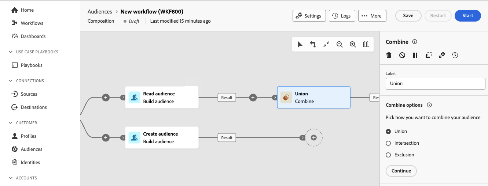

>[!BEGINTABS]

>[!TAB 聯集]

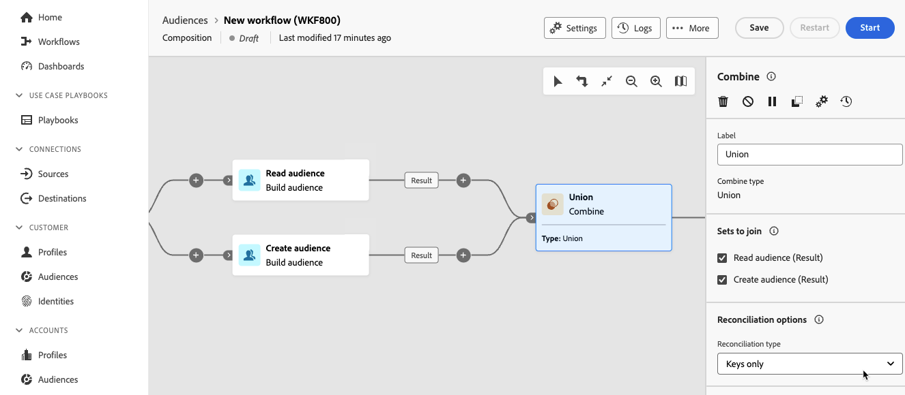

如果您選取&#x200B;**聯合**，您必須為合併活動選擇&#x200B;**調解型別**。 調解型態可讓您定義如何處理重複的專案。

- **僅金鑰**：選取&#x200B;**僅金鑰**&#x200B;會保留&#x200B;**一個**&#x200B;專案，當多個專案具有相同的金鑰時。 只有傳入母體是同質的，才能使用此選項。
- **選取的資料行**：選取&#x200B;**選取的資料行**&#x200B;可讓您定義套用資料協調的資料行清單。 您可以選取包含來源資料的主要資料集，然後選取要用於聯結的欄。

>[!TAB 交集]

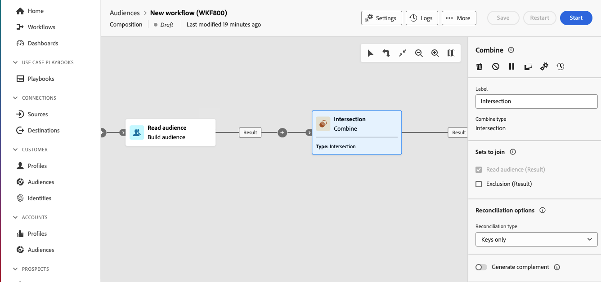

如果您選取&#x200B;**交集**，您必須為合併活動選擇&#x200B;**調解型別**。 調解型態可讓您定義如何處理重複的專案。

- **僅金鑰**：選取&#x200B;**僅金鑰**&#x200B;會保留&#x200B;**一個**&#x200B;專案，當多個專案具有相同的金鑰時。 只有傳入母體是同質的，才能使用此選項。
- **選取的資料行**：選取&#x200B;**選取的資料行**&#x200B;可讓您定義套用資料協調的資料行清單。

設定調解型別後，您也可以選取&#x200B;**產生補充**&#x200B;選項。 產生補數會處理剩餘母體，並包含資料&#x200B;**not** （不包含在交集內）。 將向活動新增一個額外的出站轉變。

>[!TAB 排除]

如果您選取&#x200B;**排除**，則必須從入站轉變中選取&#x200B;**主要集**。 這代表要從中排除元素的集合。

選擇主要集後，您可以設定&#x200B;**排除規則**。 您可以選取&#x200B;**依屬性比對**&#x200B;或&#x200B;**加入**。

設定排除規則後，您也可以選取&#x200B;**產生補充**&#x200B;選項。 產生補充處理剩餘母體，並包含排除中所包含的資料&#x200B;**not**。 將向活動新增一個額外的出站轉變。

+++

#### 重複資料刪除

>[!CONTEXTUALHELP]
>id="dc_orchestration_deduplication_fields"
>title="用於識別重複資料的欄位"
>abstract="在&#x200B;**[!UICONTROL 識別重複專案的欄位]**&#x200B;區段中，選取&#x200B;**[!UICONTROL 新增屬性]**&#x200B;按鈕，指定相同值允許識別重複專案的欄位，例如：電子郵件地址、名字、姓氏等。 欄位的順序可讓您指定首先處理的資料。"

>[!CONTEXTUALHELP]
>id="dc_orchestration_deduplication"
>title="重複資料刪除活動"
>abstract="「**重複資料刪除**」活動可讓您刪除傳入活動結果中的重複資料。其主要在目標市場選擇活動之後和允許使用目標資料的活動之前使用。"

>[!CONTEXTUALHELP]
>id="dc_orchestration_deduplication_complement"
>title="產生補集"
>abstract="您可以使用剩餘群體 (其已因重複而排除) 產生額外的傳出轉變。若要這樣做，請開啟「**[!UICONTROL 產生補集]**」選項"

>[!CONTEXTUALHELP]
>id="dc_orchestration_deduplication_settings"
>title="重複資料刪除設定"
>abstract="若要刪除傳入資料中的重複項目，請在以下欄位中定義重複資料刪除方法。預設只會保留一筆記錄。您還應該根據運算式或屬性選取重複資料刪除模式。預設會隨機選取要避免重複的記錄。"

**重複資料刪除**&#x200B;活動會移除對象內任何重複的結果。

+++ 設定詳細資料

>[!NOTE]
>
>如果您有多個入站轉變，您必須先從下拉式清單中選取&#x200B;**主要集**。

新增&#x200B;**重複資料刪除**&#x200B;活動後，您可以選擇用來識別重複專案的欄位。 選取&#x200B;**新增屬性**&#x200B;以識別可能發生重複專案的欄位。

識別欄位後，您就可以設定重複資料刪除設定。

| 設定 | 說明 |
| ------- | ----------- |
| 要保留的重複專案 | 要保留的重複記錄數。 如果值設為0，將保留&#x200B;**所有**&#x200B;重複記錄。 |
| 重複資料刪除方法 | 移除重複記錄的方法。 <ul><li>**隨機選取**：已移除的記錄是隨機選取的。</li><li>**使用運算式**：移除的記錄是以提交的運算式為基礎。 您可以依遞增或遞減順序排序，具體取決於您要移除的值。</li><li>**非空白值**：移除的記錄是以提交的運算式為基礎。 將會移除運算式沒有值的記錄。</li><li>**在值清單之後**：移除的記錄是以提交的欄位或運算式為基礎。 您可以依遞增或遞減順序隨機排序剩餘的值。</li></ul> |

此外，您可以選取&#x200B;**產生補充**&#x200B;選項。 產生補充處理剩餘母體，並包含重複資料刪除中包含的資料&#x200B;**not**。 將向活動新增一個額外的出站轉變。

+++

#### 擴充

>[!CONTEXTUALHELP]
>id="dc_orchestration_enrichment"
>title="擴充活動"
>abstract="「**擴充活動**」可讓您使用資料庫中的其他資訊來增強目標資料。這通常會用於分段活動之後的構成。"

>[!CONTEXTUALHELP]
>id="dc_orchestration_enrichment_data"
>title="擴充活動"
>abstract="將擴充資料加入構成後，可以在&#x200B;**擴充**&#x200B;活動之後新增的活動中使用，根據行為、偏好和選擇對輪廓執行細分。"

>[!CONTEXTUALHELP]
>id="dc_orchestration_enrichment_simplejoin"
>title="連結定義"
>abstract="在工作表資料和同盟資料庫之間建立連結。"

>[!CONTEXTUALHELP]
>id="dc_orchestration_enrichment_reconciliation"
>title="擴充調和"
>abstract="設定調和參數。"

>[!CONTEXTUALHELP]
>id="dc_targetdata_personalization_enrichmentdata"
>title="擴充資料"
>abstract="選取用於擴充構成的資料。您可以選取兩種類型的擴充資料：結構描述 (又名目標市場選擇維度) 中的單一擴充屬性，或集合連結 (即表格之間具有 1-N 基數的連結)。"

**擴充**&#x200B;活動可讓您透過從同盟資料庫新增其他資料來增強組合。

如果您已設定同盟對象構成目標的連線，則可使用擴充活動，以外部資料庫的屬性擴充來自Adobe Experience Platform的資料。 [瞭解如何使用外部資料擴充Adobe Experience Platform對象](../connections/destinations.md)

+++ 設定詳細資料

>[!NOTE]
>
>如果您有多個入站轉變，您必須先從下拉式清單中選取&#x200B;**主要集**。

將&#x200B;**擴充**&#x200B;活動新增至您的組合後，您可以選取&#x200B;**新增擴充資料**&#x200B;以選擇要用來擴充組合的屬性。 您可以選取&#x200B;**編輯運算式**&#x200B;來建置進階運算式以選取屬性。

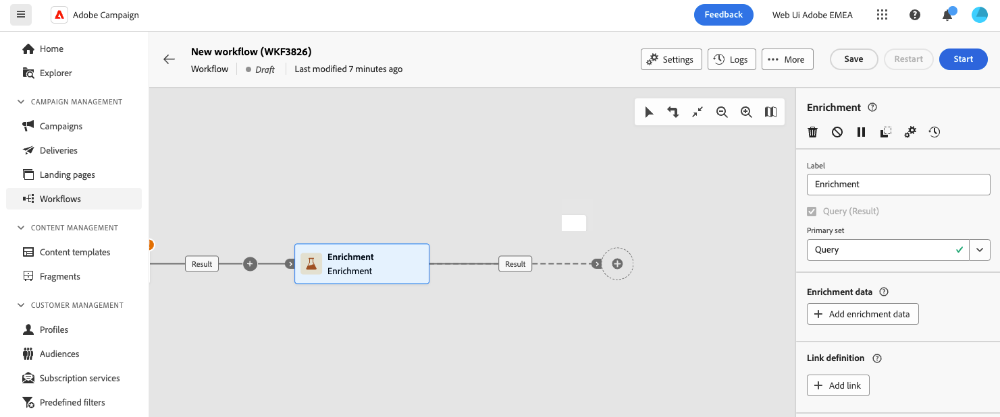

+++

#### 調和

>[!CONTEXTUALHELP]
>id="dc_orchestration_reconciliation"
>title="調和活動"
>abstract="**調和**&#x200B;活動可讓您定義資料庫資料與工作表資料之間的連結。"

>[!CONTEXTUALHELP]
>id="dc_orchestration_reconciliation_field"
>title="調和選取欄位"
>abstract="調和選取欄位"

>[!CONTEXTUALHELP]
>id="dc_orchestration_reconciliation_condition"
>title="調和建立條件"
>abstract="調和建立條件"

>[!CONTEXTUALHELP]
>id="dc_orchestration_reconciliation_complement"
>title="調和產生補集"
>abstract="調和產生補集"

>[!CONTEXTUALHELP]
>id="dc_orchestration_reconciliation_targeting"
>title="結構描述"
>abstract="選取要適用於資料的新結構描述。結構描述 (又名為目標市場選擇維度) 可讓您定義目標群體：收件者、應用程式訂閱者、操作者、訂閱者等。預設會選取構成現有的結構描述。"

>[!CONTEXTUALHELP]
>id="dc_orchestration_reconciliation_rules"
>title="調和規則"
>abstract="選取用於重複資料刪除的調和規則。若要使用屬性，請選取&#x200B;**簡單屬性**&#x200B;選項，然後選擇來源欄位和目的地欄位。若要使用查詢建模工具建立您自己的調和條件，請選取&#x200B;**進階調和條件**&#x200B;選項。"

>[!CONTEXTUALHELP]
>id="dc_orchestration_reconciliation_targeting_selection"
>title="選取目標市場選擇維度"
>abstract="選取要調和的輸入資料結構描述 (又名目標市場選擇維度)。"

>[!CONTEXTUALHELP]
>id="dc_orchestration_keep_unreconciled_data"
>title="保留未調和的資料"
>abstract="依預設，未調和的資料保留在傳出轉變中，並可在工作表中供未來使用。若要移除未調和的資料，請停用「**保留未調和的資料**」選項。"

>[!CONTEXTUALHELP]
>id="dc_orchestration_reconciliation_attribute"
>title="調和屬性"
>abstract="選取用於調和資料的屬性，然後選取「確認」。"

>[!NOTE]
>
>依預設，未調解的資料會保留在出站轉變中，並可在工作表中供未來使用。 如果您&#x200B;**不**&#x200B;想要使用已調解的資料，請停用&#x200B;**保留未調解的資料**&#x200B;選項。

**調解**&#x200B;活動可讓您定義同盟資料庫中的資料與工作表中的資料之間的連結。

+++ 設定詳細資料

將&#x200B;**調解**&#x200B;活動新增至您的組合後，您可以選擇用於調解的綱要。

選擇結構描述後，您需要設定調解規則。 您可以選擇&#x200B;**簡單屬性**&#x200B;或&#x200B;**進階調解條件**。

>[!BEGINTABS]

>[!TAB 簡單屬性]

選擇&#x200B;**簡單屬性**&#x200B;之後，請選取&#x200B;**新增規則**。 您現在可以新增&#x200B;**Source**&#x200B;和&#x200B;**目的地**&#x200B;欄位來設定調解。 **Destination**&#x200B;欄位對應到所選結構描述的欄位。

當來源和目的地相等時，資料就會進行調節。 您可以選取&#x200B;**新增規則**，以新增更多調解條件。 如果指定了多個聯結條件，則必須驗證其中的&#x200B;**所有**，才能將資料連結在一起。

>[!TAB 進階調解條件]

選擇&#x200B;**進階調解條件**&#x200B;之後，請選取&#x200B;**建立條件**。 您現在可以使用查詢模型程式建立自己的調解條件。 如需有關使用「查詢Modeler」的詳細資訊，請閱讀[查詢Modeler概觀](../query/home.md)

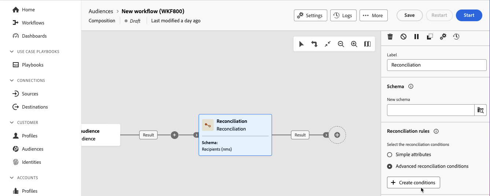

>[!ENDTABS]

您也可以篩選已調解的資料。 選取&#x200B;**建立篩選器**，以使用查詢Modeler建立自訂條件。 如需有關使用「查詢Modeler」的詳細資訊，請閱讀[查詢Modeler概觀](../query/home.md)

+++

#### 儲存客群

>[!CONTEXTUALHELP]
>id="dc_orchestration_save_audience"
>title="儲存一個對象"
>abstract="使用此活動從構成中的群體運算上游建立新的客群。建立的對象將新增至對象清單中，並可透過「**對象**」選單使用。"

>[!CONTEXTUALHELP]
>id="dc_orchestration_saveaudience_outbound"
>title="產生傳出轉變"
>abstract="如果您想在「**儲存對象**」活動之後新增轉變，請使用此選項。"

>[!CONTEXTUALHELP]
>id="dc_orchestration_save_audience_primary_identity"
>title="主要身分識別欄位"
>abstract="選取輪廓要用的主要身分識別。"
>additional-url="https://experienceleague.adobe.com/zh-hant/docs/experience-platform/xdm/ui/fields/identity#define-a-identity-field" text="進一步瞭解 Experience Platform 文件"

>[!CONTEXTUALHELP]
>id="dc_orchestration_saveaudience_namespace"
>title="身分識別命名空間"
>abstract="選取輪廓要用的命名空間。"
>additional-url="https://experienceleague.adobe.com/zh-hant/docs/experience-platform/identity/features/namespaces" text="進一步瞭解 Experience Platform 文件"

>[!IMPORTANT]
>
>如果您的沙箱使用&#x200B;**資料集優先順序**&#x200B;合併原則，請聯絡 Adobe 客戶服務以將 `Halos UPS` 資料集新增至您的合併原則。
>
>如需有關合併原則的詳細資訊，請參閱[合併原則概觀](https://experienceleague.adobe.com/zh-hant/docs/experience-platform/profile/merge-policies/overview)。

**儲存對象**&#x200B;活動可讓您根據構成建立對象。 建立對象後，您就可以在Adobe Experience Platform的對象入口網站中使用這些對象。 如需使用同盟對象構成的對象詳細資訊，請參閱[對象概覽](../start/audiences.md)。 如需Experience Platform中對象的詳細資訊，請閱讀[對象入口網站概觀](https://experienceleague.adobe.com/zh-hant/docs/experience-platform/segmentation/ui/audience-portal){target="_blank"}。

+++ 設定詳細資料

>[!IMPORTANT]
>
>對象名稱&#x200B;**在目前沙箱中必須**&#x200B;是唯一的，而且不能與任何現有對象同名。

將&#x200B;**儲存對象**&#x200B;活動新增至您的組合後，您可以指定新建立對象的名稱。

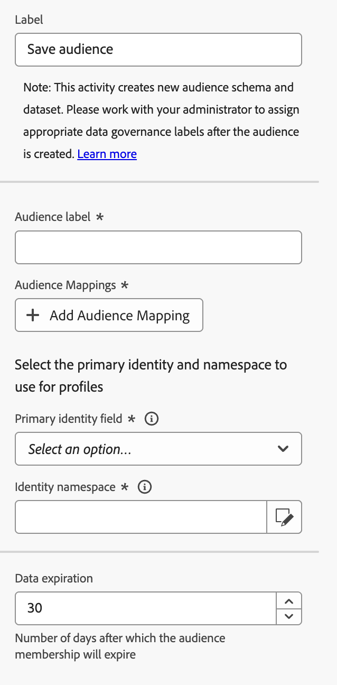

現在，您可以指定對應以選取要將哪些欄位傳輸至新建立的對象。 選取&#x200B;**新增對象對應**&#x200B;並選擇來源和目標對象欄位，視需要重複多次。

新增對應後，您可以選取主要身分和名稱空間，以識別資料庫中的目標設定檔。 主要身分欄位用於識別設定檔，而身分名稱空間會作為識別身分的金鑰。

+++

#### 分割

>[!CONTEXTUALHELP]
>id="dc_orchestration_split"
>title="分割活動"
>abstract="**分割**&#x200B;活動可讓您根據不同選擇標準 (例如篩選規則或群體大小) 將傳入群體分割到多個子集。"

>[!CONTEXTUALHELP]
>id="dc_orchestration_split_segments"
>title="分割活動的區段"
>abstract="依需求新增任意數量的子集，將傳入的群體進行細分。  執行&#x200B;**分割** 活動時，系統會依照子集新增至活動的順序，將群體細分成不同的子集。在開始構成之前，請確保已使用箭頭按鈕按照符合您需求的順序排列子集。"

>[!CONTEXTUALHELP]
>id="dc_orchestration_split_filter"
>title="分割活動篩選器"
>abstract="若要將篩選條件套用至子集，請選取&#x200B;**[!UICONTROL 建立篩選器]**，並使用查詢模型工具設定所要的篩選規則。 例如，於傳入族群中，將有電子郵件地址存在於資料庫的輪廓包含在內。"

>[!CONTEXTUALHELP]
>id="dc_orchestration_split_limit"
>title="分割活動限制"
>abstract="若要限制子集選取輪廓的數量，請開啟「**[!UICONTROL 啟用限制]**」選項，並指定要包含的族群數量或百分比。"

>[!CONTEXTUALHELP]
>id="dc_orchestration_split_sorting"
>title="分割活動排序"
>abstract="為子集設定族群限制時，您可以用指定設定檔屬性按升序或降序順序來排列所選設定檔。為此，請開啟「**啟用排序**」選項。例如，您可以限制子集僅包含購買金額最高的前 50 個設定檔。"

>[!CONTEXTUALHELP]
>id="dc_orchestration_split_complement"
>title="分割產生補集"
>abstract="設定完所有子集後，您可以選擇與任何子集都不相符的剩餘族群，並將其包含在額外的傳出轉變中。若要這樣做，請開啟「**產生補集**」選項。"

>[!CONTEXTUALHELP]
>id="dc_orchestration_split_generatesubsets"
>title="在相同表格中產生所有子集"
>abstract="切換此選項可將所有子集歸類至單一的傳出轉換。"

>[!CONTEXTUALHELP]
>id="dc_orchestration_split_emptytransition"
>title="省略空值轉變"
>abstract="如果傳入群體為空，則切換「**[!UICONTROL 跳過空值轉變]**」選項可停用此子集的輸出轉變。"

>[!CONTEXTUALHELP]
>id="dc_orchestration_split_enable_overlapping"
>title="啟用輸出群體的重疊"
>abstract="「**[!UICONTROL 啟用輸出群體的重疊]**」選項可讓您管理屬於多個子集的群體。當未選取該方塊時，分割活動將確保收件者不能出現在多個輸出轉換中，即使其滿足多個子集的條件也是如此。它們將位於具有符合條件的第一個標籤的目標中。當選取該方塊時，符合篩選條件的收件者，會出現在多個子集中。 "

**分割**&#x200B;活動會根據指定的條件，將傳入母體分成多個部分。

+++ 設定詳細資料

>[!IMPORTANT]
>
>執行&#x200B;**分割**&#x200B;活動時，母體會依照新增順序&#x200B;**在不同的子集之間分隔**。 例如，如果第一個子集分割初始母體的70%，則下一個子集會將其選取條件套用至其餘30%。
>
>在執行構成之前，請確定已按照您希望分割執行的順序排列子集。

將&#x200B;**分割**&#x200B;活動新增至您的組合後，您現在可以決定如何細分您的對象。 選取&#x200B;**新增區段**&#x200B;以建立不同的分支路徑。

您現在可以提供每個子路徑的詳細資訊。 您可以為子路徑命名並指定篩選條件。 若要建立篩選條件，請選取&#x200B;**建立篩選器**，並使用查詢Modeler設定篩選規則。 如需有關使用「查詢Modeler」的詳細資訊，請閱讀[查詢Modeler概觀](../query/home.md)。

建立篩選條件後，即可套用下列其他規則：

- **啟用限制**：限制允許分割成子集的設定檔數目。 您可以設定為母體的數字或百分比。
   - 如果啟用限制，您也可以根據特定設定檔屬性來排名選取的設定檔。 開啟&#x200B;**啟用排序**，您可以依遞增或遞減順序排序屬性。
- **略過空的轉變**：如果傳入的母體是空的，則停用轉變。

現在，子集已設定完畢，您可以再設定幾個其他選項。

| 選項 | 說明 |
| ------- | ----------- |
| **產生補充** | 建立包含剩餘母體的出站轉變。 |
| **啟用輸出母體的重疊** | 如果啟用，收件者&#x200B;**無法**&#x200B;出現在多個出站轉變中，而&#x200B;**僅**&#x200B;會出現在第一個出站轉變中。 如果停用，收件者&#x200B;**可以**&#x200B;出現在多個輸出轉變中。 |
| **產生相同資料表中的所有子集** | 將所有子集分組為單一出站轉變。 |

+++

### 流量控制活動 {#flow-control}

流程控制活動可讓您定義構成的組織與協調。

#### 並加入

>[!CONTEXTUALHELP]
>id="dc_orchestration_and-join"
>title="合併連結活動"
>abstract="**合併連結**&#x200B;活動可讓您同步處理構成的多個執行分支。一旦所有前面的活動完成，就會觸發此活動。這讓您可以在確保特定活動已完成後再繼續執行構成。"

**AND-join**&#x200B;活動可讓您合併組合的多個分支。 此活動只會在啟動&#x200B;**所有**&#x200B;入站轉變後觸發。

+++ 設定詳細資料

新增多個活動以形成至少兩個不同的分支後，您可以將&#x200B;**AND-join**&#x200B;活動新增到任何分支的結尾。

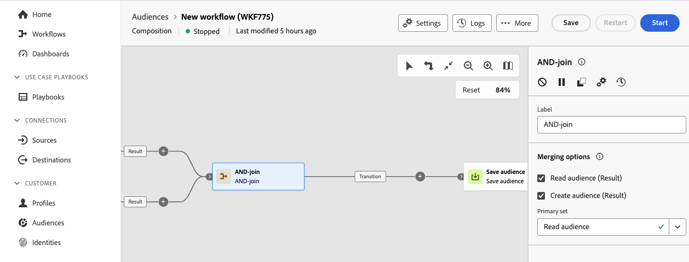

在&#x200B;**合併選項**&#x200B;區段中，您可以選取所有要同步的活動。 此外，您也可以選擇要保留在&#x200B;**主要集**&#x200B;下拉式清單中的入站轉變。

+++

#### 結尾

**End**&#x200B;活動會以圖形方式標示構成結尾，而不會造成功能影響。

#### 分支

>[!CONTEXTUALHELP]
>id="dc_orchestration_fork"
>title="分支活動"
>abstract="**分支**&#x200B;活動可讓您建立傳出轉變，以同時啟動多個活動。"

>[!CONTEXTUALHELP]
>id="dc_orchestration_fork_transitions"
>title="分支活動轉變"
>abstract="依預設，透過&#x200B;**分支**&#x200B;活動建立二個轉變。選取&#x200B;**新增轉變**&#x200B;按鈕以定義額外的輸出轉變，並輸入其標籤。"

**分支**&#x200B;活動可讓您建立多個同時啟動多個活動的出站轉變。

+++ 設定詳細資料

一旦您將&#x200B;**Fork**&#x200B;活動新增到撰寫中，就會自動產生兩個外站轉變。 您可以為這些外站轉變命名。 此外，您可以選取&#x200B;**新增轉變**&#x200B;以新增另一個外站轉變。

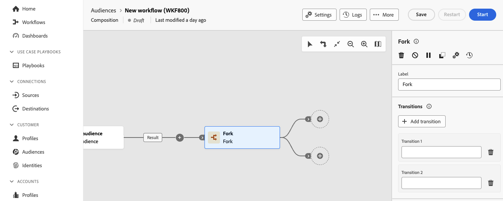

+++

#### 排程器

>[!CONTEXTUALHELP]
>id="dc_orchestration_scheduler"
>title="排程器活動"
>abstract="「**排程器**」活動可讓您安排客群構成何時開始。此活動應視為已排程的開始。其只能當作構成的第一個活動。"

>[!CONTEXTUALHELP]
>id="dc_orchestration_schedule_validity"
>title="排程器有效性"
>abstract="您可以定義排程器的有效期限。它可以是永久的 (預設)，也可以在特定日期之前有效。"

>[!CONTEXTUALHELP]
>id="dc_orchestration_schedule_options"
>title="排程器選項"
>abstract="定義排程器的頻率。它可以在特定時刻執行，可每天、每週或每月執行一次或多次。"

**排程器**&#x200B;活動可讓您排程何時開始構成執行。 您&#x200B;**必須**&#x200B;使用此項作為組合的第一個活動。

+++ 設定詳細資料

將&#x200B;**排程器**&#x200B;活動新增至構成後，您可以設定構成的&#x200B;**執行頻率**。 選項包括&#x200B;**一次**、**每日**、**一天數次**、**每週**&#x200B;和&#x200B;**每月**。

>[!BEGINTABS]

>[!TAB 一次]

>[!NOTE]
>
>時間設定為UTC。

如果您選取&#x200B;**一次**，構成只會執行一次。 您可以選取執行構成時的日期和時間。

>[!TAB 每日]

如果您選取&#x200B;**每日**，構成會每天執行一次。 不過，您可以在當月&#x200B;**日**&#x200B;區段底下執行構成。 可能的值包括&#x200B;**每天**、**工作日**、**透過選取的期間**&#x200B;和&#x200B;**工作日的選取期間**。

| 當月日期 | 說明 |
| ---------------- | ----------- |
| 每天 | 構成每天都會執行。 |
| 於工作日 | 構成會在每個工作日執行。 |
| 在選取的期間 | 構成會在選取的時段內每天執行。 您可以設定週期期間的長度以及期間開始的日期。 |
| 一週的選定天數 | 構成會在一星期中選取的每一天執行。 |

選擇排程將在一個月中的哪一天執行後，您可以選取&#x200B;**預覽啟動時間**&#x200B;以檢查您撰寫的接下來的10個執行的排程。

>[!TAB 一天幾次]

若您選取&#x200B;**一天數次**，構成會每天執行多次。 您可以選擇構成是在每天的特定時間執行，還是定期在設定的時間執行。

如果您選取&#x200B;**選取的時數**，則可以選擇將執行構成的特定時間。 如果您選取&#x200B;**定期**，您可以選擇構成在數小時或數分鐘內的執行頻率，以及執行時間。 所有時間均採用UTC格式。

選取小時後，您可以選擇在&#x200B;**月**&#x200B;日區段下執行的頻率。

| 當月日期 | 說明 |
| ---------------- | ----------- |
| 一週的每一天 | 構成每天都會執行。 |
| 在一週中的某些天 | 構成會在一星期中選取的每一天執行。 |

選擇排程將在一個月中的哪一天執行後，您可以選取&#x200B;**預覽啟動時間**&#x200B;以檢查您撰寫的接下來的10個執行的排程。

>[!TAB 每週]

如果您選取&#x200B;**每週**，構成會依設定的每週頻率執行。 如果將每週頻率設定為大於1的數字，您還可以選擇執行開始的日期。

選擇評估頻率後，您可以選擇在&#x200B;**月**&#x200B;日區段下執行的頻率。

| 當月日期 | 說明 |
| ---------------- | ----------- |
| 一週的每一天 | 構成每天都會執行。 |
| 在一週中的某些天 | 構成會在一星期中選取的每一天執行。 |

選擇排程將在一個月中的哪一天執行後，您可以選取&#x200B;**預覽啟動時間**&#x200B;以檢查您撰寫的接下來的10個執行的排程。

>[!TAB 每月]

如果您選取&#x200B;**每月**，構成會依設定的每月頻率執行。 您可以將其設為每月或特定月份。

選擇每月頻率後，您可以選擇執行所在月份&#x200B;**的**&#x200B;天。

| 當月日期 | 說明 |
| ---------------- | ----------- |
| 每天 | 構成每天都會執行。 |
| 於工作日 | 構成會在每個工作日執行。 |
| 在選取的期間 | 構成會在選取的時段內每天執行。 您可以設定週期期間的長度以及期間開始的日期。 |
| 一週的選定天數 | 構成會在一星期中選取的每一天執行。 |

一旦您設定了當月&#x200B;**日**，您就可以選擇開始時間。 所有時間均採用UTC格式。

>[!ENDTABS]

選取執行頻率後，您可以選擇排程的&#x200B;**有效期間**。

| 有效期限 | 說明 |
| --------------- | ----------- |
| **永久（永不過期）** | 構成永遠不會過期。 |
| **有效期間** | 構成將在指定的日期之間執行。 |

+++

#### 等待

>[!CONTEXTUALHELP]
>id="dc_orchestration_wait"
>title="等待活動"
>abstract="**等待**&#x200B;活動用於延遲從一個活動到另一個活動的轉變。"

**等待**&#x200B;活動會將構成的執行暫停指定的時間量。

+++ 設定詳細資料

將&#x200B;**等待**&#x200B;活動新增至撰寫後，您可以讓它成為&#x200B;**持續時間**&#x200B;或&#x200B;**固定時間**&#x200B;等待。

如果您選取持續時間，可以設定要等待的時間段。 此期間的單位為秒、分鐘、小時或天。

如果您選取「固定時間」，您可以將構成設定為等到指定的日期和時間。 時間已設定為您的&#x200B;**當地時區**。

+++

## 轉變 {#transitions}

在構成中，轉換會顯示資料如何從一個活動傳輸到另一個活動。 轉換會將資料儲存在臨時工作表中。 如果您選取轉變，則可以檢視下列資訊：

- **預覽結構描述**：您可以選取此專案來檢視工作表的結構描述。
- **預覽結果**：您可以選取此專案，以視覺化在選取的轉變中傳輸的資料。 只有在&#x200B;**在兩個執行之間保留臨時母體的結果**&#x200B;啟用時，此選項才可用。

## 後續步驟 {#next-steps}

閱讀本指南後，您將會更瞭解構成中可使用的活動和轉變。 如需構成的一般詳細資訊，請閱讀[構成概觀](./create-composition.md)。
