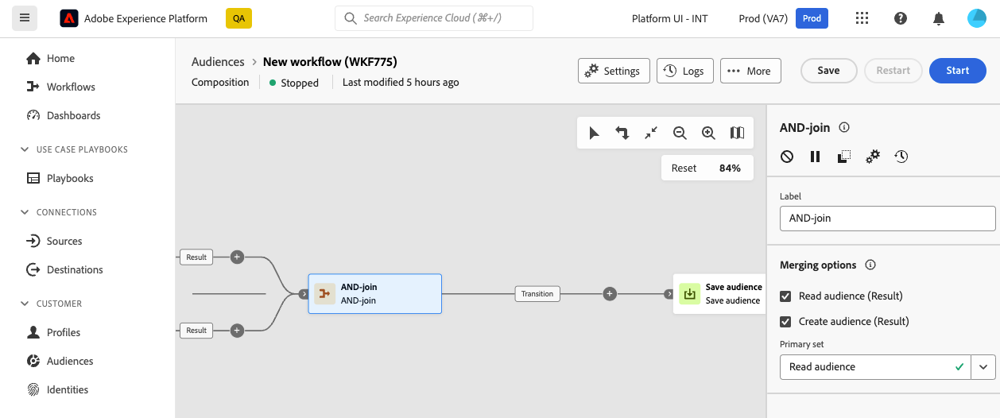

# 合併連結 {#join}

>[!CONTEXTUALHELP]
>id="dc_orchestration_and-join"
>title="AND-join 活動"
>abstract="**合併連結**&#x200B;活動可讓您同步處理構成的多個執行分支。一旦所有前面的活動完成，就會觸發此活動。這讓您可以在確保特定活動已完成後再繼續執行構成。"

**AND — 加入**&#x200B;活動可讓您同步撰寫的多個執行分支。

此活動只會在所有傳入轉變啟動後，才會觸發其傳出轉變，換句話說，會在所有之前的活動完成後觸發。這可讓您在繼續執行構成之前，先確定某些活動已完成。

## 設定 And-join 活動 {#and-join-configuration}

>[!CONTEXTUALHELP]
>id="dc_orchestration_and-join_merging"
>title="設定 AND-join 活動"
>abstract="選取您要參加的活動。在「**[!UICONTROL 主要集合]**」下拉選單中，選擇您要保留的傳入轉變族群。"

請按照以下步驟設定「**合併連結**」活動：

1. 新增多個活動以形成至少兩個不同的執行分支。
1. 新增「**合併連結**」活動至任何分支。

   

1. 在&#x200B;**[!UICONTROL 合併選項]**&#x200B;區段中，檢查您要同步處理的所有先前活動。
1. 在「**[!UICONTROL 主要集合]**」下拉選單中，選擇您要保留的傳入轉變母體。出站轉變只能包含其中一個入站轉變母體。 如果未設定活動，出站轉變將會隨機選取其中一個入站母體。
