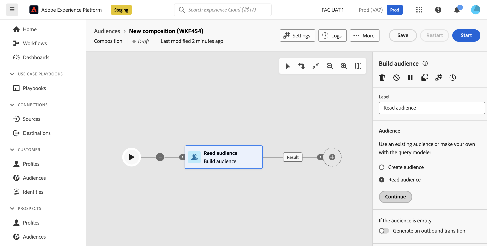

# 建置客群 {#build-audience}

>[!CONTEXTUALHELP]
>id="dc_orchestration_build_audience"
>title="建置客群活動"
>abstract="「**建置客群**」活動可讓您定義會進入構成客群。"

**建立對象**&#x200B;活動可讓您定義將進入構成的對象。 若要定義客群群體，您可以：

* 選取現有的Adobe Experience Platform對象。
* 定義並結合篩選條件，使用查詢塑模器建立新對象。

## 設定建置對象活動 {#build-audience-configuration}

>[!CONTEXTUALHELP]
>id="dc_orchestration_build_audience_audienceselector"
>title="客群"
>abstract="選取您的客群。"

請按照以下步驟設定「**建置客群**」活動：

1. 新增「**建置客群**」活動。
1. 定義標籤。
1. 指定是否要建立對象或選取現有對象。
1. 請依照下列標籤中詳述的步驟設定您的對象。

>[!BEGINTABS]

>[!TAB 建立對象]

若要建立您自己的對象，請依照下列步驟進行：

1. 選取&#x200B;**建立對象**。
1. 選擇&#x200B;**結構描述**，也稱為目標維度。 結構描述可讓您定義作業的目標母體：收件者、合約受益者、操作者、訂閱者等。 依預設，會從收件者中選取結構。

   

1. 按一下&#x200B;**繼續**。
1. 使用查詢建模器定義您的查詢，然後確認。 [瞭解如何使用查詢模型工具](../../query/query-modeler-overview.md)

>[!TAB 讀取客群]

若要選取現有客群，請依照以下步驟進行：

1. 選取「**讀取客群**」。
1. 按一下&#x200B;**繼續**。

   

1. 選取您的客群。

>[!ENDTABS]

>[!NOTE]
>
>**產生出站轉變**&#x200B;選項可讓您新增出站轉變，如果對象母體空白，該轉變將在活動執行結束時啟動。

<!--
## Examples{#build-audience-examples}

Here is an example of a workflow with two **Build audience** activities. The first one targets the poker players audience, followed by an email delivery. The second one targets the VIP clients audience, followed by an SMS delivery.

-->
