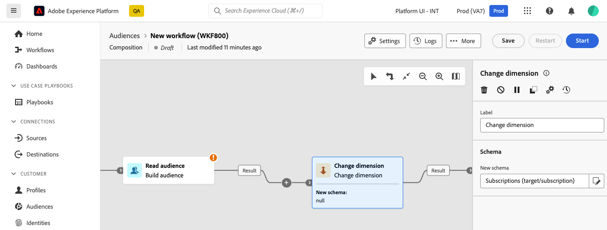

# 變更維度 {#change-dimension}

>[!CONTEXTUALHELP]
>id="dc_orchestration_dimension_complement"
>title="產生補集"
>abstract="您可以使用剩餘族群 (其已因重複而排除) 產生額外的傳出轉變。若要這樣做，請開啟「**[!UICONTROL 產生補集]**」選項"

>[!CONTEXTUALHELP]
>id="dc_orchestration_change_dimension"
>title="變更維度活動"
>abstract="此活動可讓您在建立客群時變更結構描述 (又名目標市場選擇維度)。此活動會根據資料範本和輸入結構描述來移動軸。例如，您可以從「合約」結構描述切換到「用戶端」結構描述。"

**變更維度**&#x200B;活動可讓您在建立對象時變更結構描述（也稱為目標維度）。 它會根據資料範本和輸入結構描述來移動軸。

## 設定變更維度活動 {#configure}

請依照下列步驟設定&#x200B;**變更維度**&#x200B;活動：

1. 將&#x200B;**變更維度**&#x200B;活動新增至您的組合。

   

1. 定義&#x200B;**新結構描述**。 在方案變更期間，會保留所有記錄。

1. 執行構成以檢視結果。 比較&#x200B;**變更維度**&#x200B;活動之前和之後的表格資料，並比較組合表格的結構。

<!--
## Example {#example}

In this example, we want to send an SMS delivery to all the profiles who have made a purchase. To do this, we first use a **[!UICONTROL Build audience]** activity linked to a custom "Purchase" targeting dimension to target all purchases that occurred.

We then use a **[!UICONTROL Change dimension]** activity to switch the workflow targeting dimension to "Recipients". This allows us to be able to target the recipients who match the query.
-->

