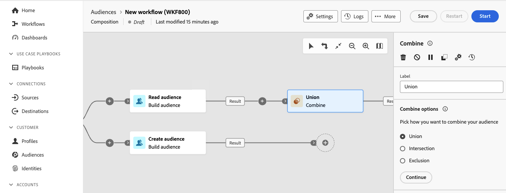
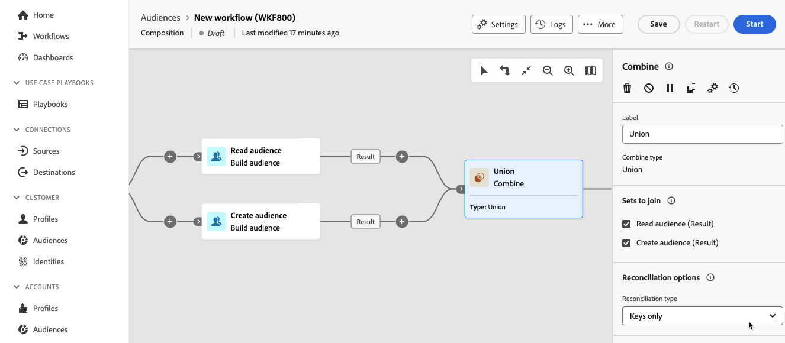
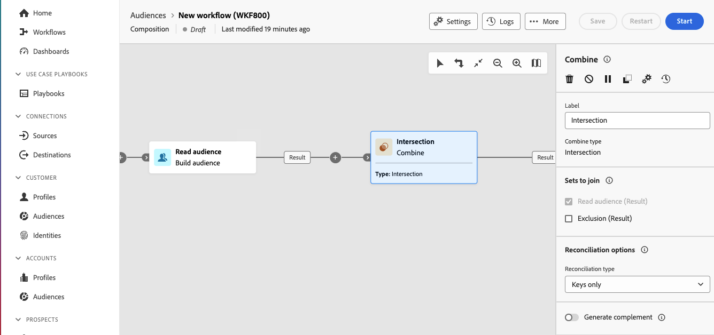

# 合併 {#combine}

>[!CONTEXTUALHELP]
>id="dc_orchestration_combine"
>title="組合活動"
>abstract="「**組合**」活動可讓您對傳入群體執行分段。您因此可以組合好幾個群體、排除其中的一部分或僅保留幾個目標通用資料。"

「**組合**」活動可讓您對傳入群體執行分段。因此，您可以合併多個母體、排除部分母體，或僅保留多個目標通用的資料。

**組合**&#x200B;活動可以放在任何其他活動之後，但不能放在組合的開頭。 任何活動都可以放在&#x200B;**組合**&#x200B;之後。

## 設定合併活動 {#combine-configuration}

>[!CONTEXTUALHELP]
>id="dc_orchestration_intersection_merging_options"
>title="交集合併選項"
>abstract="「**交集**」活動可讓您僅保留活動中不同傳入群體的通用元素。在「**要加入的集合**」一節中，勾選您之前想要加入的所有活動。"

>[!CONTEXTUALHELP]
>id="dc_orchestration_exclusion_merging_options"
>title="排除合併選項"
>abstract="「**排除**」可讓您根據特定條件從一個群體中排除元素。在「**要加入的集合**」一節中，勾選您之前想要加入的所有活動。"

>[!CONTEXTUALHELP]
>id="dc_orchestration_combine_options"
>title="選取分段類型"
>abstract="選取組合客群的方式：聯合、交集或排除。"

請按照以下常見步驟開始設定「**組合**」活動：

1. 新增多個活動以形成至少兩個不同的執行分支。

1. 對上述的任一個分支新增「**組合**」活動。

1. 選取分段型別： [聯合](#union)、[交集](#intersection)或[排除](#exclusion)，然後按一下&#x200B;**繼續**。

   

1. 在&#x200B;**要加入的集合**&#x200B;區段中，檢查您先前要加入的所有活動。

## Union {#combine-union}

>[!CONTEXTUALHELP]
>id="dc_orchestration_intersection_reconciliation_options"
>title="交集調和選項"
>abstract="選取調和類型，以定義處理重複項目的方式。"

>[!CONTEXTUALHELP]
>id="dc_orchestration_combine_reconciliation"
>title="調和選項"
>abstract="選取「**調和類型**」，以定義處理重複項目的方式。"

在&#x200B;**合併**&#x200B;活動中，您可以設定&#x200B;**聯合**。

為此，您需要選取&#x200B;**調解型別**&#x200B;以定義如何處理重複專案：

* **僅限索引鍵**：這是預設模式。當來自不同入站轉變的元素具有相同索引鍵時，活動只會保留一個元素。如果入站群體是同質的，則只能使用此選項。
* **選取的欄**：選取此選項可定義套用資料協調的欄清單。 首先，必須選取主要集合 (其中包含來源資料)，然後指定用於加入的欄。

## 交集 {#combine-intersection}

在&#x200B;**組合**&#x200B;活動中，您可以設定&#x200B;**交集**。

為此，請遵循以下額外步驟：

1. 選取「**調節類型**」，以定義處理重複項目的方式。請參閱[聯合](#union)一節。
1. 如果您要處理剩餘母體，可以核取&#x200B;**產生補充**&#x200B;選項。 此補充集會包含所有傳入活動減去交集的聯合結果。然後，額外的傳出轉變會新增到活動中。

## 排除 {#combine-exclusion}

>[!CONTEXTUALHELP]
>id="dc_orchestration_exclusion_options"
>title="排除規則"
>abstract="如有必要，您可以操控傳入表格。事實上，若要從另一個結構描述 (目標市場選擇維度) 排除目標，必須將此目標傳回到與主要目標相同的結構描述。為了進行此步驟，請按一下「**排除規則**」一節中的「**新增規則**」，並指定結構描述變更條件。資料調和會透過屬性或加入執行。"

>[!CONTEXTUALHELP]
>id="dc_orchestration_combine_sets"
>title="選取要組合的集合"
>abstract="在「**要加入的集合**」一節中，從傳入轉變中選取「**主要集合**」。這是從中排除元素的集。其他集會先設定相符的元素，然後才會從主要集予以排除。"

>[!CONTEXTUALHELP]
>id="dc_orchestration_combine_exclusion"
>title="排除規則"
>abstract="如有必要，您可以操控傳入表格。事實上，若要從另一個結構描述 (目標市場選擇維度) 排除目標，必須將此目標傳回到與主要目標相同的結構描述。為了進行此步驟，請按一下「**排除規則**」一節中的「**新增規則**」，並指定結構描述變更條件。資料調和會透過屬性或加入執行。"

>[!CONTEXTUALHELP]
>id="dc_orchestration_combine_complement"
>title="合併產生補充"
>abstract="切換開啟「**產生補集**」選項，在額外轉變中處理其餘的群體。"

在&#x200B;**合併**&#x200B;活動中，您可以設定&#x200B;**排除專案**。

為此，您需要遵循以下額外步驟：

1. 在「**要加入的集合**」一節中，從傳入轉變中選取「**主要集合**」。這是從中排除元素的集。其他集會先設定相符的元素，然後才會從主要集予以排除。

1. 如有必要，您可以操控傳入表格。事實上，若要從其他結構描述中排除目標，此目標必須傳回至與主要目標相同的結構描述。 為了進行此步驟，請按一下「**排除規則**」一節中的「**新增規則**」，並指定結構描述變更條件。資料調解可透過屬性或聯結來執行。<!-- pas compris-->
1. 如果您希望處理剩餘的群體，可勾選「**產生補充集**」選項。請參閱[交集](#intersection)一節。

<!--
## Examples{#combine-examples}

In the following example, we are using a **Combine** activity and we add a **union** to retrieves all the profiles of the two queries: persons between 18 and 27 years old and persons between 34 and 40 years old.

The following example shows the **intersection** between two query activities. It is being used here to retrieve profiles who are between 18 to 27 years old and whose email address has been provided.

The following **exclusion** example shows two queries configured to filter profiles who are between 18 and 27 years old and have an Adobe email domain. The profiles with an Adobe email domain are then excluded from the first set. 

-->
