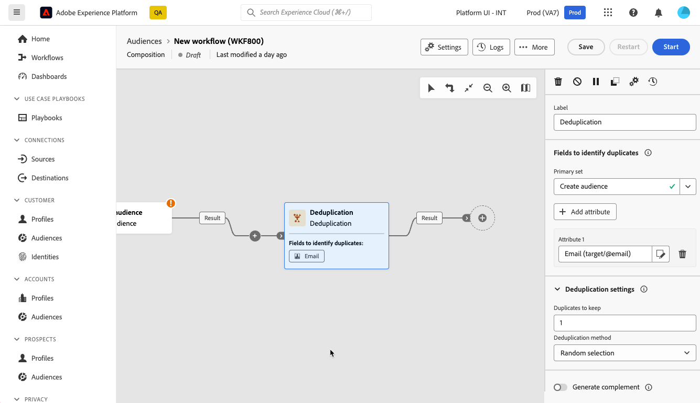

# 重複資料刪除 {#deduplication}

>[!CONTEXTUALHELP]
>id="dc_orchestration_deduplication_fields"
>title="用於識別重複資料的欄位"
>abstract="在&#x200B;**[!UICONTROL &#x200B;用於識別重複資料的欄位&#x200B;]**&#x200B;區段，按一下&#x200B;**[!UICONTROL &#x200B;新增屬性]**&#x200B;按鈕以指定可允許識別重複資料之相同值的欄位，例如：電子郵件地址、名字、姓氏等。欄位的順序可讓您指定首要處理的條件。"

>[!CONTEXTUALHELP]
>id="dc_orchestration_deduplication"
>title="重複資料刪除活動"
>abstract="「**重複資料刪除**」活動可讓您刪除傳入活動結果中的重複資料。其主要在目標市場選擇活動之後和允許使用目標資料的活動之前使用。"

>[!CONTEXTUALHELP]
>id="dc_orchestration_deduplication_complement"
>title="產生補集"
>abstract="您可以使用剩餘族群 (其已因重複而排除) 產生額外的傳出轉變。若要這樣做，請開啟「**[!UICONTROL 產生補集]**」選項"

>[!CONTEXTUALHELP]
>id="dc_orchestration_deduplication_settings"
>title="重複項目刪除設定"
>abstract="若要刪除傳入資料中的重複項目，請在以下欄位中定義重複項目刪除方法。預設只會保留一筆記錄。您還應該根據運算式或屬性選取重複項目刪除模式。預設會隨機選取要避免重複的記錄。"

**重複資料刪除**&#x200B;活動可讓您刪除入站活動結果中的重複專案，例如收件者清單中的重複設定檔。 **重複資料刪除**&#x200B;活動通常用於目標定位活動之後，以及允許使用目標定位資料的活動之前。

## 設定重複資料刪除活動{#deduplication-configuration}

請依照下列步驟設定&#x200B;**重複資料刪除**&#x200B;活動：

1. 將&#x200B;**重複資料刪除**&#x200B;活動新增至您的組合。

1. 如果活動有數個入站轉變，請從&#x200B;**[!UICONTROL 主要集]**&#x200B;下拉式清單中選取要用來執行重複資料刪除的轉變

1. 在&#x200B;**[!UICONTROL &#x200B;用於識別重複資料的欄位&#x200B;]**&#x200B;區段，按一下&#x200B;**[!UICONTROL &#x200B;新增屬性]**&#x200B;按鈕以指定可允許識別重複資料之相同值的欄位，例如：電子郵件地址、名字、姓氏等。欄位的順序可讓您指定首要處理的條件。

   

1. 在&#x200B;**[!UICONTROL 重複資料刪除設定]**&#x200B;區段中，選取要保留的不重複&#x200B;**[!UICONTROL 重複專案數目]**。 此欄位的預設值為&#x200B;**1**。 值&#x200B;**0**&#x200B;可讓您保留所有重複專案。

   例如，如果記錄 A 和 B 被視為記錄 Y 的重複項目，而記錄 C 被視為記錄 Z 的重複項目：

   * 如果欄位的值為&#x200B;**1**：只保留Y和Z記錄。
   * 如果欄位的值為&#x200B;**0**：會保留所有記錄。
   * 如果欄位的值為&#x200B;**2**：會保留記錄C和Z，並保留A、B和Y中的兩個記錄，這是偶然的或取決於之後選取的重複資料刪除方法。

1. 選取要使用的&#x200B;**[!UICONTROL 重複資料刪除方法]**：

   * **[!UICONTROL 隨機選取]**：隨機選取要保留在重複專案外的記錄。
   * **[!UICONTROL 使用運算式]**：保留所輸入運算式的值最小或最大的記錄。
   * **[!UICONTROL 非空白值]**：保留運算式不是空白的記錄。
   * **[!UICONTROL 依循值清單]**：定義一或多個欄位的值優先順序。 若要定義值，請按一下&#x200B;**[!UICONTROL 屬性]**&#x200B;來選取欄位或建立運算式，然後將值新增至適當的資料表。 若要定義新欄位，請按一下值清單上方的&#x200B;**[!UICONTROL 新增按鈕]**。

1. 如果要利用剩餘母體，請核取&#x200B;**[!UICONTROL 產生補充]**&#x200B;選項。 補充包含所有重複專案。 隨後會將其他轉變新增至活動。

<!--
## Example{#deduplication-example}

In the following example, use a deduplication activity to exclude duplicates from the target before sending a delivery. The identified duplicated profiles are added to a dedicated audience that can be reused if necessary. Choose the **Email** address to identify the duplicates. Keep 1 entry and select the **Random** deduplication method.

-->
