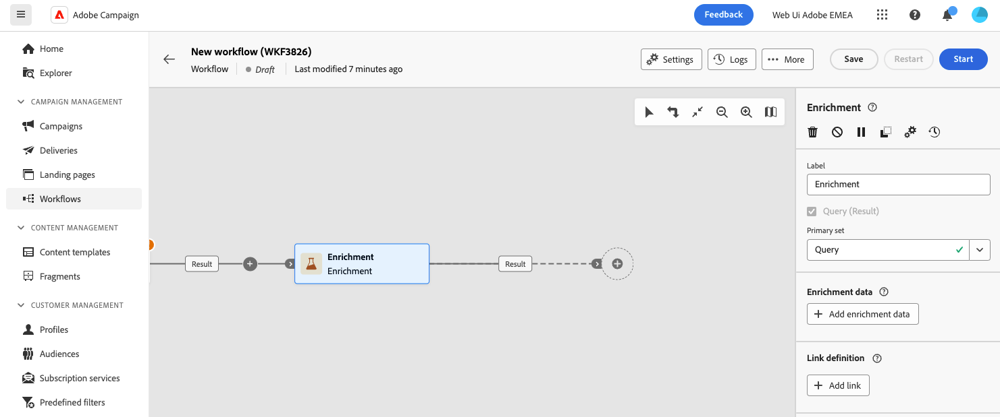
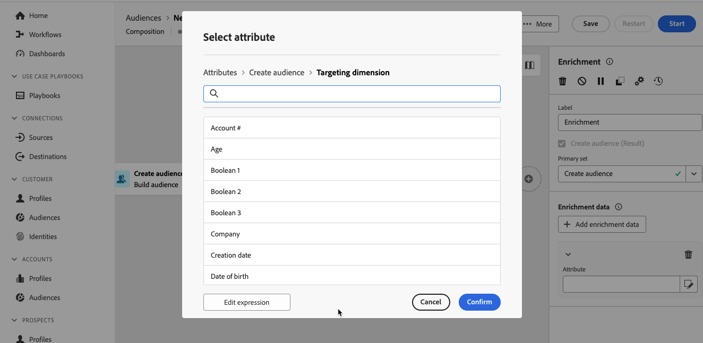

# 擴充 {#enrichment}

>[!CONTEXTUALHELP]
>id="dc_orchestration_enrichment"
>title="擴充活動"
>abstract="「**擴充活動**」可讓您使用資料庫中的其他資訊來增強目標資料。這通常會用於分段活動之後的構成。"

>[!CONTEXTUALHELP]
>id="dc_orchestration_enrichment_data"
>title="擴充活動"
>abstract="將擴充資料加入構成後，可以在&#x200B;**擴充**&#x200B;活動之後新增的活動中使用，根據區段設定檔的行為、偏好和選擇將其劃分為不同的群組。"

>[!CONTEXTUALHELP]
>id="dc_orchestration_enrichment_simplejoin"
>title="連結定義"
>abstract="在工作表資料和同盟資料庫之間建立連結。"

>[!CONTEXTUALHELP]
>id="dc_orchestration_enrichment_reconciliation"
>title="擴充調和"
>abstract="設定調和參數。"

>[!CONTEXTUALHELP]
>id="dc_targetdata_personalization_enrichmentdata"
>title="擴充資料"
>abstract="選取用於擴充構成的資料。您可以選取兩種類型的擴充資料：結構描述 (又名目標市場選擇維度) 中的單一擴充屬性，或集合連結 (即表格之間具有 1-N 基數的連結)。"

**擴充**&#x200B;活動可讓您使用同盟資料庫的額外資訊來增強目標資料。 這通常會用於分段活動之後的構成。

如果您已設定連線至同盟資料構成目的地，則可使用擴充活動，以外部資料庫的屬性擴充來自Adobe Experience Platform的資料。 [瞭解如何使用外部資料擴充Adobe Experience Platform對象](../../connections/destinations.md)

擴充資料可以：

* **來自與構成目標相同的資料表**：

  *鎖定一組客戶，並將[出生日期]欄位新增至目前的工作表*。

* **來自另一個工作表**：

  *以一組客戶為目標，並新增來自「購買」表格的「數量」和「產品類型」欄位*。

擴充資料新增至構成後，即可用於&#x200B;**擴充**&#x200B;活動後新增的活動，以根據客戶的行為、偏好和選擇，將客戶劃分至不同的群組。

<!--For instance, you can add to the working table information related to customers' purchases and use this data to personalize emails with their latest purchase or the amount spent on these purchases.-->

## 設定擴充活動 {#enrichment-configuration}

請按照以下步驟設定&#x200B;**擴充**&#x200B;活動：

1. 新增活動，例如「**建置對象**」和「**組合**」活動。
1. 新增「**擴充**」活動。

   

1. 如果您的構成中已設定多個轉變，您可以使用&#x200B;**[!UICONTROL 主要集]**&#x200B;欄位來定義應該使用哪個轉變作為主要集以擴充資料。

1. 按一下&#x200B;**新增擴充資料**，並選取要用來擴充資料的屬性。

   

   >[!NOTE]
   >
   >屬性選取畫面中的&#x200B;**編輯運算式按鈕**&#x200B;可讓您建置進階運算式以選取屬性。

<!--PAS VU SUR INSTANCE: You can select two types of enrichment data: a single enrichment attribute from the target dimension, or a collection link. Each of these types is detailed in the examples below:

    * [Single enrichment attribute](#single-attribute)
    * [Collection lnk](#collection-link)-->

<!--
## Examples {#example}

### Single enrichment attribute {#single-attribute}

Here, we are just adding a single enrichment attribute, for example, the date of birth. Follow these steps:

1. Click inside the **Attribute** field.
1. Select a simple field from the schema, also known as targeting dimension, the date of birth in our example. 
1. Click **Confirm**.
-->
<!--### Collection link {#collection-link}

In this more complex use case, we will select a collection link which is a link with a 1-N cardinality between tables. Let's retrieve the three latest purchases that are less than 100$. For this you need to define:

* an enrichment attribute: the **Total amount** field
* the number of lines to retrieve: 3
* a filter: filter out items that are greater than 100$
* a sorting: descendant sorting on the **Order date** field. 

#### Add the attribute {#add-attribute}

This is where you select the collection link to use as enrichment data.

1. Click inside the **Attribute** field.
1. Click **Display advanced attributes**.
1. Select the **Total amount** field from the **Purchases** table. 

#### Define the collection settings{#collection-settings}

Then, define how the data is collected and the number of records to retrieve.

1. Select **Collect data** in the **Select how the data is collected** drop-down.
1. Type "3" in the **Lines to retrieve (Columns to create)** field. 

If you want, for example, to get the average amount of purchases for a customer, select **Aggregated data** instead, and select **Average** in the **Aggregate function** drop-down.

#### Define the filters{#collection-filters}

Here, we define the maximum value for the enrichment attribute. We filter out items that are greater than 100$. [Learn how to work with the query modeler](../../query/query-modeler-overview.md)

1. Click **Edit filters**.
1. Add the two following filters: **Total amount** exists AND **Total amount** is less than 100. The first one filters NULL values as they would appear as the greatest value.
1. Click **Confirm**.

#### Define the sorting{#collection-sorting}

We now need to apply sorting in order to retrieve the three **latest** purchases.

1. Activate the **Enable sorting** option.
1. Click inside the **Attribute** field.
1. Select the **Order date** field.
1. Click **Confirm**. 
1. Select **Descending** from the **Sort** drop-down.-->
