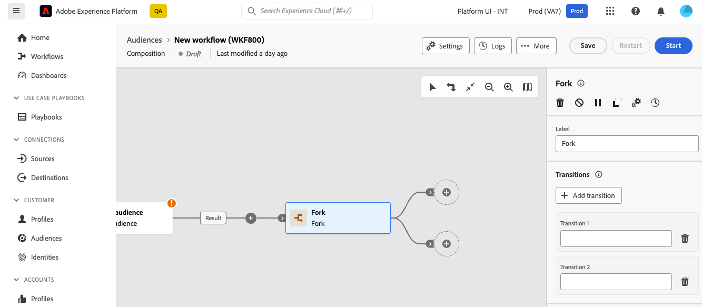

# 分支 {#fork}

>[!CONTEXTUALHELP]
>id="dc_orchestration_fork"
>title="分支活動"
>abstract="**分支**&#x200B;活動可讓您建立傳出轉變，以同時啟動多個活動。"

>[!CONTEXTUALHELP]
>id="dc_orchestration_fork_transitions"
>title="分支活動轉變"
>abstract="依預設，透過&#x200B;**分支**&#x200B;活動建立二個轉變。按一下&#x200B;**新增轉變**&#x200B;按鈕以定義額外的傳出轉變，並輸入其標籤。"

**分支**&#x200B;活動可讓您建立傳出轉變，以同時啟動多個活動。

## 設定分叉活動 {#fork-configuration}

請按照以下步驟設定「**分支**」活動：

1. 將&#x200B;**Fork**&#x200B;活動新增至您的組合。
1. 若要新增傳出轉變，請按一下「**新增轉變**」。預設情況下，會定義兩種轉變。
1. 對每種轉變新增標籤。

   
