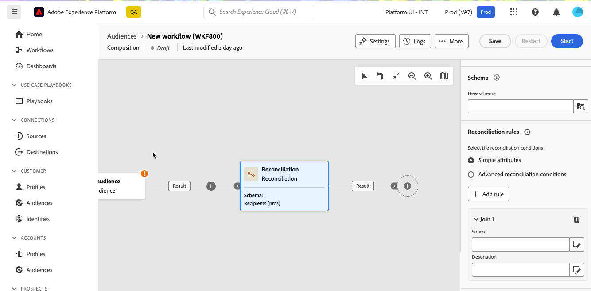
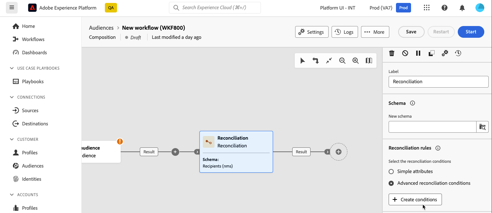

# 調和 {#reconciliation}

>[!CONTEXTUALHELP]
>id="dc_orchestration_reconciliation"
>title="調和活動"
>abstract="**調和**&#x200B;活動可讓您定義資料庫資料與工作表資料之間的連結。"

>[!CONTEXTUALHELP]
>id="dc_orchestration_reconciliation_field"
>title="調和選取欄位"
>abstract="調和選取欄位"

>[!CONTEXTUALHELP]
>id="dc_orchestration_reconciliation_condition"
>title="調和建立條件"
>abstract="調和建立條件"

>[!CONTEXTUALHELP]
>id="dc_orchestration_reconciliation_complement"
>title="調和產生補充"
>abstract="調和產生補充"

**調解**&#x200B;活動可讓您定義資料庫中的資料與工作表中的資料之間的連結，例如從外部系統載入的資料。

<!--For example, the **Reconciliation** activity can be placed after a **Load file** activity to import non-standard data into the database. In this case, the **Reconciliation** activity lets you define the link between the data in the Adobe Campaign database and the data in the work table.-->

它可讓您將未識別的資料連結至現有資源。 調解作業表示您要加入的資料已在資料庫中。 例如，如果您想要調解顯示購買哪個產品、購買時間、購買者等內容的購買資訊，產品和使用者端必須已存在於資料庫中。

## 設定調和活動 {#reconciliation-configuration}

>[!CONTEXTUALHELP]
>id="dc_orchestration_reconciliation_targeting"
>title="結構描述"
>abstract="選取要適用於資料的新結構描述。結構描述 (又名為目標市場選擇維度) 可讓您定義目標群體：收件者、應用程式訂閱者、操作者、訂閱者等。預設會選取構成現有的結構描述。"

>[!CONTEXTUALHELP]
>id="dc_orchestration_reconciliation_rules"
>title="調和規則"
>abstract="選取用於重複資料刪除的調和規則。若要使用屬性，請選取&#x200B;**簡單屬性**&#x200B;選項，然後選擇來源欄位和目的地欄位。若要使用查詢建模工具建立您自己的調和條件，請選取&#x200B;**進階調和條件**&#x200B;選項。"

>[!CONTEXTUALHELP]
>id="dc_orchestration_reconciliation_targeting_selection"
>title="選取目標市場選擇維度"
>abstract="選取要調和的輸入資料結構描述 (又名目標市場選擇維度)。"

>[!CONTEXTUALHELP]
>id="dc_orchestration_keep_unreconciled_data"
>title="保留未調和的資料"
>abstract="依預設，未調和的資料保留在傳出轉變中，並可在工作表中供未來使用。若要移除未調和的資料，請停用「**保留未調和的資料**」選項。"

>[!CONTEXTUALHELP]
>id="dc_orchestration_reconciliation_attribute"
>title="調和屬性"
>abstract="選取用於調和資料的屬性，然後選取「確認」。"

請依照下列步驟設定&#x200B;**調解**&#x200B;活動：

1. 將&#x200B;**調解**&#x200B;活動新增至您的組合。

1. 選取&#x200B;**新結構描述**。 結構描述（也稱為目標維度）可讓您定義目標母體：收件者、應用程式訂閱者、操作者、訂閱者等。

1. 選取要用於調解的欄位。 您可以使用一個或多個調和標準。

   1. 若要使用屬性來調解資料，請選取&#x200B;**簡單屬性**&#x200B;選項，然後按一下&#x200B;**新增規則**&#x200B;按鈕。
   1. 選取調解的&#x200B;**Source**&#x200B;和&#x200B;**目的地**&#x200B;欄位。 **Source**&#x200B;欄位。 **Destination**&#x200B;欄位對應到所選結構描述的欄位。

      當來源和目的地相等時，資料就會進行協調。 例如，選取&#x200B;**電子郵件**&#x200B;欄位，以根據設定檔的電子郵件地址刪除重複設定檔。

      若要新增其他調解條件，請按一下&#x200B;**新增規則**&#x200B;按鈕。 如果指定了多個連線條件，則必須全部驗證這些條件，才能將資料連結在一起。

      

   1. 若要使用其他屬性來調解資料，請選取&#x200B;**進階調解條件**&#x200B;選項，然後按一下&#x200B;**建立條件**&#x200B;按鈕。 然後，您可以使用查詢建模器建立自己的調解條件。 [瞭解如何使用查詢模型工具](../../query/query-modeler-overview.md)

      

1. 您可以使用&#x200B;**建立篩選器**&#x200B;按鈕來篩選要調解的資料。 這可讓您使用查詢建模器建立自訂條件。

依預設，未調解的資料會保留在出站轉變中，並可在工作表中供未來使用。 若要移除未調和的資料，請停用「**保留未調和的資料**」選項。

<!--
## Example {#reconciliation-example}

The following example demonstrates a workflow that creates an audience of profiles directly from an imported file containing new clients. It is made up of the following activities:

The workflow is designed as follows:


 
It is built with the following activities:

* A [Load file](load-file.md) activity uploads a file containing profiles data that were extracted from an external tool.

    For example:

    ```
    lastname;firstname;email;birthdate;
    JACKMAN;Megan;megan.jackman@testmail.com;07/08/1975;
    PHILLIPS;Edward;phillips@testmail.com;09/03/1986;
    WEAVER;Justin;justin_w@testmail.com;11/15/1990;
    MARTIN;Babe;babeth_martin@testmail.net;11/25/1964;
    REESE;Richard;rreese@testmail.com;02/08/1987;
    ```

* A **Reconciliation** activity which identifies the incoming data as profiles, by using the **email** and **Date of birth** fields as reconciliation criteria.

    

* A [Save audience](save-audience.md) activity to create a new audience based on these updates. You can also replace the **Save audience** activity by an **End** activity if no specific audience needs to be created or updated. Recipient profiles are updated in any case when you run the workflow.


## Compatibility {#reconciliation-compat}

The **Reconciliation** activity does not exist in the Client console. All **Enrichments** activities created in the Client console with the reconciliation options enabled are displayed as **Reconciliation** activities in Campaign Web user interface.
-->
