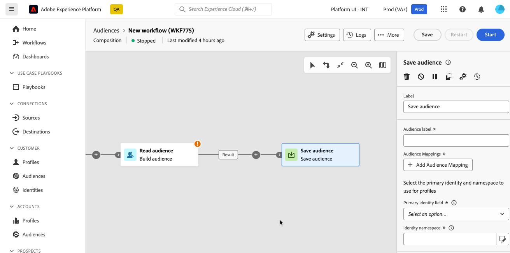

# 儲存客群 {#save-audience}

>[!CONTEXTUALHELP]
>id="dc_orchestration_save_audience"
>title="儲存一個客群"
>abstract="使用此活動從構成中的群體運算上游建立新的客群。建立的客群將新增至客群清單中，並可透過「**客群**」選單使用。"

>[!CONTEXTUALHELP]
>id="dc_orchestration_saveaudience_outbound"
>title="產生傳出轉變"
>abstract="如果您想在「**儲存客群**」活動之後新增轉變，請使用此選項。"

>[!CONTEXTUALHELP]
>id="dc_orchestration_save_audience_primary_identity"
>title="主要身分欄位"
>abstract="選取要設定檔要用的主要身分。"
>additional-url="https://experienceleague.adobe.com/zh-hant/docs/experience-platform/xdm/ui/fields/identity#define-a-identity-field" text="進一步瞭解 Experience Platform 文件"

>[!CONTEXTUALHELP]
>id="dc_orchestration_saveaudience_namespace"
>title="身分命名空間"
>abstract="選取設定檔要用的命名空間。"
>additional-url="https://experienceleague.adobe.com/zh-hant/docs/experience-platform/identity/features/namespaces" text="進一步瞭解 Experience Platform 文件"

**儲存對象**&#x200B;活動可讓您從構成中的母體運算上游建立新的對象。 建立的對象會新增至Adobe Experience Platform對象清單，並可透過&#x200B;**對象**&#x200B;功能表使用。 [學習如何使用客群](../../start/audiences.md)

此活動主要用於將母體族群轉換為可重複使用的對象，讓母體族群可繼續在相同構成中運算。 將其連線到其他目標定位活動，例如&#x200B;**建立對象**&#x200B;或&#x200B;**合併**&#x200B;活動。

## 設定「儲存對象」活動 {#save-audience-configuration}

請依照下列步驟設定&#x200B;**儲存對象**&#x200B;活動：

1. 將&#x200B;**儲存對象**&#x200B;活動新增至您的組合。

   

1. 指定要建立的對象標籤。

   >[!IMPORTANT]
   >
   >對象標籤在目前沙箱中必須是唯一的。 其標籤不得與任何現有對象相同。

1. 使用「對象對應」區段來選取您要與新建立的對象一起帶入的欄位。 若要這麼做，請按一下&#x200B;**新增對象對應**，然後選擇來源和目標對象欄位。

   重複此作業，視需要儘量新增對象對應。

1. 選取主要身分和名稱空間，以用於識別資料庫中的目標設定檔：

   * **主要身分欄位**：選取要用來識別設定檔的欄位。 例如，其電子郵件地址或電話號碼。
   * **識別名稱空間**：選取要用來識別設定檔的名稱空間，也就是要做為識別金鑰的資料型別。 例如，如果已選取電子郵件地址作為主要身分欄位，則應選取身分名稱空間&#x200B;**電子郵件**。 如果唯一識別碼是電話號碼，則應該選取識別名稱空間&#x200B;**電話**。

## 在 Adobe Experience Platform 中存取客群 {#access-audience}

在執行構成後，產生的客群將作為外部客群儲存在 Adobe Experience Platform 中，並可用於 Adobe Real-Time Customer Data Platform 和/或 Adobe Journey Optimizer。該客群可透過「**客群**」選單進行存取。[了解更多](https://experienceleague.adobe.com/zh-hant/docs/experience-platform/segmentation/ui/audience-portal){target="_blank"}

建立的對象包含「對象對應」區段中選取的所有欄位。 您可以在Journey Optimizer中鎖定此對象，或在Adobe Experience Platform支援的任何目的地啟用它。

[在Adobe Experience Platform檔案中進一步瞭解](https://experienceleague.adobe.com/zh-hant/docs/experience-platform/segmentation/ui/audience-portal){target="_blank"}

<!--

## Example{#save-audience-example}

The following example illustrates a simple audience update from targeting. A scheduler is added to run the workflow once a month. A query recovers all the profiles subscribed to the different application services available. The **Save audience** activity updates the audience by deleting profiles that have unsubscribed from the service since the last workflow execution and by adding the newly subscribed profiles.
-->
