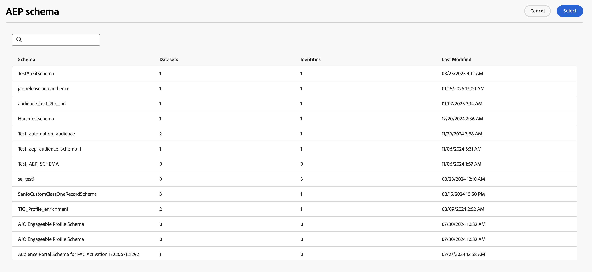
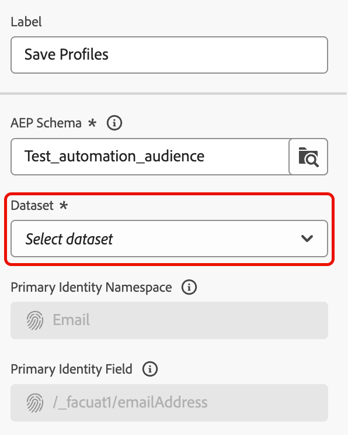
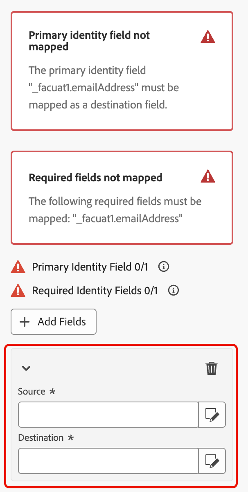
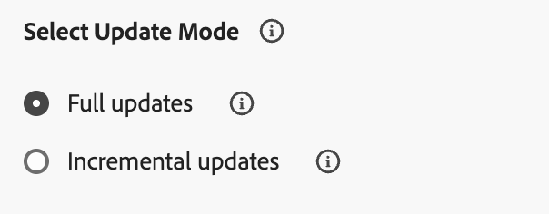

# 儲存輪廓 {#save-profile}

>[!CONTEXTUALHELP]
>id="dc_orchestration_saveprofile"
>title="儲存輪廓"
>abstract="「儲存輪廓」活動，能夠與外部倉儲的資料聯合，擴充 Experience Platform 輪廓，並允許使用其他屬性增強客戶輪廓。 "

>[!CONTEXTUALHELP]
>id="dc_orchestration_saveprofile_aepschemalist"
>title="選取 Experience Platform 結構描述"
>abstract="選擇輪廓的 Experience Platform 結構描述。"

>[!CONTEXTUALHELP]
>id="dc_orchestration_saveprofile_primaryidentitynamespace"
>title="選取主要身分識別欄位"
>abstract="選取主要身分識別，以識別資料庫中的目標輪廓。"

>[!CONTEXTUALHELP]
>id="dc_orchestration_saveprofile_selectaepschema"
>title="選取 Experience Platform 結構描述"
>abstract="選擇輪廓的 Experience Platform 結構描述。"

>[!CONTEXTUALHELP]
>id="dc_orchestration_saveprofile_updatemode"
>title="儲存輪廓更新模式"
>abstract="儲存輪廓活動的可用更新模式包括完整更新和漸進式更新。"

>[!CONTEXTUALHELP]
>id="dc_orchestration_saveprofile_updatemode_full"
>title="完整更新"
>abstract="完整更新模式會更新整套輪廓進行擴充。"

>[!CONTEXTUALHELP]
>id="dc_orchestration_saveprofile_updatemode_incremental"
>title="漸進式更新"
>abstract="漸進式更新模式會更新自上次擴充後曾修改的輪廓。"

>[!CONTEXTUALHELP]
>id="dc_orchestration_saveprofile_primaryidentityfield"
>title="主要身分識別欄位"
>abstract="主要身分識別欄位指的是在擴充過程中合併輪廓時所依據的真相來源。"

>[!CONTEXTUALHELP]
>id="dc_orchestration_saveprofile_requiredfieldscheck"
>title="必填欄位條件"
>abstract="必填欄位是匯出資料時每個輪廓或記錄必須填寫的屬性。若缺少必填欄位，匯出結果將不完整或無效。"

>[!CONTEXTUALHELP]
>id="dc_orchestration_saveprofile_primaryidentitycheck"
>title="主要身分識別欄位條件"
>abstract="每個輪廓或記錄的唯一識別碼。這樣可確保每筆記錄都能分開識別與匹配，避免資料重複。"

**[!UICONTROL 儲存設定檔]**&#x200B;活動可讓您使用從外部倉儲同盟的資料，擴充Adobe Experience Platform設定檔。

此活動通常用於透過引進其他屬性和深入分析來增強客戶設定檔，而不會將資料實際移動或複製到平台中。

## 設定[!UICONTROL 儲存設定檔]活動 {#save-profile-configuration}

>[!IMPORTANT]
>
>**儲存設定檔**&#x200B;活動需要啟用設定檔的結構描述和資料集。 若要瞭解如何啟用資料集以啟用設定檔，請參閱[資料集使用手冊](https://experienceleague.adobe.com/zh-hant/docs/experience-platform/catalog/datasets/user-guide#enable-profile){target="_blank"}。
>
>此外，如果選取的資料集&#x200B;**未**&#x200B;啟用更新插入，則來自設定檔的資料將會被&#x200B;**取代**。 若要瞭解如何為資料集啟用更新插入，請閱讀[啟用更新插入指南](https://experienceleague.adobe.com/zh-hant/docs/experience-platform/catalog/datasets/enable-upsert)。

請依照下列步驟設定&#x200B;**[!UICONTROL 儲存設定檔]**&#x200B;活動：

1. 將&#x200B;**[!UICONTROL 儲存設定檔]**&#x200B;活動新增至您的組合。

   ![活動內會醒目顯示[儲存設定檔]按鈕。](../assets/save-profiles/save-profiles.png){width="1500" zoomable="yes"}

1. 指定要建立的設定檔標籤。

   >[!IMPORTANT]
   >
   >對象標籤在目前沙箱中必須是唯一的。 其標籤不得與任何現有對象相同。

1. 選取您要使用的Adobe Experience Platform結構描述。

   {width="1500" zoomable="yes"}

1. 選取您要儲存擴充的資料集。

   {width="300" zoomable="yes"}

1. 選取資料集後，您可以看到用於識別資料庫中設定檔的主要身分欄位。

1. 選取&#x200B;**[!UICONTROL 新增欄位]**&#x200B;以新增主要和必要的身分識別欄位。

   ![[新增欄位]按鈕已反白顯示。](../assets/save-profiles/add-fields.png){width="300" zoomable="yes"}

   您可以為每一個要對應的屬性指定&#x200B;**Source**&#x200B;欄位（外部資料）和&#x200B;**目的地**&#x200B;欄位（結構描述欄位）。

   {width="300" zoomable="yes"}

1. 您也可以指定擴充的更新模式。

   {width="300" zoomable="yes"}

   | 更新模式 | 說明 |
   | ----------- | ----------- |
   | 完整更新 | 已更新完整的設定檔集以進行擴充。 |
   | 漸進式更新 | 只有在上次擴充執行後修改的設定檔才會針對擴充進行更新。 |

   如果您選取[!UICONTROL 增量更新]，您也必須選擇上次修改日期，以決定要傳送哪些資料。

1. 設定之後，請選取&#x200B;**啟動**。
