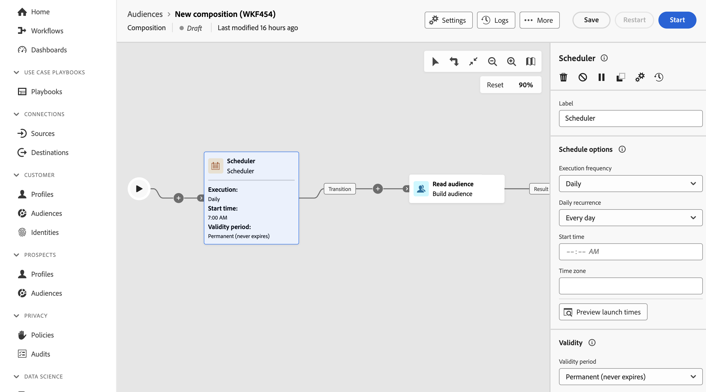

# 排程器 {#scheduler}

>[!CONTEXTUALHELP]
>id="dc_orchestration_scheduler"
>title="排程器活動"
>abstract="**排程器**&#x200B;活動可讓您排程對象組合何時開始。 此活動應視為已排程的開始。它只能用作組成的第一個活動。"

**排程器**&#x200B;活動是&#x200B;**流程控制**&#x200B;活動。 它可讓您排程構成何時開始。 此活動應視為已排程的開始。它只能用作構成的第一個活動。

如果您已設定同盟對象構成目標的連線，可以使用此活動以定期頻率透過Adobe Experience Platform傳送對象。 [瞭解如何使用外部資料擴充Adobe Experience Platform對象](../../connections/destinations.md)

## 設定排程器活動 {#scheduler-configuration}

>[!CONTEXTUALHELP]
>id="dc_orchestration_schedule_validity"
>title="排程器有效性"
>abstract="您可以定義排程器的有效期限。它可以是永久的 (預設)，也可以在特定日期之前有效。"

>[!CONTEXTUALHELP]
>id="dc_orchestration_schedule_options"
>title="排程器選項"
>abstract="定義排程器的頻率。它可以在特定時刻執行，可每天、每週或每月執行一次或多次。"

請依照下列步驟設定&#x200B;**排程器**&#x200B;活動：

1. 將&#x200B;**排程器**&#x200B;活動新增至您的組合。

1. 設定&#x200B;**執行頻率**：

   * **一次**：組合只執行一次。
   * **每日**：構成在特定時間執行，一天一次。
   * **一天數次：**&#x200B;構成會定期執行數次。 您可以設定在特定時間或定期執行。

     >[!NOTE]
     >
     >請勿將構成排程為超過每15分鐘執行一次，因為它可能會阻礙整體系統效能並在資料庫中建立區塊。

   * **每週**：構成會在指定的時間執行，每週執行一或數次。
   * **每月**：構成會在指定的時間執行，每月執行一或數次。 當您需要執行構成時，可以選取月份。 您也可以在月份的指定週日（例如，當月的第二個星期二）設定執行。

1. 根據所選頻率定義執行詳細資訊。詳細欄位可能會依使用的頻率（時間、重複頻率、指定天數等）而有所不同。

1. 按一下&#x200B;**預覽啟動時間**&#x200B;以檢查您的組合中接下來十個執行的排程。

1. 定義排程器的有效期間：

   * **永久（永不過期）**：構成會根據指定的頻率執行，對時間範圍或反複次數沒有任何限制。

   * **有效期間**：構成會根據指定的頻率執行，直到特定日期為止。 您必須指定開始和結束日期。

>[!NOTE]
>
>如果您想要立即啟動構成，可以按一下排程器頂端動作列中的&#x200B;**執行擱置中的工作**。 此按鈕僅在您啟動構成時可用。

<!--## Example{#scheduler-example}

In the following example, the activity is configured so that the composition runs several times a day at 9 and 12 AM, every day of the week from October 1st, 2023 to January 1st, 2024.-->
