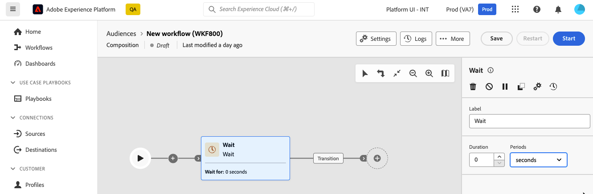

# 等待 {#wait}

>[!CONTEXTUALHELP]
>id="dc_orchestration_wait"
>title="等待活動"
>abstract="**等待**&#x200B;活動用於延遲從一個活動到另一個活動的轉變。"

**等待**&#x200B;活動允許兩個執行活動之間經過一定的時間。

## 設定{#wait-configuration}

請按照以下步驟設定&#x200B;**等待**&#x200B;活動：

1. 將&#x200B;**等待**&#x200B;活動新增至您的組合。

1. 指定傳入和傳出轉變之間等待的&#x200B;**持續時間**。

1. 在&#x200B;**期間**&#x200B;欄位中選取時間單位：秒、分鐘、小時、天。

   
