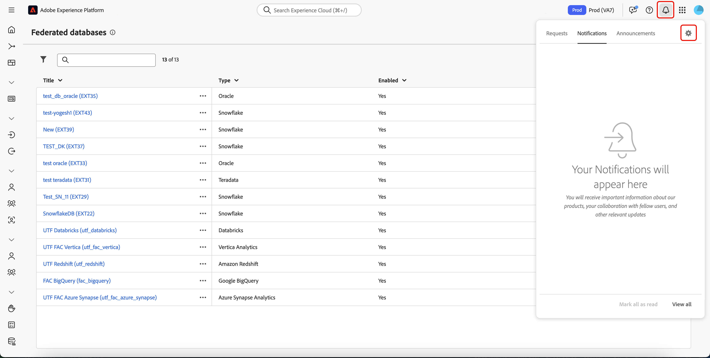
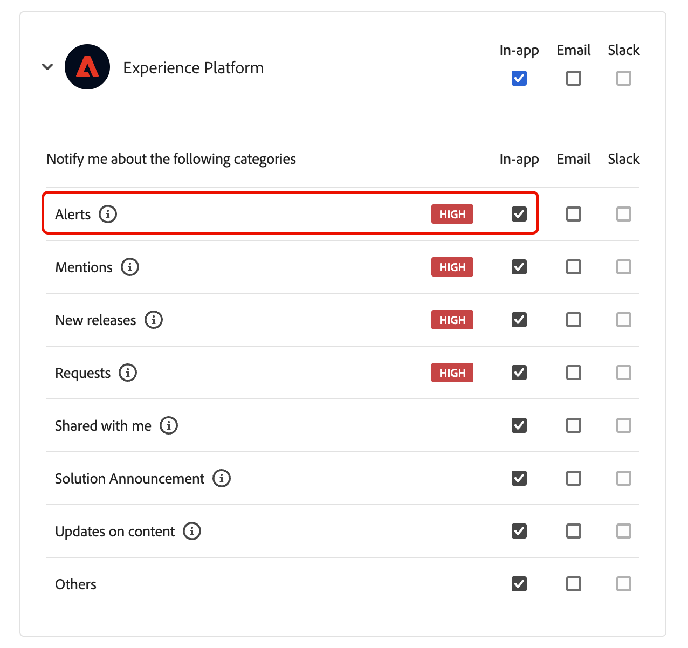
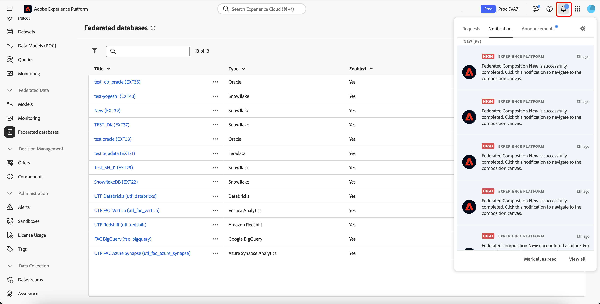

# 建立構成

聯合客群構成可讓您建立構成，以便在其中利用視覺畫布中的各種活動來建立客群。在建立構成後，產生的客群會儲存到 Adobe Experience Platform 中，並且可以在 Experience Platform 目的地和 Adobe Journey Optimizer 中用來鎖定客戶。

## 定義您的組合 {#create}

>[!CONTEXTUALHELP]
>id="dc_composition_creation_properties"
>title="構成屬性"
>abstract="在此畫面中，選擇用於建立構成的範本並指定標籤。展開「其他選項」區段以設定更多設定，例如構成內部名稱、其資料夾、時區和主管群組。強烈建議選取一個主管群組，以便在發生錯誤時警告操作者。"

若要建立構成，您必須先定義其標籤，並選擇性地設定其他設定。

若要建立組合，請選取&#x200B;**[!UICONTROL 客戶]**&#x200B;區段內的&#x200B;**[!UICONTROL 對象]**，然後選取&#x200B;**[!UICONTROL 同盟組合]**&#x200B;索引標籤。

![已反白顯示[同盟組合]區段的路徑。](assets/create/access-compositions.png)

同盟構成瀏覽頁面隨即顯示。 選取&#x200B;**[!UICONTROL 建立組合]**&#x200B;以繼續組合建立程式。

在&#x200B;**[!UICONTROL 屬性]**&#x200B;區段中，指定構成標籤，並選取資料模型。 只有與此資料模型相關聯的結構描述才可在您的構成活動中使用。

選擇 **[!UICONTROL 建立]**。組合畫布隨即顯示。 您現在可以透過將活動和轉變新增到畫布來設定構成。

## 組合畫布 {#canvas}

在畫布頂端，您可以存取提供管理及導覽活動選項的工具列。

可用的選項包括：

* **[!UICONTROL 多個選取專案]**：選取多個活動以一次刪除所有活動，或複製並貼上這些活動。
* **[!UICONTROL 旋轉]**：切換畫布以垂直顯示。
* **[!UICONTROL 符合熒幕大小]**：調整畫布縮放等級以符合熒幕。
* **[!UICONTROL 放大]** / **[!UICONTROL 縮小]**：放大或縮小畫布。
* **[!UICONTROL 顯示地圖]**：開啟顯示您所在位置的畫布快照。

## 新增活動 {#add-activities}

在構成畫布中，您可以新增有助於定義對象的活動和轉變。 活動可讓您&#x200B;*定義*&#x200B;對象內的元件，而轉換則可讓您&#x200B;*整理*&#x200B;撰寫的流程。

如需可供使用的活動與轉變的詳細資訊，請閱讀[活動概覽](./activities.md)。

## 管理活動 {#manage-activities}

您可以在屬性窗格中針對新增的活動執行作業。

選項包括：

* **[!UICONTROL 刪除]**：從畫布中刪除活動。
* **[!UICONTROL 停用]/[!UICONTROL 啟用]**：停用或啟用活動。 執行構成時，不會在同一路徑上執行已停用的活動和下列活動，並且會停止構成。
* **[!UICONTROL 暫停]/[!UICONTROL 繼續]**：暫停或繼續活動。 構成執行時，會在暫停的活動中暫停。 系統不會執行對應的任務，以及在相同路徑中跟隨著該任務的所有任務。
* **[!UICONTROL 複製]**：複製活動以將其貼到構成中的其他位置。 若要這麼做，請選取轉變上的&#x200B;**+**&#x200B;按鈕，然後選取&#x200B;**[!UICONTROL 貼上X活動]**。<!-- cannot copy multiple activities ? cannot paste in another composition?-->
* 為選取的活動設定&#x200B;**[!UICONTROL 執行選項]**。 可用的執行選項包括：
  +++可用的執行選項

  **[!UICONTROL 屬性]**&#x200B;區段可讓您設定有關活動執行的一般設定：

   * **[!UICONTROL 執行]**：定義啟動時要執行的動作。
   * **[!UICONTROL 最長執行期間]**：指定期間，例如&quot;30s&quot;或&quot;1h&quot;。 如果活動在指定的持續時間過後仍未完成，則會觸發警報。 這不會影響組成功能的方式。
   * **[!UICONTROL 時區]**：選取活動的時區。 同盟對象構成可讓您在同一例項上管理多個國家/地區之間的時間差異。 套用的設定會在建立執行個體時進行設定。
   * **[!UICONTROL 相似性]**：強制構成活動在特定電腦上執行。 若要這麼做，您必須為相關活動指定一或多個相關性。
   * **[!UICONTROL 行為]**：定義使用非同步工作時要遵循的程式。

  **[!UICONTROL 錯誤管理]**&#x200B;區段可讓您指定活動發生錯誤時要執行的動作。

  **[!UICONTROL 初始化指令碼]**&#x200B;區段可讓您初始化變數或修改活動屬性。 選取&#x200B;**[!UICONTROL 編輯程式碼]**&#x200B;按鈕，然後輸入要執行的程式碼片段。 當活動執行時，會呼叫指令碼。

  +++
* **記錄檔與工作**：檢視所選活動的記錄檔與工作。

## 開始並監控您的構成 {#start-and-monitor}

將活動新增至構成後，即可開始構成執行。 若要開始撰寫，請選取畫面右上角的&#x200B;**[!UICONTROL 開始]**&#x200B;按鈕。

| 動作 | 說明 |
| ------ | ----------- |
| **開始** | 開始構成的執行並將它移動到&#x200B;**進行中**&#x200B;狀態。 |
| **暫停** | 暫停構成的執行並將它設定為&#x200B;**已暫停**&#x200B;狀態。 在繼續構成之前，不會啟用任何新活動，但進行中的作業&#x200B;**不會**&#x200B;暫停。 |
| **繼續** | 繼續執行暫停的組合，並將其設定為&#x200B;**進行中**&#x200B;狀態。 |
| **停止** | 停止構成的執行並將它設定為&#x200B;**已完成**&#x200B;狀態。 您&#x200B;**無法**&#x200B;從停止的位置恢復組合。 |
| **重新啟動** | 停止並重新開始構成執行。 |

當構成正在執行時，畫布中的每個活動都會依序執行，直到達到構成結尾為止。 您可以使用視覺流量即時追蹤目標設定檔的進度。 這可讓您快速識別每個活動的狀態，以及活動中轉換的個人檔案數。

每個活動右上角的視覺指示器會顯示執行狀態：

| 視覺指標 | 說明 |
| ---------------- | ------------|
| {zoomable="yes"}{width="70%"} | 活動目前正在執行。 |
| {zoomable="yes"}{width="70%"} | 活動需要您注意。這可能涉及確認傳遞的傳送或採取必要行動。 |
| {zoomable="yes"}{width="70%"} | 活動發生錯誤。若要解決此問題，請開啟構成記錄以取得詳細資訊。 |
| {zoomable="yes"}{width="70%"} | 已成功執行活動。 |

### 監視記錄和任務 {#monitor-logs}

此外，您可以檢視構成記錄，以確保它們正常執行。 在動作工具列中選取&#x200B;**[!UICONTROL 記錄檔]**&#x200B;以檢視此資訊。

**[!UICONTROL 組合記錄檔與工作]**&#x200B;畫面會出現。 這會提供構成執行的歷史記錄，記錄所有使用者動作和遇到的錯誤。

歷史記錄會整理成數個標籤，詳細說明如下：

* **[!UICONTROL Log]**&#x200B;索引標籤包含所有構成活動的執行歷程記錄。 其會按時間順序，對執行的操作和執行錯誤進行索引。
* **[!UICONTROL 任務]**&#x200B;索引標籤詳細說明活動的執行順序。 位於每個任務結尾的按鈕可讓您列出透過活動傳遞的事件變數。
* **[!UICONTROL 變數]**&#x200B;索引標籤會列出構成中傳遞的所有變數。 僅可在從構成畫布存取日誌和工作時使用。 現在從活動的屬性窗格存取記錄檔時，即可使用此功能。

在所有標籤中，您可以選擇顯示的欄及其順序、套用篩選器，並使用搜尋欄位來快速尋找所需的資訊。

### 訂閱警報 {#alerts}

您也可以訂閱警報，以便在聯合構成執行成功或失敗時接收通知。

若要訂閱警示，請選取，然後選取。

{zoomable="yes"}{width="70%"}

此時會顯示通知設定頁面。 在此頁面上，選取&#x200B;**[!UICONTROL Experience Platform]**，然後選擇您想要的警示頻道。 若要在UI中檢視通知，請選取&#x200B;**[!UICONTROL 應用程式內]**。

{zoomable="yes"}{width="50%"}

選取&#x200B;**[!UICONTROL 應用程式內]**&#x200B;後，您現在會收到組合執行成功和失敗的通知。

{zoomable="yes"}{width="70%"}

## 進行構成設定 {#settings}

>[!CONTEXTUALHELP]
>id="dc_composition_settings_properties"
>title="構成屬性"
>abstract="本區段提供一般構成屬性，在建立構成時也可以存取這些屬性。"

>[!CONTEXTUALHELP]
>id="dc_composition_settings_segmentation"
>title="構成分段"
>abstract="依預設，只保留最後一次執行構成的工作表。您可以啟用此選項以保留工作表格用於測試目的。它必須&#x200B;**僅**&#x200B;在開發或中繼環境中使用。絕不能在生產環境中進行檢查。"

>[!CONTEXTUALHELP]
>id="dc_composition_settings_error"
>title="錯誤管理設定"
>abstract="在此區段中，您可以定義執行期間應如何管理錯誤。您可以選擇暫停流程、忽略一定數量的錯誤，或是停止構成執行。"

存取構成時，您可以存取進階設定，以讓您定義構成在發生錯誤時的行為方式。

若要存取這些其他選項，請選取構成建立畫面上方的&#x200B;**[!UICONTROL 設定]**。

| 設定 | 說明 |
| -------- | ----------- |
| **[!UICONTROL 標籤]** | 更新組合的名稱。 |
| **[!UICONTROL 保留兩個執行之間的臨時母體結果]** | 如果啟用此選項，即使執行構成後，也會保留工作表格。 依預設，只保留最後一次執行構成的工作表。先前執行的工作表會每天移除。 您應該只在開發或中繼環境中啟用此設定。 您應該&#x200B;**永不**&#x200B;在生產環境中啟用此設定。 |
| **[!UICONTROL 錯誤管理]** | 定義構成發生錯誤時所採取的動作。 有三個可能的選項： <ul><li>**[!UICONTROL 暫停處理序]**：構成已自動暫停，其狀態變更為&#x200B;**[!UICONTROL 失敗]**。 問題解決後，請使用&#x200B;**[!UICONTROL 繼續]**&#x200B;按鈕繼續構成。</li><li>**[!UICONTROL 忽略]**：觸發錯誤的工作狀態變更為&#x200B;**[!UICONTROL 失敗]**，但構成會保留&#x200B;**[!UICONTROL 已啟動]**&#x200B;狀態。</li><li>**[!UICONTROL 中止處理序]**：構成已自動停止，其狀態變更為&#x200B;**[!UICONTROL 失敗]**。 問題解決後，請使用&#x200B;**[!UICONTROL 開始]**&#x200B;按鈕重新啟動構成。</li></ul> |
| **[!UICONTROL 個連續錯誤]** | 指定程式停止前可忽略的錯誤數目。 一旦達到此數目，構成狀態就會變更為&#x200B;**[!UICONTROL 失敗]**。 如果此欄位的值為0，則無論錯誤數量如何，構成都不會停止。 |
