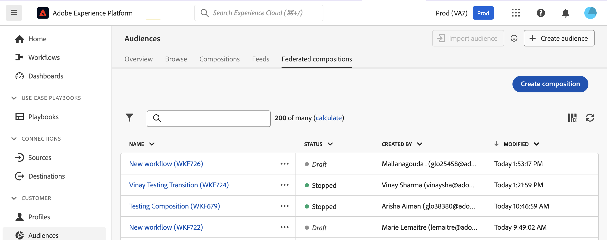
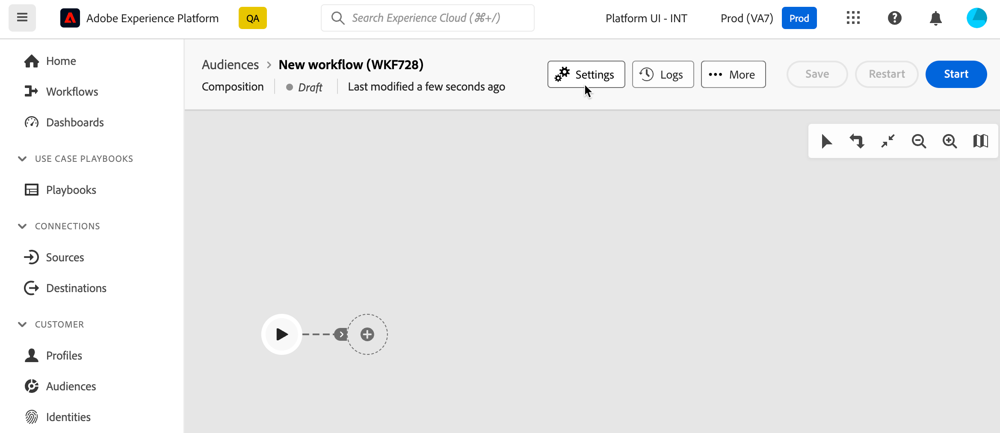

# 建立及設定構成 {#create}

建立構成的第一步是定義其標籤，並視需要設定其他設定。

## 建立構成 {#create-the-composition}

1. 存取 **[!UICONTROL 受眾]** 功能表並選取 **[!UICONTROL 同盟組合]** 標籤。

1. 按一下 **[!UICONTROL 建立組合]** 按鈕。

   

1. 在 **[!UICONTROL 屬性]** 區段，指定組合的標籤，然後按一下 **[!UICONTROL 建立]**.

1. 組合畫布隨即顯示。 您現在可以在執行構成之前，視需要新增任意數量的活動以符合您的需求，以設定構成：

   * [瞭解如何協調活動](#action-activities)
   * [瞭解如何開始和監視構成](#save)

## 設定構成設定 {#settings}

>[!CONTEXTUALHELP]
>id="dc_composition_settings_properties"
>title="組合屬性"
>abstract="本節提供建立構成時也可以存取的一般構成屬性。"

>[!CONTEXTUALHELP]
>id="dc_composition_settings_segmentation"
>title="組合分段"
>abstract="依預設，僅保留構成的最後一次執行的工作表。 您可以啟用此選項來保留工作表格以進行測試。 必須使用 **僅限** 在開發或中繼環境中。 在生產環境中絕對不可將其存回。"

>[!CONTEXTUALHELP]
>id="dc_composition_settings_error"
>title="錯誤管理設定"
>abstract="您可以在此段落中定義如何管理執行期間的錯誤。 您可以選擇暫停程式、忽略特定數目的錯誤，或停止構成執行。"

存取構成時，您可以存取進階設定，以讓您定義構成在發生錯誤時的行為方式。

若要存取構成的其他選項，請按一下 **設定** 按鈕位於構成建立畫面的上半部分。

可用的設定如下：

* **[!UICONTROL 標籤]**：變更構成標籤。

* **[!UICONTROL 保留兩次執行之間的中期母體結果]**：依預設，僅保留構成的最後一次執行的工作表。 技術構成會清除先前執行的工作表，每天執行。

  如果啟用此選項，即使執行構成後，也會保留工作表格。 您可以將其用於測試目的，因此必須使用 **僅限** 在開發或中繼環境中。 在生產組合中絕對不可核取它。

* **[!UICONTROL 錯誤管理]**：此選項可讓您定義構成活動發生錯誤時應採取的動作。 有三個可能的選項：

   * **[!UICONTROL 暫停處理序]**：構成會自動暫停，其狀態會變更為 **[!UICONTROL 已失敗]**. 問題解決後，請使用 **[!UICONTROL 繼續]** 按鈕。
   * **[!UICONTROL 忽略]**：觸發錯誤的工作狀態會變更為 **[!UICONTROL 已失敗]**，但構成會保留 **[!UICONTROL 已開始]** 狀態。
   * **[!UICONTROL 中止處理序]**：構成會自動停止，其狀態會變更為 **[!UICONTROL 已失敗]**. 問題解決後，請使用 **[!UICONTROL 開始]** 按鈕。

* **[!UICONTROL 連續錯誤]**：指定程式停止前可忽略的錯誤數。 達到此數字後，構成狀態會變更為 **[!UICONTROL 已失敗]**. 如果此欄位的值為0，則無論錯誤數量如何，構成都不會停止。
