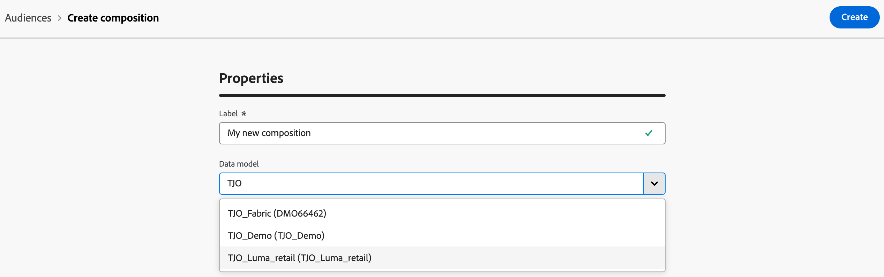

# 建立及設定構成 {#create}

建立構成的第一步是定義其標籤，並視需要設定其他設定。

## 建立構成 {#create-the-composition}

若要建立組合，請選取&#x200B;**[!UICONTROL 客戶]**&#x200B;區段內的&#x200B;**[!UICONTROL 對象]**，然後選取&#x200B;**[!UICONTROL 同盟組合]**&#x200B;索引標籤。

影像

同盟構成瀏覽頁面隨即顯示。 選取&#x200B;**[!UICONTROL 建立組合]**&#x200B;以繼續組合建立程式。

在&#x200B;**[!UICONTROL 屬性]**&#x200B;區段中，指定構成標籤，並選取資料模型。 只有與此資料模型相關聯的結構描述才可在您的構成活動中使用。

選擇 **[!UICONTROL 建立]**。組合畫布隨即顯示。 您現在可以在執行構成之前，視需要新增任意數量的活動以符合您的需求，以設定構成：

* [瞭解如何協調活動](orchestrate-activities.md)
* [瞭解如何開始和監視組合](start-monitor-composition.md)

## 進行構成設定 {#settings}

>[!CONTEXTUALHELP]
>id="dc_composition_settings_properties"
>title="構成屬性"
>abstract="本區段提供一般構成屬性，在建立構成時也可以存取這些屬性。"

>[!CONTEXTUALHELP]
>id="dc_composition_settings_segmentation"
>title="構成分段"
>abstract="依預設，只保留最後一次執行構成的工作表。您可以啟用此選項以保留工作表格用於測試目的。它必須&#x200B;**僅**&#x200B;在開發或中繼環境中使用。絕不能在生產環境中進行檢查。"

>[!CONTEXTUALHELP]
>id="dc_composition_settings_error"
>title="錯誤管理設定"
>abstract="在此區段中，您可以定義執行期間應如何管理錯誤。您可以選擇暫停流程、忽略一定數量的錯誤，或是停止構成執行。"

存取構成時，您可以存取進階設定，以讓您定義構成在發生錯誤時的行為方式。

若要存取這些其他選項，請選取構成建立畫面上方的&#x200B;**[!UICONTROL 設定]**。

可用的設定如下：

* **[!UICONTROL 標籤]**：變更構成標籤。

* **[!UICONTROL 保留兩個執行之間的臨時母體結果]**：依預設，僅保留構成的最後一個執行的工作表。 技術構成會清除先前執行的工作表，每天執行。

  如果啟用此選項，即使執行構成後，也會保留工作表格。 您可以將其用於測試目的，因此&#x200B;**只能**&#x200B;用於開發或中繼環境。 在生產組合中絕對不可核取它。

* **[!UICONTROL 錯誤管理]**：此選項可讓您定義在構成活動發生錯誤時要採取的動作。 有三個可能的選項：

   * **[!UICONTROL 暫停處理序]**：構成已自動暫停，其狀態變更為&#x200B;**[!UICONTROL 失敗]**。 問題解決後，請使用&#x200B;**[!UICONTROL 繼續]**&#x200B;按鈕繼續構成。
   * **[!UICONTROL 忽略]**：觸發錯誤的工作狀態變更為&#x200B;**[!UICONTROL 失敗]**，但構成會保留&#x200B;**[!UICONTROL 已啟動]**&#x200B;狀態。
   * **[!UICONTROL 中止處理序]**：構成已自動停止，其狀態變更為&#x200B;**[!UICONTROL 失敗]**。 問題解決後，請使用&#x200B;**[!UICONTROL 開始]**&#x200B;按鈕重新啟動構成。

* **[!UICONTROL 連續錯誤]**：指定程式停止前可忽略的錯誤數目。 一旦達到此數目，構成狀態就會變更為&#x200B;**[!UICONTROL 失敗]**。 如果此欄位的值為0，則無論錯誤數量如何，構成都不會停止。
