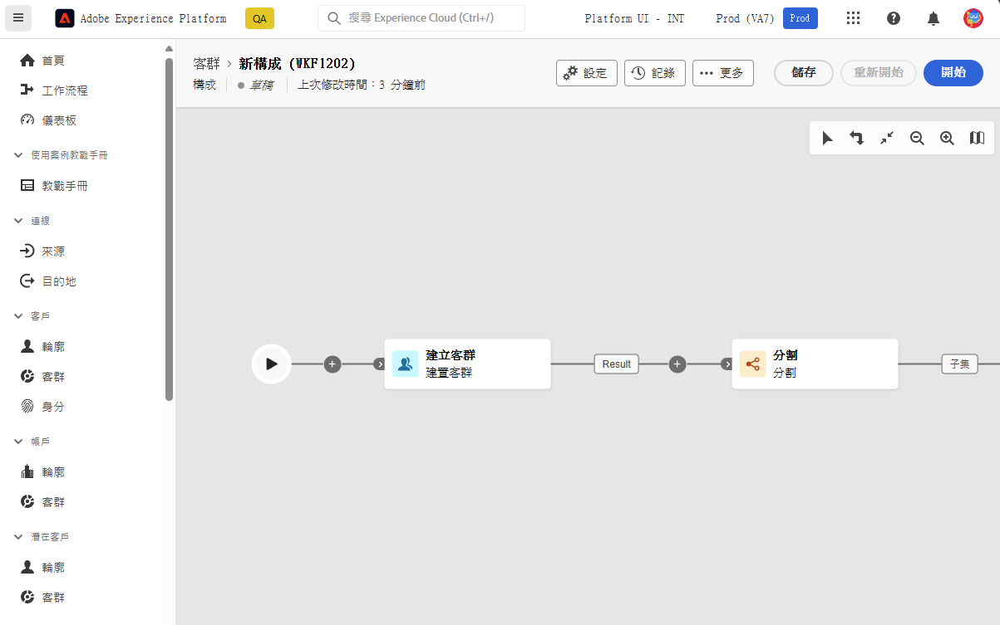
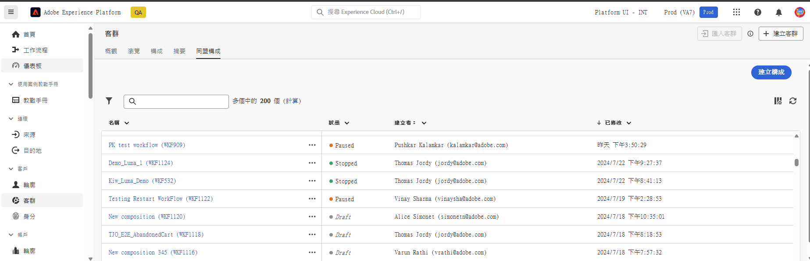
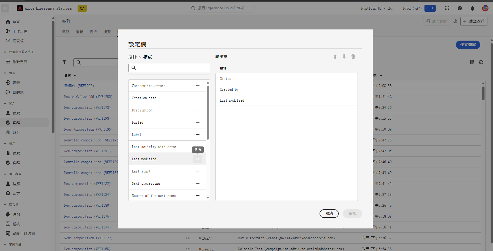

# 開始使用構成 {#compositions}

## 什麼是構成 {#what}

Adobe 客群構成允許您建立構成，讓您可以透過視覺化畫布的形式進行各種活動 (分割、排除…)，以建立客群。完成後，產生的客群會與現有客群一起儲存到 Adobe Experience Platform 中，並且可以在 Adobe Experience Platform 目的地和 Adobe Journey Optimizer 中用來鎖定客戶。[學習如何使用客群](../start/audiences.md)

## 存取和管理構成 {#access}

>[!CONTEXTUALHELP]
>id="dc_composition_list"
>title="構成"
>abstract="在此畫面中，您可以存取構成的完整清單、檢查其目前狀態、上次/下次執行日期並建立新的構成。"

您可以透過&#x200B;**[!UICONTROL 聯合構成]**&#x200B;索引標籤中的 Adobe Experience Platform **[!UICONTROL 客群]** 選單存取構成。

在此畫面中，您可以建立新的構成，並存取現有的構成。您也可以按一下現有構成名稱旁邊的省略符號按鈕，以複製或刪除構成。

若要縮小清單範圍，並輕鬆找到您想要的構成，您可以搜尋清單，並依狀態或最後處理日期篩選構成。

您也可以透過新增或移除資料欄來自訂清單。若要執行此操作，請按一下 **[!UICONTROL 設定資料欄]** 按鈕，並新增或移除所需的輸出資料欄。

## 構成的狀態 {#status}

構成可以有多種狀態：

* **[!UICONTROL 草稿]**：構成已建立並儲存。
* **[!UICONTROL 進行中]**：構成已執行，且正在執行中。
* **[!UICONTROL 已停止]**：構成已執行完成並停止。
* **[!UICONTROL 暫停]**：構成已暫停執行。
* **[!UICONTROL 錯誤]**：構成執行期間發生錯誤。請開啟構成並存取相關記錄和任務，以找出並解決錯誤。

有關如何開始並監控構成的詳細資訊，請參閱本[章節](../compositions/start-monitor-composition.md)。
