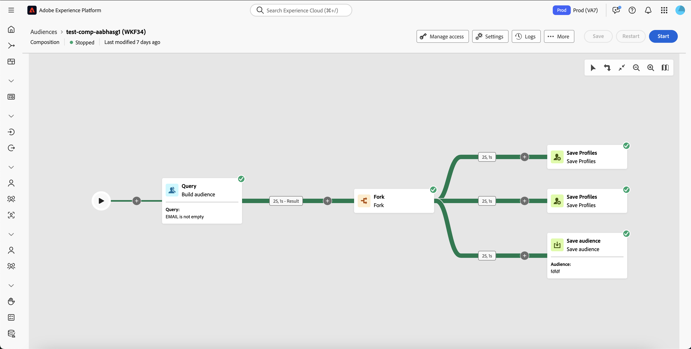
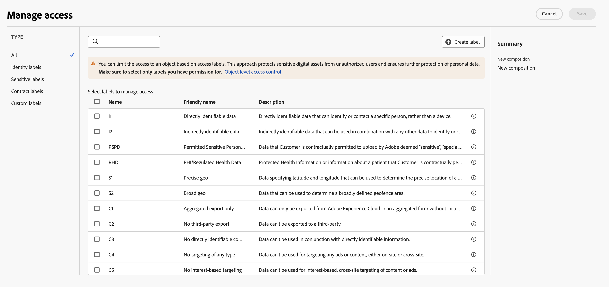

# 開始使用構成 {#compositions}

>[!AVAILABILITY]
>
>若要存取作品，您需要以下權限之一：
>
>-**管理聯合構成**
>-**檢視聯合構成**
>
>如需有關必要權限的詳細資訊，請參閱[存取控制指南](/help/governance-privacy-security/access-control.md)。

聯合客群構成可讓您建立構成，以便在其中利用視覺畫布中的各種活動來建立客群。在建立構成後，產生的客群會儲存到 Adobe Experience Platform 中，並且可以在 Experience Platform 目的地和 Adobe Journey Optimizer 中用來鎖定客戶。

{zoomable="yes"}{width="70%"}

## 存取和管理構成 {#access}

>[!CONTEXTUALHELP]
>id="dc_composition_list"
>title="構成"
>abstract="在此畫面中，您可以存取構成的完整清單、檢查其目前狀態、上次/下次執行日期並建立新的構成。"

您可以透過「**[!UICONTROL 客戶]**」區段內「**[!UICONTROL 聯合構成]**」標籤中的 Adobe Experience Platform「**[!UICONTROL 客群]**」選單來存取構成。

在此畫面中，您可以建立新的構成，並存取現有的構成。您也可以選取現有構成名稱旁邊的  按鈕，以複製或刪除該構成。

您還可以檢視有關構成的資訊，包括名稱、狀態、建立者和上次修改日期。

| 狀態 | 說明 |
| ------ | ----------- |
| **[!UICONTROL 草稿]** | 構成已建立並儲存。 |
| **[!UICONTROL 進行中]** | 構成已執行且正在執行中。 |
| **[!UICONTROL 已停止]** | 構成已執行完成並停止。 |
| **[!UICONTROL 已暫停]** | 構成已暫停執行。 |
| **[!UICONTROL 錯誤]** | 構成執行期間遇到錯誤。若要檢視有關錯誤的更多資訊，請開啟該構成並存取記錄。 |

您可以在[開始和監控構成指南](./start-monitor-composition.md)中了解如何開始或停止構成。

{zoomable="yes"}{width="70%"}

若要縮小清單範圍，並找到您想要的構成，您可以搜尋清單，並依狀態或上次處理日期篩選構成。

您也可以透過新增或移除欄來自訂清單。若要執行此操作，請選取「**[!UICONTROL 設定欄]**」按鈕，並新增或移除所需的輸出欄。

{zoomable="yes"}{width="70%"}

### 套用存取標籤 {#access-labels}

若要將存取標籤套用至特定構成，請選取該構成，然後選取「**[!UICONTROL 管理存取權]**」。

{zoomable="yes"}{width="70%"}

「**[!UICONTROL 管理存取權]**」彈出視窗隨即顯示。在此頁面上，您可以將適用的存取權和資料治理標籤套用至您的構成。

{zoomable="yes"}{width="70%"}

| 標籤類型 | 說明 |
| ---------- | ----------- |
| 合約標籤 | 合約標籤 (「C」標籤) 可用來對具有合約義務或與貴組織的資料治理原則相關的資料進行分類。 |
| 身分識別標籤 | 身分識別標籤 (「I」標籤) 可用來對可辨識或聯絡特定人員的資料進行分類。 |
| 敏感標籤 | 敏感標籤 (「S」標籤) 可用來對您和/或貴組織認定為敏感的資料進行分類。 |
| 合作夥伴生態系統標籤 | 合作夥伴生態系統標籤可用來對貴組織外部來源的資料進行分類。 |

如需有關存取權和資料治理標籤的詳細資訊，請參閱[資料使用標籤字彙表](https://experienceleague.adobe.com/zh-hant/docs/experience-platform/data-governance/labels/reference)。

## 後續步驟

在閱讀本指南後，您已了解如何為您的構成存取、管理和建立存取標籤。如需有關將客群作為一個整體進行處理的詳細資訊，請參閱[客群指南](../start/audiences.md)。
