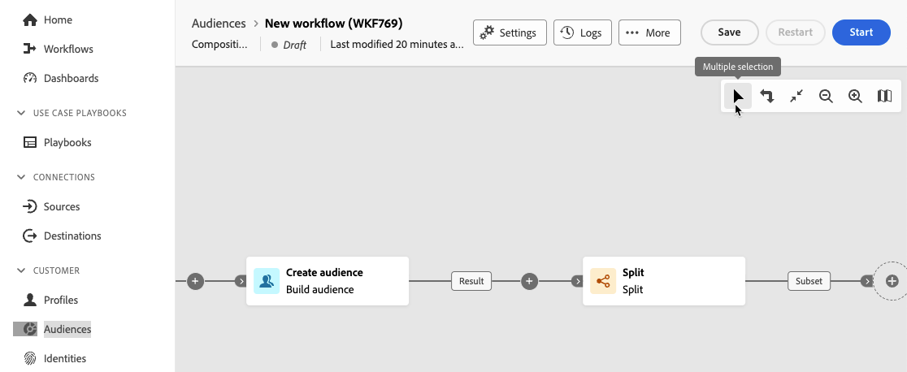

# 編排組合活動 {#activities}

建立構成後，您就可以開始編排將執行的不同任務。 為此，提供了視覺畫布，允許您構建構成圖。 在此圖表中，您可以新增各種活動，並依序連線它們。

## 新增活動 {#add}

在設定的這個階段，圖表會顯示起始圖示，代表工作流程的開始。 若要新增第一個活動，請按一下 **+** 按鈕連線至啟動圖示。

可新增至圖表的活動清單隨即顯示。 可用的活動取決於您在構成圖中的位置。 例如，新增第一個活動時，您可以透過鎖定對象、分割工作流程路徑、設定排程器以延遲工作流程執行或設定來開始撰寫 **等待** 活動以延遲工作流程執行。 另一方面，在 **建立對象** 活動，您可以使用目標定位活動來調整目標，或使用流量控制活動來組織構成程式。

將活動新增到圖表後，右側窗格會出現，可讓您使用特定設定來設定新新增的活動。 有關如何設定每個活動的詳細資訊，請參閱 [本節](activities/about-activities.md).

重複此程式，根據您希望構成執行的任務，新增所需數量的活動。 請注意，您也可以在兩個活動之間插入新活動。 若要這麼做，請按一下 **+** 按鈕在活動之間的轉變上，選取所需的活動並在右側窗格中設定它。

>[!TIP]
>
>您可以選擇個人化每個活動之間的轉變名稱。 要執行此操作，請選取轉變並在右窗格中變更其標籤。

## 畫布工具列 {#toolbar}

位於畫布右上角的工具列提供可輕鬆操控活動並在畫布中導覽的選項。

可用的動作包括：

* **多選**：選取多個活動以一次刪除全部，或複製並貼上它們。 請參閱[本節](#copy)。
* **旋轉**：垂直切換畫布。
* **符合熒幕大小**：調整畫布縮放等級以符合熒幕。
* **縮小顯示** / **放大顯示**：縮小或拉近畫布。
* **顯示地圖**：開啟畫布的快照，顯示您所在的位置。

## 管理活動 {#manage}

新增活動時，屬性窗格中會顯示動作按鈕，可讓您執行多項作業。

您可以：

* **刪除** 畫布中的活動。
* **停用/啟用** 活動。 執行工作流程時，不會執行已停用的活動以及相同路徑上的下列活動，且工作流程會停止。
* **暫停/繼續** 活動。 執行工作流程時，它會在暫停的活動中暫停。 系統不會執行對應的任務，以及在相同路徑中跟隨著該任務的所有任務。
* **複製** 活動以將其貼到構成中的其他位置。 若要這麼做，請按一下 **+** 按鈕並選取「貼上X活動」。 <!-- cannot copy multiple activities ? cannot paste in another composition?-->
* 設定 **執行選項** 針對選取的活動。 展開以下區段以進一步瞭解可用的選項。

  +++可用的執行選項

  此 **屬性** 區段可讓您設定有關活動執行的一般設定：

   * **執行**：定義啟動時要執行的動作。
   * **最長執行時間**：指定持續時間，例如&quot;30s&quot;或&quot;1h&quot;。 如果活動在指定的持續時間過後仍未完成，則會觸發警報。 這對工作流程的運作方式沒有影響。
   * **時區**：選取活動的時區。 同盟對象構成可讓您在同一例項上管理多個國家/地區之間的時間差異。 套用的設定會在建立執行個體時進行設定。
   * **相似性**：強制構成活動在特定電腦上執行。 若要這麼做，您必須為相關活動指定一或多個相關性。
   * **行為**：定義使用非同步工作時要遵循的程式。

  此 **錯誤管理** 區段可讓您指定當活動遇到錯誤時要執行的動作。

  此 **初始化指令碼** 區段可讓您初始化變數或修改活動屬性。 按一下 **編輯程式碼** 按鈕，並輸入要執行的程式碼片段。 當活動執行時，會呼叫指令碼。

+++

* 存取活動的 **記錄檔與任務**.
