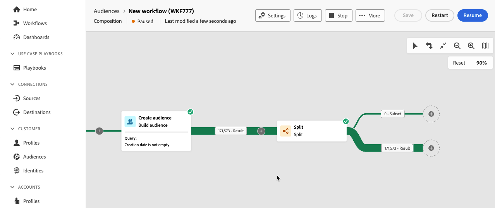
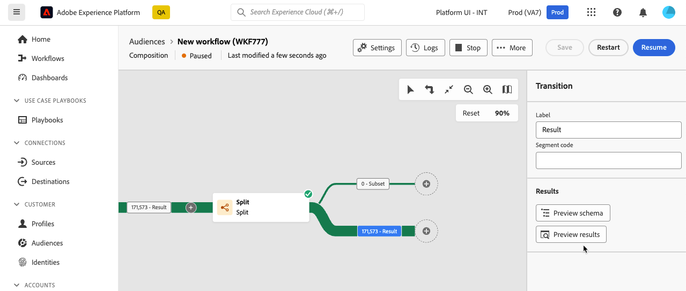
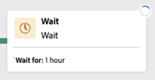
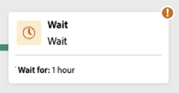
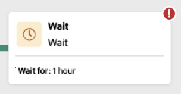
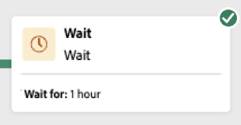
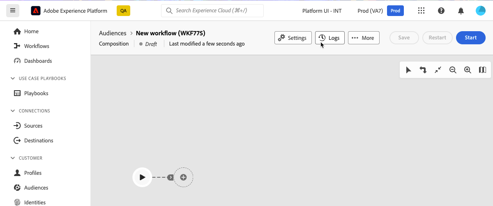
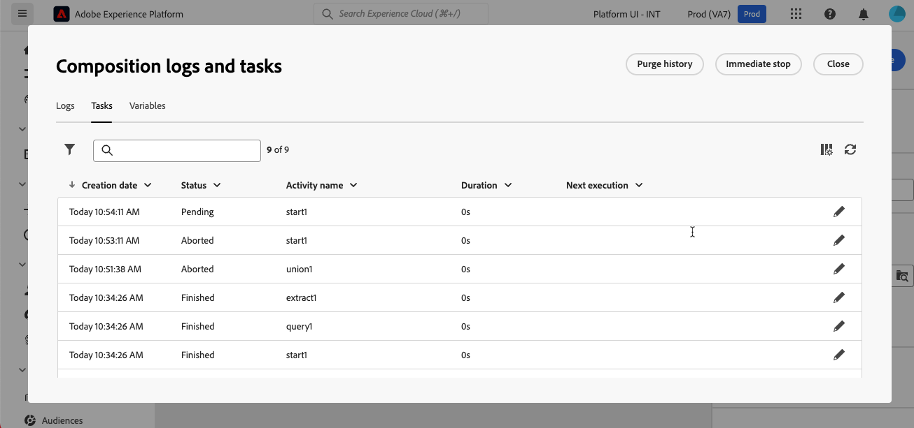
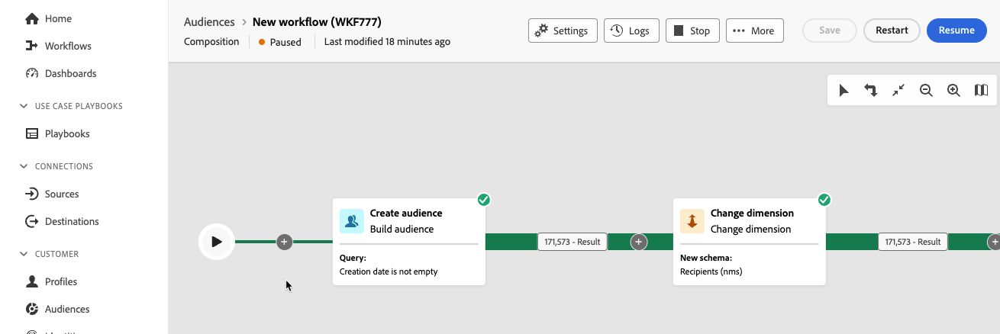

# 開始並監視您的構成 {#start-monitor}

建立構成並設計要在畫布中執行的任務後，您就可以啟動它並監視其執行方式。

## 開始構成 {#start}

若要開始撰寫，請按一下畫面右上角的&#x200B;**[!UICONTROL 開始]**&#x200B;按鈕。 當構成正在執行時，畫布中的每個活動都會依序執行，直到達到構成結尾為止。

您可以使用視覺流量即時追蹤目標設定檔的進度。 這可讓您快速識別每個活動的狀態，以及活動中轉換的個人檔案數。

## 組合轉變 {#transitions}

在組合中，透過轉變從一個活動傳輸到另一個活動的資料會儲存在臨時工作表中。 此資料可針對每個轉變顯示。 要執行此操作，請選取轉變以在熒幕右側開啟其屬性。

* 按一下&#x200B;**[!UICONTROL 預覽結構描述]**&#x200B;以顯示工作表的結構描述。
* 按一下&#x200B;**[!UICONTROL 預覽結果]**，以視覺化方式呈現所選轉變中傳輸的資料。

## 監視活動執行 {#activities}

每個活動方塊右上角的視覺指示器可讓您檢查其執行：

| 視覺指示器 | 說明 |
|-----|------------|
| {zoomable="yes"}{width="70%"} | 活動目前正在執行。 |
| {zoomable="yes"}{width="70%"} | 活動需要您注意。 這可能涉及確認傳遞的傳送或採取必要行動。 |
| {zoomable="yes"}{width="70%"} | 活動發生錯誤。 若要解決此問題，請開啟構成記錄以取得詳細資訊。 |
| {zoomable="yes"}{width="70%"} | 已成功執行活動。 |

## 監視日誌和任務 {#logs-tasks}

監控構成日誌和工作是分析構成並確保其正確執行的關鍵步驟。 可從動作工具列和每個活動屬性窗格中的&#x200B;**[!UICONTROL 記錄檔]**&#x200B;按鈕存取。

**[!UICONTROL 組合記錄檔與工作]**&#x200B;畫面提供組合執行的歷程記錄，記錄所有使用者動作與遇到的錯誤。

<!-- à confirmer, pas trouvé dans les options = The workflow history is saved for the duration specified in the workflow execution options. During this duration, all the messages are therefore saved, even after a restart. If you do not want to save the messages from a previous execution, you have to purge the history by clicking the  button.-->

歷史記錄會整理成數個標籤，詳細說明如下：

* **[!UICONTROL Log]**&#x200B;索引標籤包含所有構成活動的執行歷程記錄。 其會按時間順序，對執行的操作和執行錯誤進行索引。
* **[!UICONTROL 任務]**&#x200B;索引標籤詳細說明活動的執行順序。 位於每個任務結尾的按鈕可讓您列出透過活動傳遞的事件變數。
* **[!UICONTROL 變數]**&#x200B;索引標籤會列出構成中傳遞的所有變數。 僅可在從構成畫布存取日誌和工作時使用。 現在從活動的屬性窗格存取記錄檔時，即可使用此功能。 <!-- à confirmer-->

在所有標籤中，您可以選擇顯示的欄及其順序、套用篩選器，並使用搜尋欄位來快速尋找所需的資訊。

## 組合執行命令 {#execution-commands}

右上角的動作列提供可讓您管理構成執行的命令。

可用的動作包括：

* **[!UICONTROL 開始]**：開始執行構成，接著會顯示&#x200B;**[!UICONTROL 進行中]**&#x200B;狀態。 構成已開始，且初始活動已啟動。

* **[!UICONTROL 繼續]**：繼續執行已暫停的組合。 構成採用&#x200B;**[!UICONTROL 進行中]**&#x200B;狀態。

* **[!UICONTROL 暫停]**&#x200B;構成執行，然後會出現&#x200B;**[!UICONTROL 暫停]**&#x200B;狀態。 在繼續之前，不會啟用任何新活動，但不會暫停進行中的作業。

* **[!UICONTROL 停止]**&#x200B;正在執行的組合，這會顯示&#x200B;**[!UICONTROL 已完成]**&#x200B;的狀態。 如果可能的話，進行中的作業會被中斷。 您無法從停止的同一個位置繼續構成。

* **[!UICONTROL 重新啟動]**：停止然後重新啟動組合。 在大多數情況下，這可以讓您更快速地重新啟動，因為停止需要一定的時間，而且&#x200B;**[!UICONTROL 啟動]**&#x200B;按鈕只有在停止生效時才可用。
