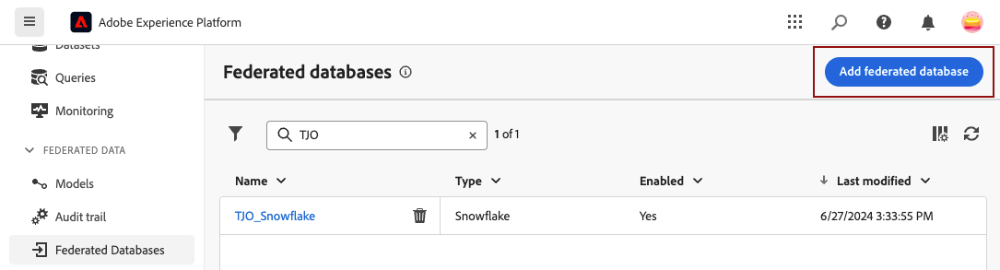
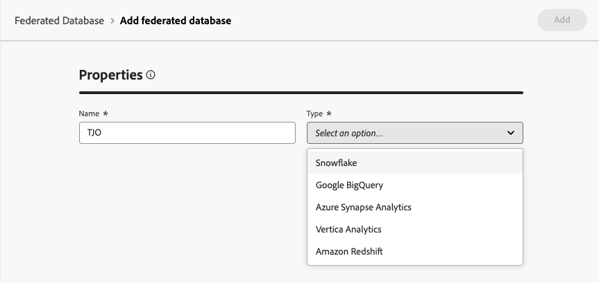
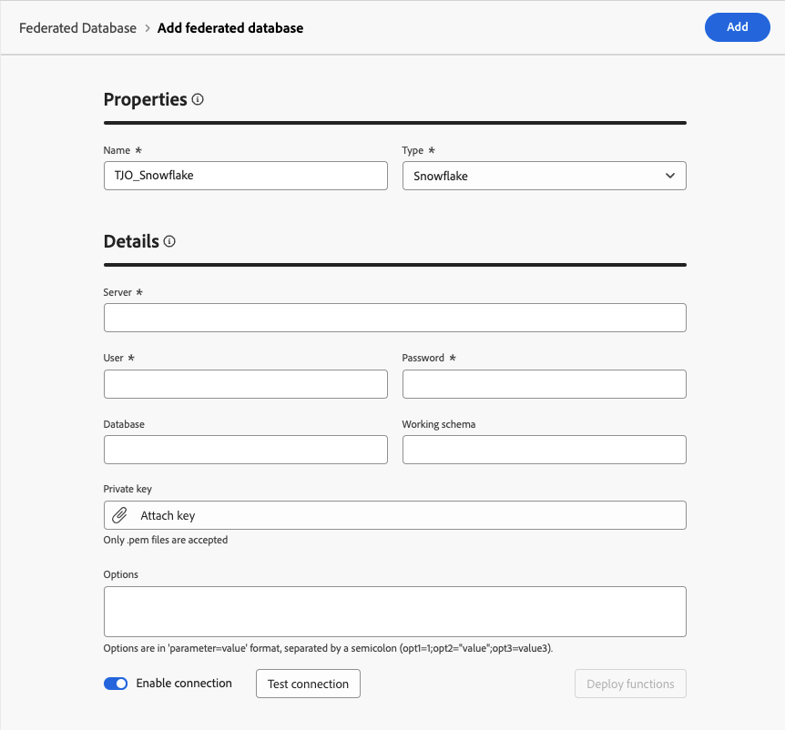
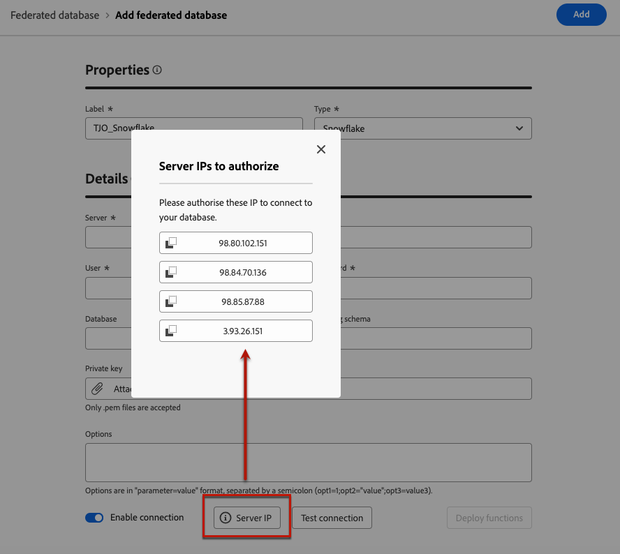
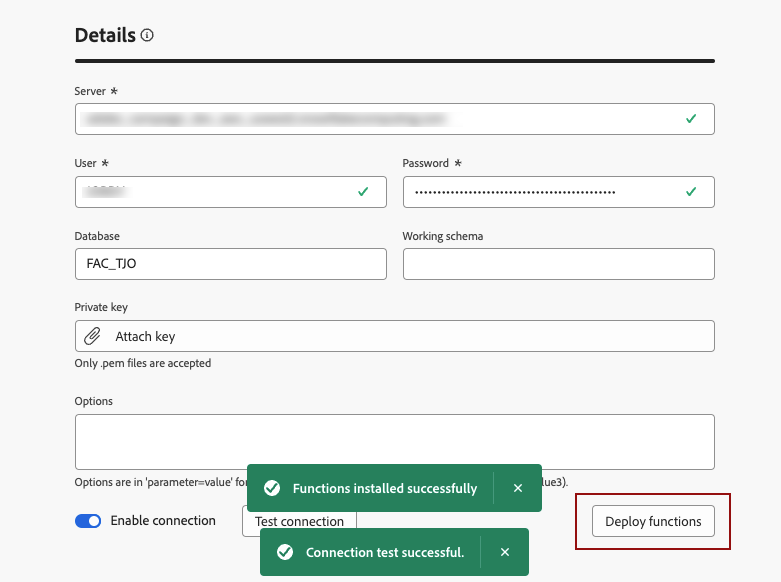
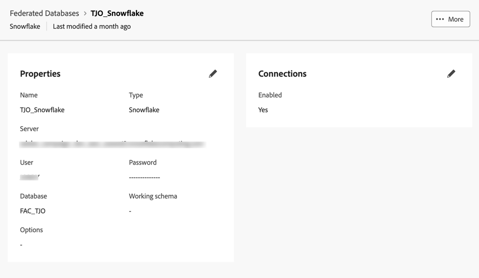

# 建立連線 {#connections-fdb}

>[!AVAILABILITY]
>
>若要存取連線，您需要下列其中一個許可權：
>
>-**管理同盟資料庫**
>&#x200B;>-**檢視同盟資料庫**
>
>如需必要許可權的詳細資訊，請參閱[存取控制指南](/help/governance-privacy-security/access-control.md)。

Experience Platform同盟對象構成可讓客戶從協力廠商資料倉儲建立並豐富對象，並將對象匯入至Adobe Experience Platform。 支援的資料倉儲列於[此區段](../start/access-prerequisites.md#supported-systems)中。

若要使用同盟資料庫和Adobe Experience Platform，您必須先建立連線。 此連線設定於Adobe Experience Platform使用者介面提供的專用使用者介面中，詳情請參閱本頁。

若要設定與資料庫的連線，請執行下列步驟：

1. 在左側邊欄瀏覽至&#x200B;**[!UICONTROL 同盟資料]**&#x200B;區段。

1. 在&#x200B;**[!UICONTROL 同盟資料庫]**&#x200B;連結中，按一下&#x200B;**[!UICONTROL 新增同盟資料庫]**&#x200B;按鈕。

   {zoomable="yes"}

1. 使用資料庫名稱和型別設定連線&#x200B;**[!UICONTROL Properties]**。

   {zoomable="yes"}

   選取其型別可讓您存取要填寫的其他屬性。 在這裡瞭解更多有關[此頁面](federated-db.md)支援的資料庫。

   {zoomable="yes"}

   組態設定取決於資料庫的型別。 瀏覽下列連結以存取設定連線所需的詳細資訊：

   * [Amazon Redshift](federated-db.md#amazon-redshift)
   * [Azure Synapse](federated-db.md#azure-synapse-redshift)
   * [Databricks](federated-db.md#databricks)
   * [Google BigQuery](federated-db.md#google-bigquery)
   * [Snowflake](federated-db.md#snowflake)
   * [Vertica Analytics](federated-db.md#vertica-analytics)
   * [Microsoft Fabric](federated-db.md#microsoft-fabric)

1. 針對每個支援的資料庫，選取&#x200B;**[!UICONTROL 伺服器IP]**&#x200B;按鈕。 系統會顯示與您同盟對象構成執行個體相關聯的所有IP清單。

   {zoomable="yes"}

   按一下清單中的IP，將其複製到您的系統中，並授權此IP連線到您的資料庫。

   >[!NOTE]
   >
   >若要針對指定資料庫使用同盟對象構成，您必須允許列出與該資料庫相關聯的所有IP位址。

1. 填寫詳細資料後，按一下&#x200B;**[!UICONTROL 測試連線]**&#x200B;按鈕，再按一下&#x200B;**[!UICONTROL 部署函式]**&#x200B;按鈕。

   {zoomable="yes"}

1. 按一下&#x200B;**[!UICONTROL 儲存]**&#x200B;按鈕，完成連線的建立。

   您有同盟資料庫連線的概觀，如下所示：

   {zoomable="yes"}
