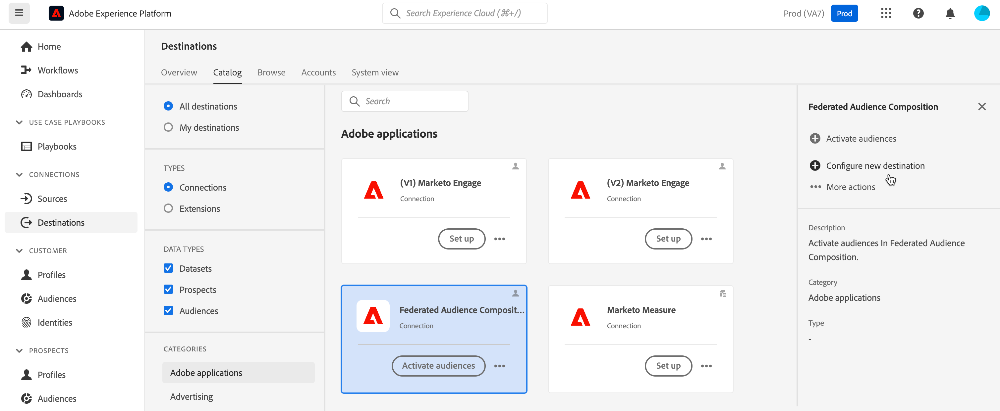
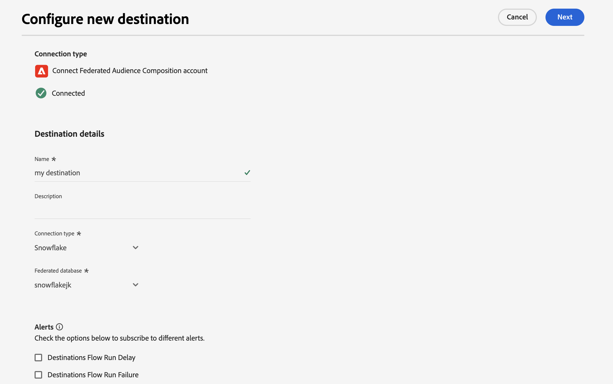
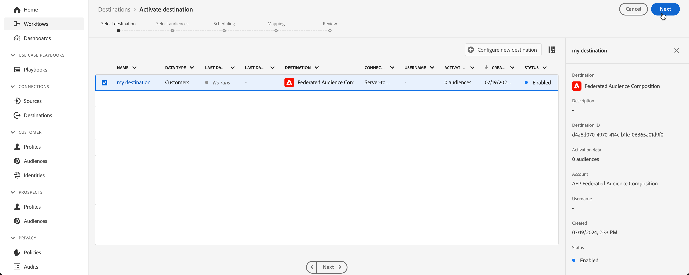
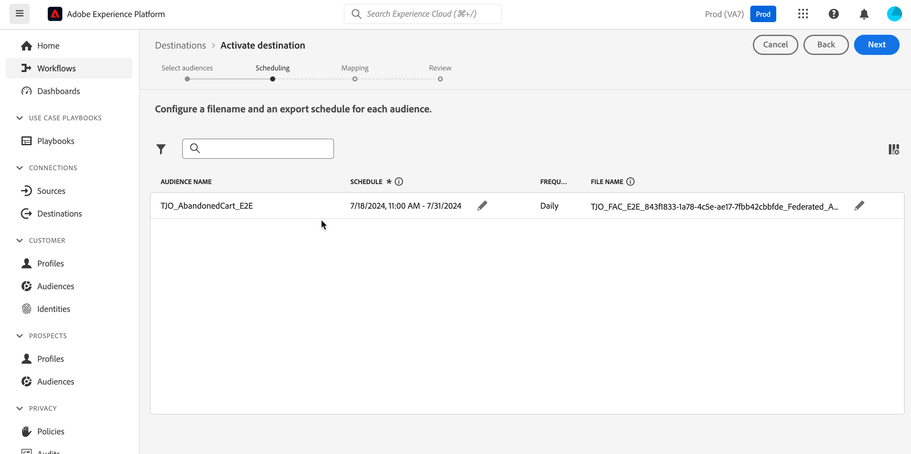
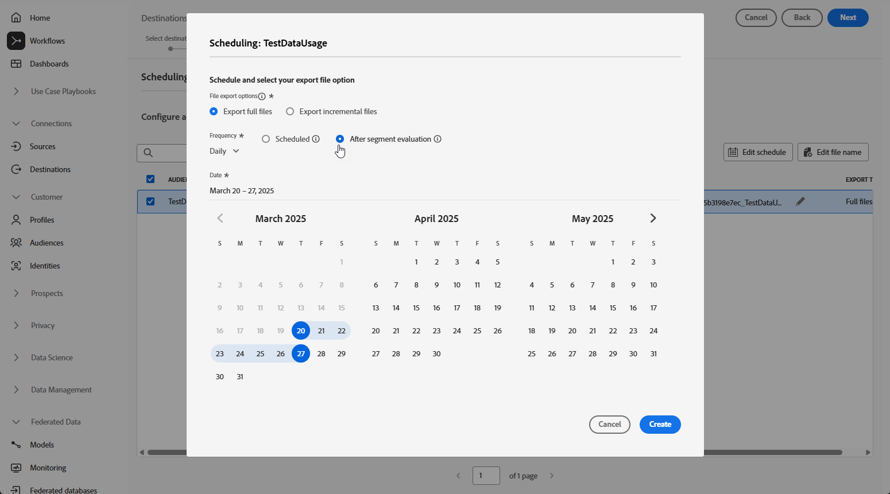
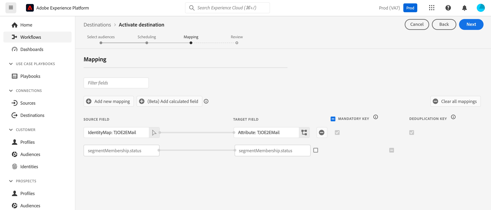

# 使用外部資料擴充 Adobe Experience Platform 客群 {#connect-aep-fac}

>[!CONTEXTUALHELP]
>id="dc_new_destination"
>title="建立目標"
>abstract="輸入連接到新聯合資料庫的設定。使用&#x200B;**[!UICONTROL 連結到目標]**&#x200B;按鈕驗證您的設定。"

Adobe Experience Platform允許使用&#x200B;**Adobe同盟對象組合目的地**，將對象入口網站中的對象與外部資料庫緊密整合。 透過這項整合，您可以將現有的對象運用在構成中，並使用外部資料庫的資料來豐富或改良對象，以建立新的對象。

若要這麼做，您需要在Adobe Experience Platform中設定與Adobe同盟對象構成目的地的新連線。 您可以使用排程器定期傳送特定對象，並選取要包含的特定屬性，例如用於資料協調的ID。 如果您已將治理和隱私權政策套用至對象，則會在對象更新後保留並傳回對象入口網站。

例如，假設您要將購買資訊儲存在Data Warehouse，且已有Adobe Experience Platform受眾鎖定最近兩個月對特定產品感興趣的客戶。 使用同盟對象構成目的地，您可以：

* 根據購買資訊調整對象。 例如，您可以篩選受眾，將目標鎖定於僅購買超過150$的客戶。
* 使用與購買相關的欄位豐富對象，例如產品名稱和購買數量。

將Adobe Experience Platform對象傳送至Adobe同盟對象構成的主要步驟如下：

1. 存取Adobe Experience Platform目的地目錄，並選取同盟對象構成目的地。

   在右窗格中，選取&#x200B;**[!UICONTROL 設定新目的地]**。

   

1. 輸入新連線的名稱，然後從下列可用的連線中選取&#x200B;**[!UICONTROL 連線型別]**：

   * Amazon Redshift
   * Azure Synapse Analytics
   * Google BigQuery
   * Snowflake
   * Vertica Analytics
   * Databricks
   * Microsoft Fabric

1. 選取您要連線的&#x200B;**[!UICONTROL 同盟資料庫]**，接著選取&#x200B;**[!UICONTROL 下一步]**。

   

1. 在&#x200B;**[!UICONTROL 警示]**&#x200B;區段中，您可以啟用警示以接收有關您目的地之資料流狀態的通知。

   如需警示的詳細資訊，請參閱Adobe Experience Platform關於使用UI訂閱目的地警示[的檔案](https://experienceleague.adobe.com/en/docs/experience-platform/destinations/ui/alerts){target="_blank"}

1. **[!UICONTROL 治理原則與執行動作]**&#x200B;步驟，您可以定義您的資料治理原則，並確保在傳送和啟用對象時，所使用的資料是合規的。

   當您完成選取目的地所需的行銷動作時，請選取&#x200B;**[!UICONTROL 建立]**。

1. 會建立與目的地的新連線。 您現在可以啟用對象以傳送至目的地。 若要這麼做，請從清單中選取該專案，然後選取&#x200B;**[!UICONTROL 下一步]**

   

1. 選取您要傳送的所需對象。

1. 選取圖示以編輯您的匯出排程。

   

1. 定義匯出檔案選項。 若要更快速地啟用對象，請選取&#x200B;**[!UICONTROL 區段評估之後]**&#x200B;選項，以便在每日Platform批次分段工作完成後立即觸發啟用工作。

   

   >[!NOTE]
   >
   >如需如何設定排程和檔案名稱的詳細資訊，請參閱Adobe Experience Platform檔案的下列章節：
   >
   >* [排程對象匯出](https://experienceleague.adobe.com/en/docs/experience-platform/destinations/ui/activate/activate-batch-profile-destinations#scheduling){target="_blank"}
   >* [設定檔案名稱](https://experienceleague.adobe.com/en/docs/experience-platform/destinations/ui/activate/activate-batch-profile-destinations#configure-file-names){target="_blank"}

1. 在&#x200B;**[!UICONTROL 對應]**&#x200B;步驟中，選取要為對象匯出的屬性和身分欄位。 如需詳細資訊，請參閱Adobe Experience Platform檔案中的[對應步驟](https://experienceleague.adobe.com/en/docs/experience-platform/destinations/ui/activate/activate-batch-profile-destinations#mapping){target="_blank"}。

   

1. 檢閱目的地組態和對象設定，然後選取&#x200B;**[!UICONTROL 完成]**。

   

現在為新連線啟用選取的對象。 您可以導覽回&#x200B;**[!UICONTROL 啟用對象]**&#x200B;頁面，新增更多要透過此連線傳送的對象。 對象啟動後，您就無法移除對象。
