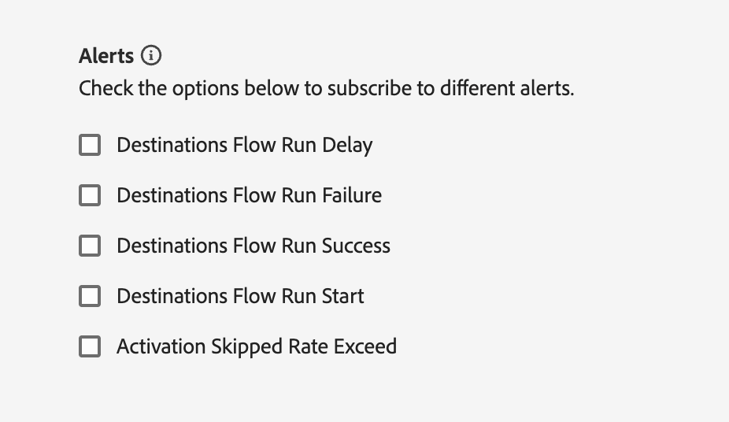

# 使用外部資料擴充 Adobe Experience Platform 客群 {#connect-aep-fac}

>[!CONTEXTUALHELP]
>id="dc_new_destination"
>title="建立目標"
>abstract="輸入連接到新聯合資料庫的設定。 使用&#x200B;**[!UICONTROL 連結到目標]**&#x200B;按鈕驗證您的設定。"

Adobe Experience Platform允許使用&#x200B;**Adobe同盟對象組合目的地**，將對象入口網站中的對象與外部資料庫緊密整合。 透過這項整合，您可以將現有的對象運用在構成中，並使用外部資料庫的資料來豐富或改良對象，以建立新的對象。

若要這麼做，您需要在Adobe Experience Platform中設定與Adobe同盟對象構成目的地的新連線。 您可以使用排程器定期傳送特定對象，並選取要包含的特定屬性，例如用於資料協調的ID。 如果您已將治理和隱私權政策套用至對象，則會在對象更新後保留並傳回對象入口網站。

例如，假設您要將購買資訊儲存在Data Warehouse，且已有Adobe Experience Platform受眾鎖定最近兩個月對特定產品感興趣的客戶。 使用同盟對象構成目的地，您可以：

* 根據購買資訊調整對象。 例如，您可以篩選受眾，將目標鎖定於僅購買超過$150的客戶。
* 使用與購買相關的欄位豐富對象，例如產品名稱和購買數量。

## 對目的地啟用對象 {#activate}

在「Adobe Experience Platform目的地」目錄中，選取「同盟對象構成」目的地。 在右窗格中，選取&#x200B;**[!UICONTROL 設定新目的地]**。

![目的地目錄中的[設定新目的地]按鈕會反白顯示。](assets/destinations/new.png)

**[!UICONTROL 設定新目的地]**&#x200B;頁面就會顯示。 您可以在此頁面設定目的地詳細資訊，包括名稱、說明、連線型別和同盟資料庫。

![顯示[設定新目的地]頁面，顯示建立目的地需要新增哪些詳細資料。](assets/destinations/configure.png)

在&#x200B;**[!UICONTROL 警示]**&#x200B;區段中，您可以啟用警示以接收有關您目的地之資料流狀態的通知。 其中包括資料流執行延遲、執行失敗、執行成功、執行開始和啟動略過的警示。

如需警示的詳細資訊，請參閱Adobe Experience Platform關於使用UI[&#128279;](https://experienceleague.adobe.com/en/docs/experience-platform/destinations/ui/alerts){target="_blank"}訂閱目的地警示的檔案。

完成目的地詳細資訊的設定後，請選取&#x200B;**[!UICONTROL 下一步]**。 **[!UICONTROL 治理原則與執行動作]**&#x200B;步驟隨即顯示。 您可以在此頁面定義資料治理原則，並確保使用的資料在傳送及啟用對象時符合要求。

當您完成選取目的地所需的行銷動作時，請選取&#x200B;**[!UICONTROL 建立]**。

會建立與目的地的新連線。 您現在可以啟用對象以傳送至目的地。 選擇您要啟用對象的目的地，然後按&#x200B;**[!UICONTROL 下一步]**。

顯示&#x200B;**[!UICONTROL 排程]**&#x200B;步驟。 您可以選取想要對目的地啟用的對象。 若要設定排程，請選取以編輯您的匯出排程。

![顯示[啟用目的地]頁面。](assets/destinations/schedule.png)

出現&#x200B;**[!UICONTROL 排程]**&#x200B;彈出視窗。 您可以在此彈出視窗定義檔案匯出選項、頻率，並設定排程。

>[!NOTE]
>
>若要更快速地啟用對象，請選取&#x200B;**[!UICONTROL 區段評估之後]**&#x200B;選項，以便在每日Platform批次分段工作完成後立即觸發啟用工作。
>
>如需如何設定排程和檔案名稱的詳細資訊，請閱讀Adobe Experience Platform檔案的下列區段：
>
>* [排程對象匯出](https://experienceleague.adobe.com/en/docs/experience-platform/destinations/ui/activate/activate-batch-profile-destinations#scheduling){target="_blank"}
>* [設定檔案名稱](https://experienceleague.adobe.com/en/docs/experience-platform/destinations/ui/activate/activate-batch-profile-destinations#configure-file-names){target="_blank"}

在&#x200B;**[!UICONTROL 對應]**&#x200B;步驟中，選取要為對象匯出的屬性和身分欄位。

>[!IMPORTANT]
>
>啟用至目的地時，您&#x200B;**無法**&#x200B;使用系統產生的資料行。 選取系統產生的欄會導致發生錯誤。

如需詳細資訊，請參閱Adobe Experience Platform檔案中的[對應區段](https://experienceleague.adobe.com/en/docs/experience-platform/destinations/ui/activate/activate-batch-profile-destinations#mapping){target="_blank"}。

檢閱目的地組態和對象設定，然後選取&#x200B;**[!UICONTROL 完成]**。

現在為新連線啟用選取的對象。 您可以導覽回&#x200B;**[!UICONTROL 啟用對象]**&#x200B;頁面，新增更多要透過此連線傳送的對象。 對象啟動後，您就無法移除對象。
