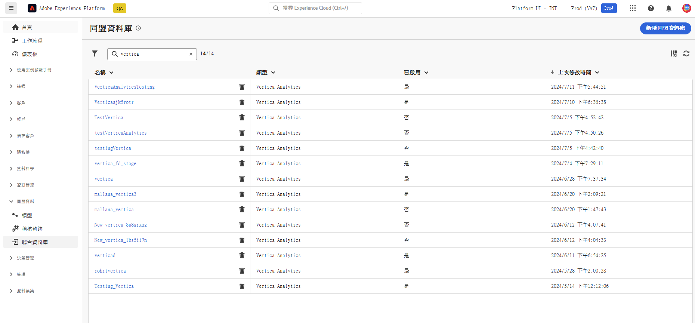
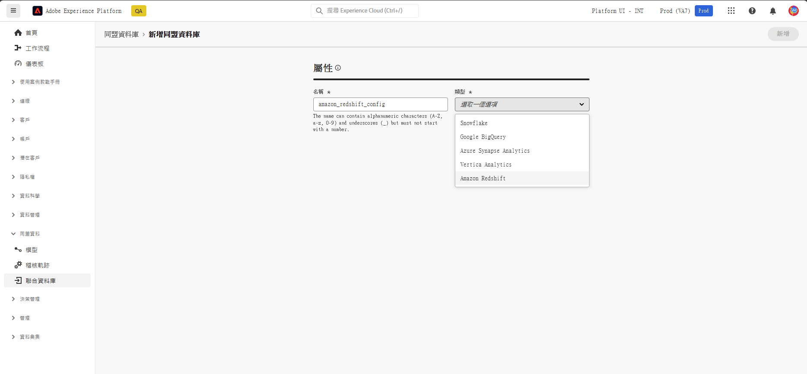
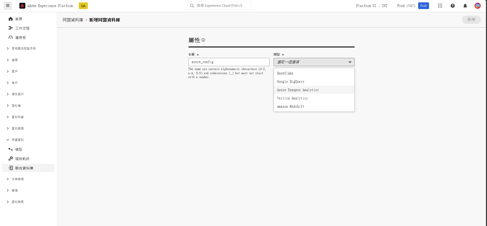
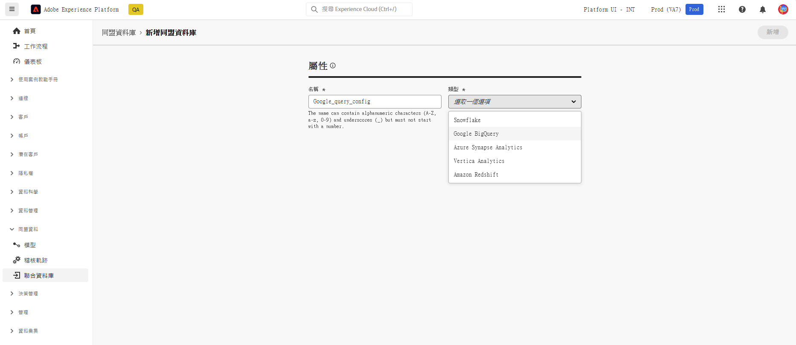
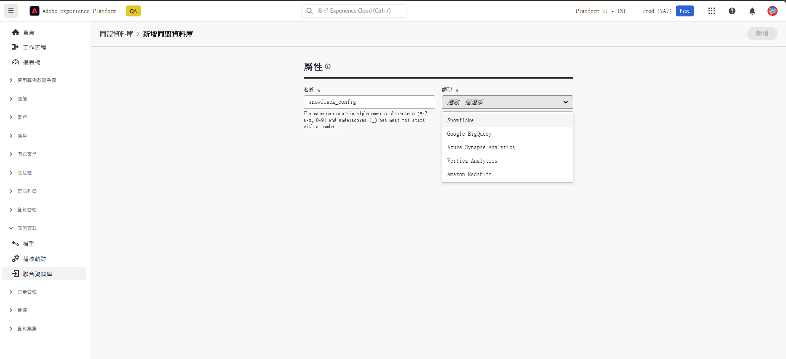
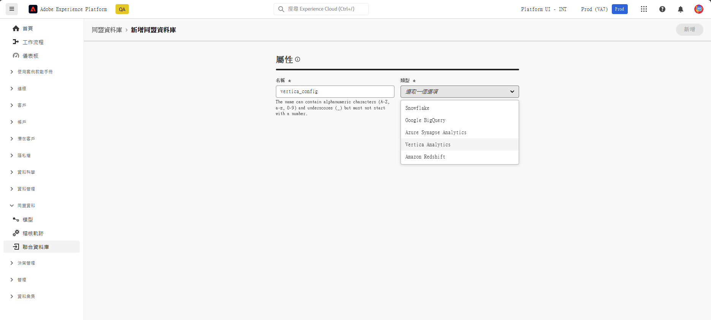
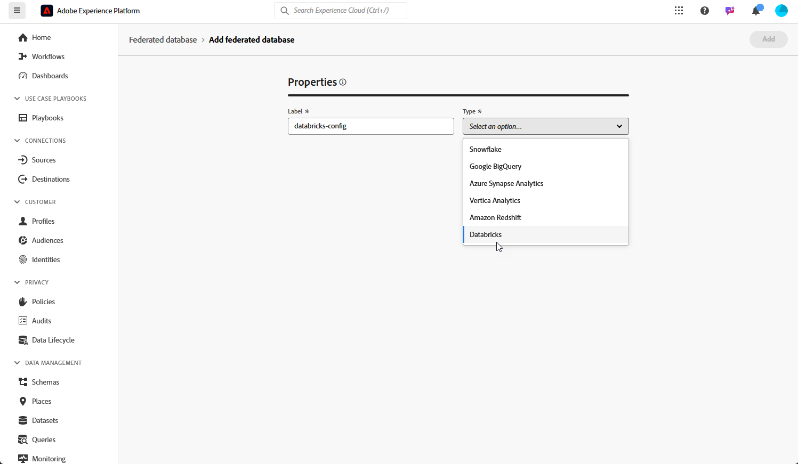
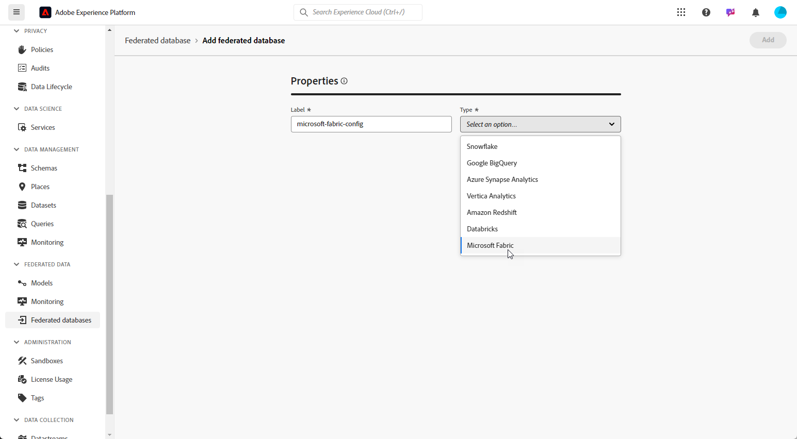

# 設定您的聯合資料庫 {#federated-db}

>[!CONTEXTUALHELP]
>id="dc_connection_federated_database_menu"
>title="聯合資料庫"
>abstract="此畫面中列出了與聯合資料庫的現有連接。若要建立新連接，請按一下&#x200B;**[!UICONTROL 新增聯合資料庫]**&#x200B;按鈕。"

>[!CONTEXTUALHELP]
>id="dc_connection_federated_database_properties"
>title="聯合資料庫屬性"
>abstract="輸入新聯合資料庫的名稱，然後選取其類型。"

>[!CONTEXTUALHELP]
>id="dc_connection_federated_database_details"
>title="聯合資料庫詳細資料"
>abstract="輸入連接到新聯合資料庫的設定。使用「**[!UICONTROL 測試連線]**」按鈕來驗證您的設定。"

Experience Platform 聯合客群構成可讓客戶從第三方資料倉儲中建立和擴充客群，並將客群匯入 Adobe Experience Platform。

若要了解如何建立、設定、測試及儲存與外部資料庫的連線，請參閱[此頁面](connections.md)。您可以在下方找到支援的資料庫清單以及為每個資料庫設定的詳細設定。

## 支援的資料庫 {#supported-db}

您可以透過聯合客群構成連接下列資料庫。每個資料庫的設定詳述如下。

* [Amazon Redshift](#amazon-redshift)
* [Azure Synapse Analytics](#azure-synapse)
* [Google Big Query](#google-big-query)
* [Snowflake](#snowflake)
* [Vertica Analytics](#vertica-analytics)
* [Databricks](#databricks)
* [Microsoft Fabric](#microsoft-fabric)

## Amazon Redshift {#amazon-redshift}

>[!AVAILABILITY]
>
>僅支援 Amazon Redshift AWS、Amazon Redshift Spectrum 和 Amazon Redshift Serverless。

使用聯合資料庫來處理儲存在外部資料庫中的資訊。請依照以下步驟，設定 Amazon Redshift 的存取權。

1. 在&#x200B;**[!UICONTROL 聯合資料]**&#x200B;選單中，選取&#x200B;**[!UICONTROL 聯合資料庫]**。

1. 按一下&#x200B;**[!UICONTROL 新增聯合資料庫]**。

   

1. 輸入聯合資料庫的&#x200B;**[!UICONTROL 名稱]**。

1. 在&#x200B;**[!UICONTROL 類型]**&#x200B;下拉式清單中，選取 Amazon Redshift。

   

1. 完成 Amazon Redshift 驗證設定：

   * **[!UICONTROL 伺服器]**：新增 DNS 的名稱。

   * **[!UICONTROL 帳戶]**：新增使用者名稱。

   * **[!UICONTROL 密碼]**：新增帳戶密碼。

   * **[!UICONTROL 資料庫]**：資料庫名稱 (如果沒有在 DSN 中指定)。如果已於 DSN 中指定，則可以保留空白

   * **[!UICONTROL 工作結構描述]**：用於工作表的資料庫結構描述的名稱。若要了解更多資訊，請參閱 [Amazon 文件](https://docs.aws.amazon.com/redshift/latest/dg/r_Schemas_and_tables.html){target="_blank"}

     >[!NOTE]
     >
     >若要使用資料庫中的任何結構描述，只要您具有連接至此結構描述所需的權限，就可以使用該結構描述，包括用於臨時資料處理的結構描述。
     >
     >將多個沙箱與相同資料庫連接時，必須使用&#x200B;**不同的工作結構描述**。

1. 選取&#x200B;**[!UICONTROL 測試連接]**&#x200B;選項，以驗證您的設定。

1. 按一下&#x200B;**[!UICONTROL 部署功能]**&#x200B;按鈕，建立相關功能。

1. 設定完成後，按一下&#x200B;**[!UICONTROL 新增]**&#x200B;建立聯合資料庫。

## Azure Synapse Analytics {#azure-synapse}

使用聯合資料庫來處理儲存在外部資料庫中的資訊。請依照下列步驟，設定 Azure Synapse Analytics 的存取權。

1. 在&#x200B;**[!UICONTROL 聯合資料]**&#x200B;選單中，選取&#x200B;**[!UICONTROL 聯合資料庫]**。

1. 按一下&#x200B;**[!UICONTROL 新增聯合資料庫]**。

   

1. 輸入聯合資料庫的&#x200B;**[!UICONTROL 名稱]**。

1. 在「**[!UICONTROL 類型]**」下拉式清單中，選取 Azure Synapse Analytics。

   

1. 完成 Azure Synapse Analytics 驗證設定：

   * **[!UICONTROL 伺服器]**：輸入 Azure Synapse 伺服器的 URL。

   * **[!UICONTROL 帳戶]**：輸入使用者名稱。

   * **[!UICONTROL 密碼]**：輸入帳戶密碼。

   * **[!UICONTROL 資料庫]** (選填)：輸入資料庫的名稱 (如果沒有在 DSN 中指定)。

   * **[!UICONTROL 選項]**：下表詳細說明了連接器支援的選項。

1. 選取&#x200B;**[!UICONTROL 測試連接]**&#x200B;選項，以驗證您的設定。

1. 按一下&#x200B;**[!UICONTROL 部署功能]**&#x200B;按鈕，建立相關功能。

1. 設定完成後，按一下&#x200B;**[!UICONTROL 新增]**&#x200B;建立聯合資料庫。

| 選項 | 說明 |
|---|---|
| Authentication | 連接器支援的驗證類型。目前支援的值：ActiveDirectoryMSI。若需更多詳細資訊，請參閱 [Microsoft SQL 文件](https://learn.microsoft.com/en-us/sql/connect/odbc/using-azure-active-directory?view=sql-server-ver15#example-connection-strings){target="_blank"} (連接字串範例 n°8) |

## Google Big Query {#google-big-query}

使用聯合資料庫來處理儲存在外部資料庫中的資訊。請依照下列步驟，設定 Google Big Query 的存取權。

1. 在&#x200B;**[!UICONTROL 聯合資料]**&#x200B;選單中，選取&#x200B;**[!UICONTROL 聯合資料庫]**。

1. 按一下&#x200B;**[!UICONTROL 新增聯合資料庫]**。

   

1. 輸入聯合資料庫的&#x200B;**[!UICONTROL 名稱]**。

1. 在&#x200B;**[!UICONTROL 類型]**&#x200B;下拉式清單中，選取 Google Big Query。

   

1. 設定 Google Big Query 的驗證設定：

   * **[!UICONTROL 服務帳戶]**：輸入&#x200B;**[!UICONTROL 服務帳戶]**&#x200B;的電子郵件地址。如需相關詳細資訊，請參閱 [Google Cloud 文件](https://cloud.google.com/iam/docs/creating-managing-service-accounts){target="_blank"}。

   * **[!UICONTROL 專案]**：輸入&#x200B;**[!UICONTROL 專案]**&#x200B;的 ID。如需相關詳細資訊，請參閱 [Google Cloud 文件](https://cloud.google.com/resource-manager/docs/creating-managing-projects){target="_blank"}。

   * **[!UICONTROL 資料集]**：輸入&#x200B;**[!UICONTROL 資料集]**&#x200B;的名稱。如需相關詳細資訊，請參閱 [Google Cloud 文件](https://cloud.google.com/bigquery/docs/datasets-intro){target="_blank"}。

   * **[!UICONTROL 金鑰檔案路徑]**：將您的金鑰檔案上傳至伺服器。只接受 .json 檔案。

   * **[!UICONTROL 選項]**：下表詳細說明了連接器支援的選項。

1. 選取&#x200B;**[!UICONTROL 測試連接]**&#x200B;選項，以驗證您的設定。

1. 按一下&#x200B;**[!UICONTROL 部署功能]**&#x200B;按鈕，建立相關功能。

1. 設定完成後，按一下&#x200B;**[!UICONTROL 新增]**&#x200B;建立聯合資料庫。

| 選項 | 說明 |
|---|---|
| ProxyType | 透過 ODBC 和 SDK 連接器連接至 BigQuery 所使用的 Proxy 類型。 目前支援 HTTP (預設)、http_no_tunnel、socks4 和 socks5。 |
| ProxyHost | 可連接至 Proxy 的主機名稱或 IP 位址。 |
| ProxyPort | 用來執行 Proxy 的連接埠號碼，例如 8080 |
| ProxyUid | 經過驗證的 Proxy 所使用的使用者名稱 |
| ProxyPwd | ProxyUid 密碼 |
| bqpath | 請注意，這只適用於大量載入工具 (Cloud SDK)。  為避免使用 PATH 變數，或如果 google-cloud-sdk 目錄必須移到其他位置，您可以使用此選項，指定伺服器上雲端 SDK bin 目錄的確切路徑。 |
| GCloudConfigName | 請注意，此選項自 7.3.4 版本起適用，且只適用於大量載入工具 (Cloud SDK)。  Google Cloud SDK 會使用設定 (configuration)，將資料載入 BigQuery 表格。名為 `accfda` 的設定儲存了用來載入資料的參數。然而，使用者可以使用此選項，為設定指定不同的名稱。 |
| GCloudDefaultConfigName | 請注意，此選項自 7.3.4 版本起適用，且只適用於大量載入工具 (Cloud SDK)。  將作用中標記轉移至新的設定之前，無法刪除作用中的 Google Cloud SDK 設定。此臨時設定對於重新建立用來載入資料的主要設定來說是必要的。臨時設定的預設名稱是 `default`，如有需要可以更改。 |
| GCloudRecreateConfig | 請注意，此選項自 7.3.4 版本起適用，且只適用於大量載入工具 (Cloud SDK)。  設定為 `false` 時，大量載入機制會避免嘗試重新建立、刪除或修改 Google Cloud SDK 設定。相反，它會使用機器上的現有設定，執行後續的資料載入作業。當有其他作業仰賴 Google Cloud SDK 設定時，此功能尤為重要。  如果使用者在缺少適當設定的情況下啟用此引擎選項，大量載入機制將會發出警告訊息：`No active configuration found. Please either create it manually or remove the GCloudRecreateConfig option`。為了防止進一步的錯誤，系統將會恢復使用預設的 ODBC Array Insert 大量載入機制。 |

## Snowflake {#snowflake}

>[!NOTE]
>
>支援透過私人連結，安全地存取外部 Snowflake 資料倉儲。請注意，您的 Snowflake 帳戶必須託管在 Amazon Web Services (AWS) 或 Azure 上，並且與您的聯合客群構成環境位於同一區域。請聯絡您的 Adobe 代表，協助您設定 Snowflake 帳戶的安全存取權。
>

使用聯合資料庫來處理儲存在外部資料庫中的資訊。請按照以下步驟，設定對 Snowflake 的存取權。

1. 在&#x200B;**[!UICONTROL 聯合資料]**&#x200B;選單中，選取&#x200B;**[!UICONTROL 聯合資料庫]**。

1. 按一下&#x200B;**[!UICONTROL 新增聯合資料庫]**。

   

1. 輸入聯合資料庫的&#x200B;**[!UICONTROL 名稱]**。

1. 在&#x200B;**[!UICONTROL 類型]**&#x200B;下拉式清單中，選取 Snowflake。

   

1. 完成 Snowflake 驗證設定：

   * **[!UICONTROL 伺服器]**：輸入伺服器的名稱。

   * **[!UICONTROL 使用者]**：輸入你的使用者名稱。

   * **[!UICONTROL 密碼]**：輸入您的帳戶密碼。

   * **[!UICONTROL 資料庫]** (選填)：輸入資料庫的名稱 (如果沒有在 DSN 中指定)。

   * **[!UICONTROL 工作結構描述]** (可選)：輸入用於工作表的資料庫結構描述的名稱。

     >[!NOTE]
     >
     >若要使用資料庫中的任何結構描述，只要您具有連接至此結構描述所需的權限，就可以使用該結構描述，包括用於臨時資料處理的結構描述。
     >
     >將多個沙箱與相同資料庫連接時，必須使用&#x200B;**不同的工作結構描述**。

   * **[!UICONTROL 私密金鑰]**：按一下&#x200B;**[!UICONTROL 私密金鑰]**&#x200B;欄位，從 locale 資料夾中選取 .pem 檔案。

   * **[!UICONTROL 選項]**：下表詳細說明了連接器支援的選項。

1. 選取&#x200B;**[!UICONTROL 測試連接]**&#x200B;選項，以驗證您的設定。

1. 按一下&#x200B;**[!UICONTROL 部署功能]**&#x200B;按鈕，建立相關功能。

1. 設定完成後，按一下&#x200B;**[!UICONTROL 新增]**&#x200B;建立聯合資料庫。

連接器支援下列選項：

| 選項 | 說明 |
|---|---|
| workschema | 工作表所使用的資料庫結構描述 |
| warehouse | 預設倉儲所使用的名稱。此選項將覆寫使用者的預設值。 |
| TimeZoneName | 預設為空白，代表使用應用程式伺服器的系統時區。此選項可用於強制執行 TIMEZONE 工作階段參數。 若需更多有關此預設值的詳細資訊，請參閱[此頁面](https://docs.snowflake.net/manuals/sql-reference/parameters.html#timezone){target="_blank"}。 |
| WeekStart | WEEK_START 工作階段參數。預設值為 0。 若需更多有關此預設值的詳細資訊，請參閱[此頁面](https://docs.snowflake.com/en/sql-reference/parameters.html#week-start){target="_blank"}。 |
| UseCachedResult | USE_CACHED_RESULTS 工作階段參數。預設值為 TRUE。此選項可用來停用 Snowflake 快取結果。 若需更多有關此預設值的詳細資訊，請參閱[此頁面](https://docs.snowflake.net/manuals/user-guide/querying-persisted-results.html){target="_blank"}。 |
| bulkThreads | Snowflake 大量載入器所使用的執行緒數量，執行緒越多，代表大量載入的效能越好。預設值為 1。此數量可根據機器的執行緒數量調整。 |
| chunkSize | 決定大量載入器區塊的檔案大小。預設值為 128MB。與 bulkThreads 一起使用時，可以修改此值以進一步提升效能。並行作用中的執行緒越多，效能就越好。 若需更多有關此預設值的詳細資訊，請參閱 [Snowflake 文件](https://docs.snowflake.net/manuals/sql-reference/sql/put.html){target="_blank"}。 |
| StageName | 預先佈建的內部階段名稱。大量載入時會直接使用此名稱，而非建立新的臨時階段。 |

## Vertica Analytics {#vertica-analytics}

使用聯合資料庫來處理儲存在外部資料庫中的資訊。請依照以下步驟，設定 Vertica Analytics 的存取權。

1. 在&#x200B;**[!UICONTROL 聯合資料]**&#x200B;選單中，選取&#x200B;**[!UICONTROL 聯合資料庫]**。

1. 按一下&#x200B;**[!UICONTROL 新增聯合資料庫]**。

   

1. 輸入聯合資料庫的&#x200B;**[!UICONTROL 名稱]**。

1. 在&#x200B;**[!UICONTROL 類型]**&#x200B;下拉式清單中，選取 Vertica Analytics。

   

1. 完成 Vertica Analytics 驗證設定：

   * **[!UICONTROL 伺服器]**：新增 [!DNL Vertica Analytics] 伺服器的 URL。

   * **[!UICONTROL 帳戶]**：新增使用者名稱。

   * **[!UICONTROL 密碼]**：新增帳戶密碼。

   * **[!UICONTROL 資料庫]** (選填)：輸入資料庫的名稱 (如果沒有在 DSN 中指定)。

   * **[!UICONTROL 工作結構描述]** (可選)：輸入用於工作表的資料庫結構描述的名稱。

     >[!NOTE]
     >
     >若要使用資料庫中的任何結構描述，只要您具有連接至此結構描述所需的權限，就可以使用該結構描述，包括用於臨時資料處理的結構描述。
     >
     >將多個沙箱與相同資料庫連接時，必須使用&#x200B;**不同的工作結構描述**。

   * **[!UICONTROL 選項]**：下表詳細說明了連接器支援的選項。

1. 選取&#x200B;**[!UICONTROL 測試連接]**&#x200B;選項，以驗證您的設定。

1. 按一下&#x200B;**[!UICONTROL 部署功能]**&#x200B;按鈕，建立相關功能。

1. 設定完成後，按一下&#x200B;**[!UICONTROL 新增]**&#x200B;建立聯合資料庫。

連接器支援下列選項：

| 選項 | 說明 |
|---|---|
| TimeZoneName | 預設為空白，代表使用應用程式伺服器的系統時區。此選項可用於強制執行 TIMEZONE 工作階段參數。 |

## Databricks {#databricks}

>[!NOTE]
>
>支援透過私人連結，安全地存取外部 Databricks 資料倉儲。這包括透過私人連結與託管在 Amazon Web Services (AWS) 上的 Databricks 資料庫建立安全連線，以及透過 VPN 與託管在 Microsoft Azure 上的 Databricks 資料庫建立安全連線。請聯絡您的 Adobe 代表，以取得設定安全存取的協助。

使用聯合資料庫來處理儲存在外部資料庫中的資訊。請按照以下步驟，設定對 Databricks 的存取權。

1. 在&#x200B;**[!UICONTROL 聯合資料]**&#x200B;選單中，選取&#x200B;**[!UICONTROL 聯合資料庫]**。

1. 按一下&#x200B;**[!UICONTROL 新增聯合資料庫]**。

   

1. 輸入聯合資料庫的&#x200B;**[!UICONTROL 名稱]**。

1. 在「**[!UICONTROL 類型]**」下拉式清單中，選取「Databricks」。

   

1. 完成 Databricks 驗證設定：

   * **[!UICONTROL 伺服器]**：新增 Databricks 伺服器的名稱。

   * **[!UICONTROL HTTP 路徑]**：新增叢集或倉儲的路徑。[了解更多](https://docs.databricks.com/en/integrations/compute-details.html){target="_blank"}

   * **[!UICONTROL 密碼]**：新增帳戶存取權杖。[了解更多](https://docs.databricks.com/en/dev-tools/auth/pat.html){target="_blank"}

   * **[!UICONTROL 目錄]**：新增 Databricks 目錄的欄位。

   * **[!UICONTROL 工作結構描述]**：用於工作表的資料庫結構描述的名稱。

     >[!NOTE]
     >
     >若要使用資料庫中的任何結構描述，只要您具有連接至此結構描述所需的權限，就可以使用該結構描述，包括用於臨時資料處理的結構描述。
     >
     >將多個沙箱與相同資料庫連接時，必須使用&#x200B;**不同的工作結構描述**。

   * **[!UICONTROL 選項]**：下表詳細說明了連接器支援的選項。

1. 選取&#x200B;**[!UICONTROL 測試連接]**&#x200B;選項，以驗證您的設定。

1. 按一下&#x200B;**[!UICONTROL 部署功能]**&#x200B;按鈕，建立相關功能。

1. 設定完成後，按一下&#x200B;**[!UICONTROL 新增]**&#x200B;建立聯合資料庫。

連接器支援下列選項：

| 選項 | 說明 |
|---|---|
| TimeZoneName | 預設為空白，代表使用應用程式伺服器的系統時區。此選項可用於強制執行 TIMEZONE 工作階段參數。 |

## Microsoft Fabric {#microsoft-fabric}

使用聯合資料庫來處理儲存在外部資料庫中的資訊。請依照下列步驟，設定對 Microsoft Fabric 的存取權。

1. 在&#x200B;**[!UICONTROL 聯合資料]**&#x200B;選單中，選取&#x200B;**[!UICONTROL 聯合資料庫]**。

1. 按一下&#x200B;**[!UICONTROL 新增聯合資料庫]**。

   

1. 輸入聯合資料庫的&#x200B;**[!UICONTROL 名稱]**。

1. 在「**[!UICONTROL 類型]**」下拉式清單中，選取「Microsoft Fabric」。

   

1. 設定 Microsoft Fabric 驗證設定：

   * **[!UICONTROL 伺服器]**：輸入 Microsoft Fabric 伺服器的 URL。

   * **[!UICONTROL 應用程式 ID]**：輸入您的 Microsoft Fabric 應用程式 ID。

   * **[!UICONTROL 用戶端密碼]**：輸入您的用戶端密碼。

   * **[!UICONTROL 選項]**：下表詳細說明了連接器支援的選項。

1. 按一下「**[!UICONTROL 伺服器 IP]**」以選取您想要授權的伺服器 IP。

1. 選取&#x200B;**[!UICONTROL 測試連接]**&#x200B;選項，以驗證您的設定。

1. 按一下&#x200B;**[!UICONTROL 部署功能]**&#x200B;按鈕，建立相關功能。

1. 設定完成後，按一下&#x200B;**[!UICONTROL 新增]**&#x200B;建立聯合資料庫。

| 選項 | 說明 |
|---|---|
| Authentication | 連接器支援的驗證類型。目前支援的值：ActiveDirectoryMSI。若需更多詳細資訊，請參閱 [Microsoft SQL 文件](https://learn.microsoft.com/en-us/sql/connect/odbc/using-azure-active-directory?view=sql-server-ver15#example-connection-strings){target="_blank"} (連接字串範例 n°8) |

