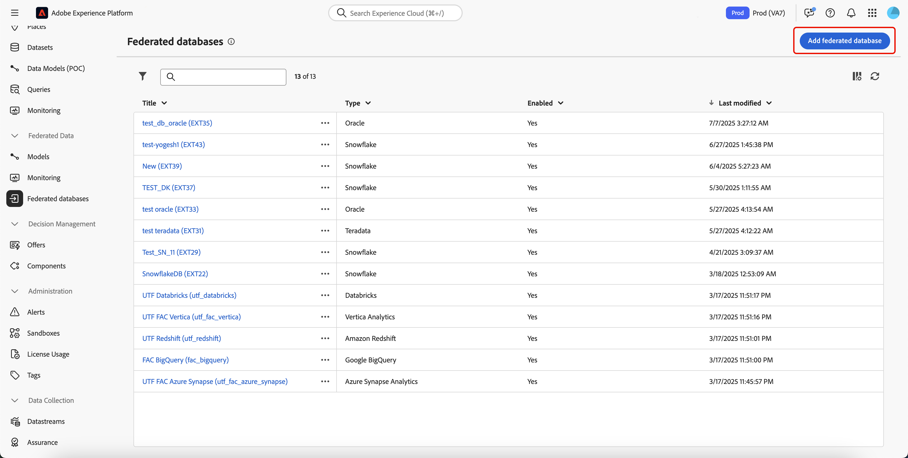
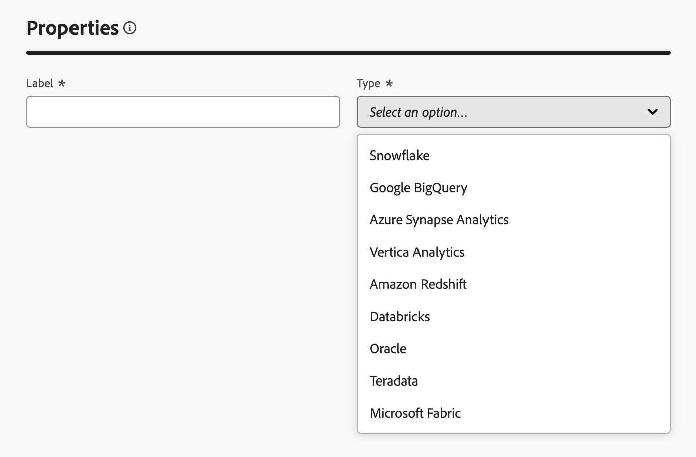

# 建立連線 {#connections-fdb}

>[!AVAILABILITY]
>
>若要存取連線，您需要下列其中一個許可權：
>
>-**管理同盟資料庫**
>>-**檢視同盟資料庫**
>
>如需有關必要權限的詳細資訊，請參閱[存取控制指南](/help/governance-privacy-security/access-control.md)。

Experience Platform同盟對象構成可讓您從協力廠商資料倉儲建立及擴充對象，並將對象匯入至Adobe Experience Platform。

## 支援的資料庫 {#supported-databases}

若要使用同盟資料庫和Adobe Experience Platform，您必須先建立兩個來源之間的連線。 透過同盟對象構成，您可以連線至下列資料庫。

* Amazon Redshift
* Azure Synapse Analytics
* Databricks
* Google BigQuery
* Microsoft Fabric
* Oracle
* Snowflake
* Vertica Analytics

## 建立連線 {#create}

若要建立連線，請在同盟資料區段中選取&#x200B;**[!UICONTROL 同盟資料庫]**。

![左側導覽中會反白顯示[同盟資料庫]按鈕。](assets/home/select-federated.png){zoomable="yes" width="70%" align="center"}

便會顯示「同盟資料庫」段落。 選取&#x200B;**[!UICONTROL 新增同盟資料庫]**&#x200B;以建立連線。

{zoomable="yes" width="70%" align="center"}

連線屬性彈出視窗會出現。 您可以為連線命名，並選取要建立的資料庫型別。

{zoomable="yes" width="70%" align="center"}

選取型別後，**[!UICONTROL 詳細資料]**&#x200B;區段就會顯示。 此區段會根據先前選擇的資料庫型別而有所不同。

>[!BEGINTABS]

>[!TAB Amazon Redshift]

>[!AVAILABILITY]
>
>僅支援Amazon Redshift AWS、Amazon Redshift Spectrum和Amazon Redshift Serverless。

選取Amazon Redshift後，您可以新增下列詳細資料：

| 欄位 | 說明 |
| ----- | ----------- |
| 伺服器 | 資料來源的名稱。 |
| 帳戶 | 帳戶的使用者名稱。 |
| 密碼 | 帳戶的密碼。 |
| 資料庫 | 資料庫的名稱。 若在伺服器名稱中指定此專案，此欄位可保留空白。 |
| 工作結構描述 | 用於工作表的資料庫綱要名稱。 如需有關此功能的詳細資訊，請參閱[Amazon結構描述檔案](https://docs.aws.amazon.com/redshift/latest/dg/r_Schemas_and_tables.html){target="_blank"}。  **注意：**&#x200B;只要您擁有連線到這個結構描述所需的許可權，就可以使用資料庫的任何結構描述，包括用於暫時資料處理的結構描述。 但是，當使用相同資料庫連線多個沙箱時，**必須**&#x200B;使用不同的工作結構描述。 |

>[!TAB Azure Synapse Analytics]

選取Azure Synapse Analytics後，您可以新增下列詳細資料：

| 欄位 | 說明 |
| ----- | ----------- |
| 伺服器 | Azure Synapse伺服器的URL。 |
| 帳戶 | Azure Synapse帳戶的使用者名稱。 |
| 密碼 | Azure synapse帳戶的密碼。 |
| 資料庫 | 資料庫的名稱。 若在伺服器名稱中指定此專案，此欄位可保留空白。 |
| 選項 | 連線的其他選項。 對於Azure Synapse Analytics，您可以指定聯結器支援的驗證型別。 目前，同盟對象構成支援`ActiveDirectoryMSI`。 如需連線字串的詳細資訊，請參閱Microsoft檔案[中的](https://learn.microsoft.com/en-us/sql/connect/odbc/using-azure-active-directory?view=sql-server-ver15#example-connection-strings){target="_blank"}連線字串範例區段。 |

>[!TAB 資料庫]

>[!NOTE]
>
>支援透過私人連結，安全地存取外部 Databricks 資料倉儲。這包括透過私人連結與託管在 Amazon Web Services (AWS) 上的 Databricks 資料庫建立安全連線，以及透過 VPN 與託管在 Microsoft Azure 上的 Databricks 資料庫建立安全連線。請聯絡您的 Adobe 代表，以取得設定安全存取的協助。

選取「資料庫」後，您可以新增下列詳細資料：

| 欄位 | 說明 |
| ----- | ----------- |
| 伺服器 | Databricks伺服器的名稱。 |
| HTTP 路徑 | 叢集或倉儲的路徑。 如需有關路徑的詳細資訊，請參閱連線詳細資料[的](https://docs.databricks.com/aws/en/integrations/compute-details){target="_blank"}Databricks檔案。 |
| 密碼 | Databricks伺服器的存取權杖。 如需有關這個值的詳細資訊，請參閱有關個人存取權杖的[Databricks檔案](https://docs.databricks.com/aws/en/dev-tools/auth/pat){target="_blank"}。 |
| 目錄 | Databricks目錄的名稱。 如需有關資料庫中目錄的詳細資訊，請閱讀有關目錄[的](https://docs.databricks.com/aws/en/catalogs/){target="_blank"}資料庫檔案 |
| 工作結構描述 | 用於工作表的資料庫綱要名稱。   **注意：**&#x200B;只要您擁有連線至此結構描述所需的許可權，就可以使用資料庫中的&#x200B;**any**&#x200B;結構描述，包括用於暫時資料處理的結構描述。 但是，當使用相同資料庫連線多個沙箱時，**必須**&#x200B;使用不同的工作結構描述。 |
| 選項 | 連線的其他選項。 下表列出可用的選項。 |

若為「資料庫」，您可以設定下列其他選項：

| 選項 | 說明 |
| ------- | ----------- |
| TimeZoneName | 要使用的時區名稱。 此值代表`TIMEZONE`工作階段引數。 如需時區的詳細資訊，請閱讀[時區](https://docs.databricks.com/aws/en/sql/language-manual/parameters/timezone#:~:text=The%20system%20default%20is%20UTC%20.){target="_blank"}的Databricks檔案。 |

>[!TAB Google BigQuery]

選取Google BigQuery後，您可以新增下列詳細資料：

| 欄位 | 說明 |
| ----- | ----------- |
| 服務帳戶 | 您的服務帳戶的電子郵件地址。 如需詳細資訊，請參閱[Google雲端服務帳戶檔案](https://cloud.google.com/iam/docs/service-accounts-create){target="_blank"}。 |
| 專案 | 專案的ID。 如需詳細資訊，請閱讀[Google Cloud專案檔案](https://cloud.google.com/resource-manager/docs/creating-managing-projects){target="_blank"}。 |
| 資料集 | 資料集的名稱。 如需詳細資訊，請參閱[Google Cloud資料集檔案](https://cloud.google.com/bigquery/docs/datasets-intro){target="_blank"}。 |
| 金鑰檔案路徑 | 連線到伺服器的金鑰檔案。 僅支援`json`個檔案。 |
| 選項 | 連線的其他選項。 下表列出可用的選項。 |

若為Google BigQuery，您可以設定下列其他選項：

| 選項 | 說明 |
| ------- | ----------- |
| ProxyType | 用來連線至BigQuery的Proxy型別。 支援的值包括`HTTP`、`http_no_tunnel`、`socks4`和`socks5`。 |
| ProxyHost | 可以連線到Proxy的主機名稱或IP位址。 |
| ProxyUid | 執行Proxy的連線埠號碼。 |
| ProxyPwd | Proxy密碼。 |
| bgpath | **注意：**&#x200B;這僅適用於&#x200B;**大量載入工具** (Cloud SDK)。   伺服器上雲端SDK bin目錄的路徑。 如果您已將`google-cloud-sdk`目錄移至其他位置，或想避免使用PATH變數，您才需要設定此專案。 |
| GCloudConfigName | **注意：**&#x200B;這僅適用於7.3.4版以上的&#x200B;**大量載入工具** (Cloud SDK)。  儲存載入資料之引數的組態名稱。 預設值為`accfda`。 |
| GCloudDefaultConfigName | **注意：**&#x200B;這僅適用於7.3.4版以上的&#x200B;**大量載入工具** (Cloud SDK)。  為重新建立載入資料的主要組態而使用的暫時組態名稱。 預設值為`default`。 |
| GCloudRecreateConfig | **注意：**&#x200B;這僅適用於7.3.4版以上的&#x200B;**大量載入工具** (Cloud SDK)。  布林值可讓您決定大量載入機制是否應自動重新建立、刪除或修改Google Cloud SDK設定。 如果此值設定為`false`，大量載入機制會使用電腦上的現有組態來載入資料。 如果此值設定為`true`，請確定您的設定已正確設定 — 否則，將會顯示`No active configuration found. Please either create it manually or remove the GCloudRecreateConfig option`錯誤，而且載入機制將還原為預設載入機制。 |

>[!TAB Microsoft光纖]

選取「Microsoft光纖」後，您可以新增下列詳細資訊：

| 欄位 | 說明 |
| ----- | ----------- |
| 伺服器 | Microsoft光纖伺服器的URL。 |
| 應用程式ID | Microsoft光纖的應用程式ID。 如需應用程式ID的詳細資訊，請參閱應用程式設定[的](https://learn.microsoft.com/en-us/fabric/workload-development-kit/create-entra-id-app){target="_blank"}Microsoft Fabric檔案。 |
| 用戶端密碼 | 應用程式的使用者端密碼。 如需有關使用者端密碼的詳細資訊，請參閱應用程式設定[的](https://learn.microsoft.com/en-us/fabric/workload-development-kit/create-entra-id-app#step-8-generate-a-secret-for-your-application){target="_blank"}Microsoft光纖檔案。 |
| 選項 | 連線的其他選項。 下表列出可用的選項。 |

對於Microsoft Fabric，您可以設定下列其他選項：

| 選項 | 說明 |
| ------ | ----------- |
| Authentication | 聯結器使用的驗證型別。 支援的值包括： `ActiveDirectoryMSI`。 如需詳細資訊，請閱讀有關倉儲連線的[Microsoft檔案](https://learn.microsoft.com/en-us/fabric/data-warehouse/connectivity){target="_blank"}。 |

>[!TAB Oracle]

>[!IMPORTANT]
>
>Oracle資料庫聯結器目前只能&#x200B;**使用**&#x200B;來建立對象和擴充對象使用案例。
>
>此外，在設定Oracle資料庫之前，請聯絡您的Adobe客戶服務代表。

選取Oracle後，您可以新增下列詳細資料：

| 欄位 | 說明 |
| ----- | ----------- |
| 伺服器 | Oracle伺服器的URL。 |
| 帳戶 | 帳戶的使用者名稱。 |
| 密碼 | 帳戶的密碼。 |

>[!TAB Snowflake]

>[!NOTE]
>
>支援透過私人連結，安全地存取外部 Snowflake 資料倉儲。請注意，您的 Snowflake 帳戶必須託管在 Amazon Web Services (AWS) 或 Azure 上，並且與您的聯合客群構成環境位於同一區域。請聯絡您的 Adobe 代表，協助您設定 Snowflake 帳戶的安全存取權。

選取Snowflake後，您可以新增下列詳細資料：

| 欄位 | 說明 |
| ----- | ----------- |
| 伺服器 | 伺服器的名稱。 |
| 使用者 | 帳戶的使用者名稱。 |
| 密碼 | 帳戶的密碼。 |
| 資料庫 | 資料庫的名稱。 若在伺服器名稱中指定此專案，此欄位可保留空白。 |
| 工作結構描述 | 用於工作表的資料庫綱要名稱。   **注意：**&#x200B;只要您擁有連線至此結構描述所需的許可權，就可以使用資料庫中的&#x200B;**any**&#x200B;結構描述，包括用於暫時資料處理的結構描述。 但是，當使用相同資料庫連線多個沙箱時，**必須**&#x200B;使用不同的工作結構描述。 |
| 私密金鑰 | 資料庫連線的私密金鑰。 您可以從本機系統上傳`.pem`檔案。 |
| 選項 | 連線的其他選項。 下表列出可用的選項。 |

若為Snowflake，您可以設定下列其他選項：

| 選項 | 說明 |
| ------- | ----------- |
| workschema | 用於工作表的資料庫綱要名稱。 |
| TimeZoneName | 要使用的時區名稱。 此值代表`TIMEZONE`工作階段引數。 依預設，系統會使用系統時區。 如需時區的詳細資訊，請參閱時區[的](https://docs.snowflake.com/en/sql-reference/parameters#timezone){target="_blank"}Snowflake檔案。 |
| WeekStart | 您希望一週開始的日期。 此值代表`WEEK_START`工作階段引數。 如需周開始的詳細資訊，請參閱周開始引數[的](https://docs.snowflake.com/en/sql-reference/parameters#week-start){target="_blank"}Snowflake檔案 |
| UseCachedResult | 布林值，判斷是否將使用Snowflake的快取結果。 此值代表`USE_CACHED_RESULTS`工作階段引數。 預設情況下，此值會設為true。 如需此引數的詳細資訊，請參閱有關持續結果[的](https://docs.snowflake.com/en/user-guide/querying-persisted-results){target="_blank"}Snowflake檔案。 |
| bulkThreads | 用於Snowflake大量載入器的執行緒數量。 新增的執行緒越多，大量載入的效能就越好。 預設情況下，此值設為1。 |
| chunkSize | 每個大量載入器區塊的檔案大小。 與更多執行緒同時使用時，您可以改善大量載入的效能。 預設情況下，此值會設為128 MB。 如需區塊大小的詳細資訊，請閱讀有關準備資料檔案的[Snowflake檔案](https://docs.snowflake.com/en/user-guide/data-load-considerations-prepare){target="_blank"}。 |
| StageName | 預先布建的內部預備環境名稱。 這可用於大量載入，而非建立新的臨時階段。 |

>[!TAB Vertica Analytics]

選取Vertica Analytics後，您可以新增下列詳細資料：

| 欄位 | 說明 |
| ----- | ----------- |
| 伺服器 | Vertica Analytics伺服器的URL。 |
| 帳戶 | 帳戶的使用者名稱。 |
| 密碼 | 帳戶的密碼。 |
| 資料庫 | 資料庫的名稱。 若在伺服器名稱中指定此專案，此欄位可保留空白。 |
| 工作結構描述 | 用於工作表的資料庫綱要名稱。   **注意：**&#x200B;只要您擁有連線至此結構描述所需的許可權，就可以使用資料庫中的&#x200B;**any**&#x200B;結構描述，包括用於暫時資料處理的結構描述。 但是，當使用相同資料庫連線多個沙箱時，**必須**&#x200B;使用不同的工作結構描述。 |
| 選項 | 連線的其他選項。 下表列出可用的選項。 |

若為Vertica Analytics，您可以設定下列其他選項：

| 選項 | 說明 |
| ------- | ----------- |
| TimeZoneName | 要使用的時區名稱。 此值代表`TIMEZONE`工作階段引數。 如需時區的詳細資訊，請參閱[時區](https://docs.vertica.com/24.1.x/en/admin/configuring-db/config-procedure/using-time-zones-with/){target="_blank"}的Vertica Analytics檔案 |

>[!ENDTABS]

新增連線的詳細資料後，請注意下列額外設定：

>[!NOTE]
>
>若要針對指定的資料庫使用同盟對象構成，您必須允許與該資料庫相關聯的IP位址清單&#x200B;**所有**。

| 設定 | 詳細資料 |
| -------- | ------- |
| 啟用連線 | 布林值切換，決定是否自動啟用連線。 |
| 伺服器IP | 顯示需要列入允許清單才能連線到資料庫之IP位址的彈出視窗。 |
| 測試連線 | 可讓您驗證您的設定詳細資料。 |

您現在可以選取&#x200B;**[!UICONTROL 部署功能]**，然後選取&#x200B;**[!UICONTROL 新增]**，以完成同盟資料庫與Experience Platform之間的連線。
