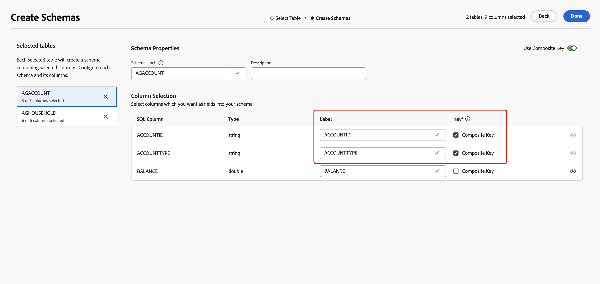

# 開始使用結構描述 {#schemas}

>[!AVAILABILITY]
>
>若要存取方案，您需要下列其中一項許可權：
>
>-**管理同盟結構描述**
>&#x200B;>-**檢視同盟結構描述**
>
>如需有關必要權限的詳細資訊，請參閱[存取控制指南](/help/governance-privacy-security/access-control.md)。

>[!CONTEXTUALHELP]
>id="dc_schema_create_select_tables"
>title="選取表格"
>abstract="選取要為資料模式新增的表格。"

>[!CONTEXTUALHELP]
>id="dc_schema_create_key"
>title="索引鍵"
>abstract="選取資料調和的索引鍵。"

>[!CONTEXTUALHELP]
>id="dc_schema_create_schema_name"
>title="結構描述的名稱"
>abstract="輸入結構描述的名稱。"

>[!CONTEXTUALHELP]
>id="dc_schema_edit_description"
>title="結構描述說明"
>abstract="結構描述說明列出了資料欄、類型和標籤。您也可以檢查結構描述的調和索引鍵。若要更新結構描述定義，請按一下鉛筆圖示。"

>[!CONTEXTUALHELP]
>id="dc_schema_filter_sources"
>title="選取要篩選的來源資料庫"
>abstract="您可以根據其來源來篩選結構描述。選取一個或多個聯合資料庫以顯示其結構描述。"

## 什麼是結構描述 {#schema-start}

綱要代表資料庫的表格。 它是應用程式內的物件，定義資料與資料庫表格的連結方式。

透過建立結構，您可以在Experience Platform同盟對象構成中定義表格的表示法：

* 提供易記的名稱和說明，以簡化使用者的理解
* 根據每個欄位的實際使用情況決定其可見性
* 請選取其主要索引鍵，以便根據[資料模型](../data-management/gs-models.md#data-model-start)的需要連結它們之間的結構描述

>[!CAUTION]
>
>使用相同的資料庫連線多個沙箱時，必須使用不同的工作結構描述。

## 建立結構描述 {#schema-create}

若要在Federated Audience Composition中建立結構描述，請在&#x200B;**[!UICONTROL Federated Data]**&#x200B;區段中選取&#x200B;**[!UICONTROL 模型]**。 在&#x200B;**[!UICONTROL 結構描述]**&#x200B;標籤中，選取&#x200B;**[!UICONTROL 建立結構描述]**。

{zoomable="yes"}

出現&#x200B;**[!UICONTROL 選取同盟資料庫]**&#x200B;彈出視窗。 在此彈出視窗上，您可以選取[來源資料庫](/help/connections/home.md)，然後選取&#x200B;**[!UICONTROL 下一步]**。

{zoomable="yes"}

**選取資料表**&#x200B;彈出視窗會出現。 在此彈出視窗中，您可以選取要用來建立綱要的表格。

![顯示[選取資料表]彈出視窗。](assets/select-table.png){zoomable="yes"}

每個選取的表格都會產生具有所選欄的綱要。 對於每個表格，您可以變更綱要的標籤、新增說明、重新命名欄位標籤、設定欄位標籤可見度，以及選取綱要主索引鍵。

{zoomable="yes"}

>[!NOTE]
>
>如果您啟用&#x200B;**[!UICONTROL 使用複合金鑰]**，但只選取一個要使用的金鑰，則會將該金鑰視為標準結構描述主要金鑰。

此外，您可以建立由多個結構描述欄組成的索引鍵。 開啟&#x200B;**[!UICONTROL 使用複合金鑰]**，並標示您要用作複合金鑰的金鑰。

{zoomable="yes"}

完成設定後，請選取&#x200B;**[!UICONTROL 完成]**&#x200B;以完成建立結構描述。

## 編輯結構 {#schema-edit}

若要編輯結構描述，請在&#x200B;**結構描述**&#x200B;頁面上選取您先前建立的結構描述。

便會顯示「綱要詳細資訊」頁面。 選取以編輯結構描述。

{zoomable="yes"}

在&#x200B;**[!UICONTROL 編輯結構描述]**&#x200B;視窗上，您可以存取和設定與[建立結構描述](#schema-create)時相同的選項。

{zoomable="yes"}

## 在結構描述中預覽資料 {#schema-preview}

若要預覽結構描述所代表之表格中的資料，請瀏覽至&#x200B;**[!UICONTROL 資料]**&#x200B;標籤，如下所示。

選取&#x200B;**[!UICONTROL 計算]**&#x200B;連結以預覽錄製總數。

{zoomable="yes"}

選取&#x200B;**[!UICONTROL 設定資料行]**&#x200B;按鈕以變更資料顯示。

{zoomable="yes"}

## 重新整理結構描述 {#schema-refresh}

可以更新、新增或移除同盟資料庫中的表格。 在這種情況下，您必須重新整理Adobe Experience Platform中的結構以符合最新變更。 若要執行此動作，請選取結構描述名稱旁的，然後選取&#x200B;**[!UICONTROL 重新整理結構描述]**。

您也可以在編輯時更新結構描述定義。

{zoomable="yes"}

## 刪除結構描述 {#schema-delete}

若要刪除結構描述，請選取，然後選取&#x200B;**[!UICONTROL 刪除]**。

{zoomable="yes"}
