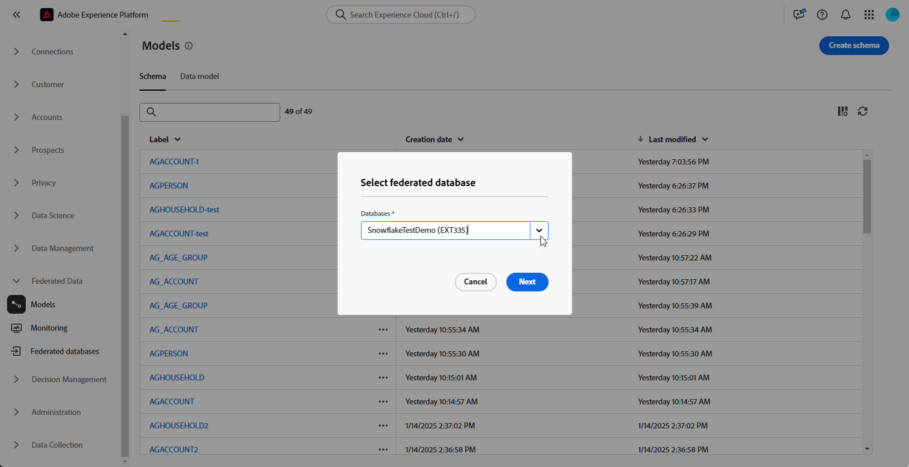

# 開始使用結構描述 {#schemas}

>[!CONTEXTUALHELP]
>id="dc_schema_create_select_tables"
>title="選取表格"
>abstract="選取要為資料模式新增的表格。"

>[!CONTEXTUALHELP]
>id="dc_schema_create_key"
>title="索引鍵"
>abstract="選取資料調和的索引鍵。"

>[!CONTEXTUALHELP]
>id="dc_schema_create_schema_name"
>title="結構描述的名稱"
>abstract="輸入結構描述的名稱。"

>[!CONTEXTUALHELP]
>id="dc_schema_edit_description"
>title="結構描述說明"
>abstract="結構描述說明列出了資料欄、類型和標籤。您也可以檢查結構描述的調和索引鍵。若要更新結構描述定義，請按一下鉛筆圖示。"

>[!CONTEXTUALHELP]
>id="dc_schema_filter_sources"
>title="選取要篩選的來源資料庫"
>abstract="您可以根據其來源來篩選結構描述。選取一個或多個同盟資料庫以顯示其結構描述。"

## 什麼是結構描述？ {#schema-start}

綱要代表資料庫的表格。 它是應用程式內的物件，定義資料與資料庫表格的連結方式。

透過建立結構描述，您將可以在FAC中操作您的表格：
- 提供易記的名稱和說明，以簡化使用者的理解
- 根據每個欄位的實際使用情形來決定其可見性
- 請選取其主要索引鍵，以便根據[資料模型](../data-management/gs-models.md#data-model-start)的需要連結它們之間的結構描述

## 建立結構描述 {#schema-create}

若要在FAC中建立方案，請遵循下列步驟：
在**[!UICONTROL 同盟資料]**&#x200B;區段中，進入&#x200B;**[!UICONTROL 模型]**&#x200B;連結。 您會在該處找到&#x200B;**[!UICONTROL 結構描述]**索引標籤。
按一下**[!UICONTROL 建立結構描述]**&#x200B;按鈕。

{zoomable="yes"}

您將能存取新介面，其中包含您將會找到的下拉式清單
所有連線至您應用程式的資料庫。 深入瞭解[資料庫連線](../connections/connections.md#connections-fdb)。
在清單中選取您的來源資料庫，然後按一下**[!UICONTROL 新增表格]**&#x200B;索引標籤

{zoomable="yes"}

您可以存取資料庫中所有表格的清單。

新增您要建立綱要的表格後，您就可以存取其欄位，如下所示。

{zoomable="yes"}

對於每個表格，您可以：
- 重新命名指定的結構描述標籤
- 新增說明
- 重新命名所有欄位，並決定其可見性。
- 選取結構描述主索引鍵

例如，以下是匯入的表格，緊接在新增之後：

{zoomable="yes"}

結構描述可以像這樣定義：

{zoomable="yes"}

## 編輯結構 {#schema-edit}

若要編輯方案，請在「方案」資料夾中按一下方案的名稱。 您將可存取以下頁面。
按一下**[!UICONTROL 編輯]**&#x200B;按鈕。

{zoomable="yes"}

您將可存取與建立結構描述時相同的可能性：
- 重新命名指定的結構描述標籤
- 新增說明
- 重新命名所有欄位，並決定其可見性。
- 選取結構描述主索引鍵

{zoomable="yes"}

## 在結構描述中預覽資料 {#schema-preview}

若要預覽結構描述所代表之表格中的資料，請移至&#x200B;**[!UICONTROL 資料]**標籤，如下所示。
按一下**[!UICONTROL 計算]**&#x200B;連結，即可取得錄製總數。

{zoomable="yes"}

您可以按一下&#x200B;**[!UICONTROL 設定資料行]**&#x200B;按鈕來變更資料概觀。

{zoomable="yes"}

## 刪除結構描述 {#schema-delete}

若要刪除結構描述，請按一下&#x200B;**[!UICONTROL 更多]**&#x200B;按鈕，然後按&#x200B;**[!UICONTROL 刪除]**。

{zoomable="yes"}