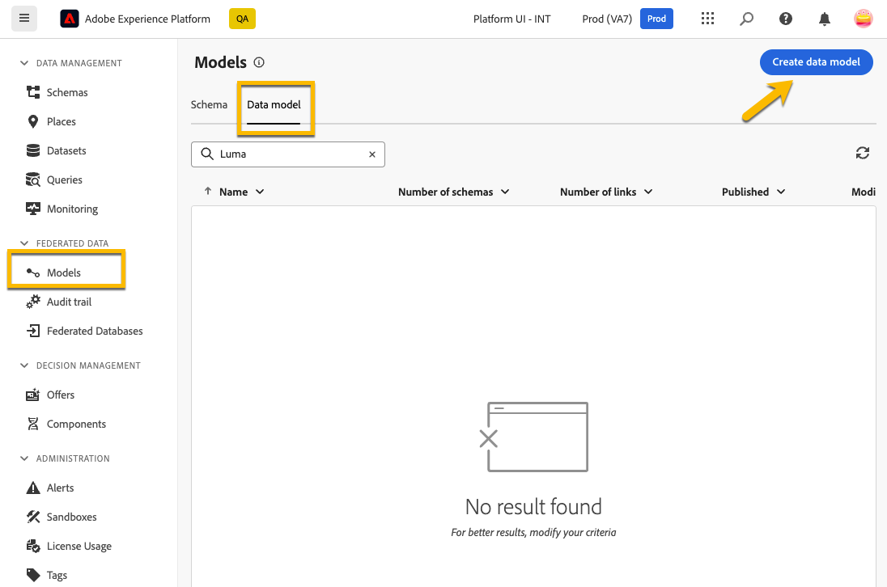
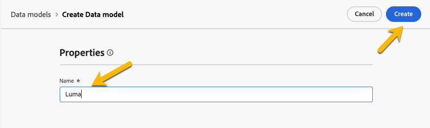
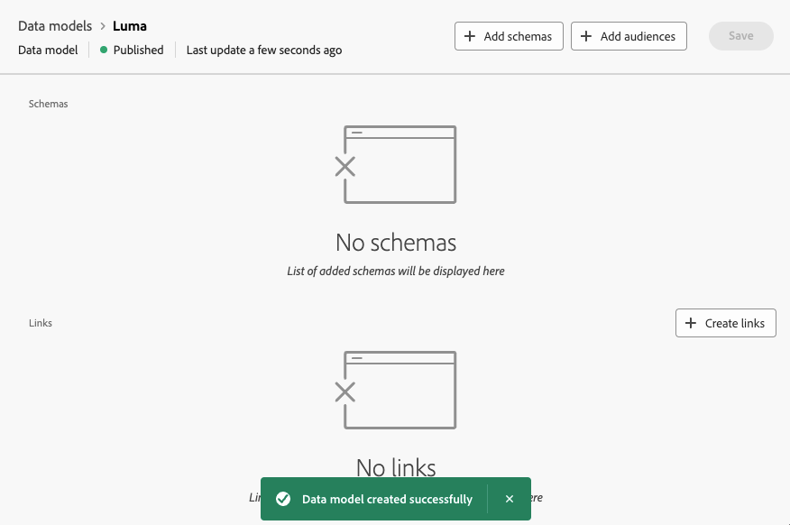
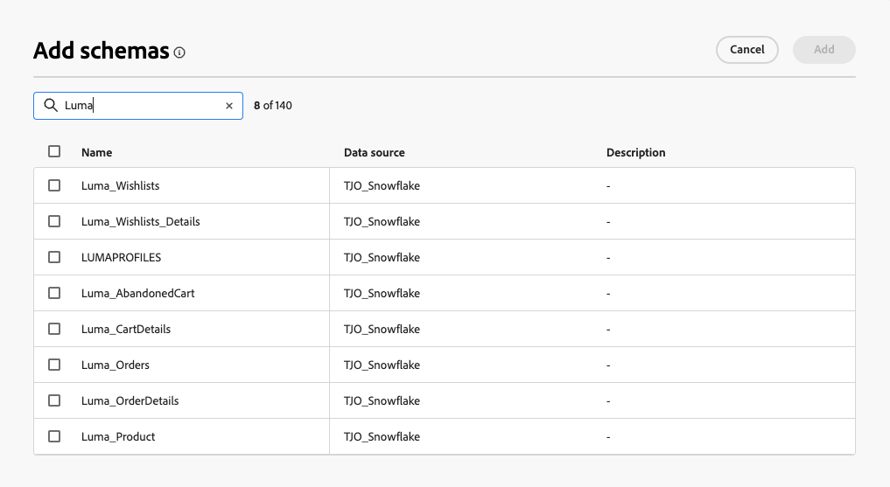

# 開始使用資料模式 {#data-model}

>[!CONTEXTUALHELP]
>id="dc_model_menu"
>title="使用模式"
>abstract="此畫面中列出了結構描述和資料模式。您可以透過&#x200B;**建立**&#x200B;按鈕建立結構描述和資料模式。"

>[!CONTEXTUALHELP]
>id="dc_datamodel_add_schema"
>title="選取結構描述"
>abstract="選取資料模式的結構描述。"

>[!CONTEXTUALHELP]
>id="dc_datamodel_add_audience"
>title="選取對象"
>abstract="選取資料模式的對象。"

>[!CONTEXTUALHELP]
>id="dc_datamodel_properties"
>title="資料模式屬性"
>abstract="輸入資料模式的標籤。"

## 什麼是資料模型？ {#data-model-start}

資料模型是一組結構描述、對象及其之間的連結。

深入瞭解[結構描述](../customer/schemas.md)。

深入瞭解[對象](../customer/audiences.md)。

## 如何建立資料模型？ {#data-model-create}

在&#x200B;**[!UICONTROL 同盟資料]**&#x200B;區段中，進入&#x200B;**[!UICONTROL 模型]**&#x200B;連結。 您會在該處找到&#x200B;**[!UICONTROL 資料模型]**&#x200B;標籤。

{zoomable="yes"}

按一下&#x200B;**[!UICONTROL 建立資料模型]**&#x200B;按鈕，您就可以命名資料模型，然後按一下&#x200B;**[!UICONTROL 建立]**&#x200B;按鈕。

{zoomable="yes"}

您將存取可新增結構、對象和資料模型連結的視窗。

{zoomable="yes"}

{zoomable="yes"}

### 建立連結 {#data-model-links}

