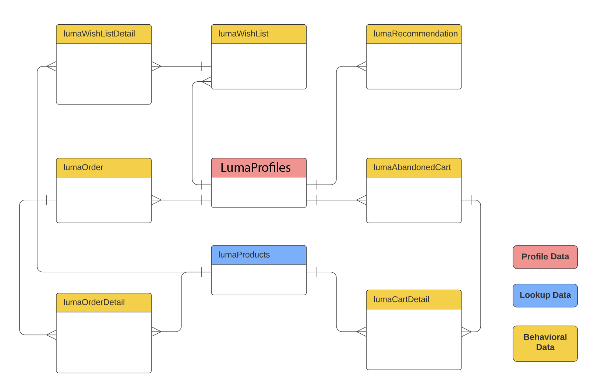

# 開始使用資料模型 {#data-model-beta}

>[!AVAILABILITY]
>
>若要存取資料模型，您需要下列其中一個許可權：
>
>-**管理同盟資料模型**
>>-**檢視同盟資料模型**
>
>如需必要許可權的詳細資訊，請參閱[存取控制指南](/help/governance-privacy-security/access-control.md)。

## 什麼是資料模型 {#data-model-start}

資料模型是一組結構描述、對象及其之間的連結。 它可用來將對象與資料庫資料建立同盟。

在「同盟對象構成」中，您可以直接在「畫布」檢視中建立和管理資料模型。 這包括新增方案和對象，以及根據您的使用案例定義它們之間的連結。

深入瞭解[結構描述](../customer/schemas.md#schema-start)和[對象](../start/audiences.md)。

例如，您可以在下方看到資料模型的表示法：具有其名稱的表格以及它們之間的連結。

{zoomable="yes"}

## 建立資料模型 {#data-model-create}

若要建立資料模型，請遵循下列步驟：

1. 在&#x200B;**[!UICONTROL 同盟資料]**&#x200B;區段中，存取&#x200B;**[!UICONTROL 模型]**&#x200B;功能表，並瀏覽至&#x200B;**[!UICONTROL 資料模型]**&#x200B;標籤。

   按一下&#x200B;**[!UICONTROL 建立資料模型]**&#x200B;按鈕。

   {zoomable="yes"}

1. 定義資料模型的名稱，然後按一下&#x200B;**[!UICONTROL 建立]**&#x200B;按鈕。

1. 在資料模型儀表板中，按一下&#x200B;**[!UICONTROL 新增結構描述]**&#x200B;以選擇與資料模型關聯的結構描述。

   {zoomable="yes"}

1. 此外，您也可以將對象新增至資料模型。 選取&#x200B;**[!UICONTROL 新增對象]**&#x200B;以定義您的目標群組。

   {zoomable="yes"}

1. 在資料模型中的表格之間建立連線，以確保精確的資料關係。 [了解更多](#data-model-links)

1. 完成設定後，按一下&#x200B;**[!UICONTROL 儲存]**&#x200B;以套用您的變更。

## 建立連結 {#data-model-links}

>[!BEGINTABS]

>[!TAB 資料表檢視]

若要從「表格檢視」標籤建立資料模型之表格之間的連結，請執行下列步驟：

1. 按一下其中一個資料表的&#x200B;**[!UICONTROL 建立連結]**&#x200B;功能表，或按一下&#x200B;**[!UICONTROL 建立連結]**&#x200B;按鈕，然後選擇2個資料表：

   {zoomable="yes"}

1. 填寫指定表單以定義連結。

   {zoomable="yes"}

   **基數**

   * **1-N**：來源表格的一個出現次數可以具有多個目標表格的對應出現次數，但目標表格的一個出現次數最多可以具有來源表格的一個對應出現次數。

   * **N-1**：目標表格的一個出現次數可以有來源表格的多個對應出現次數，但來源表格的一個出現次數最多可以有目標表格的對應出現次數。

   * **1-1**：來源資料表的一個執行個體最多可以具有目標資料表的一個對應執行個體。

為您的資料模型定義的所有連結如下所列：

{zoomable="yes"}

>[!TAB 畫布檢視]

若要從「畫布」檢視標籤建立資料模型表格之間的連結，請執行下列步驟：

1. 存取資料模型的「畫布」檢視，並選擇您要連結的兩個表格

1. 按一下Source加入旁的按鈕，然後拖曳並引導箭頭朝向Target加入以建立連線。

   {zoomable="yes"}

1. 填寫指定的表單以定義連結，並在設定後按一下&#x200B;**[!UICONTROL 套用]**。

   {zoomable="yes"}

   **基數**

   * **1-N**：來源表格的一個出現次數可以具有多個目標表格的對應出現次數，但目標表格的一個出現次數最多可以具有來源表格的一個對應出現次數。

   * **N-1**：目標表格的一個出現次數可以有來源表格的多個對應出現次數，但來源表格的一個出現次數最多可以有目標表格的對應出現次數。

   * **1-1**：來源資料表的一個執行個體最多可以具有目標資料表的一個對應執行個體。

1. 資料模型中定義的所有連結都會在畫布檢視中以箭頭表示。 按一下兩個表格之間的箭頭，即可檢視詳細資訊、進行編輯或視需要移除連結。

   {zoomable="yes"}

1. 使用工具列來自訂和調整您的畫布。

   

   * **[!UICONTROL 放大]**：放大畫布以更清楚檢視資料模型的詳細資料。
   * **[!UICONTROL 縮小]**：縮小畫布大小，以更廣的檢視您的資料模型。
   * **[!UICONTROL 符合檢視]**：調整縮放以符合可見區域中的所有結構描述和/或對象。
   * **[!UICONTROL 切換互動]**：啟用或停用使用者與畫布的互動。
   * **[!UICONTROL 篩選器]**：選擇要顯示在畫布中的結構描述。
   * **[!UICONTROL 強制自動配置]**：自動排列結構描述和/或對象，以提升組織品質。

>[!ENDTABS]

## 操作說明影片 {#data-model-video}

透過此影片瞭解如何建立資料模型：

>[!VIDEO](https://video.tv.adobe.com/v/3432020)
