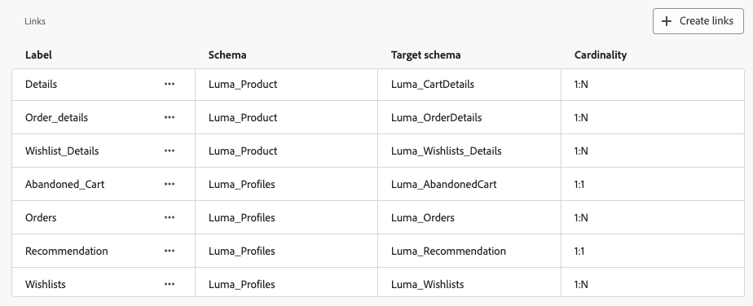

# 開始使用資料模型 {#data-model-beta}

>[!AVAILABILITY]
>
>若要存取資料模型，您需要下列其中一個許可權：
>
>-**管理同盟資料模型**
>&#x200B;>-**檢視同盟資料模型**
>
>如需有關必要權限的詳細資訊，請參閱[存取控制指南](/help/governance-privacy-security/access-control.md)。

## 什麼是資料模型 {#data-model-start}

資料模型是一組結構描述、對象及其之間的連結。 它可用來將對象與資料庫資料建立同盟。

在「同盟對象構成」中，您可以直接在「畫布」檢視中建立和管理資料模型。 這包括新增方案和對象，以及根據您的使用案例定義它們之間的連結。

深入瞭解[結構描述](../customer/schemas.md#schema-start)和[對象](../start/audiences.md)。

例如，您可以在下方看到資料模型的表示法：具有其名稱的表格以及它們之間的連結。

{zoomable="yes"}

## 建立資料模型 {#data-model-create}

若要建立資料模型，請遵循下列步驟：

1. 在&#x200B;**[!UICONTROL 同盟資料]**&#x200B;區段中，存取&#x200B;**[!UICONTROL 模型]**&#x200B;功能表，並瀏覽至&#x200B;**[!UICONTROL 資料模型]**&#x200B;標籤。

   選取&#x200B;**[!UICONTROL 建立資料模型]**&#x200B;按鈕。

   {zoomable="yes"}

2. 定義資料模型的名稱，並選取&#x200B;**[!UICONTROL 建立]**&#x200B;按鈕。

3. 在資料模型儀表板中，選取&#x200B;**[!UICONTROL 新增結構描述]**&#x200B;以選擇與資料模型關聯的結構描述。

   {zoomable="yes"}

4. 此外，您也可以將對象新增至資料模型。 選取&#x200B;**[!UICONTROL 新增對象]**&#x200B;以定義您的目標群組。

   {zoomable="yes"}

5. 在資料模型中的表格之間建立連線，以確保精確的資料關係。 如需詳細資訊，請閱讀[建立連結區段](#data-model-links)。

6. 完成設定後，選取&#x200B;**[!UICONTROL 儲存]**&#x200B;以套用您的變更。

## 建立連結 {#data-model-links}

>[!NOTE]
>
>如果您要建立具有多個聯結的連結，您只能使用來源和目標結構描述的相同組合一次。

>[!BEGINTABS]

>[!TAB 資料表檢視]

若要從表格檢視標籤建立資料模型表格之間的連結，請遵循下列步驟：

1. 選取其中一個資料表旁的，然後選取&#x200B;**[!UICONTROL 建立連結]**，或選取&#x200B;**[!UICONTROL 連結]**&#x200B;區段中的&#x200B;**[!UICONTROL 建立連結]**：

   {zoomable="yes"}

2. 填寫指定表單以定義連結。

   {zoomable="yes"}

   **基數**

   * **1-N**：來源表格的單一發生次數可以擁有眾多目標表格對應的發生次數，但目標表格的單一發生次數，最多只可以擁有來源表格的單一對應發生次數。

   * **N-1**：目標表格的單一發生次數可以擁有眾多來源表格對應的發生次數，但來源表格單一發生次數，最多只可以擁有目標表格的單一對應發生次數。

   * **1-1**：來源表格的單一發生次數，最多可以擁有目標表格對應的單一發生次數。

   若要建立多重聯結連結，請選取加號圖示。 您現在可以在結構描述欄位之間建立多個聯結。

   {zoomable="yes"}

以下列出為您的資料模型定義的所有連結：

{zoomable="yes"}

>[!TAB 畫布檢視]

若要從「畫布」檢視標籤建立資料模型表格之間的連結，請執行下列步驟：

1. 存取資料模型的「畫布」檢視，並選擇您要連結的兩個表格

2. 選取Source加入旁的按鈕，然後拖曳並引導箭頭朝向Target加入以建立連線。

   {zoomable="yes"}

3. 填寫指定的表單以定義連結，並在設定後選取&#x200B;**[!UICONTROL 套用]**。

   {zoomable="yes"}

   **基數**

   * **1-N**：來源表格的單一發生次數可以擁有眾多目標表格對應的發生次數，但目標表格的單一發生次數，最多只可以擁有來源表格的單一對應發生次數。

   * **N-1**：目標表格的單一發生次數可以擁有眾多來源表格對應的發生次數，但來源表格單一發生次數，最多只可以擁有目標表格的單一對應發生次數。

   * **1-1**：來源表格的單一發生次數，最多可以擁有目標表格對應的單一發生次數。

4. 資料模式中定義的所有連結，全都會顯示在畫布視圖下方，會以箭頭表示。 選取兩個表格之間的箭號，即可檢視詳細資訊、進行編輯或移除連結。

   {zoomable="yes"}

5. 使用工具列，即可自訂、調整您的畫布。

   

   * **[!UICONTROL 放大顯示]**：放大畫布，即可更清楚地檢視資料模式的詳細資料。
   * **[!UICONTROL 縮小顯示]**：縮小畫布大小，以便廣泛地檢視您的資料模式。
   * **[!UICONTROL 符合檢視]**：調整縮放以符合可見區域中的所有結構描述和/或對象。
   * **[!UICONTROL 切換互動]**：啟用或停用使用者與畫布的互動。
   * **[!UICONTROL 篩選器]**：請選擇想要顯示在畫布中的結構描述。
   * **[!UICONTROL 強制自動配置]**：自動排列結構描述和/或對象，以提升組織品質。

>[!ENDTABS]

## 操作說明影片 {#data-model-video}

透過此影片瞭解如何建立資料模型：

>[!VIDEO](https://video.tv.adobe.com/v/3432020)
