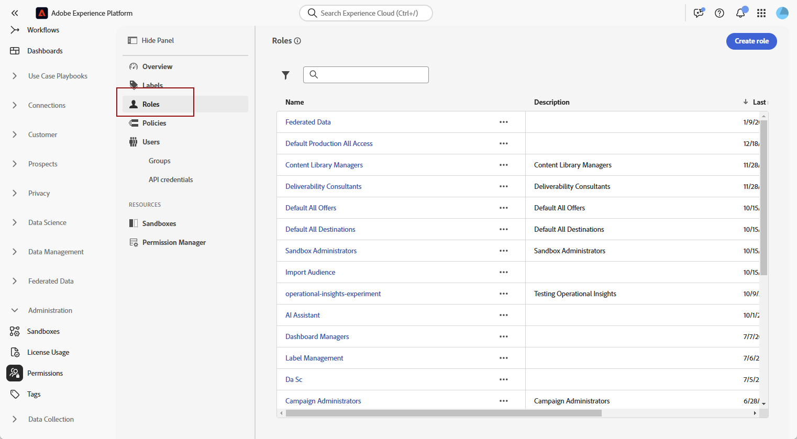
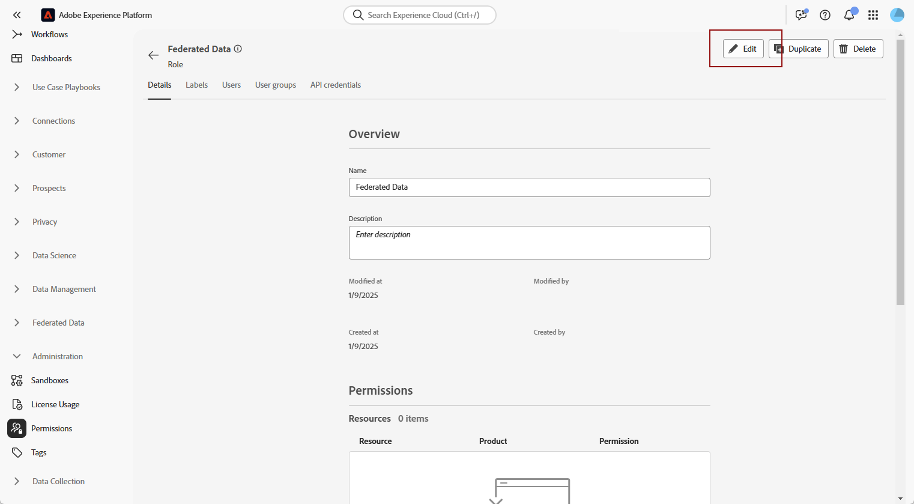
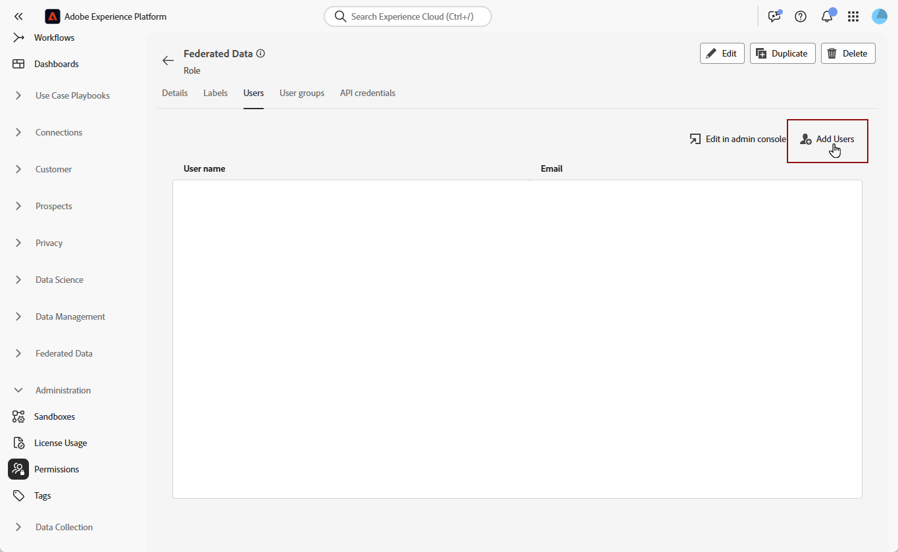

# 同盟對象組合中的存取控制

您可以使用存取控制，針對沙箱和同盟對象構成提供角色型存取。

## 管理對沙箱的存取權 {#access-sandboxes}

當您購買 Adobe Experience Platform 聯合客群構成時，系統會為當時的每個使用中沙箱建立產品設定檔。此產品設定檔是在 Admin Console 中的 **Adobe Experience Platform** 產品卡下方建立，並遵循以下命名慣例：`ACP_FAC - <<SandboxName>> - admin.`。若要存取特定沙箱的聯合客群構成，您必須將使用者新增至為該沙箱建立的產品設定檔中。

例如，如果啟用名為「fac-test」的新沙箱，則會建立對應的產品設定檔「ACP_FAC - fac-test - admin」。為了使用此沙箱存取聯合客群構成，您必須將使用者新增至此產品設定檔。

## 管理對聯合客群構成的存取權

您可以透過指派所需的許可權來管理存取權，以存取同盟對象構成的不同層面。 這些許可權會透過角色指派給需要存取&#x200B;**同盟對象構成**&#x200B;的使用者。

>[!NOTE]
>
>只有管理員可以將許可權指派給其他使用者。

1. 導覽至「**[!UICONTROL 權限]**」選單。
1. 從「**[!UICONTROL 角色]**」選單中，選取您想要更新的&#x200B;**[!UICONTROL 角色]**。

   

1. 選取「**[!UICONTROL 編輯]**」以修改您的角色權限。

   

1. 新增使用者所需的權限。您可以新增以下權限以便存取聯合客群構成：

   | 權限 | 說明 |
   | ---------- | ----------- |
   | 管理聯合資料 | 使用此權限來管理聯合客群構成的所有層面。此權限包含管理聯合資料庫、管理聯合結構描述、管理聯合資料模型和管理聯合構成。 |
   | 管理聯合資料庫 | 使用此權限來新增、檢視、更新和刪除您與聯合資料庫的連線。 |
   | 檢視聯合資料庫 | 使用此權限來檢視您與聯合資料庫的連線。 |
   | 管理聯合結構描述 | 使用此權限來建立、檢視、更新、刪除和刷新結構描述。 |
   | 檢視聯合結構描述資料 | 使用此權限來檢視結構描述部分內的資料標籤。 |
   | 檢視聯合結構描述 | 使用此權限來檢視結構描述表。 |
   | 管理聯合資料模型 | 使用此權限來建立、檢視、更新和刪除資料模型。 |
   | 檢視聯合資料模型 | 使用此權限來檢視資料模型。 |
   | 檢視聯合稽核軌跡 | 使用此權限來檢視聯合客群構成的稽核軌跡。 |
   | 管理聯合構成 | 使用此權限來建立、查看、更新和刪除聯合構成。 |
   | 檢視聯合構成 | 使用此權限來檢視聯合構成。 |

   

1. 在完成必要的變更後，請選取「**[!UICONTROL 儲存]**」。

對於任何已指派此角色的使用者，其權限都將自動更新並可存取聯合客群構成。

若要將此角色指派給新使用者：

1. 導覽至「角色」儀表板內的「**[!UICONTROL 使用者]**」標籤，然後選取「**[!UICONTROL 新增使用者]**」。

   

1. 輸入使用者的姓名或電子郵件地址，或從可用清單中進行選取。完成後，選取「**[!UICONTROL 儲存]**」。

或者，您可以根據使用者所需的權限，為其指派一個預先存在的角色。有關為使用者指派預先存在角色的更多資訊，請閱讀「[有關管理產品設定檔的使用者指南](https://experienceleague.adobe.com/zh-hant/docs/experience-platform/access-control/ui/users)」。

| 角色名稱 | 權限 |
| --------- | ----------- |
| FAC 資料管理員 | <ul><li>管理聯合構成</li><li>檢視聯合資料庫</li><li>檢視聯合結構描述</li><li>檢視聯合結構描述資料</li><li>檢視聯合資料模型</li></ul> |
| FAC 構成管理員 | <ul><li>管理聯合構成</li></ul> |
| FAC 管理員 | <ul><li>管理聯合資料</li></ul> |

然後，使用者將會收到一封電子郵件，內含存取執行個體的指示。如果之前未建立該使用者，請參閱[此文件](https://experienceleague.adobe.com/zh-hant/docs/experience-platform/access-control/abac/permissions-ui/users)。

## 管理對特定組合的存取

您可以套用存取權標籤，以管理對特定構圖的存取權。

如需將存取權標籤套用至組合的相關詳細資訊，請閱讀組合指南的[套用存取權標籤區段](/help/compositions/gs-compositions.md#access-labels)。
