# 建置您的第一個查詢 {#build-query}

若要開始建立查詢，請根據您要執行的動作，從您選擇的位置存取查詢建模器。 「查詢建模工具」會以空白畫布開啟。 按一下 **+** 按鈕來設定查詢的第一個節點。

您可以新增兩種型別的元素：

* **篩選元件** （自訂條件、選取對象、預先定義的篩選器）可讓您建立自己的規則、選取對象或預先定義的篩選器，以縮小查詢範圍。 它們會新增在查詢的開頭和虛線轉變上。 [瞭解如何使用篩選元件](#filtering)

  範例： *訂閱體育電子報的收件者*. *住在紐約的收件者*， *住在舊金山的收件者*

  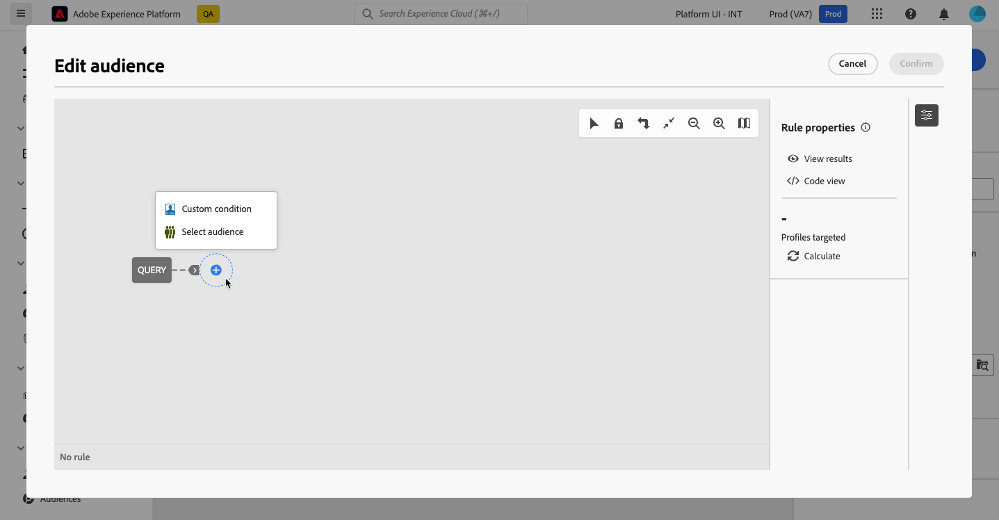{zoomable="yes"}

* **群組操作者** (AND、OR、EXCEPT)可讓您將圖表中的篩選元件群組在一起。 它們會在篩選元件之前新增到現有轉變上。 [瞭解如何使用操作者](#filtering)

  範例： *訂閱「運動」電子報的收件者&#x200B;**和**住在紐約的人&#x200B;**或**舊金山*.

  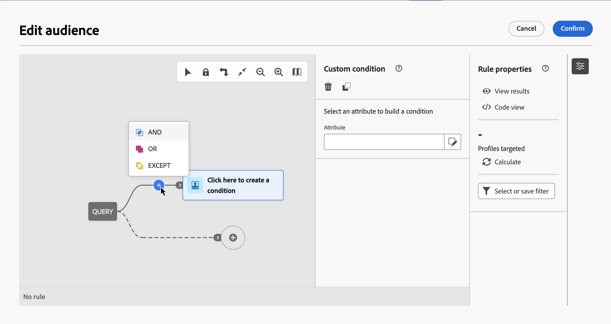{zoomable="yes"}

## 新增篩選元件 {#filtering}

篩選元件可讓您使用下列專案來縮小查詢範圍：

* **[自訂條件](#custom-condition)**：使用資料庫和進階運算式的屬性來建立您自己的條件，以篩選您的查詢。
* **[受眾](#audiences)**：使用現有對象篩選查詢。
* **[預先定義的篩選器](#predefined-filters)**：使用現有的預先定義篩選器來篩選查詢。

### 設定自訂條件 {#custom-condition}

>[!CONTEXTUALHELP]
>id="dc_orchestration_querymodeler_customcondition"
>title="自訂條件"
>abstract="自訂條件是篩選元件，允許您使用資料庫中的屬性和進階運算式來建立自己的條件，藉此篩選查詢。"

若要使用自訂條件篩選查詢，請執行下列步驟：

1. 按一下 **+** 按鈕並選取 **[!UICONTROL 自訂條件]**. 自訂條件屬性窗格會在右側開啟。

1. 在 **屬性** 欄位中，選取您要用來建立條件的資料庫屬性。 屬性清單包含資料庫中的所有屬性，包括連結表格的屬性。

   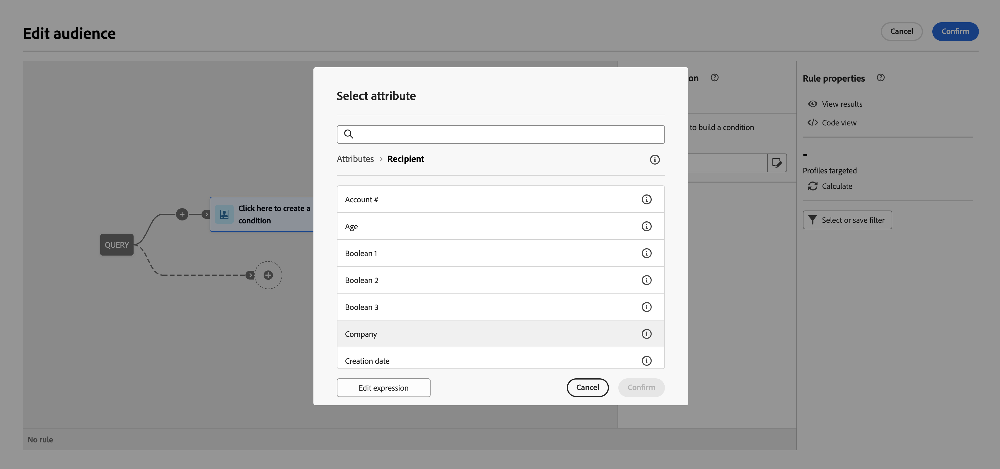{zoomable="yes"}

   >[!NOTE]
   >
   >此 **編輯運算式** 按鈕可讓您善用Web運算式編輯器，以使用資料庫和協助程式函式的欄位手動定義運算式。 [瞭解如何編輯運算式](expression-editor.md)

1. 從下拉式清單中選取要套用的運運算元。 可以使用各種運運算元。 請注意，下拉式清單中可用的運運算元取決於屬性的資料型別。

   +++可用運運算元清單

   | 運算子 | 目的 | 範例 |
   |  ---  |  ---  |  ---  |
   | 等於 | 傳回與第二個「值」欄中所輸入資料相同的結果。 | 姓氏(@lastName)等於&#39;Jones&#39;，只會傳回姓氏為Jones的收件者。 |
   | 不等於 | 傳回所有與輸入值不相同的值。 | 等於&#39;English&#39;的語言(@language) |
   | 大於 | 傳回大於輸入值的值。 | 年齡(@age)大於50</strong>，會傳回所有大於&#39;50&#39;的值，即&#39;51&#39;、&#39;52&#39;等 |
   | 小於 | 傳回小於輸入值的值。 | 在「DaysAgo(100)」之前的建立日期(@created)</strong>，會傳回在100天前建立的所有收件者。 |
   | 大於或等於 | 傳回等於或大於輸入值的所有值。 | 年齡(@age)大於或等於「30」</strong>，會傳回年齡在30歲或以上的所有收件者。 |
   | 小於或等於 | 傳回等於或小於輸入值的所有值。 | 年齡(@age)小於或等於「60」</strong>，會傳回年齡在60歲或以下的所有收件者。 |
   | 包含在 | 傳回指定值中包含的結果。 這些值必須以逗號分隔。 | 出生日期(@birthDate)包含在「12/10/1979,12/10/1984」中，將傳回這些日期之間出生的收件者。 |
   | 不在 | 其運作方式與「包含於」運運算元類似。 在此，我們要根據輸入的值排除收件者。 | 出生日期(@birthDate)不包含在&#39;12/10/1979,12/10/1984&#39;中。 和上一個範例不同，系統不會傳回這些日期內出生的收件者。 |
   | 是空的 | 在此案例中，我們要尋找的結果符合第二個「值」欄中的空白值。 | 行動裝置(@mobilePhone)為空白會傳回所有沒有行動號碼的收件者。 |
   | 不是空的 | 與Is empty運運算元相反的運作方式。 不需要在第二個「值」欄中輸入資料。 | 電子郵件(@email)不是空的。 |
   | 開頭為 | 傳回以輸入值開頭的結果。 | 帳戶# (@account)以「32010」開頭。 |
   | 開頭不是 | 傳回不是以輸入值開頭的結果 | 帳戶# (@account)的開頭不是「20」 |
   | 包含 | 傳回至少包含輸入值的結果。 | 電子郵件網域(@domain)包含「郵件」</strong>，將會傳回所有包含&#39;mail&#39;的網域名稱。 所以也會傳回&#39;gmail.com&#39;網域。 |
   | 不包含 | 傳回不包含輸入值的結果。 | 電子郵件網域(@domain)不包含「vo」</strong>. 在此情況下，將不會傳回包含&#39;vo&#39;的網域名稱。 &#39;voila.fr&#39;網域名稱不會出現在結果中。 |
   | 讚 | Like與Contains運運算元非常類似。 它可讓您在值中插入%萬用字元。 | 姓氏(@lastName)類似&#39;Jon%s&#39;。 在此處，萬一運運算元忘了&#39;n&#39;與&#39;s&#39;之間的遺漏字母，萬一使用萬用字元作為&quot;joker&quot;來尋找名稱&quot;Jones&quot;。 |
   | Not like | Like與Contains運運算元非常類似。 它可讓您在值中插入%萬用字元。 | 姓氏(@lastName)不像&#39;Smi%h&#39;。 在此，將不會傳回姓氏為&#39;Smi%h&#39;的收件者。 |

+++

1. 在 **值** 欄位，定義預期值。 您也可以善用Web運算式編輯器，使用資料庫和協助程式函式的欄位，手動定義運算式。 若要這麼做，請按一下 **編輯運算式** 按鈕。 [瞭解如何編輯運算式](expression-editor.md)

   *傳回21歲或以上所有設定檔的查詢範例：*

   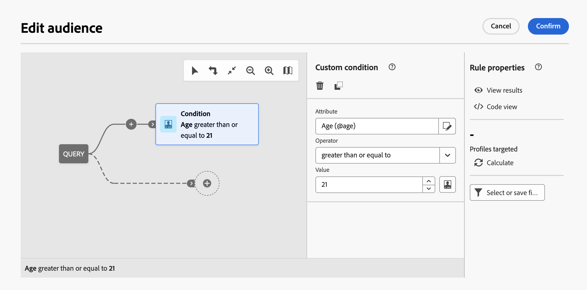{zoomable="yes"}

   對於日期型別屬性，預先定義的值可使用 **[!UICONTROL 預設集]** 選項。

   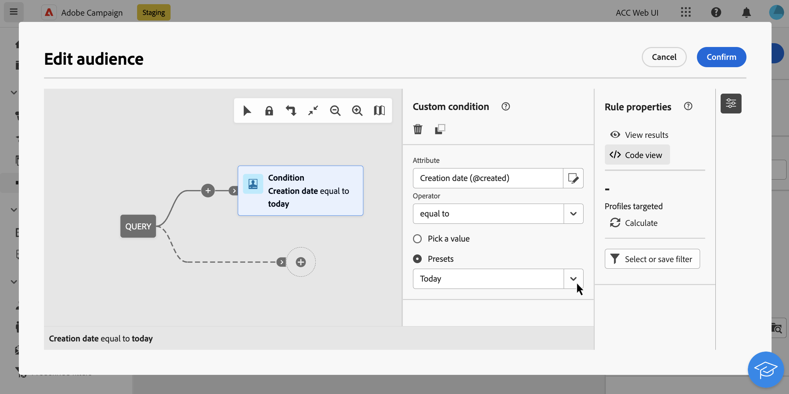{zoomable="yes"}

#### 連結表格的自訂條件（1-1和1-N連結）{#links}

自訂條件可讓您查詢連結至規則目前使用之表格的表格。 這包括具有1-1基數連結的表格，或集合表格（1-N連結）。

針對 **1-1連結**，導覽至連結的表格，選取所需的屬性並定義預期值。

您也可以直接選取中的表格連結 **值** 選取器並確認。 在此情況下，必須使用專用的選擇器來選取可用於所選表格的值，如以下範例所示。

+++查詢範例

在此，查詢會鎖定其標籤為「執行中」的品牌。

1. 在 **品牌** 表格並選取 **標籤** 屬性。

   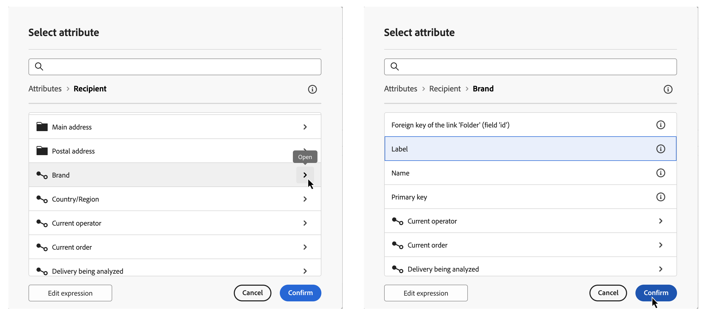{zoomable="yes"}{width="85%" align="center"}

1. 定義屬性的預期值。

   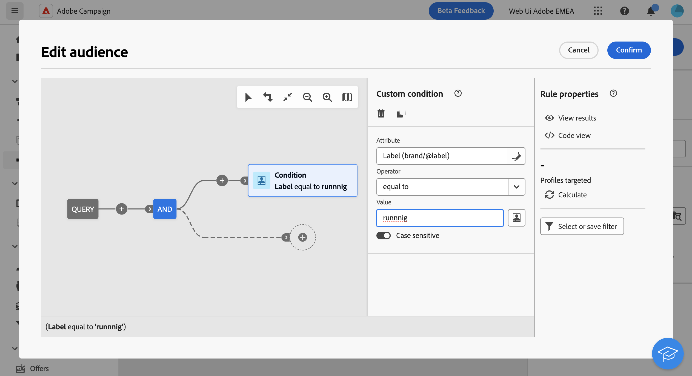{zoomable="yes"}{width="85%" align="center"}

以下是已直接選取表格連結的查詢範例。 必須從專用選擇器選取此資料表的可用值。

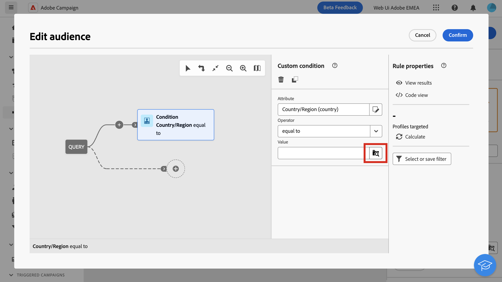{zoomable="yes"}{width="85%" align="center"}

+++

針對 **1-N連結**，您可以定義子條件來縮小查詢範圍，如下列範例所示。

+++查詢範例

在此，查詢會鎖定進行與BrewMaster產品相關購買的總金額至少為100$的收件者。

1. 選取 **購買** 表格並確認。

   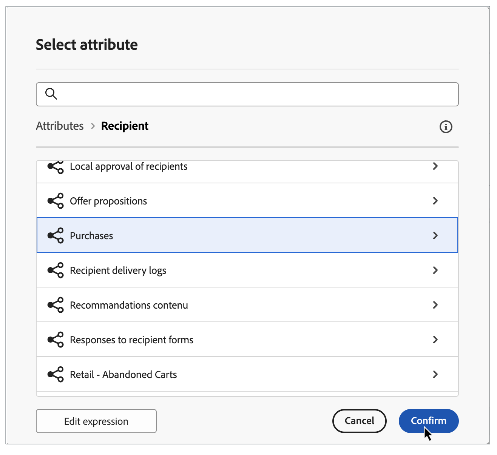{zoomable="yes"}{width="50%" align="center"}

1. 會新增出站轉變，讓您建立子條件。

   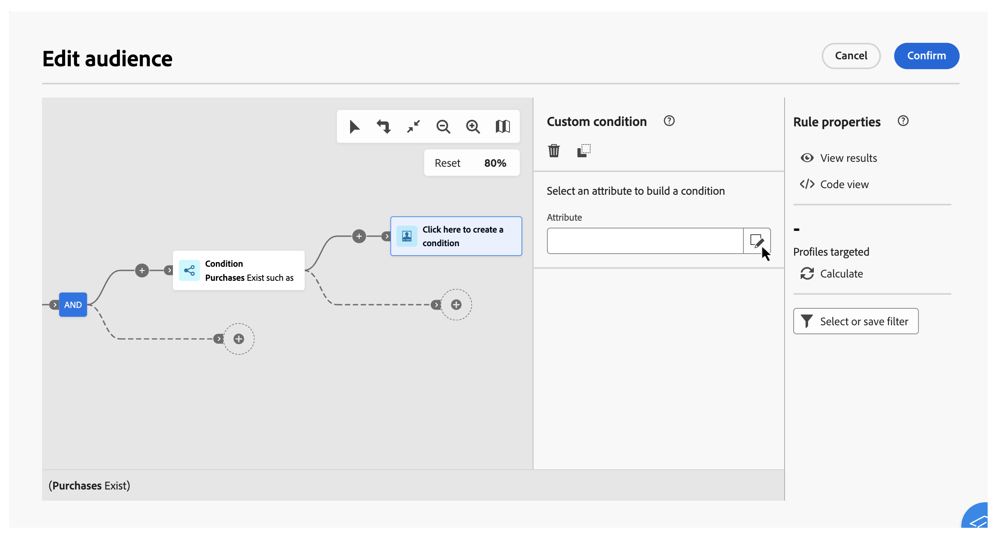{zoomable="yes"}{width="85%" align="center"}

1. 選取 **價格** 1000$或以上的屬性和目標購買

   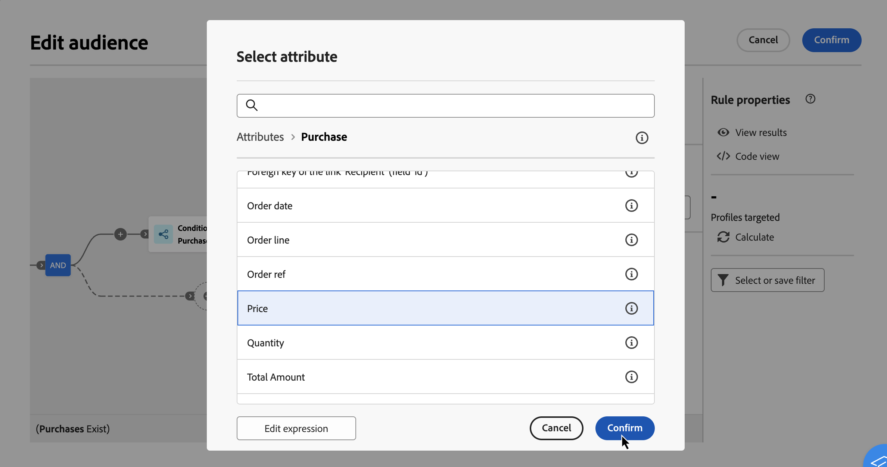{zoomable="yes"}{width="85%" align="center"}

1. 新增子條件以符合您的需求。 我們在此處新增條件，以定位購買BrewMaster產品的設定檔。

   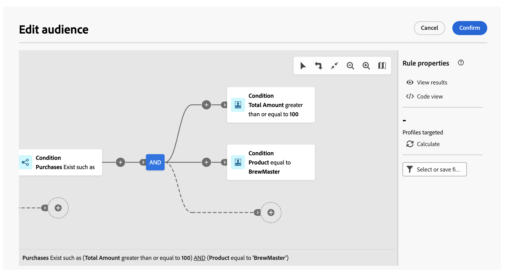{zoomable="yes"}{width="85%" align="center"}

+++

#### 使用彙總資料 {#aggregate}

自訂條件可讓您執行彙總作業。 若要這麼做，您必須直接從集合表格中選取屬性：

1. 在所需的集合表格內導覽，並選取您要執行彙總作業的屬性。

   {zoomable="yes"}{width="85%" align="center"}

1. 在屬性窗格中，切換 **彙總資料** 選項並選取所需的彙總函式。

   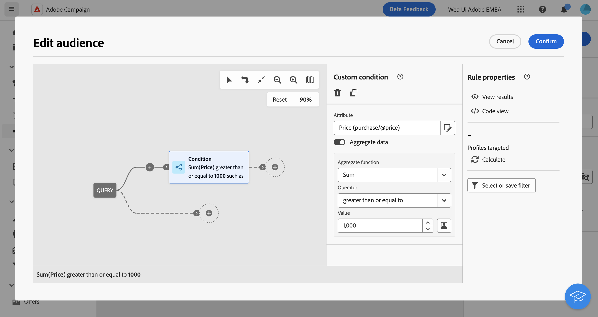{zoomable="yes"}{width="85%" align="center"}

### 選取對象 {#audiences}

>[!CONTEXTUALHELP]
>id="dc_orchestration_querymodeler_selectaudience"
>title="選取對象"
>abstract="透過使用「**選取對象**」選項，您可以選擇要用來篩選查詢的對象。"

若要使用現有對象篩選查詢，請執行下列步驟：

1. 按一下 **+** 按鈕並選擇 **[!UICONTROL 選取對象]**.

1. 此 **選取對象** 屬性窗格會在右側開啟。 選擇您要用來篩選查詢的對象。

   *傳回屬於「節日活動者」受眾的所有設定檔的查詢範例：*

   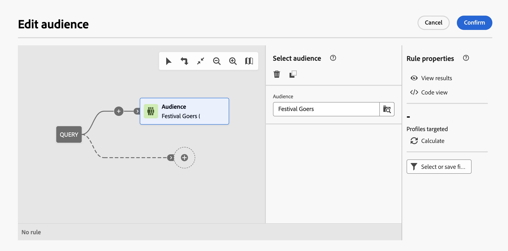{zoomable="yes"}

### 使用預先定義的篩選器 {#predefined-filters}

>[!CONTEXTUALHELP]
>id="dc_orchestration_querymodeler_predefinedfilter"
>title="預先定義的篩選器"
>abstract="透過使用「**預先定義的篩選器**」選項，您可以從自訂篩選器清單或常用篩選器中選取預先定義的篩選器。"

若要使用預先定義的篩選器來篩選查詢，請執行下列步驟：

1. 按一下 **+** 按鈕並選取 **[!UICONTROL 預先定義的篩選器]**.

1. 此 **預先定義的篩選器** 屬性窗格會在右側開啟。 從自訂篩選器清單或我的最愛選取預先定義的篩選器。

   *查詢範例傳回與「非作用中客戶」預先定義篩選器對應的所有設定檔：*

   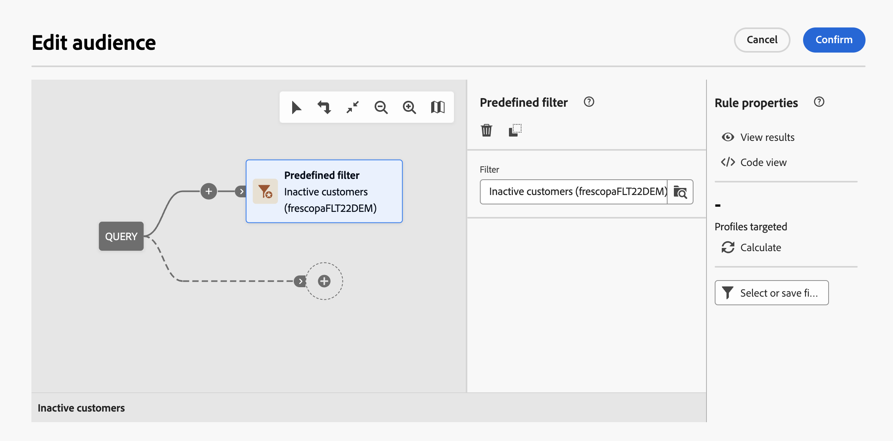{zoomable="yes"}

### 複製貼上元件 {#copy}

查詢建模器可讓您複製一個或多個篩選元件，並在轉變結束時貼上這些元件。 此操作可在目前查詢畫布內執行，或在您執行個體內的任何畫布中執行。

>[!NOTE]
>
>只要您正在執行個體中工作，就會保留複製的選取範圍。 如果您登出並重新登入，您的選取範圍將無法再用於貼上。

若要複製貼上篩選元件，請執行下列步驟：

1. 在查詢畫布中按一下要複製的篩選元件，以選取該元件。 若要選取多個元件，請使用位於畫布右上角的工具列中可用的多重選取工具。

1. 按一下 **[!UICONTROL 複製]** 按鈕位於元件的「屬性」窗格中，或熒幕底部的藍色功能區中（如果已選取多個元件）。

   | 複製單一元件 | 複製多個元件 |
   |  ---  |  ---  |
   | 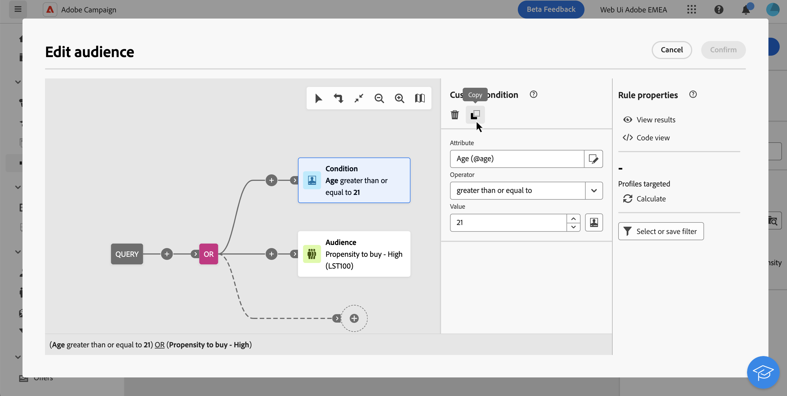{zoomable="yes"}{width="200" align="center" zoomable="yes"} | 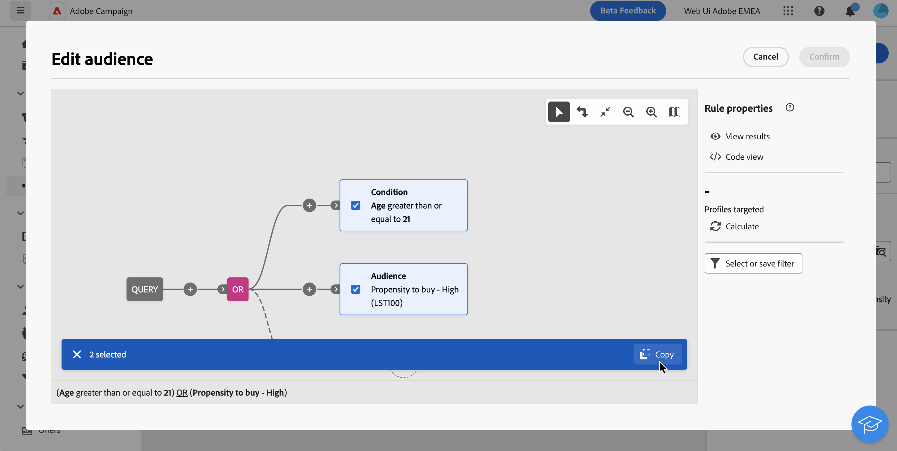{zoomable="yes"}{width="200" align="center" zoomable="yes"} |

1. 若要貼上元件，請按一下所需轉變結尾的+按鈕，然後選取 **貼上專案**.

   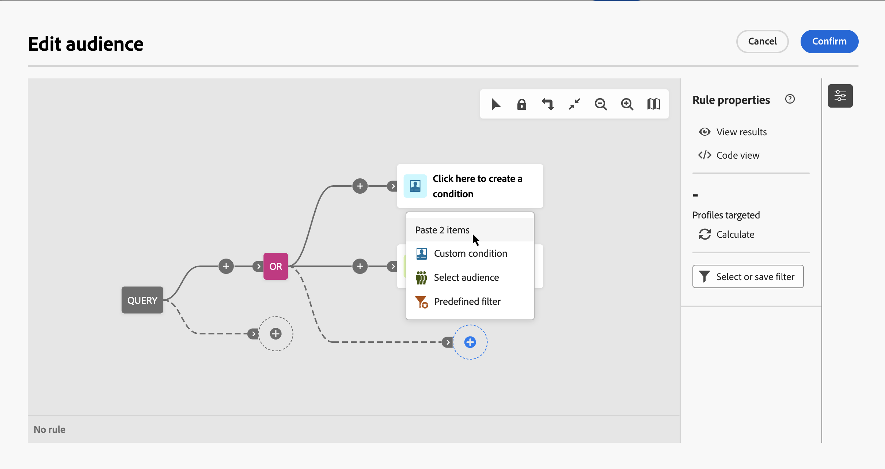{zoomable="yes"}

## 將篩選元件與運算子結合 {#operators}

>[!CONTEXTUALHELP]
>id="dc_orchestration_querymodeler_group"
>title="群組"
>abstract="在此窗格中，您可以變更用來將篩選條件連結在一起的運算子。"

每次您將新的篩選元件新增到查詢時，它都會自動透過連結連結到另一個元件。 **和** 運運算元。 這表示兩個篩選元件的結果會合併。

在此範例中，我們在第二個轉變中新增了對象型別的篩選元件。 元件會連結至預先定義的篩選條件，並具有 **和** 運運算元，表示查詢結果包含以「Madridians」預先定義篩選器為目標的收件者，且屬於「折扣獵手」對象。

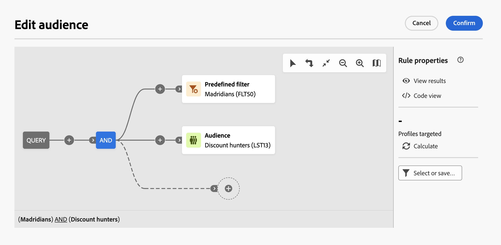{zoomable="yes"}

若要變更用來將篩選條件連結在一起的運運算元，請按一下運運算元，然後在 **群組** 在右側開啟的窗格。

可用的運運算元包括：

* **AND （交集）**：結合符合出站轉變中所有篩選元件的結果。
* **OR （聯集）**：包含符合出站轉變中至少一個篩選元件的結果。
* **排除（排除）**：排除符合出站轉變中所有篩選元件的結果。

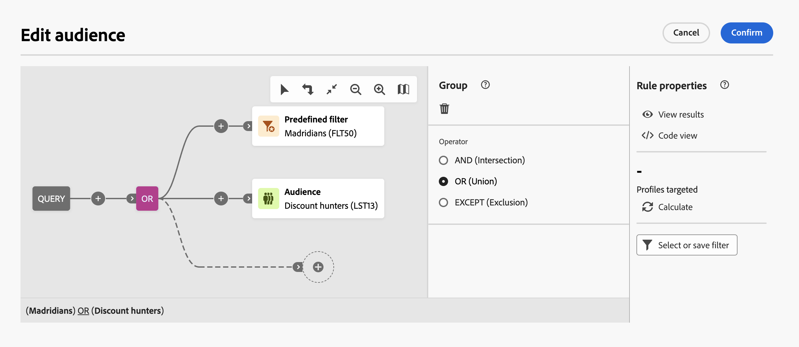{zoomable="yes"}

此外，您可以按一下 **+** 按鈕來切換內容。 這可讓您在此特定位置新增運運算元，以將多個元件分組在一起，並調整查詢。

在以下範例中，我們已建立中繼群組以包含「VIP to reward」或「Super VIP」受眾的結果。

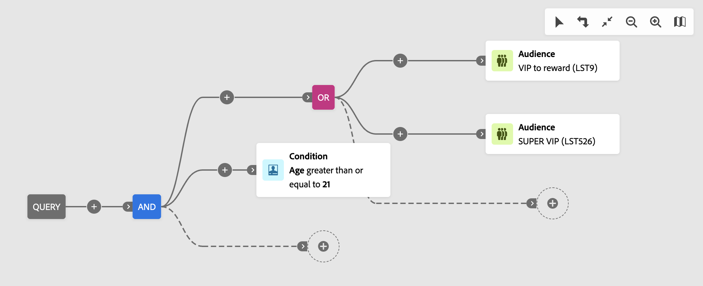{zoomable="yes"}

## 檢查並驗證您的查詢

>[!CONTEXTUALHELP]
>id="dc_orchestration_querymodeler_ruleproperties"
>title="規則屬性"
>abstract="在畫布中建立查詢後，您可以使用右側的&#x200B;**規則屬性**&#x200B;窗格進行檢查。 此窗格可讓您顯示結果資料、擷取查詢的 SQL 程式碼版本，以及檢查目標記錄的數量。 使用「**選取或儲存篩選器**」按鈕，將您的查詢儲存為預先定義篩選器，或將畫布內容更換為現有換的篩選器。"

在畫布中建立查詢後，您可以使用 **規則屬性** 窗格位於右側。 可用的操作包括：

* **檢視結果：** 顯示查詢後產生的資料。
* **程式碼檢視**：顯示SQL中查詢的程式碼型版本。
* **計算**：更新並顯示查詢目標的記錄數。
* **選取或儲存篩選器**：選取要在畫布中使用的現有預先定義篩選器，或將查詢儲存為預先定義的篩選器，以供日後重複使用。 <!--[Learn how to work with predefined filters](../get-started/predefined-filters.md)-->

  >[!IMPORTANT]
  >
  >從「規則屬性」窗格中選取預先定義的篩選器，以選取的篩選器取代畫布中建立的查詢。

當您的查詢準備就緒時，按一下 **[!UICONTROL 確認]** 按鈕來儲存。

您可以隨時透過開啟查詢來修改查詢。 請記住，開啟現有查詢時，它會以簡化檢視顯示，而不會顯示  **+** 按鈕。 若要新增元素至查詢，請在畫布上選取元件或運運算元以顯示 **+** 按鈕。

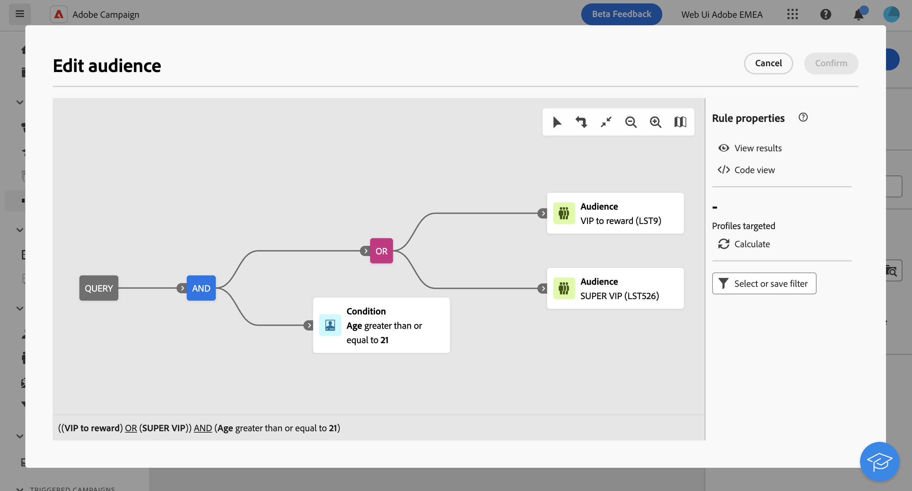{zoomable="yes"}
