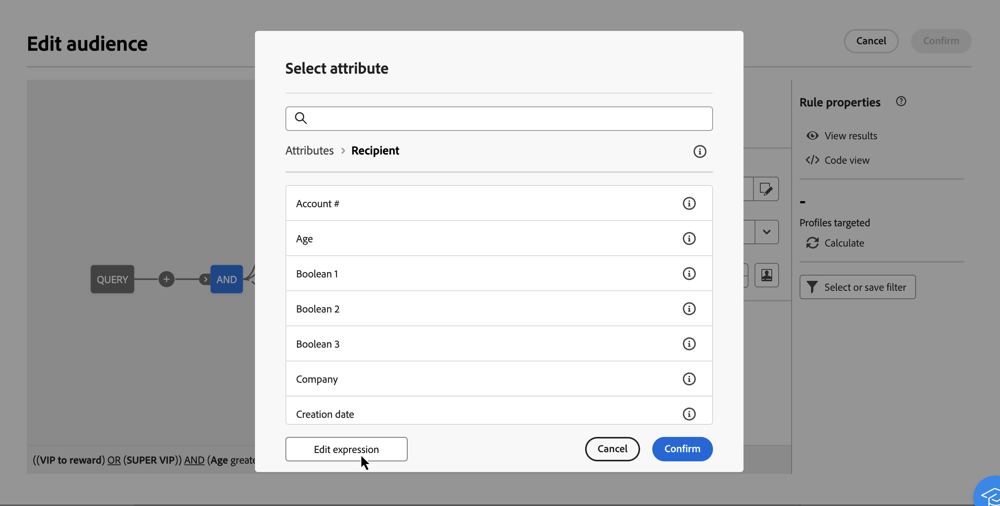
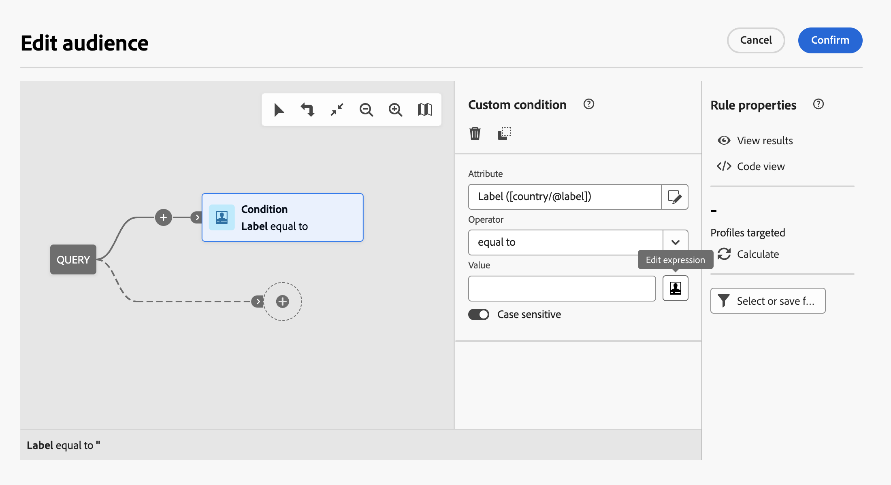
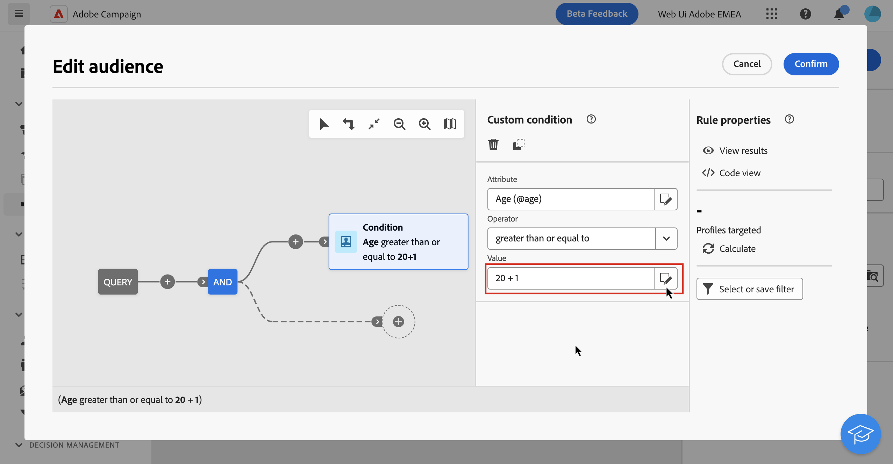

# 運算式編輯器概觀 {#expression}

編輯運算式需要手動輸入條件以形成規則。此模式可讓您使用進階函式，這些函式可讓您控制用於執行特定查詢的值，例如控制日期、字串、數值欄位、排序等。

## 使用運算式編輯器 {#edit}

設定自訂條件時，**[!UICONTROL 屬性]**&#x200B;和&#x200B;**[!UICONTROL 值]**&#x200B;欄位可使用查詢模型器&#x200B;**[!UICONTROL 編輯運算式]**&#x200B;按鈕中的運算式編輯器。

| 從「**[!UICONTROL 屬性]**」欄位存取 | 從「**[!UICONTROL 值]**」欄位存取 |
|  ---  |  ---  |
| {zoomable="yes"}{width="200" align="center" zoomable="yes"} | {zoomable="yes"}{width="200" align="center" zoomable="yes"} |

運算式編輯器提供：

* 定義運算式的&#x200B;**輸入欄位(1)**。
* 可用的&#x200B;**欄位(2)**&#x200B;清單，可用於運算式中，並與查詢的結構描述（也稱為目標維度）相對應。
* **協助程式函式 (3)**，依類別排序。

直接在輸入欄位中輸入運算式以編輯運算式。若要新增欄位或協助程式函式，請將游標置於要新增的運算式中，然後選取+按鈕。

{zoomable="yes"}

當運算式準備就緒時，請選取&#x200B;**[!UICONTROL 確認]**。 運算式會顯示在選取的欄位中。 若要編輯，請開啟運算式編輯器並進行所需的變更。

下列範例顯示為&#x200B;**[!UICONTROL 值]**&#x200B;欄位設定的運算式。 若要編輯它，您必須使用&#x200B;**[!UICONTROL 編輯運算式]**&#x200B;按鈕開啟運算式編輯器。

{zoomable="yes"}

## 協助程式功能

查詢編輯工具可讓您使用進階功能，根據所需結果和操作資料的類型執行複雜的篩選。可使用下列函式：

<!-- ### Aggregate

The aggregate functions are used to perform calculations on a set of values.

>[!BEGINTABS]

>[!TAB Google BigQuery]

| Name | Description | Syntax | Example |
| ---- | ----------- | ------ | ------- |
| **StdDev** | Returns the standard deviation of the values given. | StdDev(&lt;VALUE&gt;) | StdDev([0,3,5]) | -->

<!-- 

>[!TAB Databricks]

Aggregate functions are not available.

>[!TAB Fabric]

| Name | Description | Syntax | Example |
| ---- | ----------- | ------ | ------- |
| **StringAgg** | Returns the concatenation of the values of a string type column, separated by the character in the second argument | StringAgg(&lt;Value&gt;, &lt;String&gt;) | StringAgg(column, ",") |

>[!TAB Redshift]

Aggregate functions are not available. -->

<!-- 

>[!TAB Snowflake]

| Name | Description | Syntax | Example |
| ---- | ----------- | ------ | ------- |
| **StringAgg** | Returns the concatenation of the values of a string type column, separated by the character in the second argument | StringAgg(&lt;Value&gt;, &lt;String&gt;) | StringAgg(column, ",") | -->

<!-- 
>[!TAB Vertica]

Aggregate functions are not available. -->

<!-- 
>[!ENDTABS] 
-->

### 日期

日期函式可用來控制日期或時間值。

>[!BEGINTABS]

>[!TAB Google BigQuery]

| 名稱 | 說明 | 語法 | 範例 |
| ---- | ----------- | ------ | ------- |
| **AddYears** | 將指定的年數新增到提供的日期時間。 | AddYears(&lt;DATETIME>， &lt;NUMBER>) | AddYears(&quot;2019-12-25 15:30:00&quot;， 3) |
| **AddMonths** | 將指定的月數新增到提供的日期時間。 | AddMonths(&lt;DATETIME>， &lt;NUMBER>) | AddMonths(&quot;2019-12-25 15:30:00&quot;， 6) |
| **AddDays** | 將指定的天數新增至提供的日期時間。 | AddDays(&lt;DATETIME>， &lt;NUMBER>) | AddDays(&quot;2019-12-25 15:30:00&quot;， 10) |
| **AddHours** | 將指定的小時數新增到提供的日期時間。 | AddHours(&lt;DATETIME>， &lt;NUMBER>) | AddHours(&quot;2019-12-25 15:30:00&quot;， 3) |
| **AddMinutes** | 將指定的分鐘數新增到提供的日期時間。 | AddMinutes(&lt;DATETIME>， &lt;NUMBER>) | AddMinutes(&quot;2019-12-25 15:30:00&quot;， 32) |
| **AddSeconds** | 將指定的秒數新增到提供的日期時間。 | AddSeconds(&lt;DATETIME>， &lt;NUMBER>) | AddSeconds(&quot;2019-12-25 15:30:00&quot;， 37) |
| **SubYears** | 將指定的年數減去提供的日期時間。 | SubYears(&lt;DATETIME>， &lt;NUMBER>) | SubYears(&quot;2019-12-25 15:30:00&quot;， 3) |
| **SubMonths** | 將指定的月數減去提供的日期時間。 | SubMonths(&lt;DATETIME>， &lt;NUMBER>) | SubMonths(&quot;2019-12-25 15:30:00&quot;， 6) |
| **SubDays** | 將指定的天數減去提供的日期時間。 | SubDays(&lt;DATETIME>， &lt;NUMBER>) | SubDays(&quot;2019-12-25 15:30:00&quot;， 10) |
| **SubHours** | 將指定的小時數減去提供的日期時間。 | SubHours(&lt;DATETIME>， &lt;NUMBER>) | SubHours(&quot;2019-12-25 15:30:00&quot;， 3) |
| **SubMinutes** | 將指定的分鐘數減去提供的日期時間。 | SubMinutes(&lt;DATETIME>， &lt;NUMBER>) | SubMinutes(&quot;2019-12-25 15:30:00&quot;， 32) |
| **SubSeconds** | 將指定的秒數減去提供的日期時間。 | SubSeconds(&lt;DATETIME>， &lt;NUMBER>) | SubSeconds(&quot;2019-12-25 15:30:00&quot;， 37) |
| **年** | 從指定的datetime物件中擷取年份。 | Year(&lt;DATETIME>) | 年(&quot;2019-12-15 15:30:00&quot;) |
| **Month** | 從指定的datetime物件中擷取月份。 | Month(&lt;DATETIME>) | 月份(&quot;2019-12-15 15:30:00&quot;) |
| **Day** | 從指定的datetime物件中擷取日。 | Day(&lt;DATETIME>) | Day(&quot;2019-12-15 15:30:00&quot;) |
| **DayOfYear** | 從指定的datetime物件中擷取一年中的第幾天。 例如，如果提供的日期時間是2月2日，則會傳回33。 | DayOfYear(&lt;DATETIME>) | DayOfYear(&quot;2019-12-15 15:30:00&quot;) |
| **WeekDay** | 從指定的datetime物件中擷取一週中的某天，數值從0到6,0代表星期日。 | Year(&lt;DATETIME>) | 年(&quot;2019-12-15 15:30:00&quot;) |
| **Hour** | 從指定的datetime物件中擷取小時值。 | Year(&lt;DATETIME>) | 年(&quot;2019-12-15 15:30:00&quot;) |
| **Minute** | 從指定的datetime物件中擷取分鐘值。 | Year(&lt;DATETIME>) | 年(&quot;2019-12-15 15:30:00&quot;) |
| **Second** | 從指定的datetime物件中擷取第二個值。 | Year(&lt;DATETIME>) | 年(&quot;2019-12-15 15:30:00&quot;) |
| **YearsDiff** | 找出指定日期時間之間的差異，並以年為粒度。 | YearsDiff(&lt;DATETIME>， &lt;DATETIME>) | YearsDiff(&quot;2019-12-25 15:30:00&quot;， &quot;2018-10-14 18:35:27&quot;) |
| **MonthsDiff** | 尋找指定日期時間之間的差異，其粒度為月。 | MonthsDiff(&lt;DATETIME>， &lt;DATETIME>) | MonthsDiff(&quot;2019-12-25 15:30:00&quot;， &quot;2018-10-14 18:35:27&quot;) |
| **DaysDiff** | 找出指定日期時間之間的差異，並以天為粒度。 | DaysDiff(&lt;DATETIME>， &lt;DATETIME>) | DaysDiff(&quot;2019-12-25 15:30:00&quot;， &quot;2018-10-14 18:35:27&quot;) |
| **HoursDiff** | 尋找指定日期時間之間的差異，其詳細程度為小時。 | HoursDiff(&lt;DATETIME>， &lt;DATETIME>) | HoursDiff(&quot;2019-12-25 15:30:00&quot;， &quot;2018-10-14 18:35:27&quot;) |
| **MinutesDiff** | 尋找指定日期時間之間的差異，其詳細程度為分鐘。 | MinutesDiff(&lt;DATETIME>， &lt;DATETIME>) | MinutesDiff(&quot;2019-12-25 15:30:00&quot;， &quot;2018-10-14 18:35:27&quot;) |
| **SecondsDiff** | 尋找指定日期時間之間的差異，其詳細程度為秒。 | SecondsDiff(&lt;DATETIME>， &lt;DATETIME>) | SecondsDiff(&quot;2019-12-25 15:30:00&quot;， &quot;2018-10-14 18:35:27&quot;) |
| **YearsOld** | 找出指定日期時間與目前時間之間的差異，並以年為粒度。 | YearsOld(&lt;DATETIME>) | YearsOld(&quot;2019-12-25 15:30:00&quot;) |
| **MonthsOld** | 找出指定日期時間與目前時間之間的差異，粒度為月。 | MonthsOld(&lt;DATETIME>) | MonthsOld(&quot;2019-12-25 15:30:00&quot;) |
| **DaysOld** | 找出指定日期時間與目前時間之間的差異，並以天為粒度。 | DaysOld(&lt;DATETIME>) | DaysOld(&quot;2019-12-25 15:30:00&quot;) |
| **GetDate** | 取得伺服器的目前日期。 | GetDate() | GetDate() |
| **DateOnly** | 將日期時間截斷為只有年、月和日。 | DateOnly(&lt;DATETIME>) | DateOnly(&quot;2019-12-25 15:30:00&quot;) |
| **ToDate** | 將欄位轉換為日期欄位。 | ToDate(&lt;DATETIME>) | ToDate(&quot;2019-12-25 15:30:00&quot;) |
| **ToDateTime** | 將欄位轉換為日期時間欄位。 | ToDateTime(&lt;DATE>) | ToDateTime(&quot;2019-12-25 15:30:00&quot;) |
| **ToTimestamp** | 將欄位轉換為時間戳記欄位。 | ToTimestamp(&lt;DATETIME>) | ToTimestamp(&quot;2019-12-25 15:30:00&quot;) |
| **Oldest** | 傳回提供的兩個日期之間的最早日期。 | Oldest(&lt;DATETIME>， &lt;DATETIME>) | Oldest(&quot;2015-02-13 11:59:59&quot;， &quot;2016-04-13 19:28:14&quot;) |
| **TruncDate** | 根據指定的數值，將日期時間截斷為最接近的單位。 如果數值等於60，則會截斷至最接近的分鐘。 如果數值等於3600，則會截斷為最接近的小時。 如果數值等於86400，則會截斷至最接近的天數。 否則，會截斷至最接近的秒數。 | TruncDate(&lt;DATETIME>， &lt;NUMBER>) | TruncDate(&quot;2016-04-13 19:28:14&quot;， 3600) |
| **TruncDateTZ** | 根據指定的數值，將日期時間截斷為最接近的單位，並將日期時間設定為指定的時區。 如果數值等於60，則會截斷至最接近的分鐘。 如果數值等於3600，則會截斷為最接近的小時。 如果數值等於86400，則會截斷至最接近的天數。 | TruncDateTZ(&lt;DATETIME>， &lt;NUMBER>， &lt;TIMEZONE>) | TruncDateTZ(&quot;2016-04-13 19:28:14&quot;， 3600， &quot;America/Los_Angeles&quot;) |
| **TruncTime** | 將日期時間設為2000年1月1日，並根據給定的數值將剩餘的日期時間舍入至最接近的單位。如果數值等於60，則會截斷至最接近的分鐘。 如果數值等於3600，則會截斷為最接近的小時。 | TruncTime(&lt;DATETIME>， &lt;NUMBER>) | TruncTime(&quot;2016-04-13 19:28:14&quot;， 3600) |
| **TruncQuarter** | 將日期時間截斷為最接近季度中的第一個日期。 | TruncQuarter(&lt;DATETIME>) | TruncQuarter(&quot;2016-04-13 19:28:14&quot;) |
| **TruncYear** | 將日期時間截斷為最接近年份中的第一個日期。 | TruncYear(&lt;DATETIME>) | TruncYear(&quot;2016-04-13 19:28:14&quot;) |
| **TruncWeek** | 將日期時間截斷為最接近一週的星期日。 | TruncWeek(&lt;DATETIME>) | TruncWeek(&quot;2016-04-13 19:28:14&quot;) |

<!-- 
| **YearAndMonth** | Truncates the datetime to just the year and month. | YearAndMonth(&lt;DATETIME&gt;) | YearAndMonth("2019-12-25 15:30:00") | 
-->

<!-- | **DaysAgo** | Calculates the number of days between the current date and the provided timestamp, and returns the value as a datetime. | DaysAgo(&lt;DATETIME&gt;) | DaysAgo("2024-06-24 14:43:49") |
| **DaysAgoInt** | Calculates the number of days between the current date and the provided timestamp, and returns the value as an integer. | DaysAgoInt(&lt;DATETIME&gt;) | DaysAgoInt("2024-06-24 14:43:49") |
| **MonthsAgo** | Calculates the number of months between the current date and the provided timestamp, and returns the value as a datetime. | MonthsAgo(&lt;DATETIME&gt;) | MonthsAgo("2024-06-24 14:43:49") |
| **YearsAgo** | Calculates the number of years between the current date and the provided timestamp, and returns the value as a datetime. | YearsAgo(&lt;DATETIME&gt;) | YearsAgo("2024-06-24 14:43:49") | -->

<!-- 
>[!TAB Databricks]

| Name | Description | Syntax | Example |
| ---- | ----------- | ------ | ------- |
| **AddYears** | Adds the specified number of years to the provided datetime. | AddYears(&lt;DATETIME&gt;, &lt;NUMBER&gt;) | AddYears("2019-12-25 15:30:00", 3) |
| **AddMonths** | Adds the specified number of months to the provided datetime. | AddMonths(&lt;DATETIME&gt;, &lt;NUMBER&gt;) | AddMonths("2019-12-25 15:30:00", 6) |
| **AddDays** | Adds the specified number of days to the provided datetime. | AddDays(&lt;DATETIME&gt;, &lt;NUMBER&gt;) | AddDays("2019-12-25 15:30:00", 10) |
| **AddHours** | Adds the specified number of hours to the provided datetime. | AddHours(&lt;DATETIME&gt;, &lt;NUMBER&gt;) | AddHours("2019-12-25 15:30:00", 3) |
| **AddMinutes** | Adds the specified number of minutes to the provided datetime. | AddMinutes(&lt;DATETIME&gt;, &lt;NUMBER&gt;) | AddMinutes("2019-12-25 15:30:00", 32) |
| **AddSeconds** | Adds the specified number of seconds to the provided datetime. | AddSeconds(&lt;DATETIME&gt;, &lt;NUMBER&gt;) | AddSeconds("2019-12-25 15:30:00", 37) |
| **SubYears** | Subtracts the specified number of years to the provided datetime. | SubYears(&lt;DATETIME&gt;, &lt;NUMBER&gt;) | SubYears("2019-12-25 15:30:00", 3) |
| **SubMonths** | Adds the specified number of months to the provided datetime. | SubMonths(&lt;DATETIME&gt;, &lt;NUMBER&gt;) | SubMonths("2019-12-25 15:30:00", 6) |
| **SubDays** | Adds the specified number of days to the provided datetime. | SubDays(&lt;DATETIME&gt;, &lt;NUMBER&gt;) | SubDays("2019-12-25 15:30:00", 10) |
| **SubHours** | Adds the specified number of hours to the provided datetime. | SubHours(&lt;DATETIME&gt;, &lt;NUMBER&gt;) | SubHours("2019-12-25 15:30:00", 3) |
| **SubMinutes** | Adds the specified number of minutes to the provided datetime. | SubMinutes(&lt;DATETIME&gt;, &lt;NUMBER&gt;) | SubMinutes("2019-12-25 15:30:00", 32) |
| **SubSeconds** | Adds the specified number of seconds to the provided datetime. | SubSeconds(&lt;DATETIME&gt;, &lt;NUMBER&gt;) | SubSeconds("2019-12-25 15:30:00", 37) |
| **Year** | Extracts the year from the given datetime object. | Year(&lt;DATETIME&gt;) | Year("2019-12-15 15:30:00") |
| **Month** | Extracts the month from the given datetime object. | Month(&lt;DATETIME&gt;) | Month("2019-12-15 15:30:00") |
| **Day** | Extracts the day from the given datetime object. | Day(&lt;DATETIME&gt;) | Day("2019-12-15 15:30:00") |
| **DayOfYear** | Extracts the day of year from the given datetime object. For example, if the provided datetime is February 2nd, it would return 33. | DayOfYear(&lt;DATETIME&gt;) | DayOfYear("2019-12-15 15:30:00") |
| **WeekDay** | Extracts the day of the week from the given datetime object, as a number from 1 to 7, with 1 representing Sunday. | Year(&lt;DATETIME&gt;) | Year("2019-12-15 15:30:00") |
| **Hour** | Extracts the hour value from the given datetime object. | Year(&lt;DATETIME&gt;) | Year("2019-12-15 15:30:00") |
| **Minute** | Extracts the minute value from the given datetime object. | Year(&lt;DATETIME&gt;) | Year("2019-12-15 15:30:00") |
| **Second** | Extracts the second value from the given datetime object. | Year(&lt;DATETIME&gt;) | Year("2019-12-15 15:30:00") |
| **YearsDiff** | Finds the difference between the given datetimes, with a granularity of years. | YearsDiff(&lt;DATETIME&gt;, &lt;DATETIME&gt;) | YearsDiff("2019-12-25 15:30:00", "2018-10-14 18:35:27") |
| **MonthsDiff** | Finds the difference between the given datetimes, with a granularity of months. | MonthsDiff(&lt;DATETIME&gt;, &lt;DATETIME&gt;) | MonthsDiff("2019-12-25 15:30:00", "2018-10-14 18:35:27") |
| **DaysDiff** | Finds the difference between the given datetimes, with a granularity of days. | DaysDiff(&lt;DATETIME&gt;, &lt;DATETIME&gt;) | DaysDiff("2019-12-25 15:30:00", "2018-10-14 18:35:27") |
| **HoursDiff** | Finds the difference between the given datetimes, with a granularity of hours. | HoursDiff(&lt;DATETIME&gt;, &lt;DATETIME&gt;) | HoursDiff("2019-12-25 15:30:00", "2018-10-14 18:35:27") |
| **MinutesDiff** | Finds the difference between the given datetimes, with a granularity of minutes. | MinutesDiff(&lt;DATETIME&gt;, &lt;DATETIME&gt;) | MinutesDiff("2019-12-25 15:30:00", "2018-10-14 18:35:27") |
| **SecondsDiff** | Finds the difference between the given datetimes, with a granularity of seconds. | SecondsDiff(&lt;DATETIME&gt;, &lt;DATETIME&gt;) | SecondsDiff("2019-12-25 15:30:00", "2018-10-14 18:35:27") |
| **YearsOld** | Finds the difference between the given datetime and the present, with a granularity of years. | YearsOld(&lt;DATETIME&gt;) | YearsOld("2019-12-25 15:30:00") |
| **MonthsOld** | Finds the difference between the given datetime and the present, with a granularity of months. | MonthsOld(&lt;DATETIME&gt;) | MonthsOld("2019-12-25 15:30:00") |
| **DaysOld** | Finds the difference between the given datetime and the present, with a granularity of days. | DaysOld(&lt;DATETIME&gt;) | DaysOld("2019-12-25 15:30:00") |
| **DaysAgo** | Calculates the number of days between the current date and the provided timestamp, and returns the value as a datetime. | DaysAgo(&lt;DATETIME&gt;) | DaysAgo("2024-06-24 14:43:49") |
| **DaysAgoInt** | Calculates the number of days between the current date and the provided timestamp, and returns the value as an integer. | DaysAgoInt(&lt;DATETIME&gt;) | DaysAgoInt("2024-06-24 14:43:49") |
| **MonthsAgo** | Calculates the number of months between the current date and the provided timestamp, and returns the value as a datetime. | MonthsAgo(&lt;DATETIME&gt;) | MonthsAgo("2024-06-24 14:43:49") |
| **ToDateTime** | Converts the field to a datetime field. | ToDateTime(&lt;DATE&gt;) | ToDateTime("2019-12-25 15:30:00") |
| **ToTimestamp** | Converts the field to a timestamp field. | ToTimestamp(&lt;DATETIME&gt;) | ToTimestamp("2019-12-25 15:30:00") |
| **GetDate** | Get the current date of the server. | GetDate() | GetDate() |
| **DateOnly** | Truncates the datetime to just the year, month, and day. | DateOnly(&lt;DATETIME&gt;) | DateOnly("2019-12-25 15:30:00") |
| **ToDate** | Converts the field to a date field. | ToDate(&lt;DATETIME&gt;) | ToDate("2019-12-25 15:30:00") |
| **YearAndMonth** | Truncates the datetime to just the year and month. | YearAndMonth(&lt;DATETIME&gt;) | YearAndMonth("2019-12-25 15:30:00") |
| **Oldest** | Returns the oldest date between the two provided. | Oldest(&lt;DATETIME&gt;, &lt;DATETIME&gt;) | Oldest("2015-02-13 11:59:59", "2016-04-13 19:28:14") |
| **TruncDate** | Truncates the datetime to the nearest unit, based on the numerical value given. If the numeric value is equal to 60, it truncates to the nearest minute. If the numeric value is equal to 3600, it truncates to the nearest hour. If the numeric value is equal to 86400, it truncates to the nearest day. Otherwise, it truncates to the nearest second. | TruncDate(&lt;DATETIME&gt;, &lt;NUMBER&gt;) | TruncDate("2016-04-13 19:28:14", 3600) |
| **TruncDateTZ** | Truncates the datetime to the nearest unit, based on the numerical value given, and sets the datetime to the specified timezone. If the numeric value is equal to 60, it truncates to the nearest minute. If the numeric value is equal to 3600, it truncates to the nearest hour. If the numeric value is equal to 86400, it truncates to the nearest day. | TruncDateTZ(&lt;DATETIME&gt;, &lt;NUMBER&gt;, &lt;TIMEZONE&gt;) | TruncDateTZ("2016-04-13 19:28:14", 3600, "America/Los_Angeles") |
| **TruncTime** | Sets the datetime to January 1st, 2000 and rounds the rest of the datetime to the nearest unit, based on the numerical value given.If the numeric value is equal to 60, it truncates to the nearest minute. If the numeric value is equal to 3600, it truncates to the nearest hour. | TruncTime(&lt;DATETIME&gt;, &lt;NUMBER&gt;) | TruncTime("2016-04-13 19:28:14", 3600) |
| **TruncQuarter** | Truncates the datetime to the first date in the nearest quarter. | TruncQuarter(&lt;DATETIME&gt;) | TruncQuarter("2016-04-13 19:28:14") |
| **TruncYear** | Truncates the datetime to the first date in the nearest year. | TruncYear(&lt;DATETIME&gt;) | TruncYear("2016-04-13 19:28:14") |
| **TruncWeek** | Truncates the datetime to the Sunday of the nearest week. | TruncWeek(&lt;DATETIME&gt;) | TruncWeek("2016-04-13 19:28:14") |

>[!TAB Fabric]

| Name | Description | Syntax | Example |
| ---- | ----------- | ------ | ------- |
| **AddYears** | Adds the specified number of years to the provided datetime. | AddYears(&lt;DATETIME&gt;, &lt;NUMBER&gt;) | AddYears("2019-12-25 15:30:00", 3) |
| **AddMonths** | Adds the specified number of months to the provided datetime. | AddMonths(&lt;DATETIME&gt;, &lt;NUMBER&gt;) | AddMonths("2019-12-25 15:30:00", 6) |
| **AddDays** | Adds the specified number of days to the provided datetime. | AddDays(&lt;DATETIME&gt;, &lt;NUMBER&gt;) | AddDays("2019-12-25 15:30:00", 10) |
| **AddHours** | Adds the specified number of hours to the provided datetime. | AddHours(&lt;DATETIME&gt;, &lt;NUMBER&gt;) | AddHours("2019-12-25 15:30:00", 3) |
| **AddMinutes** | Adds the specified number of minutes to the provided datetime. | AddMinutes(&lt;DATETIME&gt;, &lt;NUMBER&gt;) | AddMinutes("2019-12-25 15:30:00", 32) |
| **AddSeconds** | Adds the specified number of seconds to the provided datetime. | AddSeconds(&lt;DATETIME&gt;, &lt;NUMBER&gt;) | AddSeconds("2019-12-25 15:30:00", 37) |
| **SubYears** | Subtracts the specified number of years to the provided datetime. | SubYears(&lt;DATETIME&gt;, &lt;NUMBER&gt;) | SubYears("2019-12-25 15:30:00", 3) |
| **SubMonths** | Adds the specified number of months to the provided datetime. | SubMonths(&lt;DATETIME&gt;, &lt;NUMBER&gt;) | SubMonths("2019-12-25 15:30:00", 6) |
| **SubDays** | Adds the specified number of days to the provided datetime. | SubDays(&lt;DATETIME&gt;, &lt;NUMBER&gt;) | SubDays("2019-12-25 15:30:00", 10) |
| **SubHours** | Adds the specified number of hours to the provided datetime. | SubHours(&lt;DATETIME&gt;, &lt;NUMBER&gt;) | SubHours("2019-12-25 15:30:00", 3) |
| **SubMinutes** | Adds the specified number of minutes to the provided datetime. | SubMinutes(&lt;DATETIME&gt;, &lt;NUMBER&gt;) | SubMinutes("2019-12-25 15:30:00", 32) |
| **SubSeconds** | Adds the specified number of seconds to the provided datetime. | SubSeconds(&lt;DATETIME&gt;, &lt;NUMBER&gt;) | SubSeconds("2019-12-25 15:30:00", 37) |
| **DayOfYear** | Extracts the day of year from the given datetime object. For example, if the provided datetime is February 2nd, it would return 33. | DayOfYear(&lt;DATETIME&gt;) | DayOfYear("2019-12-15 15:30:00") |
| **DateOnly** | Truncates the datetime to just the year, month, and day. | DateOnly(&lt;DATETIME&gt;) | DateOnly("2019-12-25 15:30:00") |
| **YearsOld** | Finds the difference between the given datetime and the present, with a granularity of years. | YearsOld(&lt;DATETIME&gt;) | YearsOld("2019-12-25 15:30:00") |
| **YearsDiff** | Finds the difference between the given datetimes, with a granularity of years. | YearsDiff(&lt;DATETIME&gt;, &lt;DATETIME&gt;) | YearsDiff("2019-12-25 15:30:00", "2018-10-14 18:35:27") |
| **MonthsDiff** | Finds the difference between the given datetimes, with a granularity of months. | MonthsDiff(&lt;DATETIME&gt;, &lt;DATETIME&gt;) | MonthsDiff("2019-12-25 15:30:00", "2018-10-14 18:35:27") |
| **DaysDiff** | Finds the difference between the given datetimes, with a granularity of days. | DaysDiff(&lt;DATETIME&gt;, &lt;DATETIME&gt;) | DaysDiff("2019-12-25 15:30:00", "2018-10-14 18:35:27") |
| **HoursDiff** | Finds the difference between the given datetimes, with a granularity of hours. | HoursDiff(&lt;DATETIME&gt;, &lt;DATETIME&gt;) | HoursDiff("2019-12-25 15:30:00", "2018-10-14 18:35:27") |
| **MinutesDiff** | Finds the difference between the given datetimes, with a granularity of minutes. | MinutesDiff(&lt;DATETIME&gt;, &lt;DATETIME&gt;) | MinutesDiff("2019-12-25 15:30:00", "2018-10-14 18:35:27") |
| **SecondsDiff** | Finds the difference between the given datetimes, with a granularity of seconds. | SecondsDiff(&lt;DATETIME&gt;, &lt;DATETIME&gt;) | SecondsDiff("2019-12-25 15:30:00", "2018-10-14 18:35:27") |
| **WeekDay** | Extracts the day of the week from the given datetime object, as a number from 1 to 7, with 1 representing Sunday. | Year(&lt;DATETIME&gt;) | Year("2019-12-15 15:30:00") |
| **Hour** | Extracts the hour value from the given datetime object. | Year(&lt;DATETIME&gt;) | Year("2019-12-15 15:30:00") |
| **Minute** | Extracts the minute value from the given datetime object. | Year(&lt;DATETIME&gt;) | Year("2019-12-15 15:30:00") |
| **Second** | Extracts the second value from the given datetime object. | Year(&lt;DATETIME&gt;) | Year("2019-12-15 15:30:00") |
| **Oldest** | Returns the oldest date between the two provided. | Oldest(&lt;DATETIME&gt;, &lt;DATETIME&gt;) | Oldest("2015-02-13 11:59:59", "2016-04-13 19:28:14") |
| **YearAndMonth** | Truncates the datetime to just the year and month. | YearAndMonth(&lt;DATETIME&gt;) | YearAndMonth("2019-12-25 15:30:00") |
| **ToDate** | Converts the field to a date field. | ToDate(&lt;DATETIME&gt;) | ToDate("2019-12-25 15:30:00") |
| **TruncDate** | Truncates the datetime to the nearest unit, based on the numerical value given. If the numeric value is equal to 60, it truncates to the nearest minute. If the numeric value is equal to 3600, it truncates to the nearest hour. If the numeric value is equal to 86400, it truncates to the nearest day. Otherwise, it truncates to the nearest second. | TruncDate(&lt;DATETIME&gt;, &lt;NUMBER&gt;) | TruncDate("2016-04-13 19:28:14", 3600) |
| **TruncTime** | Sets the datetime to January 1st, 2000 and rounds the rest of the datetime to the nearest unit, based on the numerical value given.If the numeric value is equal to 60, it truncates to the nearest minute. If the numeric value is equal to 3600, it truncates to the nearest hour. | TruncTime(&lt;DATETIME&gt;, &lt;NUMBER&gt;) | TruncTime("2016-04-13 19:28:14", 3600) |
| **TruncQuarter** | Truncates the datetime to the first date in the nearest quarter. | TruncQuarter(&lt;DATETIME&gt;) | TruncQuarter("2016-04-13 19:28:14") |
| **TruncYear** | Truncates the datetime to the first date in the nearest year. | TruncYear(&lt;DATETIME&gt;) | TruncYear("2016-04-13 19:28:14") |
| **TruncWeek** | Truncates the datetime to the Sunday of the nearest week. | TruncWeek(&lt;DATETIME&gt;) | TruncWeek("2016-04-13 19:28:14") |
| **ToTimestamp** | Converts the field to a timestamp field. | ToTimestamp(&lt;DATETIME&gt;) | ToTimestamp("2019-12-25 15:30:00") |

>[!TAB Redshift]

| Name | Description | Syntax | Example |
| ---- | ----------- | ------ | ------- |
| **ConvertTimezone** | Converts the datetime from its timezone to the timezone of the external account. | ConvertTimezone(&lt;DATETIME&gt;) | ConvertTimezone("2019-12-25 15:30:00") |

 -->

>[!TAB Snowflake]

| 名稱 | 說明 | 語法 | 範例 |
| ---- | ----------- | ------ | ------- |
| **AddYears** | 將指定的年數新增到提供的日期時間。 | AddYears(&lt;DATETIME>， &lt;NUMBER>) | AddYears(&quot;2019-12-25 15:30:00&quot;， 3) |
| **AddMonths** | 將指定的月數新增到提供的日期時間。 | AddMonths(&lt;DATETIME>， &lt;NUMBER>) | AddMonths(&quot;2019-12-25 15:30:00&quot;， 6) |
| **AddDays** | 將指定的天數新增至提供的日期時間。 | AddDays(&lt;DATETIME>， &lt;NUMBER>) | AddDays(&quot;2019-12-25 15:30:00&quot;， 10) |
| **AddHours** | 將指定的小時數新增到提供的日期時間。 | AddHours(&lt;DATETIME>， &lt;NUMBER>) | AddHours(&quot;2019-12-25 15:30:00&quot;， 3) |
| **AddMinutes** | 將指定的分鐘數新增到提供的日期時間。 | AddMinutes(&lt;DATETIME>， &lt;NUMBER>) | AddMinutes(&quot;2019-12-25 15:30:00&quot;， 32) |
| **AddSeconds** | 將指定的秒數新增到提供的日期時間。 | AddSeconds(&lt;DATETIME>， &lt;NUMBER>) | AddSeconds(&quot;2019-12-25 15:30:00&quot;， 37) |
| **SubYears** | 將指定的年數減去提供的日期時間。 | SubYears(&lt;DATETIME>， &lt;NUMBER>) | SubYears(&quot;2019-12-25 15:30:00&quot;， 3) |
| **SubMonths** | 將指定的月數減去提供的日期時間。 | SubMonths(&lt;DATETIME>， &lt;NUMBER>) | SubMonths(&quot;2019-12-25 15:30:00&quot;， 6) |
| **SubDays** | 將指定的天數減去提供的日期時間。 | SubDays(&lt;DATETIME>， &lt;NUMBER>) | SubDays(&quot;2019-12-25 15:30:00&quot;， 10) |
| **SubHours** | 將指定的小時數減去提供的日期時間。 | SubHours(&lt;DATETIME>， &lt;NUMBER>) | SubHours(&quot;2019-12-25 15:30:00&quot;， 3) |
| **SubMinutes** | 將指定的分鐘數減去提供的日期時間。 | SubMinutes(&lt;DATETIME>， &lt;NUMBER>) | SubMinutes(&quot;2019-12-25 15:30:00&quot;， 32) |
| **SubSeconds** | AdSubtracts會將指定的秒數減去提供的日期時間。 | SubSeconds(&lt;DATETIME>， &lt;NUMBER>) | SubSeconds(&quot;2019-12-25 15:30:00&quot;， 37) |
| **年** | 從指定的datetime物件中擷取年份。 | Year(&lt;DATETIME>) | 年(&quot;2019-12-15 15:30:00&quot;) |
| **Month** | 從指定的datetime物件中擷取月份。 | Month(&lt;DATETIME>) | 月份(&quot;2019-12-15 15:30:00&quot;) |
| **Day** | 從指定的datetime物件中擷取日。 | Day(&lt;DATETIME>) | Day(&quot;2019-12-15 15:30:00&quot;) |
| **DayOfYear** | 從指定的datetime物件中擷取一年中的第幾天。 例如，如果提供的日期時間是2月2日，則會傳回33。 | DayOfYear(&lt;DATETIME>) | DayOfYear(&quot;2019-12-15 15:30:00&quot;) |
| **WeekDay** | 從指定的datetime物件中擷取一週中的某天，數字從1到7,1代表星期日。 | Year(&lt;DATETIME>) | 年(&quot;2019-12-15 15:30:00&quot;) |
| **Hour** | 從指定的datetime物件中擷取小時值。 | Year(&lt;DATETIME>) | 年(&quot;2019-12-15 15:30:00&quot;) |
| **Minute** | 從指定的datetime物件中擷取分鐘值。 | Year(&lt;DATETIME>) | 年(&quot;2019-12-15 15:30:00&quot;) |
| **Second** | 從指定的datetime物件中擷取第二個值。 | Year(&lt;DATETIME>) | 年(&quot;2019-12-15 15:30:00&quot;) |
| **YearsDiff** | 找出指定日期時間之間的差異，並以年為粒度。 | YearsDiff(&lt;DATETIME>， &lt;DATETIME>) | YearsDiff(&quot;2019-12-25 15:30:00&quot;， &quot;2018-10-14 18:35:27&quot;) |
| **MonthsDiff** | 尋找指定日期時間之間的差異，其粒度為月。 | MonthsDiff(&lt;DATETIME>， &lt;DATETIME>) | MonthsDiff(&quot;2019-12-25 15:30:00&quot;， &quot;2018-10-14 18:35:27&quot;) |
| **DaysDiff** | 找出指定日期時間之間的差異，並以天為粒度。 | DaysDiff(&lt;DATETIME>， &lt;DATETIME>) | DaysDiff(&quot;2019-12-25 15:30:00&quot;， &quot;2018-10-14 18:35:27&quot;) |
| **HoursDiff** | 尋找指定日期時間之間的差異，其詳細程度為小時。 | HoursDiff(&lt;DATETIME>， &lt;DATETIME>) | HoursDiff(&quot;2019-12-25 15:30:00&quot;， &quot;2018-10-14 18:35:27&quot;) |
| **MinutesDiff** | 尋找指定日期時間之間的差異，其詳細程度為分鐘。 | MinutesDiff(&lt;DATETIME>， &lt;DATETIME>) | MinutesDiff(&quot;2019-12-25 15:30:00&quot;， &quot;2018-10-14 18:35:27&quot;) |
| **SecondsDiff** | 尋找指定日期時間之間的差異，其詳細程度為秒。 | SecondsDiff(&lt;DATETIME>， &lt;DATETIME>) | SecondsDiff(&quot;2019-12-25 15:30:00&quot;， &quot;2018-10-14 18:35:27&quot;) |
| **MonthsOld** | 找出指定日期時間與目前時間之間的差異，粒度為月。 | MonthsOld(&lt;DATETIME>) | MonthsOld(&quot;2019-12-25 15:30:00&quot;) |
| **DaysOld** | 找出指定日期時間與目前時間之間的差異，並以天為粒度。 | DaysOld(&lt;DATETIME>) | DaysOld(&quot;2019-12-25 15:30:00&quot;) |
| **GetDate** | 取得伺服器的目前日期。 | GetDate() | GetDate() |
| **DateOnly** | 將日期時間截斷為只有年、月和日。 | DateOnly(&lt;DATETIME>) | DateOnly(&quot;2019-12-25 15:30:00&quot;) |
| **ToDate** | 將欄位轉換為日期欄位。 | ToDate(&lt;DATETIME>) | ToDate(&quot;2019-12-25 15:30:00&quot;) |
| **ToDateTime** | 將欄位轉換為日期時間欄位。 | ToDateTime(&lt;DATE>) | ToDateTime(&quot;2019-12-25 15:30:00&quot;) |
| **ToTimestamp** | 將欄位轉換為時間戳記欄位。 | ToTimestamp(&lt;DATETIME>) | ToTimestamp(&quot;2019-12-25 15:30:00&quot;) |
| **Oldest** | 傳回提供的兩個日期之間的最早日期。 | Oldest(&lt;DATETIME>， &lt;DATETIME>) | Oldest(&quot;2015-02-13 11:59:59&quot;， &quot;2016-04-13 19:28:14&quot;) |
| **TruncDate** | 根據指定的數值，將日期時間截斷為最接近的單位。 如果數值等於60，則會截斷至最接近的分鐘。 如果數值等於3600，則會截斷為最接近的小時。 如果數值等於86400，則會截斷至最接近的天數。 否則，會截斷至最接近的秒數。 | TruncDate(&lt;DATETIME>， &lt;NUMBER>) | TruncDate(&quot;2016-04-13 19:28:14&quot;， 3600) |
| **TruncDateTZ** | 根據指定的數值，將日期時間截斷為最接近的單位，並將日期時間設定為指定的時區。 如果數值等於60，則會截斷至最接近的分鐘。 如果數值等於3600，則會截斷為最接近的小時。 如果數值等於86400，則會截斷至最接近的天數。 | TruncDateTZ(&lt;DATETIME>， &lt;NUMBER>， &lt;TIMEZONE>) | TruncDateTZ(&quot;2016-04-13 19:28:14&quot;， 3600， &quot;America/Los_Angeles&quot;) |
| **TruncTime** | 將日期時間設為2000年1月1日，並根據給定的數值將剩餘的日期時間舍入至最接近的單位。如果數值等於60，則會截斷至最接近的分鐘。 如果數值等於3600，則會截斷為最接近的小時。 | TruncTime(&lt;DATETIME>， &lt;NUMBER>) | TruncTime(&quot;2016-04-13 19:28:14&quot;， 3600) |
| **TruncQuarter** | 將日期時間截斷為最接近季度中的第一個日期。 | TruncQuarter(&lt;DATETIME>) | TruncQuarter(&quot;2016-04-13 19:28:14&quot;) |
| **TruncYear** | 將日期時間截斷為最接近年份中的第一個日期。 | TruncYear(&lt;DATETIME>) | TruncYear(&quot;2016-04-13 19:28:14&quot;) |
| **TruncWeek** | 將日期時間截斷為最接近一週的星期日。 | TruncWeek(&lt;DATETIME>) | TruncWeek(&quot;2016-04-13 19:28:14&quot;) |
| **ConvertNTZ** | 將沒有時區的時間戳記轉換為具有時區的時間戳記。 附加的時區將是外部帳戶的時區。 | ConvertNTZ(&lt;DATETIME>) | ConvertNTZ(&quot;2024-06-24 14:43:49&quot;) |

<!-- 
| **YearAndMonth** | Truncates the datetime to just the year and month. | YearAndMonth(&lt;DATETIME&gt;) | YearAndMonth("2019-12-25 15:30:00") | 
-->

<!-- 
| **DaysAgo** | Calculates the number of days between the current date and the provided timestamp, and returns the value as a datetime. | DaysAgo(&lt;DATETIME&gt;) | DaysAgo("2024-06-24 14:43:49") |
| **DaysAgoInt** | Calculates the number of days between the current date and the provided timestamp, and returns the value as an integer. | DaysAgoInt(&lt;DATETIME&gt;) | DaysAgoInt("2024-06-24 14:43:49") |
| **MonthsAgo** | Calculates the number of months between the current date and the provided timestamp, and returns the value as a datetime. | MonthsAgo(&lt;DATETIME&gt;) | MonthsAgo("2024-06-24 14:43:49") |
| **YearsAgo** | Calculates the number of years between the current date and the provided timestamp, and returns the value as a datetime. | YearsAgo(&lt;DATETIME&gt;) | YearsAgo("2024-06-24 14:43:49") | 
-->

<!-- 

>[!TAB Vertica]

| Name | Description | Syntax | Example |
| ---- | ----------- | ------ | ------- |
| **AddYears** | Adds the specified number of years to the provided datetime. | AddYears(&lt;DATETIME&gt;, &lt;NUMBER&gt;) | AddYears("2019-12-25 15:30:00", 3) |
| **AddMonths** | Adds the specified number of months to the provided datetime. | AddMonths(&lt;DATETIME&gt;, &lt;NUMBER&gt;) | AddMonths("2019-12-25 15:30:00", 6) |
| **AddDays** | Adds the specified number of days to the provided datetime. | AddDays(&lt;DATETIME&gt;, &lt;NUMBER&gt;) | AddDays("2019-12-25 15:30:00", 10) |
| **AddHours** | Adds the specified number of hours to the provided datetime. | AddHours(&lt;DATETIME&gt;, &lt;NUMBER&gt;) | AddHours("2019-12-25 15:30:00", 3) |
| **AddMinutes** | Adds the specified number of minutes to the provided datetime. | AddMinutes(&lt;DATETIME&gt;, &lt;NUMBER&gt;) | AddMinutes("2019-12-25 15:30:00", 32) |
| **AddSeconds** | Adds the specified number of seconds to the provided datetime. | AddSeconds(&lt;DATETIME&gt;, &lt;NUMBER&gt;) | AddSeconds("2019-12-25 15:30:00", 37) |
| **SubYears** | Subtracts the specified number of years to the provided datetime. | SubYears(&lt;DATETIME&gt;, &lt;NUMBER&gt;) | SubYears("2019-12-25 15:30:00", 3) |
| **SubMonths** | Adds the specified number of months to the provided datetime. | SubMonths(&lt;DATETIME&gt;, &lt;NUMBER&gt;) | SubMonths("2019-12-25 15:30:00", 6) |
| **SubDays** | Adds the specified number of days to the provided datetime. | SubDays(&lt;DATETIME&gt;, &lt;NUMBER&gt;) | SubDays("2019-12-25 15:30:00", 10) |
| **SubHours** | Adds the specified number of hours to the provided datetime. | SubHours(&lt;DATETIME&gt;, &lt;NUMBER&gt;) | SubHours("2019-12-25 15:30:00", 3) |
| **SubMinutes** | Adds the specified number of minutes to the provided datetime. | SubMinutes(&lt;DATETIME&gt;, &lt;NUMBER&gt;) | SubMinutes("2019-12-25 15:30:00", 32) |
| **SubSeconds** | Adds the specified number of seconds to the provided datetime. | SubSeconds(&lt;DATETIME&gt;, &lt;NUMBER&gt;) | SubSeconds("2019-12-25 15:30:00", 37) |
| **Year** | Extracts the year from the given datetime object. | Year(&lt;DATETIME&gt;) | Year("2019-12-15 15:30:00") |
| **Month** | Extracts the month from the given datetime object. | Month(&lt;DATETIME&gt;) | Month("2019-12-15 15:30:00") |
| **Day** | Extracts the day from the given datetime object. | Day(&lt;DATETIME&gt;) | Day("2019-12-15 15:30:00") |
| **DayOfYear** | Extracts the day of year from the given datetime object. For example, if the provided datetime is February 2nd, it would return 33. | DayOfYear(&lt;DATETIME&gt;) | DayOfYear("2019-12-15 15:30:00") |
| **WeekDay** | Extracts the day of the week from the given datetime object, as a number from 1 to 7, with 1 representing Sunday. | Year(&lt;DATETIME&gt;) | Year("2019-12-15 15:30:00") |
| **Hour** | Extracts the hour value from the given datetime object. | Year(&lt;DATETIME&gt;) | Year("2019-12-15 15:30:00") |
| **Minute** | Extracts the minute value from the given datetime object. | Year(&lt;DATETIME&gt;) | Year("2019-12-15 15:30:00") |
| **Second** | Extracts the second value from the given datetime object. | Year(&lt;DATETIME&gt;) | Year("2019-12-15 15:30:00") |
| **YearsDiff** | Finds the difference between the given datetimes, with a granularity of years. | YearsDiff(&lt;DATETIME&gt;, &lt;DATETIME&gt;) | YearsDiff("2019-12-25 15:30:00", "2018-10-14 18:35:27") |
| **MonthsDiff** | Finds the difference between the given datetimes, with a granularity of months. | MonthsDiff(&lt;DATETIME&gt;, &lt;DATETIME&gt;) | MonthsDiff("2019-12-25 15:30:00", "2018-10-14 18:35:27") |
| **DaysDiff** | Finds the difference between the given datetimes, with a granularity of days. | DaysDiff(&lt;DATETIME&gt;, &lt;DATETIME&gt;) | DaysDiff("2019-12-25 15:30:00", "2018-10-14 18:35:27") |
| **HoursDiff** | Finds the difference between the given datetimes, with a granularity of hours. | HoursDiff(&lt;DATETIME&gt;, &lt;DATETIME&gt;) | HoursDiff("2019-12-25 15:30:00", "2018-10-14 18:35:27") |
| **MinutesDiff** | Finds the difference between the given datetimes, with a granularity of minutes. | MinutesDiff(&lt;DATETIME&gt;, &lt;DATETIME&gt;) | MinutesDiff("2019-12-25 15:30:00", "2018-10-14 18:35:27") |
| **SecondsDiff** | Finds the difference between the given datetimes, with a granularity of seconds. | SecondsDiff(&lt;DATETIME&gt;, &lt;DATETIME&gt;) | SecondsDiff("2019-12-25 15:30:00", "2018-10-14 18:35:27") |
| **YearsOld** | Finds the difference between the given datetime and the present, with a granularity of years. | YearsOld(&lt;DATETIME&gt;) | YearsOld("2019-12-25 15:30:00") |
| **MonthsOld** | Finds the difference between the given datetime and the present, with a granularity of months. | MonthsOld(&lt;DATETIME&gt;) | MonthsOld("2019-12-25 15:30:00") |
| **DaysOld** | Finds the difference between the given datetime and the present, with a granularity of days. | DaysOld(&lt;DATETIME&gt;) | DaysOld("2019-12-25 15:30:00") |
| **GetDate** | Get the current date of the server. | GetDate() | GetDate() |
| **DateOnly** | Truncates the datetime to just the year, month, and day. | DateOnly(&lt;DATETIME&gt;) | DateOnly("2019-12-25 15:30:00") |
| **ToDate** | Converts the field to a date field. | ToDate(&lt;DATETIME&gt;) | ToDate("2019-12-25 15:30:00") |
| **ToDateTime** | Converts the field to a datetime field. | ToDateTime(&lt;DATE&gt;) | ToDateTime("2019-12-25 15:30:00") |
| **ToTimestamp** | Converts the field to a timestamp field. | ToTimestamp(&lt;DATETIME&gt;) | ToTimestamp("2019-12-25 15:30:00") |
| **YearAndMonth** | Truncates the datetime to just the year and month. | YearAndMonth(&lt;DATETIME&gt;) | YearAndMonth("2019-12-25 15:30:00") |
| **Oldest** | Returns the oldest date between the two provided. | Oldest(&lt;DATETIME&gt;, &lt;DATETIME&gt;) | Oldest("2015-02-13 11:59:59", "2016-04-13 19:28:14") |
| **TruncDate** | Truncates the datetime to the nearest unit, based on the numerical value given. If the numeric value is equal to 60, it truncates to the nearest minute. If the numeric value is equal to 3600, it truncates to the nearest hour. If the numeric value is equal to 86400, it truncates to the nearest day. Otherwise, it truncates to the nearest second. | TruncDate(&lt;DATETIME&gt;, &lt;NUMBER&gt;) | TruncDate("2016-04-13 19:28:14", 3600) |
| **TruncTime** | Sets the datetime to January 1st, 2000 and rounds the rest of the datetime to the nearest unit, based on the numerical value given.If the numeric value is equal to 60, it truncates to the nearest minute. If the numeric value is equal to 3600, it truncates to the nearest hour. | TruncTime(&lt;DATETIME&gt;, &lt;NUMBER&gt;) | TruncTime("2016-04-13 19:28:14", 3600) |
| **TruncQuarter** | Truncates the datetime to the first date in the nearest quarter. | TruncQuarter(&lt;DATETIME&gt;) | TruncQuarter("2016-04-13 19:28:14") |
| **TruncYear** | Truncates the datetime to the first date in the nearest year. | TruncYear(&lt;DATETIME&gt;) | TruncYear("2016-04-13 19:28:14") |
| **TruncWeek** | Truncates the datetime to the Sunday of the nearest week. | TruncWeek(&lt;DATETIME&gt;) | TruncWeek("2016-04-13 19:28:14") |
| **DaysAgo** | Calculates the number of days between the current date and the provided timestamp, and returns the value as a datetime. | DaysAgo(&lt;DATETIME&gt;) | DaysAgo("2024-06-24 14:43:49") |
| **MonthsAgo** | Calculates the number of months between the current date and the provided timestamp, and returns the value as a datetime. | MonthsAgo(&lt;DATETIME&gt;) | MonthsAgo("2024-06-24 14:43:49") |
| **YearsAgo** | Calculates the number of years between the current date and the provided timestamp, and returns the value as a datetime. | YearsAgo(&lt;DATETIME&gt;) | YearsAgo("2024-06-24 14:43:49") |
-->

>[!ENDTABS]

>[!NOTE]
>
>請注意，**Dateonly**&#x200B;函式會考量伺服器的時區，而非運運算元的時區。

### 地理行銷

地理行銷函式用於操縱地理值。

>[!BEGINTABS]

>[!TAB Google BigQuery]

| 名稱 | 說明 | 語法 | 範例 |
| ---- | ----------- | ------ | ------- |
| **Distance** | 傳回由經度和緯度定義的兩點之間的距離（以度為單位），以雙精度表示。 | Distance(&lt;NUMBER>， &lt;NUMBER>， &lt;NUMBER>， &lt;NUMBER>) | 距離(40.345， 39.2345， -35.5834， 34.599) |

<!-- 

>[!TAB Databricks]

| Name | Description | Syntax | Example |
| ---- | ----------- | ------ | ------- |
| **Distance** | Returns the distance between two points defined by their longitude and latitude in degrees, as a double. | Distance(&lt;NUMBER&gt;, &lt;NUMBER&gt;, &lt;NUMBER&gt;, &lt;NUMBER&gt;) | Distance(40.345, 39.2345, -35.5834, 34.599) |

>[!TAB Fabric]

| Name | Description | Syntax | Example |
| ---- | ----------- | ------ | ------- |
| **Distance** | Returns the distance between two points defined by their longitude and latitude in degrees, as a double. | Distance(&lt;NUMBER&gt;, &lt;NUMBER&gt;, &lt;NUMBER&gt;, &lt;NUMBER&gt;) | Distance(40.345, 39.2345, -35.5834, 34.599) |

>[!TAB Redshift]

Geomarketing functions are not available.

-->

>[!TAB Snowflake]

| 名稱 | 說明 | 語法 | 範例 |
| ---- | ----------- | ------ | ------- |
| **Distance** | 傳回由經度和緯度定義的兩點之間的距離（以度為單位），以雙精度表示。 | Distance(&lt;NUMBER>， &lt;NUMBER>， &lt;NUMBER>， &lt;NUMBER>) | 距離(40.345， 39.2345， -35.5834， 34.599) |

<!-- 

>[!TAB Vertica]

| Name | Description | Syntax | Example |
| ---- | ----------- | ------ | ------- |
| **Distance** | Returns the distance between two points defined by their longitude and latitude in degrees, as a double. | Distance(&lt;NUMBER&gt;, &lt;NUMBER&gt;, &lt;NUMBER&gt;, &lt;NUMBER&gt;) | Distance(40.345, 39.2345, -35.5834, 34.599) |

-->

>[!ENDTABS]

### 數值

數值函數可用來將文轉換為數字。

>[!BEGINTABS]

>[!TAB Google BigQuery]

| 名稱 | 說明 | 語法 | 範例 |
| ---- | ----------- | ------ | ------- |
| **Mod** | 傳回第一個數字的餘數除以第二個數字。 | Mod(&lt;NUMBER>， &lt;NUMBER>) | Mod (3， 2) |
| **Percent** | 計算第一個數字佔第二個數字的百分比。 | Percent(&lt;NUMBER>， &lt;NUMBER>) | Percent(1， 2) |
| **Random** | 傳回介於0 （含）和1 （含）之間的隨機數字。 | Random() | 隨機() |
| **Round** | 將提供的數字傳回至要求的最接近的小數位數。 | Round(&lt;NUMBER>， &lt;NUMBER>) | Round(4.5394， 2) |
| **ToDouble** | 將提供的數字轉換為雙精度浮點數。 | ToDouble(&lt;NUMBER>) | ToDouble(5) |
| **ToInteger** | 將提供的數字轉換為整數。 | ToInteger(&lt;NUMBER>) | ToInteger(45) |
| **ToInt64** | 將提供的數字轉換為64位元整數。 | ToInt64(&lt;NUMBER>) | ToInt64(493) |
| **Trunc** | 將提供的數字截斷為請求的小數位數。 | Trunc(&lt;NUMBER>， &lt;NUMBER>) | Trunc(36.9348934， 3) |

<!-- 
| **Ceil** | Rounds up the provided number to the nearest integer. For example, if the provided number is 2.3, it will return 3. | Ceil(&lt;NUMBER&gt;) | Ceil(2.3) |
| **Floor** | Rounds down the provided number to the nearest integer. For example, if the provided number is 3.8, it will return 3. | Floor(&lt;NUMBER&gt;) | Floor(3.8) |
| **Greatest** | Returns the larger number between the two provided numbers. | Greatest(&lt;NUMBER&gt;, &lt;NUMBER&gt;) | Greatest(1, 2) |
| **Least** | Returns the smaller number between the two provided numbers. | Least(&lt;NUMBER&gt;, &lt;NUMBER&gt;) | Least (1,2) |
 -->

<!-- 

>[!TAB Databricks]

| Name | Description | Syntax | Example |
| ---- | ----------- | ------ | ------- |
| **Mod** | Returns the remainder of the first number divided by the second number. | Mod(&lt;NUMBER&gt;, &lt;NUMBER&gt;) | Mod (3, 2) |
| **Percent** | Calculates what percentage the first number is of the second number. | Percent(&lt;NUMBER&gt;, &lt;NUMBER&gt;) | Percent(1, 2) |
| **Random** | Returns a random number between 0 (inclusive) and 1 (exclusive). | Random() | Random () |
| **ToDouble** | Converts the provided number to a double. | ToDouble(&lt;NUMBER&gt;) | ToDouble(5) |
| **ToInteger** | Converts the provided number to an integer. | ToInteger(&lt;NUMBER&gt;) | ToInteger(45) |
| **ToInt64** | Converts the provided number to a 64-bit integer. | ToInt64(&lt;NUMBER&gt;) | ToInt64(493) |
| **Trunc** | Truncates the provided number to the requested number of decimal places. | Trunc(&lt;NUMBER&gt;, &lt;NUMBER&gt;) | Trunc(36.9348934, 3) |

>[!TAB Fabric]

| Name | Description | Syntax | Example |
| ---- | ----------- | ------ | ------- |
| **Ceil** | Rounds up the provided number to the nearest integer. For example, if the provided number is 2.3, it will return 3. | Ceil(&lt;NUMBER&gt;) | Ceil(2.3) |
| **Mod** | Returns the remainder of the first number divided by the second number. | Mod(&lt;NUMBER&gt;, &lt;NUMBER&gt;) | Mod (3, 2) |
| **Percent** | Calculates what percentage the first number is of the second number. | Percent(&lt;NUMBER&gt;, &lt;NUMBER&gt;) | Percent(1, 2) |
| **ToDouble** | Converts the provided number to a double. | ToDouble(&lt;NUMBER&gt;) | ToDouble(5) |
| **ToInteger** | Converts the provided number to an integer. | ToInteger(&lt;NUMBER&gt;) | ToInteger(45) |
| **ToInt64** | Converts the provided number to a 64-bit integer. | ToInt64(&lt;NUMBER&gt;) | ToInt64(493) |
| **Trunc** | Truncates the provided number to the requested number of decimal places. | Trunc(&lt;NUMBER&gt;, &lt;NUMBER&gt;) | Trunc(36.9348934, 3) |

>[!TAB Redshift]

Numeric functions are not available.

--->

>[!TAB Snowflake]

| 名稱 | 說明 | 語法 | 範例 |
| ---- | ----------- | ------ | ------- |
| **Mod** | 傳回第一個數字的餘數除以第二個數字。 | Mod(&lt;NUMBER>， &lt;NUMBER>) | Mod (3， 2) |
| **Percent** | 計算第一個數字佔第二個數字的百分比。 | Percent(&lt;NUMBER>， &lt;NUMBER>) | Percent(1， 2) |
| **Random** | 傳回介於0 （含）和1 （含）之間的隨機數字。 | Random() | 隨機() |
| **ToDouble** | 將提供的數字轉換為雙精度浮點數。 | ToDouble(&lt;NUMBER>) | ToDouble(5) |
| **ToInteger** | 將提供的數字轉換為整數。 | ToInteger(&lt;NUMBER>) | ToInteger(45) |
| **ToInt64** | 將提供的數字轉換為64位元整數。 | ToInt64(&lt;NUMBER>) | ToInt64(493) |
| **Trunc** | 將提供的數字截斷為請求的小數位數。 | Trunc(&lt;NUMBER>， &lt;NUMBER>) | Trunc(36.9348934， 3) |

<!-- 

>[!TAB Vertica]

| Name | Description | Syntax | Example |
| ---- | ----------- | ------ | ------- |
| **Mod** | Returns the remainder of the first number divided by the second number. | Mod(&lt;NUMBER&gt;, &lt;NUMBER&gt;) | Mod (3, 2) |
| **Percent** | Calculates what percentage the first number is of the second number. | Percent(&lt;NUMBER&gt;, &lt;NUMBER&gt;) | Percent(1, 2) |
| **Random** | Returns a random number between 0 (inclusive) and 1 (exclusive). | Random() | Random () |
| **ToDouble** | Converts the provided number to a double. | ToDouble(&lt;NUMBER&gt;) | ToDouble(5) |
| **ToInteger** | Converts the provided number to an integer. | ToInteger(&lt;NUMBER&gt;) | ToInteger(45) |
| **ToInt64** | Converts the provided number to a 64-bit integer. | ToInt64(&lt;NUMBER&gt;) | ToInt64(493) |
| **Trunc** | Truncates the provided number to the requested number of decimal places. | Trunc(&lt;NUMBER&gt;, &lt;NUMBER&gt;) | Trunc(36.9348934, 3) |

--->

>[!ENDTABS]

### 其他

此表包含剩餘的可用函式。

>[!BEGINTABS]

>[!TAB Google BigQuery]

| 名稱 | 說明 | 語法 | 範例 |
| ---- | ----------- | ------ | ------- |
| **Case** | 如果運算式為true，則傳回第一個值。 否則，傳回第二個值。 | Case(When（&lt;運算式> &lt;值>）， Else（&lt;值>）) | Case(當(a > b， &quot;yes&quot;)， Else(&quot;no&quot;)) |
| **When** | 用作Case函式的一部分。 用於檢查Case中的運算式。 | When（&lt;運算式> &lt;值>） | 當（a > b，「是」） |
| **Else** | 用作Case函式的一部分。 如果When運算式為false，可用來選擇其他選項。 | Else(&lt;VALUE>) | 否則（「否」） |
| **Coalesce** | 傳回第一個非null值。 | Coalesce(&lt;VALUE>， &lt;VALUE>) | 合併(「」、「string」) |
| **Decode** | 如果值相等，則傳回第一個選項。 如果值不相等，則傳回第二個選項。 | Decode(&lt;VALUE>， &lt;VALUE>， &lt;VALUE>， &lt;VALUE>) | Decode(1， 2， &quot;true&quot;， &quot;false&quot;) |
| **GetEmailDomain** | 從提供的電子郵件地址中擷取網域。 | GetEmailDomain(&lt;STRING>) | GetEmailDomain(&quot;sample@example.com&quot;) |
| **Iif** | 若條件為true，則傳回第一個選項，若條件為false，則傳回第二個選項。 | Iif(&lt;CONDITION>， &lt;VALUE>， &lt;VALUE>) | Iif(10 &lt; 20， &quot;true&quot;， &quot;false&quot;) |
| **IsEmptyString** | 如果字串為空，則傳回第一個選項。 否則，傳回第二個選項。 | IsEmptyString( &lt;STRING> ，&lt;VALUE>， &lt;VALUE>) | IsEmptyString(&quot;string&quot;， &quot;yes&quot;， &quot;no&quot;) |
| **NewUUID** | 產生新的唯一UUID。 | NewUUID() | NewUUID() |
| **NoNull** | 如果提供的字串不是空的，則傳回該字串，如果提供的字串是空的，則傳回空字串。 | NoNull(&lt;STRING>) | NoNull（「測試」） |
| **IsBitSet** | 對提供的數字執行位元和(&amp;)。 這可讓您檢查第一個引數內的位元是否設定在第二個引數所提供的位置。 | IsBitSet(&lt;NUMBER>， &lt;NUMBER>) | IsBitSet(5， 3) |
| **ClearBit** | 這可讓您清除第二個引數所提供的位置之第一個引數中的位元。 | ClearBit(&lt;NUMBER>， &lt;NUMBER>) | |
| **SetBit** | 對提供的數字執行位元或(\|)。 這可讓您設定第一個引數內的位元，此位元設定於第二個引數所提供的位置。 | SetBit(&lt;NUMBER>， &lt;NUMBER>) | SetBit(5， 3) |
| **RowId** | 傳回行號。 | RowId() | RowId() |
| **ToBoolean** | 將值轉換為布林值。 | ToBoolean(&lt;VALUE>) | ToBoolean(a=b) |

<!-- 

>[!TAB Databricks]

| Name | Description | Syntax | Example |
| ---- | ----------- | ------ | ------- |
| **Case** | Returns the first value if the expression is true. Otherwise, returns the second value. | Case(When(&lt;EXPRESSION&gt; &lt;VALUE&gt;), Else(&lt;VALUE&gt;)) | Case(When(a > b, "yes"), Else("no")) |
| **When** | Used as part of the Case function. Used to check the expression within Case. | When(&lt;EXPRESSION&gt; &lt;VALUE&gt;) | When(a > b, "yes") |
| **Else** | Used as part of the Case function. Used to choose the other option, if the When expression is false. | Else(&lt;VALUE&gt;) | Else ("no") |
| **GetEmailDomain** | Extracts the domain from the provided email address. | GetEmailDomain(&lt;STRING&gt;) | GetEmailDomain("sample@example.com") |
| **Iif** | Returns the first option if the condition is true and returns the second option if the condition is false. | Iif(&lt;CONDITION&gt;, &lt;VALUE&gt;, &lt;VALUE&gt;) | Iif(10 < 20, "true", "false") |
| **IsBitSet** | Performs a bitwise and (&) on the provided numbers. This lets you check if the bit within the first parameter is set at the position provided in the second parameter. | IsBitSet(&lt;NUMBER&gt;, &lt;NUMBER&gt;) | IsBitSet(5, 3) |
| **ClearBit** | This lets your clear the bit within the first parameter at the position provided in the second parameter. | ClearBit(&lt;NUMBER&gt;, &lt;NUMBER&gt;) | |
| **SetBit** | Performs a bitwise or (\|) on the provided numbers. This lets you set the bit within the first parameter is set at the position provided in the second parameter. | SetBit(&lt;NUMBER&gt;, &lt;NUMBER&gt;) | SetBit(5, 3) |
| **IsEmptyString** | Returns the first option if the string is empty. Otherwise, returns the second option. | IsEmptyString( &lt;STRING&gt; ,&lt;VALUE&gt;, &lt;VALUE&gt;) | IsEmptyString("string", "yes", "no") |
| **NewUUID** | Generates a new unique UUID. | NewUUID() | NewUUID() |
| **NoNull** | Returns the provided string if it's not empty, and returns an empty string if the provided string is empty. | NoNull(&lt;STRING&gt;) | NoNull("test") |
| **RowId** | Returns the line number. | RowId() | RowId() |
| **ToBoolean** | Converts the value to a boolean. | ToBool(&lt;VALUE&gt;) | ToBool(a=b) |

>[!TAB Fabric]

| Name | Description | Syntax | Example |
| ---- | ----------- | ------ | ------- |
| **Case** | Returns the first value if the expression is true. Otherwise, returns the second value. | Case(When(&lt;EXPRESSION&gt; &lt;VALUE&gt;), Else(&lt;VALUE&gt;)) | Case(When(a > b, "yes"), Else("no")) |
| **When** | Used as part of the Case function. Used to check the expression within Case. | When(&lt;EXPRESSION&gt; &lt;VALUE&gt;) | When(a > b, "yes") |
| **Else** | Used as part of the Case function. Used to choose the other option, if the When expression is false. | Else(&lt;VALUE&gt;) | Else ("no") |
| **IsBitSet** | Performs a bitwise and (&) on the provided numbers. This lets you check if the bit within the first parameter is set at the position provided in the second parameter. | IsBitSet(&lt;NUMBER&gt;, &lt;NUMBER&gt;) | IsBitSet(5, 3) |
| **ClearBit** | This lets your clear the bit within the first parameter at the position provided in the second parameter. | ClearBit(&lt;NUMBER&gt;, &lt;NUMBER&gt;) | |
| **SetBit** | Performs a bitwise or (\|) on the provided numbers. This lets you set the bit within the first parameter is set at the position provided in the second parameter. | SetBit(&lt;NUMBER&gt;, &lt;NUMBER&gt;) | SetBit(5, 3) |
| **IsEmptyString** | Returns the first option if the string is empty. Otherwise, returns the second option. | IsEmptyString( &lt;STRING&gt; ,&lt;VALUE&gt;, &lt;VALUE&gt;) | IsEmptyString("string", "yes", "no") |
| **NoNull** | Returns the provided string if it's not empty, and returns an empty string if the provided string is empty. | NoNull(&lt;STRING&gt;) | NoNull("test") |
| **RowId** | Returns the line number. | RowId() | RowId() |
| **GetEmailDomain** | Extracts the domain from the provided email address. | GetEmailDomain(&lt;STRING&gt;) | GetEmailDomain("sample@example.com") |

>[!TAB Redshift]

Other functions are not available.

--->

>[!TAB Snowflake]

| 名稱 | 說明 | 語法 | 範例 |
| ---- | ----------- | ------ | ------- |
| **Case** | 如果運算式為true，則傳回第一個值。 否則，傳回第二個值。 | Case(When（&lt;運算式> &lt;值>）， Else（&lt;值>）) | Case(當(a > b， &quot;yes&quot;)， Else(&quot;no&quot;)) |
| **When** | 用作Case函式的一部分。 用於檢查Case中的運算式。 | When（&lt;運算式> &lt;值>） | 當（a > b，「是」） |
| **Else** | 用作Case函式的一部分。 如果When運算式為false，可用來選擇其他選項。 | Else(&lt;VALUE>) | 否則（「否」） |
| **GetEmailDomain** | 從提供的電子郵件地址中擷取網域。 | GetEmailDomain(&lt;STRING>) | GetEmailDomain(&quot;sample@example.com&quot;) |
| **Iif** | 若條件為true，則傳回第一個選項，若條件為false，則傳回第二個選項。 | Iif(&lt;CONDITION>， &lt;VALUE>， &lt;VALUE>) | Iif(10 &lt; 20， &quot;true&quot;， &quot;false&quot;) |
| **IsEmptyString** | 如果字串為空，則傳回第一個選項。 否則，傳回第二個選項。 | IsEmptyString( &lt;STRING> ，&lt;VALUE>， &lt;VALUE>) | IsEmptyString(&quot;string&quot;， &quot;yes&quot;， &quot;no&quot;) |
| **ToBoolean** | 如果值為true，則傳回1。 如果值為false，則傳回0。 | ToBoolean(&lt;VALUE>) | ToBoolean(a=b) |
| **ToBooleanType** | 將值轉換為布林值。 | ToBooleanType(&lt;VALUE>) | ToBooleanType(a=b) |
| **IsBitSet** | 對提供的數字執行位元和(&amp;)。 這可讓您檢查第一個引數內的位元是否設定在第二個引數所提供的位置。 | IsBitSet(&lt;NUMBER>， &lt;NUMBER>) | IsBitSet(5， 3) |
| **ClearBit** | 這可讓您清除第二個引數所提供的位置之第一個引數中的位元。 | ClearBit(&lt;NUMBER>， &lt;NUMBER>) | |
| **SetBit** | 對提供的數字執行位元或(\|)。 這可讓您設定第一個引數內的位元，此位元設定於第二個引數所提供的位置。 | SetBit(&lt;NUMBER>， &lt;NUMBER>) | SetBit(5， 3) |
| **RowId** | 傳回行號。 | RowId() | RowId() |
| **NewUUID** | 產生新的唯一UUID。 | NewUUID() | NewUUID() |
| **NoNull** | 如果提供的字串不是空的，則傳回該字串，如果提供的字串是空的，則傳回空字串。 | NoNull(&lt;STRING>) | NoNull（「測試」） |
| **AESEncrypt** | 使用AES加密型別加密提供的字串。 | AESEncrypt() | AESEncrypt(&quot;hello&quot;) |
| **物件建構** | 根據提供的索引鍵/值組建立物件。 | ObjectConstruct(&lt;STRING>， &lt;STRING>) | ObjectConstruct(&quot;key&quot;， &quot;value&quot;) |

<!-- 

>[!TAB Vertica]

| Name | Description | Syntax | Example |
| ---- | ----------- | ------ | ------- |
| **Case** | Returns the first value if the expression is true. Otherwise, returns the second value. | Case(When(&lt;EXPRESSION&gt; &lt;VALUE&gt;), Else(&lt;VALUE&gt;)) | Case(When(a > b, "yes"), Else("no")) |
| **When** | Used as part of the Case function. Used to check the expression within Case. | When(&lt;EXPRESSION&gt; &lt;VALUE&gt;) | When(a > b, "yes") |
| **Else** | Used as part of the Case function. Used to choose the other option, if the When expression is false. | Else(&lt;VALUE&gt;) | Else ("no") |
| **Coalesce** | Returns the first non-null value. | Coalesce(&lt;VALUE&gt;, &lt;VALUE&gt;) | Coalesce ("", "string") |
| **GetEmailDomain** | Extracts the domain from the provided email address. | GetEmailDomain(&lt;STRING&gt;) | GetEmailDomain("sample@example.com") |
| **Iif** | Returns the first option if the condition is true and returns the second option if the condition is false. | Iif(&lt;CONDITION&gt;, &lt;VALUE&gt;, &lt;VALUE&gt;) | Iif(10 < 20, "true", "false") |
| **IsBitSet** | Performs a bitwise and (&) on the provided numbers. This lets you check if the bit within the first parameter is set at the position provided in the second parameter. | IsBitSet(&lt;NUMBER&gt;, &lt;NUMBER&gt;) | IsBitSet(5, 3) |
| **ClearBit** | This lets your clear the bit within the first parameter at the position provided in the second parameter. | ClearBit(&lt;NUMBER&gt;, &lt;NUMBER&gt;) | |
| **SetBit** | Performs a bitwise or (\|) on the provided numbers. This lets you set the bit within the first parameter is set at the position provided in the second parameter. | SetBit(&lt;NUMBER&gt;, &lt;NUMBER&gt;) | SetBit(5, 3) |
| **IsEmptyString** | Returns the first option if the string is empty. Otherwise, returns the second option. | IsEmptyString( &lt;STRING&gt; ,&lt;VALUE&gt;, &lt;VALUE&gt;) | IsEmptyString("string", "yes", "no") |
| **NewUUID** | Generates a new unique UUID. | NewUUID() | NewUUID() |
| **NoNull** | Returns the provided string if it's not empty, and returns an empty string if the provided string is empty. | NoNull(&lt;STRING&gt;) | NoNull("test") |
| **RowId** | Returns the line number. | RowId() | RowId() |
| **ToBoolean** | Converts the value to a boolean. | ToBoolean(&lt;VALUE&gt;) | ToBoolean(a=b) |

-->

>[!ENDTABS]

### 字串

字串函式可用來控制一組字串。

>[!BEGINTABS]

>[!TAB Google BigQuery]

| 名稱 | 說明 | 語法 | 範例 |
| ---- | ----------- | ------ | ------- |
| **AllNonNull2** | 接受兩個字串並檢查它們是否全部不是Null且不是空白。 | AllNonNull2(&lt;STRING>， &lt;STRING>) | AllNonNull2(&quot;， &quot;string2&quot;) |
| **AllNonNull3** | 接受三個字串並檢查它們是否全部不是Null且不是空白 | AllNonNull3(&lt;STRING>， &lt;STRING>， &lt;STRING>) | AllNonNull3(&quot;， &quot;one&quot;， &quot;three&quot;) |
| **Ascii** | 接受字串並傳回結果。 | Ascii(&lt;STRING>) | Ascii (「foo」) |
| **Char** | 接受一系列Unicode程式碼點並傳回產生的字串。 | Char(&lt;ARRAY>) | 字元([65， 68， 79， 66， 69]) |
| **Charindex** | 尋找指定子字串在主字串中的第一次出現。 | Charindex(&lt;STRING>， &lt;SUBSTRING>) | 字元索引(&quot;bar@example.com&quot;， &quot;@&quot;) |
| **DataLength** | 傳回字串中的位元組數。 | dataLength(&lt;STRING>) | dataLength（「我的字串」） |
| **GetLine** | 傳回所提供字串的請求行。 | GetLine(&lt;STRING>， &lt;NUMBER>) | GetLine(multilinestring， 5) |
| **IfEquals** | 接受四個字串，如果前兩個字串相等，則傳回第三個字串，如果前兩個字串不相等，則傳回第四個字串。 | IfEquals(&lt;STRING>， &lt;STRING>， &lt;STRING>， &lt;STRING>) | IfEquals(&quot;a&quot;， &quot;a&quot;， &quot;yes&quot;， &quot;no&quot;) |
| **IsMemoNull** | 如果字串為null，則傳回1，否則傳回0。 | IsMemoNull(&lt;STRING>) | IsMemoNull(&quot;hello&quot;) |
| **JuxtWords** | 取用兩個字串並將它們合併為單一字串。 必要時，字串之間會新增空格。 | JuxtWords(&lt;STRING>， &lt;STRING>) | JuxtWords(&quot;Hello&quot;， &quot;World&quot;) |
| **JuxtWords3** | 取用三個字串並將它們合併為單一字串。 必要時，字串之間會新增空格。 | JuxtWords3(&lt;STRING>， &lt;STRING>， &lt;STRING>) | JuxtWords3(「Hello」、「New」、「World」) |
| **Left** | 採用字串並按指定傳回最左邊的字元。 | Left(&lt;STRING>， &lt;NUMBER>) | Left(「Substring」， 3) |
| **Length** | 傳回字串的長度。 | Length(&lt;STRING>) | Length(&quot;MyString&quot;) |
| **Md5Digest** | 將MD5雜湊字串轉換成其十六進位表示。 | Md5Digest(&lt;STRING>) | Md5Digest（「字串」） |
| **MemoContains** | 檢查字串是否包含提供的子字串。 | MemoContains(&lt;STRING>， &lt;STRING>) | MemoContains(&quot;string&quot;， &quot;str&quot;) |
| **Right** | 採用字串並傳回指定的最右邊字元。 | Right(&lt;STRING>， &lt;NUMBER>) | 右（「子字串」，3） |
| **Smart** | 傳回字串，每個字詞的首字母都會大寫。 | Smart(&lt;STRING>) | Smart(「hello world」) |
| **Substring** | 接受字串並根據給定的位置傳回所提供字串的一部分。 | Substring(&lt;STRING>， &lt;LEFT_NUMBER>， RIGHT_NUMBER>) | Substring(&quot;Substring&quot;， 3， 5) |
| **Sha256Digest** | 將SHA256雜湊字串轉換為其十六進位表示。 | Sha256Digest(&lt;STRING>) | Sha256Digest（「字串」） |
| **Sha512Digest** | 將SHA512雜湊字串轉換為其十六進位表示。 | Sha512Digest(&lt;STRING>) | Sha512Digest（「字串」） |
| **ToString** | 以字串形式傳回值。 | ToString(&lt;VALUE>) | ToString(123) |

<!-- 

>[!TAB Databricks]

| Name | Description | Syntax | Example |
| ---- | ----------- | ------ | ------- |
| **AllNonNull2** | Takes two strings and checks if all of them are not null and not empty. |  AllNonNull2(&lt;STRING&gt;, &lt;STRING&gt;) | AllNonNull2("", "string2") | 
| **AllNonNull3** | Takes three strings and checks if all of them are not null and not empty | AllNonNull3(&lt;STRING&gt;, &lt;STRING&gt;, &lt;STRING&gt;) | AllNonNull3("", "one", "three") |
| **Char** | Takes an array of Unicode codepoints and returns the resulting string. | Char(&lt;ARRAY&gt;) | Char([65, 68, 79, 66, 69]) |
| **Charindex** | Finds the first occurrence of the specified substring within the main string. | Charindex(&lt;STRING&gt;, &lt;SUBSTRING&gt;) | Charindex ("bar@example.com", "@") |
| **dataLength** | Returns the number of bytes in the string. | dataLength(&lt;STRING&gt;) | dataLength("My string") |
| **IfEquals** | Takes four strings and returns the third string if the first two strings are equal and returns the fourth string if the first two strings are not equal. | IfEquals(&lt;STRING&gt;, &lt;STRING&gt;, &lt;STRING&gt;, &lt;STRING&gt;) | IfEquals("a", "a", "yes", "no") |
| **JuxtWords** | Takes two strings and combines them into a single string. Spaces between the strings are added if required. | JuxtWords(&lt;STRING&gt;, &lt;STRING&gt;) | JuxtWords("Hello", "World") |
| **Left** | Takes a string and returns the leftmost characters as specified. | Left(&lt;STRING&gt;, &lt;NUMBER&gt;) | Left("Substring", 3) |
| **Length** | Returns the length of the string. | Length(&lt;STRING&gt;) | Length("MyString") |
| **Md5Digest** | Converts the MD5-hashed string into its hexadecimal representation. |  Md5Digest(&lt;STRING&gt;) | Md5Digest("String") |
| **Right** | Takes a string and returns the rightmost characteres as specified. | Right(&lt;STRING&gt;, &lt;NUMBER&gt;)  | Right ("Substring", 3) |
| **Smart** | Returns the string with the first letter of each word capitalized. | Smart(&lt;STRING&gt;) | Smart("hello world") |
| **ToString** | Returns the value as a string. | ToString(&lt;VALUE&gt;) | ToString(123) |
| **Sha256Digest** | Converts the SHA256-hashed string into its hexadecimal representation. | Sha256Digest(&lt;STRING&gt;)  | Sha256Digest("string") |
| **Sha512Digest** | Converts the SHA512-hashed string into its hexadecimal representation. | Sha512Digest(&lt;STRING&gt;)  | Sha512Digest("string") |

>[!TAB Fabric]

| Name | Description | Syntax | Example |
| ---- | ----------- | ------ | ------- |
| **AllNonNull2** | Takes two strings and checks if all of them are not null and not empty. |  AllNonNull2(&lt;STRING&gt;, &lt;STRING&gt;) | AllNonNull2("", "string2") | 
| **AllNonNull3** | Takes three strings and checks if all of them are not null and not empty | AllNonNull3(&lt;STRING&gt;, &lt;STRING&gt;, &lt;STRING&gt;) | AllNonNull3("", "one", "three") |
| **Char** | Takes an array of Unicode codepoints and returns the resulting string. | Char(&lt;ARRAY&gt;) | Char([65, 68, 79, 66, 69]) |
| **Charindex** | Finds the first occurrence of the specified substring within the main string. | Charindex(&lt;STRING&gt;, &lt;SUBSTRING&gt;) | Charindex ("bar@example.com", "@") |
| **dataLength** | Returns the number of bytes in the string. | dataLength(&lt;STRING&gt;) | dataLength("My string") |
| **GetLine** | Return the requested line of the provided string. | GetLine(&lt;STRING&gt;, &lt;NUMBER&gt;) | GetLine(multilinestring, 5) |
| **IfEquals** | Takes four strings and returns the third string if the first two strings are equal and returns the fourth string if the first two strings are not equal. | IfEquals(&lt;STRING&gt;, &lt;STRING&gt;, &lt;STRING&gt;, &lt;STRING&gt;) | IfEquals("a", "a", "yes", "no") |
| **IsMemoNull** |  Returns 1 if the string is null, otherwise it returns 0. | IsMemoNull(&lt;STRING&gt;) | IsMemoNull("hello") |
| **Left** | Takes a string and returns the leftmost characters as specified. | Left(&lt;STRING&gt;, &lt;NUMBER&gt;) | Left("Substring", 3) |
| **Md5Digest** | Converts the MD5-hashed string into its hexadecimal representation. |  Md5Digest(&lt;STRING&gt;) | Md5Digest("String") |
| **JuxtWords** | Takes two strings and combines them into a single string. Spaces between the strings are added if required. | JuxtWords(&lt;STRING&gt;, &lt;STRING&gt;) | JuxtWords("Hello", "World") |
| **JuxtWords3** | Takes three strings and combines them into a single string. Spaces between the strings are added if required. | JuxtWords3(&lt;STRING&gt;, &lt;STRING&gt;, &lt;STRING&gt;) | JuxtWords3("Hello", "New", "World") |
| **LPad** | Pads the provided string on the left side with the padding string up to the length given. | LPad(&lt;STRING&gt;, &lt;NUMBER&gt;, &lt;STRING&gt;) | LPad("LongerString", 15, "ch") |
| **Length** | Returns the length of the string. | Length(&lt;STRING&gt;) | Length("MyString") |
| **Right** | Takes a string and returns the rightmost characteres as specified. | Right(&lt;STRING&gt;, &lt;NUMBER&gt;)  | Right ("Substring", 3) |
| **RPad** | Pads the provided string on the right side with the padding string up to the length given. | RPad(&lt;STRING&gt;, &lt;NUMBER&gt;, &lt;STRING&gt;) | RPad("LongerString", 15, "ch") |
| **Smart** | Returns the string with the first letter of each word capitalized. | Smart(&lt;STRING&gt;) | Smart("hello world") |
| **ToString** | Returns the value as a string. | ToString(&lt;VALUE&gt;) | ToString(123) |
| **Sha256Digest** | Converts the SHA256-hashed string into its hexadecimal representation. | Sha256Digest(&lt;STRING&gt;)  | Sha256Digest("string") |
| **Sha512Digest** | Converts the SHA512-hashed string into its hexadecimal representation. | Sha512Digest(&lt;STRING&gt;)  | Sha512Digest("string") |

>[!TAB Redshift]

String functions are not available.

-->

>[!TAB Snowflake]

| 名稱 | 說明 | 語法 | 範例 |
| ---- | ----------- | ------ | ------- |
| **AllNonNull2** | 接受兩個字串並檢查它們是否全部不是Null且不是空白。 | AllNonNull2(&lt;STRING>， &lt;STRING>) | AllNonNull2(&quot;， &quot;string2&quot;) |
| **AllNonNull3** | 接受三個字串並檢查它們是否全部不是Null且不是空白 | AllNonNull3(&lt;STRING>， &lt;STRING>， &lt;STRING>) | AllNonNull3(&quot;， &quot;one&quot;， &quot;three&quot;) |
| **Char** | 接受一系列Unicode程式碼點並傳回產生的字串。 | Char(&lt;ARRAY>) | 字元([65， 68， 79， 66， 69]) |
| **Charindex** | 尋找指定子字串在主字串中的第一次出現。 | Charindex(&lt;STRING>， &lt;SUBSTRING>) | 字元索引(&quot;bar@example.com&quot;， &quot;@&quot;) |
| **DataLength** | 傳回字串中的位元組數。 | dataLength(&lt;STRING>) | dataLength（「我的字串」） |
| **GetLine** | 傳回所提供字串的請求行。 | GetLine(&lt;STRING>， &lt;NUMBER>) | GetLine(multilinestring， 5) |
| **IfEquals** | 接受四個字串，如果前兩個字串相等，則傳回第三個字串，如果前兩個字串不相等，則傳回第四個字串。 | IfEquals(&lt;STRING>， &lt;STRING>， &lt;STRING>， &lt;STRING>) | IfEquals(&quot;a&quot;， &quot;a&quot;， &quot;yes&quot;， &quot;no&quot;) |
| **IsMemoNull** | 如果字串為null，則傳回1，否則傳回0。 | IsMemoNull(&lt;STRING>) | IsMemoNull(&quot;hello&quot;) |
| **JuxtWords** | 取用兩個字串並將它們合併為單一字串。 必要時，字串之間會新增空格。 | JuxtWords(&lt;STRING>， &lt;STRING>) | JuxtWords(&quot;Hello&quot;， &quot;World&quot;) |
| **JuxtWords3** | 取用三個字串並將它們合併為單一字串。 必要時，字串之間會新增空格。 | JuxtWords3(&lt;STRING>， &lt;STRING>， &lt;STRING>) | JuxtWords3(「Hello」、「New」、「World」) |
| **Left** | 採用字串並按指定傳回最左邊的字元。 | Left(&lt;STRING>， &lt;NUMBER>) | Left(「Substring」， 3) |
| **Length** | 傳回字串的長度。 | Length(&lt;STRING>) | Length(&quot;MyString&quot;) |
| **Line** | 從字串傳回指定的編號行。 | Line(&lt;STRING>， &lt;NUMBER>) | Line(multilinestring， 5) |
| **Md5Digest** | 將MD5雜湊字串轉換成其十六進位表示。 | Md5Digest(&lt;STRING>) | Md5Digest（「字串」） |
| **Replace** | 採用字串並以取代子字串取代子字串的所有例項。 | Replace(&lt;STRING>， &lt;STRING&amp;gt， &lt;STRING&amp;gt) | Replace(「Captain Steve」、「Captain」、「Engineer」) |
| **Right** | 採用字串並傳回指定的最右邊字元。 | Right(&lt;STRING>， &lt;NUMBER>) | 右（「子字串」，3） |
| **Sha256Digest** | 將SHA256雜湊字串轉換為其十六進位表示。 | Sha256Digest(&lt;STRING>) | Sha256Digest（「字串」） |
| **Sha512Digest** | 將SHA512雜湊字串轉換為其十六進位表示。 | Sha512Digest(&lt;STRING>) | Sha512Digest（「字串」） |
| **Smart** | 傳回字串，每個字詞的首字母都會大寫。 | Smart(&lt;STRING>) | Smart(「hello world」) |
| **ToString** | 以字串形式傳回值。 | ToString(&lt;VALUE>) | ToString(123) |

<!-- 

>[!TAB Vertica]

| Name | Description | Syntax | Example |
| ---- | ----------- | ------ | ------- |
| **AllNonNull2** | Takes two strings and checks if all of them are not null and not empty. |  AllNonNull2(&lt;STRING&gt;, &lt;STRING&gt;) | AllNonNull2("", "string2") | 
| **AllNonNull3** | Takes three strings and checks if all of them are not null and not empty | AllNonNull3(&lt;STRING&gt;, &lt;STRING&gt;, &lt;STRING&gt;) | AllNonNull3("", "one", "three") |
| **Char** | Takes an array of Unicode codepoints and returns the resulting string. | Char(&lt;ARRAY&gt;) | Char([65, 68, 79, 66, 69]) |
| **Charindex** | Finds the first occurrence of the specified substring within the main string. | Charindex(&lt;STRING&gt;, &lt;SUBSTRING&gt;) | Charindex ("bar@example.com", "@") |
| **dataLength** | Returns the number of bytes in the string. | dataLength(&lt;STRING&gt;) | dataLength("My string") |
| **GetLine** | Return the requested line of the provided string. | GetLine(&lt;STRING&gt;, &lt;NUMBER&gt;) | GetLine(multilinestring, 5) |
| **IfEquals** | Takes four strings and returns the third string if the first two strings are equal and returns the fourth string if the first two strings are not equal. | IfEquals(&lt;STRING&gt;, &lt;STRING&gt;, &lt;STRING&gt;, &lt;STRING&gt;) | IfEquals("a", "a", "yes", "no") |
| **JuxtWords** | Takes two strings and combines them into a single string. Spaces between the strings are added if required. | JuxtWords(&lt;STRING&gt;, &lt;STRING&gt;) | JuxtWords("Hello", "World") |
| **JuxtWords3** | Takes three strings and combines them into a single string. Spaces between the strings are added if required. | JuxtWords3(&lt;STRING&gt;, &lt;STRING&gt;, &lt;STRING&gt;) | JuxtWords3("Hello", "New", "World") |
| **Left** | Takes a string and returns the leftmost characters as specified. | Left(&lt;STRING&gt;, &lt;NUMBER&gt;) | Left("Substring", 3) |
| **Length** | Returns the length of the string. | Length(&lt;STRING&gt;) | Length("MyString") |
| **LPad** | Pads the provided string on the left side with the padding string up to the length given. | LPad(&lt;STRING&gt;, &lt;NUMBER&gt;, &lt;STRING&gt;) | LPad("LongerString", 15, "ch") |
| **Md5Digest** | Converts the MD5-hashed string into its hexadecimal representation. |  Md5Digest(&lt;STRING&gt;) | Md5Digest("String") |
| **Right** | Takes a string and returns the rightmost characteres as specified. | Right(&lt;STRING&gt;, &lt;NUMBER&gt;)  | Right ("Substring", 3) |
| **RPad** | Pads the provided string on the right side with the padding string up to the length given. | RPad(&lt;STRING&gt;, &lt;NUMBER&gt;, &lt;STRING&gt;) | RPad("LongerString", 15, "ch") |
| **Sha256Digest** | Converts the SHA256-hashed string into its hexadecimal representation. | Sha256Digest(&lt;STRING&gt;)  | Sha256Digest("string") |
| **Sha512Digest** | Converts the SHA512-hashed string into its hexadecimal representation. | Sha512Digest(&lt;STRING&gt;)  | Sha512Digest("string") |
| **Smart** | Returns the string with the first letter of each word capitalized. | Smart(&lt;STRING&gt;) | Smart("hello world") |
| **ToString** | Returns the value as a string. | ToString(&lt;VALUE&gt;) | ToString(123) |

-->

>[!ENDTABS]

### 視窗

>[!BEGINTABS]

>[!TAB Google BigQuery]

| 名稱 | 說明 | 語法 | 範例 |
| ---- | ----------- | ------ | ------- |
| **RowNum** | 根據表格分割和排序順序傳回資料列順序。 | rownum(PartitionBy(&lt;EXPRESSION>)， OrderBy(&lt;EXPRESSION>)) | RowNum(PartitionBy(division)， OrderBy(time)) |
| **PartitionBy** | 根據給定的運算式將輸入列分隔成不同的分割區。 | PartitionBy(&lt;EXPRESSION>) | PartitionBy（除法） |
| **OrderBy** | 排序分割結果。 | OrderBy(&lt;EXPRESSION>) | OrderBy(age) |
| **Desc** | 可讓您的OrderBy依遞減順序排序，而非遞增順序。 | Desc(OrderBy(&lt;EXPRESSION>)) | Desc(OrderBy(age)) |

<!-- 

>[!TAB Databricks]

| Name | Description | Syntax | Example |
| ---- | ----------- | ------ | ------- |
| **RowNum** | Returns a sequence of rows based on the table partition and the sorting sequence. | RowNum(PartitionBy(&lt;EXPRESSION&gt;), OrderBy(&lt;EXPRESSION&gt;)) | RowNum(PartitionBy(division), OrderBy(time)) |
| **PartitionBy** | Separates the input rows into different partitions, based on the expression given. | PartitionBy(&lt;EXPRESSION&gt;) | PartitionBy(division) |
| **OrderBy** | Sorts the result of the partition. | OrderBy(&lt;EXPRESSION&gt;) | OrderBy(age) |
| **Desc** | Lets your OrderBy sort by descending order, rather than ascending order. | Desc(OrderBy(&lt;EXPRESSION&gt;)) | Desc(OrderBy(age)) |

>[!TAB Fabric]

| Name | Description | Syntax | Example |
| ---- | ----------- | ------ | ------- |
| **RowNum** | Returns a sequence of rows based on the table partition and the sorting sequence. | RowNum(PartitionBy(&lt;EXPRESSION&gt;), OrderBy(&lt;EXPRESSION&gt;)) | RowNum(PartitionBy(division), OrderBy(time)) |
| **PartitionBy** | Separates the input rows into different partitions, based on the expression given. | PartitionBy(&lt;EXPRESSION&gt;) | PartitionBy(division) |
| **OrderBy** | Sorts the result of the partition. | OrderBy(&lt;EXPRESSION&gt;) | OrderBy(age) |
| **Desc** | Lets your OrderBy sort by descending order, rather than ascending order. | Desc(OrderBy(&lt;EXPRESSION&gt;)) | Desc(OrderBy(age)) |

>[!TAB Redshift]

Window functions are not available.

--->

>[!TAB Snowflake]

| 名稱 | 說明 | 語法 | 範例 |
| ---- | ----------- | ------ | ------- |
| **RowNum** | 根據表格分割和排序順序傳回資料列順序。 | rownum(PartitionBy(&lt;EXPRESSION>)， OrderBy(&lt;EXPRESSION>)) | RowNum(PartitionBy(division)， OrderBy(time)) |
| **PartitionBy** | 根據給定的運算式將輸入列分隔成不同的分割區。 | PartitionBy(&lt;EXPRESSION>) | PartitionBy（除法） |
| **OrderBy** | 排序分割結果。 | OrderBy(&lt;EXPRESSION>) | OrderBy(age) |
| **Desc** | 可讓您的OrderBy依遞減順序排序，而非遞增順序。 | Desc(OrderBy(&lt;EXPRESSION>)) | Desc(OrderBy(age)) |

<!-- 

>[!TAB Vertica]

| Name | Description | Syntax | Example |
| ---- | ----------- | ------ | ------- |
| **RowNum** | Returns a sequence of rows based on the table partition and the sorting sequence. | RowNum(PartitionBy(&lt;EXPRESSION&gt;), OrderBy(&lt;EXPRESSION&gt;)) | RowNum(PartitionBy(division), OrderBy(time)) |
| **PartitionBy** | Separates the input rows into different partitions, based on the expression given. | PartitionBy(&lt;EXPRESSION&gt;) | PartitionBy(division) |
| **OrderBy** | Sorts the result of the partition. | OrderBy(&lt;EXPRESSION&gt;) | OrderBy(age) |
| **Desc** | Lets your OrderBy sort by descending order, rather than ascending order. | Desc(OrderBy(&lt;EXPRESSION&gt;)) | Desc(OrderBy(age)) |

-->

>[!ENDTABS]
