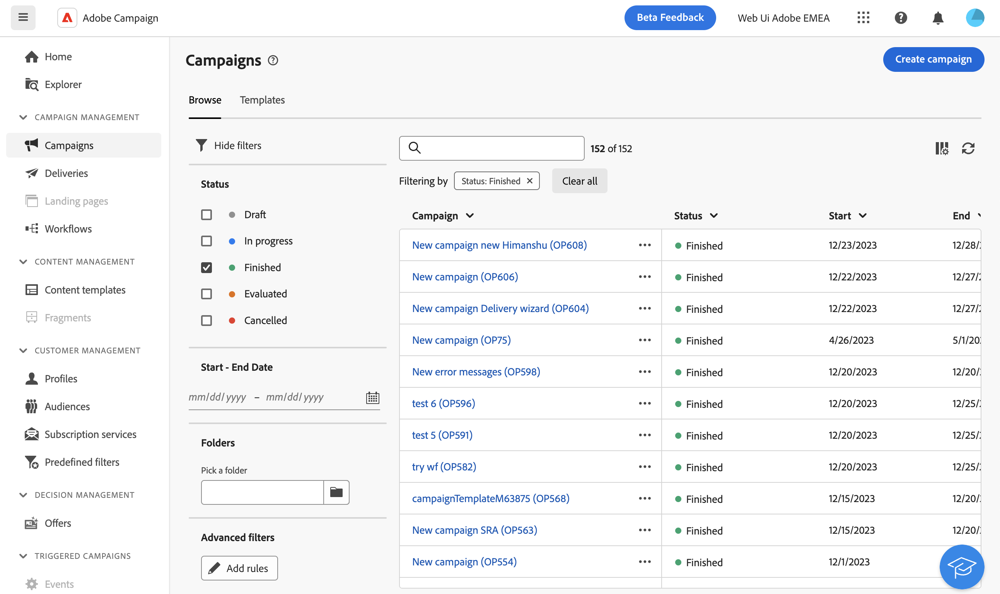

# 篩選清單 {#filter-lists}

您可以篩選物件清單，讓您根據特定內容條件篩選資訊。

## 套用篩選器 {#apply}

若要將篩選器套用至清單，請按一下 **[!UICONTROL 顯示篩選器]** 位於清單左上角、搜尋列旁的按鈕。

篩選器窗格隨即開啟，顯示所選清單的可用篩選器。

{zoomable="yes"}{width="70%" align="left" zoomable="yes"}

若要根據您自己的條件來篩選清單，請建立自訂篩選器。 若要這麼做，請瀏覽至篩選器窗格的底部，然後按一下 **新增規則** 按鈕。 [瞭解如何建立自訂篩選器](#custom)

篩選器一旦套用至清單，就會顯示在搜尋列下方。 您可以隨時移除個別篩選器，或按一下 **全部清除** 按鈕。

## 建立自訂篩選器 {#custom}

自訂篩選器可讓您根據自己的特定條件來調整清單。 這些範本是使用查詢建模程式設計的。 若要建立自訂篩選器，請遵循下列步驟：

1. 開啟篩選器窗格，然後按一下 **新增規則** 位於窗格底部的按鈕。

1. 查詢建模器隨即開啟。 定義並結合您的篩選條件以符合您的需求。 有關如何使用查詢建模器的詳細資訊，請參閱 [本節](../query/query-modeler-overview.md).

1. 設定自訂篩選器後，請按一下 **[!UICONTROL 確認]** 以將其套用至清單。
