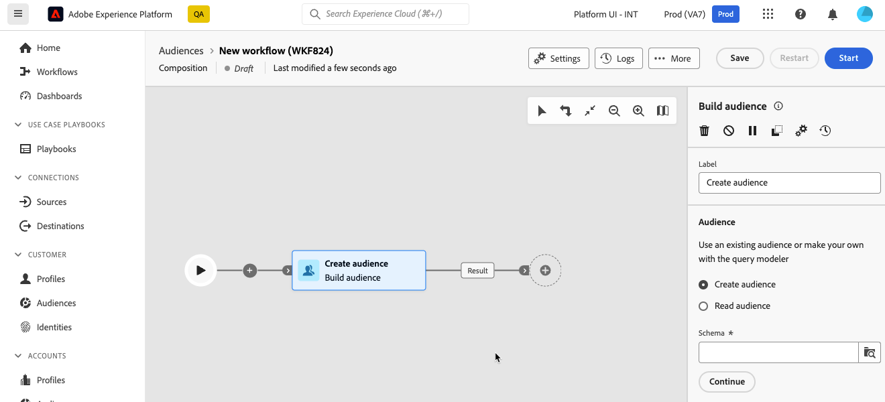
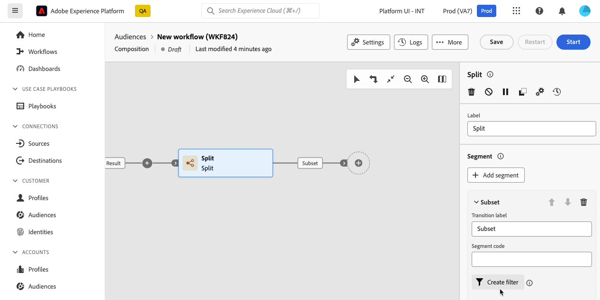
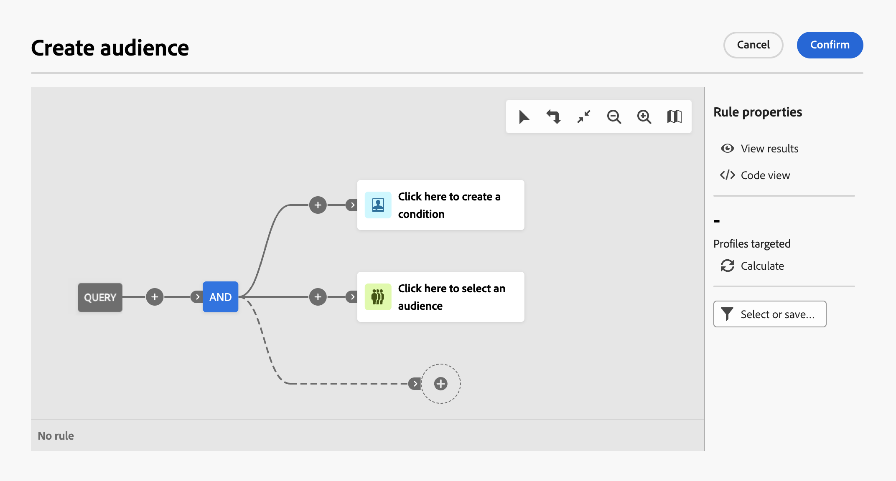

# 使用查詢建模工具 {#segment-builder}

>[!CONTEXTUALHELP]
>id="dc_orchestration_querymodeler_querymessage"
>title="查詢建模工具"
>abstract="為收件者或資料庫中的任何其他結構描述 (又名目標市場選擇維度) 定義篩選條件。"

查詢模組化工具可簡化根據各種條件篩選資料庫的程式。 此外，查詢模型工具還能有效率地管理非常複雜和冗長的查詢，提供增強的彈性和精確度。 此外，它支援條件內的預先定義篩選器，使您可輕鬆調整查詢，同時利用進階運算式和運運算元實現全面的受眾目標定位和細分策略。

## 存取查詢模型工具

查詢建模工具適用於每個您需要定義篩選資料的規則的環境。

| 使用方式 | 範例 |
|  ---  |  ---  |
| **定義對象**：指定您要在組成中鎖定的母體，並輕鬆建立根據您的需求量身打造的新對象。 | {zoomable="yes"}{width="200" align="center" zoomable="yes"} |
| **自訂活動**：在構成活動中套用規則，例如&#x200B;**分割**&#x200B;和&#x200B;**調解**，以符合您的特定需求。 [進一步瞭解組合活動](../compositions/activities/about-activities.md) | {zoomable="yes"}{width="200" align="center" zoomable="yes"} |

## 查詢模組化介面 {#interface}

查詢模型工具會提供一個中央畫布，您可在其中建立查詢，以及一個右窗格，提供查詢的相關資訊。

{zoomable="yes"}

### 中央畫布 {#canvas}

查詢建模器中央畫布是您新增和組合不同元件以建立查詢的位置。 [瞭解如何建立查詢](build-query.md)

位於畫布右上角的工具列提供可輕鬆操控查詢元件並在畫布中導覽的選項：

* **[!UICONTROL 多重選取模式]**：選取多個篩選元件，以複製並貼至您選擇的位置。
* **[!UICONTROL 旋轉]**：垂直切換畫布。
* **[!UICONTROL 符合熒幕大小]**：調整畫布縮放等級以符合熒幕。
* **[!UICONTROL 縮小]** / **[!UICONTROL 放大]**：縮小或進入畫布。
* **[!UICONTROL 顯示地圖]**：開啟顯示您所在位置的畫布快照。

### 規則屬性窗格 {#rule-properties}

在右側，**[!UICONTROL 規則屬性]**&#x200B;窗格會提供您查詢的相關資訊。 它可讓您執行各種作業來檢查查詢，並確保查詢符合您的需求。 建立查詢以建立對象時，會顯示此窗格。 [瞭解如何檢查及驗證您的查詢](build-query.md#check-and-validate-your-query)
