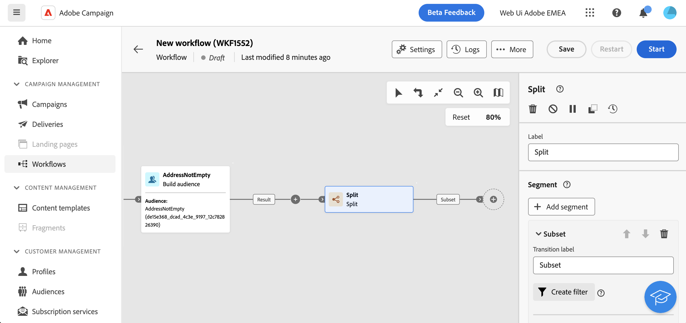
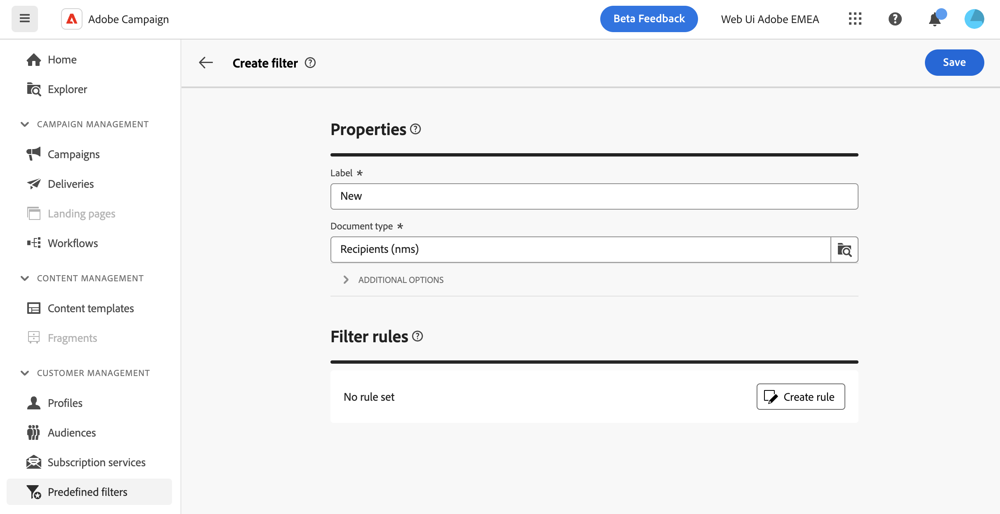
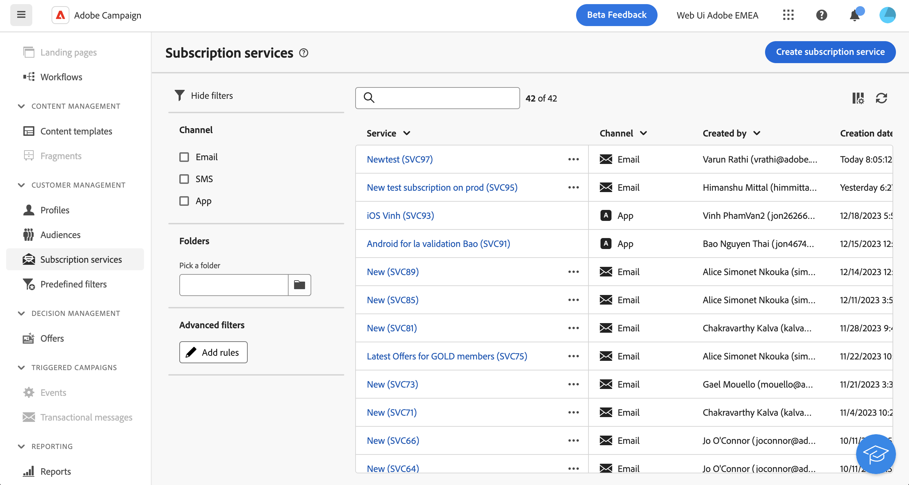

# 使用查詢建模工具 {#segment-builder}

>[!CONTEXTUALHELP]
>id="dc_orchestration_querymodeler_querymessage"
>title="查詢建模工具"
>abstract="從資料庫定義收件者或任何其他目標維度的篩選條件。"

查詢模組化工具可簡化根據各種條件篩選資料庫的程式。 此外，查詢模型工具還能有效率地管理非常複雜和冗長的查詢，提供增強的彈性和精確度。 此外，它支援條件內的預先定義篩選器，使您可輕鬆調整查詢，同時利用進階運算式和運運算元實現全面的受眾目標定位和細分策略。

## 存取查詢模型工具

查詢建模工具適用於每個您需要定義篩選資料的規則的環境。

| 使用方式 | 範例 |
|  ---  |  ---  |
| **定義對象**：指定您要在構成中鎖定的母體，並根據您的需求輕鬆建立新對象。 | {zoomable="yes"}{width="200" align="center" zoomable="yes"} |
| **自訂工作流程活動**：在工作流程活動中套用規則，例如 **Split** 和 **調解**，以符合您的特定需求。 [進一步瞭解工作流程活動](../compositions/activities/about-activities.md) | {zoomable="yes"}{width="200" align="center" zoomable="yes"} |
| **預先定義的篩選器**：建立預先定義的篩選器，以做為各種篩選作業期間的捷徑，無論您是使用資料清單或形成傳送的對象。 | {zoomable="yes"}{width="200" align="center" zoomable="yes"} |
| **自訂清單**：建立自訂規則，以篩選清單中顯示的資料，例如收件者、傳遞清單等。 | {zoomable="yes"}{width="200" align="center" zoomable="yes"} |

## 查詢模組化介面 {#interface}

查詢模型工具會提供一個中央畫布，您可在其中建立查詢，以及一個右窗格，提供查詢的相關資訊。

{zoomable="yes"}

### 中央畫布 {#canvas}

查詢建模器中央畫布是您新增和組合不同元件以建立查詢的位置。 [瞭解如何建立查詢](build-query.md)

位於畫布右上角的工具列提供可輕鬆操控查詢元件並在畫布中導覽的選項：

* **多重選擇模式**：選取多個篩選元件，以將它們複製並貼到您選擇的位置。
* **旋轉**：垂直切換畫布。
* **符合熒幕大小**：調整畫布縮放等級以符合熒幕。
* **縮小顯示** / **放大顯示**：縮小或拉近畫布。
* **顯示地圖**：開啟畫布的快照，顯示您所在的位置。

### 規則屬性窗格 {#rule-properties}

在右側， **[!UICONTROL 規則屬性]** 窗格提供有關查詢的資訊。 它可讓您執行各種作業來檢查查詢，並確保查詢符合您的需求。 [瞭解如何檢查及驗證您的查詢](build-query.md#check-and-validate-your-query)
