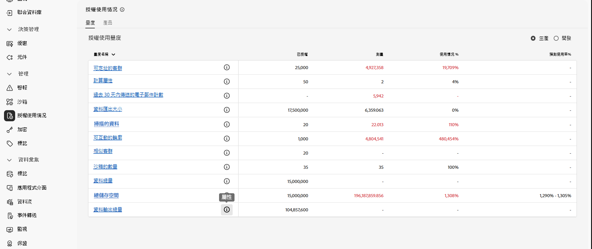
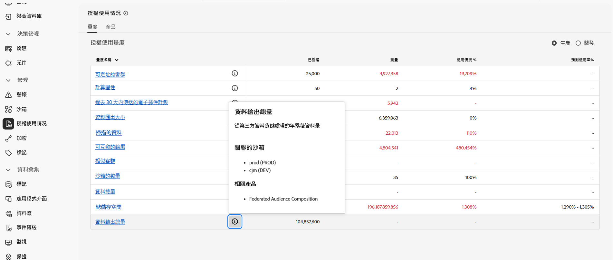

# 先決條件和護欄 {#fac-access}

聯合客群構成需要 Adobe Real-Time Customer Data Platform 和/或 Adobe Journey Optimizer **Prime** 或 **Ultimate** 套件。若要存取此功能，您必須已購買聯合客群構成附加元件。

>[!AVAILABILITY]
>
>在您收到 Adobe 的歡迎電子郵件通知後，可能需要等候幾個小時，才能看到更新的介面並使用相關功能。

## 支援的系統 {#supported-systems}

聯合客群構成支援下列雲端倉儲：

* Amazon Redshift
* Azure Synapse
* Databricks
* Google BigQuery
* Snowflake
* Vertica Analytics
* Microsoft Fabric

若要了解如何與這些系統建立連線，請參閱[此頁面](../connections/connections.md)。

## 沙箱

購買聯合客群構成後，您有權使用兩個沙箱。若有任何額外的沙箱佈建請求，請聯絡您的 Adobe 代表。

若要檢視使用中的聯合客群構成清單，請依照下列步驟操作：

1. 從聯合客群構成中，存取「**[!UICONTROL 管理]**」下方的「**[!UICONTROL 授權使用量]**」選單。

1. 按一下「**[!UICONTROL 資料輸出總量]**」中的  圖示，以存取您的沙箱屬性。

   

1. 您沙箱的相關資訊會顯示在「屬性」彈出提示框中。

   

## 權限 {#permissions}

若要存取聯合客群構成，您必須將使用者新增至購買時所建立的沙箱特定產品設定檔中，並為其指派「**[!UICONTROL 管理聯合資料]**」權限。[了解更多](/help/governance-privacy-security/access-control.md)

## IP 允許清單 {#ip}

若要安全地啟用聯合客群構成來存取您的資料庫，您必須授權將存取這些資料庫的聯合客群構成伺服器的 IP 位址。在 Adobe Experience Platform 使用者介面中新增聯合資料庫時，這些 IP 位址便會顯示。[了解更多](../connections/connections.md)

將這些 IP 位址新增至您的允許清單，以授予聯合客群構成的存取權。

## 合併原則 {#merge-policies}

若要使用同盟對象構成來產生對象，您&#x200B;**必須**&#x200B;使用依順序&#x200B;**合併原則的**&#x200B;時間戳記。 如果您的對象使用&#x200B;**資料集優先順序**&#x200B;合併原則，請聯絡Adobe客戶服務以繼續。

如需合併原則的詳細資訊，請閱讀[合併原則概觀](https://experienceleague.adobe.com/zh-hant/docs/experience-platform/profile/merge-policies/overview)。

## 護欄與限制 {#fac-guardrails}

* [Adobe Real-Time Customer Data Platform 文件](https://experienceleague.adobe.com/zh-hant/docs/experience-platform/profile/guardrails){target="_blank"}中列出的權益、產品限制及效能護欄，均適用於聯合客群構成。

* 聯合客群構成支援匯出大量客群，檔案大小可大於 1GB。為了獲得最佳效能，建議的檔案大小上限為 20GB。
