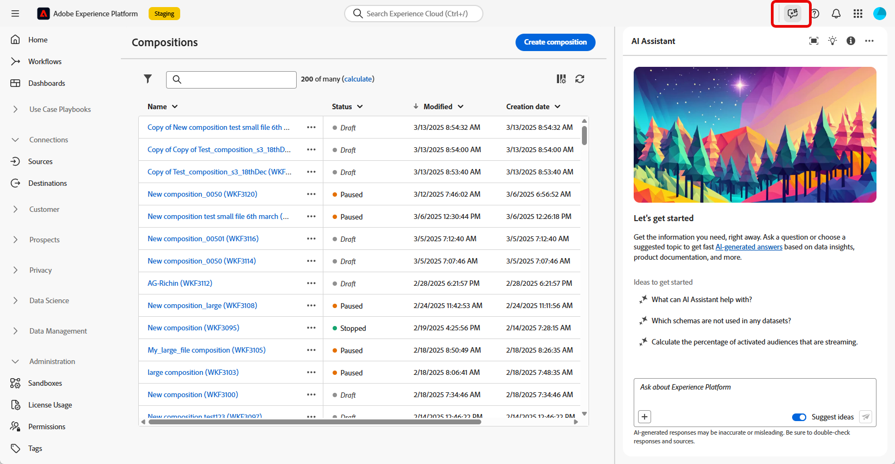
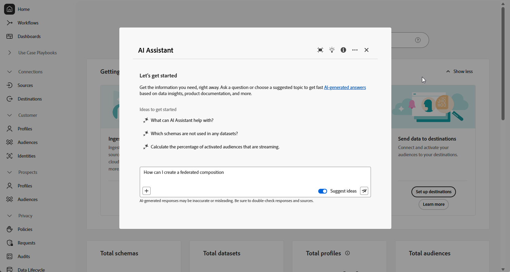
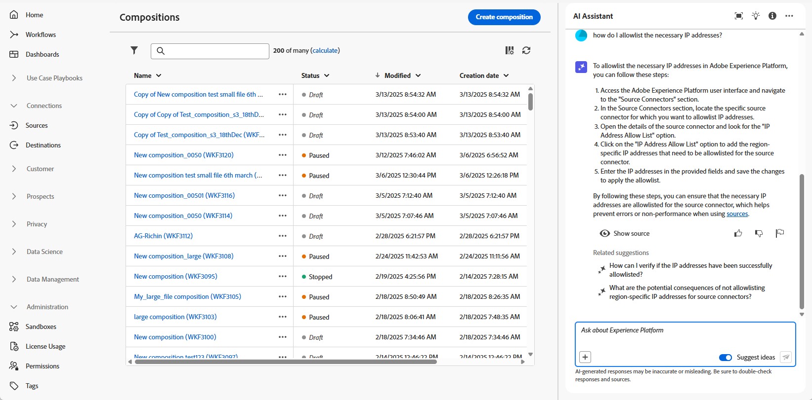

# 使用 AI 助理 {#ai-assistant}

AI 助理是一項使用者介面功能，旨在協助您導覽和了解 Adobe 概念。它適用於 Adobe Experience Cloud 中多個產品的產品知識使用案例，包括聯合客群構成。

>[!CAUTION]
>
>您必須同意 Adobe Experience Cloud 生成式 AI 使用者準則，然後才能使用 AI 助理。若要了解更多有關此協議的資訊，請參閱[此頁面](https://experienceleague.adobe.com/zh-hant/docs/experience-platform/ai-assistant/home){target="_blank"}。

在聯合客群構成中，您可以存取產品知識來了解與流程不同部分相關的 Adobe 概念。AI 助理支援兩種類型的產品知識：**開放式探索** (根據 Experience League 文件來探索產品概念) 和&#x200B;**有針對性的學習和疑難排解** (詢問有關特定功能的問題)。

此類問題的範例包括：

* 什麼是聯合客群構成？
* 如何設定 Snowflake 聯合資料庫帳戶？
* 如何建立聯合構成？

若要提出問題：

1. 按一下頂端列上的圖示來存取 AI 助理。

   AI 助理會顯示在畫面的右側區段。您可以按一下  來展開 AI 助理視窗。

   

1. 將其輸入到畫面底部的欄位中，然後按 Enter 鍵。

   

1. 查看答案並使用「**顯示來源**」按鈕，取得產品文件的直接連結並了解更多資訊。

   

1. 使用「按讚」和「不滿意」來評價該答案。

若要了解如何使用 AI 助理、查看您可以使用 AI 助理實現的範例目標，以及了解 AI 助理的運作方式，請參閱 [Adobe Experience Platform 文件](https://experienceleague.adobe.com/zh-hant/docs/experience-platform/ai-assistant/home){target="_blank"}。
