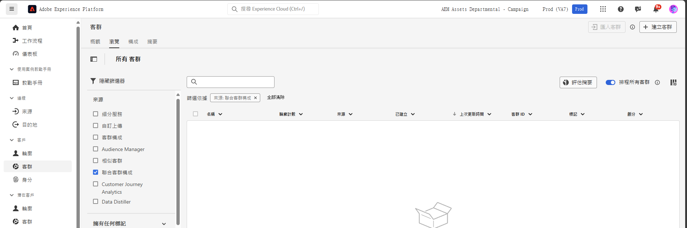

# 使用客群 {#gs-audiences}

Experience Platform 聯合客群構成可讓您[建立構成](../compositions/gs-compositions.md)，以便在其中利用視覺畫布中的各種活動來建立客群，並將其儲存到 Adobe Experience Platform 客群入口網站中。

然後，您可以在 Journey Optimizer 中鎖定這些客群，或在 Adobe Experience Platform 支援的任何目的地上啟用他們。

## 使用構成建立客群{#creation}

若要使用聯合客群構成建立客群，您必須建立一個包含&#x200B;**[!UICONTROL 儲存客群]**&#x200B;活動的構成。此活動可讓您將客群儲存到客群入口網站中，並從外部資料庫中選取要包含在客群中的欄位。[了解如何設定儲存客群活動](../compositions/activities/save-audience.md)

使用 Adobe 聯合客群構成所建立的客群包含了在&#x200B;**[!UICONTROL 儲存客群]**&#x200B;活動中選取的所有欄位，並與所有 Adobe Experience Platform 客群一起儲存在客群入口網站中。

在執行構成後，產生的客群將作為外部客群儲存在 Adobe Experience Platform 中，並可用於 Adobe Real-Time Customer Data Platform 和/或 Adobe Journey Optimizer。

您可以在 Adobe Experience Platform 支援的任何目的地上啟用這些客群。了解如何在 [Adobe Experience Platform](https://experienceleague.adobe.com/zh-hant/docs/experience-platform/destinations/home){target="_blank"} 中使用目的地。

>[!NOTE]
>
>使用 Adobe 聯合客群構成建立的客群無法編輯。若要修改這些客群，您需要使用構成方法來建立新的客群。

## 在 Adobe Experience Platform 中存取客群 {#access-audience}

使用聯合客群構成所建立的客群可在客群入口網站中透過「**客群**」選單進行存取。

**[!UICONTROL 瀏覽]**&#x200B;索引標籤會列出已儲存至 Adobe Experience Platform 的所有現有客群。您可以使用&#x200B;**[!UICONTROL 來源]**&#x200B;資料欄或左側窗格中的可用篩選器，在清單中找出聯合客群構成客群。

如需如何在 Adobe Experience Platform 中使用客群的詳細資訊，請參閱[客群入口網站文件](https://experienceleague.adobe.com/zh-hant/docs/experience-platform/segmentation/ui/audience-portal){target="_blank"}

<!-- add link to this donc once published: https://jira.corp.adobe.com/browse/PLAT-198674-->