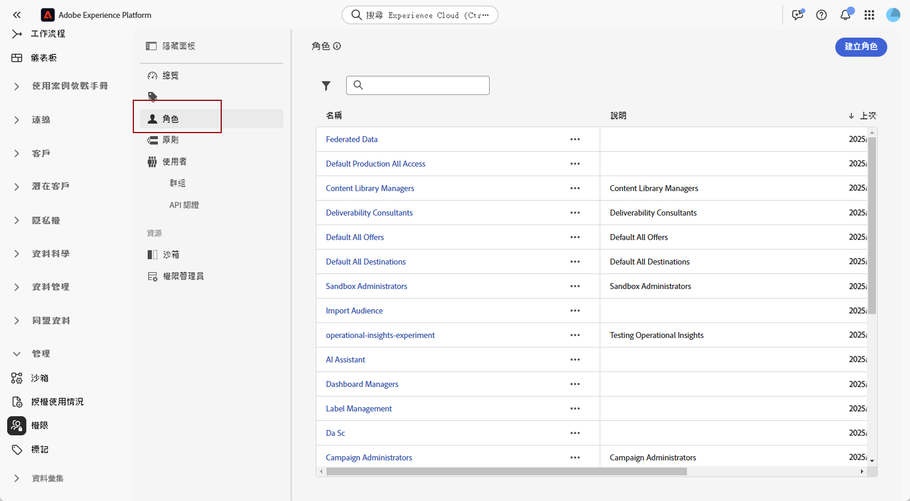
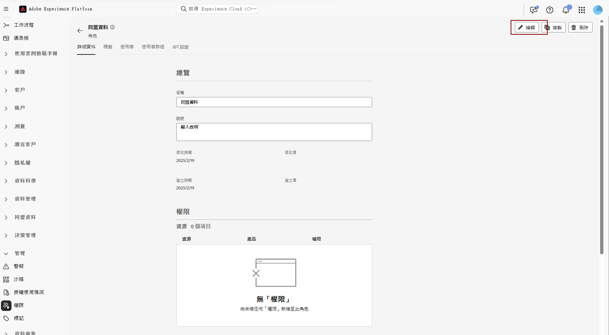
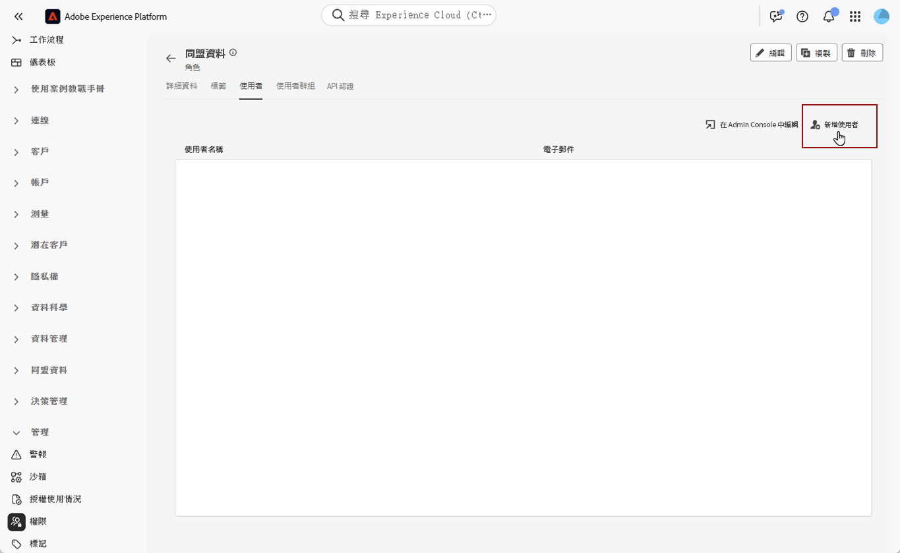

# 存取同盟對象構成 {#feature-access}

## 管理對沙箱的存取 {#access-sandboxes}

當您購買聯合客群構成附加元件時，系統會為當時的每個使用中沙箱建立一個產品設定檔。此產品設定檔是在 Admin Console 中的 **Adobe Experience Platform** 產品卡下方建立，並遵循以下命名慣例：`ACP_FAC - <<SandboxName>> - admin.`。若要存取特定沙箱的聯合客群構成，您必須將使用者新增至為該沙箱建立的產品設定檔中。

例如，如果啟用名為「fac-test」的新沙箱，則會建立對應的產品設定檔「ACP_FAC - fac-test - admin」。為了使用此沙箱存取聯合客群構成，您必須將使用者新增至此產品設定檔。

## 管理對同盟對象構成的存取

>[!AVAILABILITY]
>
>許可權在3月版本中提供。

若要存取&#x200B;**同盟對象構成**，您必須先確定已將&#x200B;**管理同盟資料**&#x200B;許可權指派給適當的角色。 這些角色必須指派給需要存取&#x200B;**同盟對象構成**&#x200B;的使用者。

請注意，只有管理員才能指派許可權。

1. 瀏覽至&#x200B;**[!UICONTROL 許可權]**&#x200B;功能表。

1. 從&#x200B;**[!UICONTROL 角色]**&#x200B;功能表，選取您要更新的&#x200B;**[!UICONTROL 角色]**。

   

1. 按一下&#x200B;**[!UICONTROL 編輯]**&#x200B;以修改您角色的許可權。

   

1. 新增&#x200B;**同盟資料**&#x200B;資源，然後從下拉式功能表中選取&#x200B;**[!UICONTROL 管理同盟資料]**。

   

1. 完成必要的變更後，請按一下[儲存]。****

任何已指派給此角色的使用者都會自動更新其許可權，並可存取同盟對象構成。

若要將此角色指派給新使用者：

1. 導覽至您角色儀表板中的&#x200B;**[!UICONTROL 使用者]**&#x200B;索引標籤，然後按一下&#x200B;**[!UICONTROL 新增使用者]**。

   

1. 輸入使用者的名稱或電子郵件地址，或從可用清單中選取。 完成後，按一下&#x200B;**[!UICONTROL 儲存]**。

之後，使用者會收到電子郵件，其中包含存取您執行個體的指示。 如果之前未建立使用者，請參閱[此文件](https://experienceleague.adobe.com/zh-hant/docs/experience-platform/access-control/abac/permissions-ui/users)。
