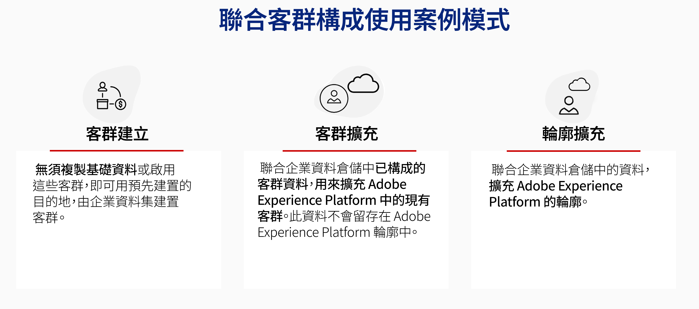

# 開始使用同盟對象構成 {#gs-fac}

同盟對象構成是[Adobe Real-time Customer Data Platform](https://experienceleague.adobe.com/en/docs/experience-platform/segmentation/home){target="_blank"}和[Adobe Journey Optimizer](https://experienceleague.adobe.com/zh-hant/docs/journey-optimizer/using/ajo-home){target="_blank"}的附加功能，可讓您從協力廠商資料倉儲建立並擴充對象，並將對象匯入至Adobe Experience Platform。 同盟對象構成提供簡單而強大的解決方案，可直接在Adobe Real-time Customer Data Platform及/或Adobe Journey Optimizer中連線您的企業資料倉儲，並在Data Warehouse的表格上執行查詢。

Adobe同盟對象構成可協助Adobe Experience Platform應用程式使用者存取其儲存在資料倉儲和雲端儲存平台(例如Amazon Redshift、Azure synapse Analytics等)的客戶資料。 客戶資料可存放在多個資料倉儲中，現在無需複製即可立即存取。 支援的平台列於[此頁面](../connections/federated-db.md#supported-db)。

## 功能 {#rn-capabilities}

同盟受眾構成透過全面性的受眾策劃和啟用方法，進一步延伸Real-Time CDP和Journey Optimizer的價值：

* 擴充對關鍵倉儲型資料集的存取權，以建立高價值受眾：運用現有的資料倉儲作為主要記錄系統，同時運用同級最佳的應用程式來強化絕佳的客戶體驗。

* 全面支援強力參與使用案例：同盟受眾構成、搭配Real-Time CDP或Journey Optimizer支援品牌啟動的個人化體驗與同盟受眾，並提供即時事件觸發的即時體驗，加上人員屬性，以滿足跨團隊的使用案例需求。

* 將資料移動和複製最小化：從位於企業資料倉儲中的資料集建立對象，無需複製基礎資料即可管理可操作的行銷設定檔和對象。

* 針對體驗導向工作流程利用單一系統：在Adobe Experience Platform中組織內嵌和同盟對象，並協調所有管道的對外體驗。

## 使用案例 {#rn-uc}

透過方便行銷的UI，建立區段規則來查詢您的資料倉儲，以取得符合行銷活動所需特定區段資格的使用者清單、存取倉儲中的現有對象以進行啟用，或利用倉儲中存在的其他資料點來擴充Adobe Experience Platform對象。

此版本提供兩種使用案例：

1. 對象建立：從企業資料集建立新對象，而不複製基礎資料，並使用預先建立的目的地啟用這些對象&#x200B;。

1. 對象擴充：利用從企業資料倉儲已同盟的構成對象資料，擴充Adobe Experience Platform中的現有對象。 此資料不會儲存在Adobe Experience Platform客戶設定檔中。

{zoomable="yes"}{width="75%" align="center"}

## 主要步驟 {#gs-steps}

Adobe同盟對象構成可讓您直接從資料庫建立和更新Adobe Experience Platform對象，無需任何擷取程式。

{zoomable="yes"}{width="85%" align="center"}

關鍵步驟：

1. **資料整合**：將各種來源的資料彙整在一起，並將它們合併到統一的資料集中。 在[本節](../connections/federated-db.md)中詳細瞭解如何連結Adobe Experience Platform應用程式和您的企業資料倉儲、支援的資料庫，以及如何設定它們。

2. **資料模型**：設計和建立定義資料結構、關係和限制的資料模型和結構描述。 在[此頁面](../customer/schemas.md)中進一步瞭解結構描述。 在[此頁面](../data-management/gs-models.md)中瞭解如何建立資料模型的連結。

3. **資料轉換**：套用資料操作技術來修改資料元素的格式、結構或值，使其相容或適用於特定的分析或應用程式。

4. **資料使用**：建立、協調和建立對象。 瞭解如何在[此頁面](../compositions/gs-compositions.md)中撰寫對象。 您也可以透過Adobe Experience Platform對象入口網站和目標，更新或重複使用現有的對象。 在[本頁](../connections/destinations.md)中進一步瞭解

>[!NOTE]
>
>執行構成後，產生的受眾會作為外部受眾儲存在Adobe Experience Platform中，並可供Adobe Real-Time Customer Data Platform和/或Adobe Journey Optimizer使用。 它可在&#x200B;**對象**&#x200B;功能表中存取。 [了解更多](https://experienceleague.adobe.com/en/docs/experience-platform/segmentation/ui/audience-portal){target="_blank"}
>

## 更多詳情 {#learn}

<!-- Workflow + Workflow activities-->

請參閱[此頁面](faq.md)中的常見問題。

>[!CONTEXTUALHELP]
>id="dc_workflow_settings_execution"
>title="執行設定"
>abstract="您可以在此段落中設定與工作流程執行相關的設定，例如構成歷程記錄的保留天數。"

>[!CONTEXTUALHELP]
>id="dc_orchestration_query_enrichment_noneditable"
>title="活動不可編輯"
>abstract="當在主控台利用其他資料設定&#x200B;**查詢**&#x200B;或&#x200B;**擴充**&#x200B;活動時，會將擴充資料納入考量，並傳遞至出站轉變，但無法編輯。"

<!-- Create a link -->

>[!CONTEXTUALHELP]
>id="dc_federated_database_create_link"
>title="建立連結"
>abstract="定義連結設定。"
