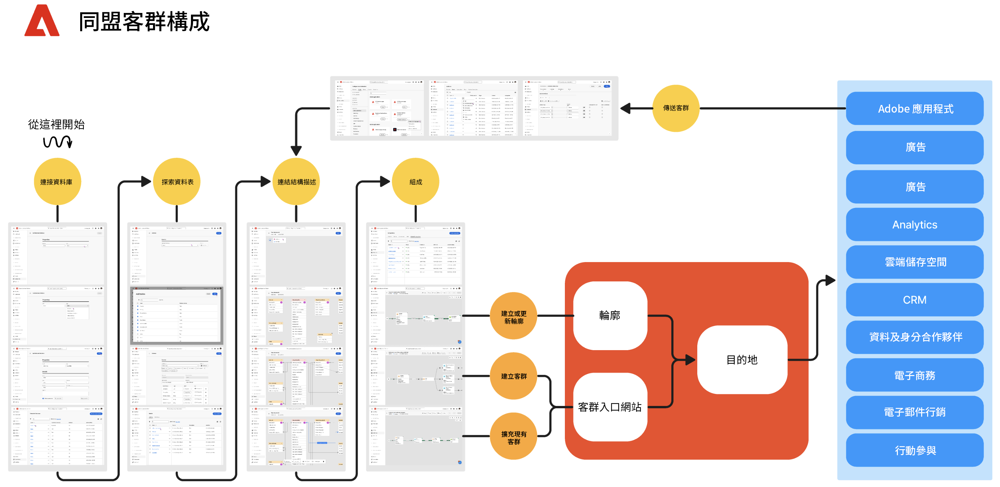

# 開始使用聯合客群構成 {#gs-fac}

同盟對象組合可用於[Adobe Real-Time Customer Data Platform](https://experienceleague.adobe.com/zh-hant/docs/experience-platform/segmentation/home){target="_blank"}和[Adobe Journey Optimizer](https://experienceleague.adobe.com/zh-hant/docs/journey-optimizer/using/ajo-home){target="_blank"}環境。 它可讓您從協力廠商資料倉儲建立及擴充對象，並將對象匯入至Adobe Experience Platform。 聯合客群構成提供簡易且強大的解決方案，可讓您直接在 Adobe Real-Time Customer Data Platform 和/或 Adobe Journey Optimizer 中連接企業資料倉儲，並針對資料倉儲中的表格執行查詢。

有了 Adobe 聯合客群構成協助，Adobe Experience Platform 應用程式使用者就能存取儲存在資料倉儲與雲端儲存平台 (如 Amazon Redshift、Azure Synapse Analytics 等) 中的客戶資料。現在，客戶資料可以存放在多個資料倉儲中，而且無需複寫，就能立即存取。[此頁面](../connections/federated-db.md#supported-db)列出了支援的平台。

>[!INFO]
>
>請遵循此[逐步指南](https://experienceleague.adobe.com/zh-hant/docs/platform-learn/tutorial-comprehensive-technical/datacollection/module13/fac)，了解如何使用聯合客群構成來建立客群。

## 功能 {#rn-capabilities}

聯合客群構成會透過全面的客群管理和啟用方法來擴充 Real-Time CDP 和 Journey Optimizer 的價值：

* 擴大對基於倉儲的關鍵資料集的存取以建立高價值客群：利用現有資料倉儲作為主要記錄系統，同時利用同級最佳的應用程式來提升卓越的客戶體驗。

* 對提高參與度使用案例的全面支援：將聯合客群構成與 Real-Time CDP 或 Journey Optimizer 搭配使用，以支援聯合客群的品牌發起的個人化體驗、提供由即時事件觸發的即時體驗，並與人員屬性結合來滿足跨團隊的使用案例要求。

* 盡量減少資料移動和複製：從企業資料倉儲的資料集中建立客群，而無需複製基礎資料來管理可操作的行銷輪廓和客群。

* 利用單一系統來實現體驗驅動的工作流程：在 Adobe Experience Platform 中管理攝取和聯合的客群，並協調所有管道的傳出體驗。

## 使用案例 {#rn-uc}

透過行銷人員一看就懂的使用者介面，建立用來查詢資料倉儲的區段規則，找出符合行銷活動所需特定區段資格的使用者清單；存取倉儲中的現有客群並加以啟用，或使用倉儲中的其他現有資料點擴充 Adobe Experience Platform 客群。

在此版本中，有兩個可用的使用案例：

1. 客群建立：從企業資料集中建立新客群，而無需複製基礎資料，並透過預先建立的目的地來啟用這些客群。

1. 客群擴充：利用從企業資料倉儲聯合的構成客群資料，擴充 Adobe Experience Platform 中的現有客群。此資料將不會長期保存在 Adobe Experience Platform 客戶輪廓中。

{zoomable="yes"}{width="75%" align="center"}

## 主要步驟 {#gs-steps}

Adobe 聯合客群構成可讓您直接從資料庫建立和更新 Adobe Experience Platform 客群，無需任何擷取程序。

<!--{zoomable="yes"}{width="85%" align="center"}-->

主要步驟：

1. **資料整合**：匯集各種來源的資料，並合併為統一的資料集。若要進一步了解如何連接 Adobe Experience Platform 應用程式和您的企業資料倉儲、支援的資料庫，以及如何設定這些資料庫，請參閱[本節](../connections/federated-db.md)說明。

1. **資料模式**：設計並建立資料模型和結構描述，以定義資料的結構、關係和限制。前往[此頁面](../customer/schemas.md)深入了解結構描述。前往[此頁面](../data-management/gs-models.md)學習如何為資料模型建立連結。

1. **資料轉換**：應用資料處理技術，修改資料元素的格式、結構或值，使其相容或適用於特定的分析或應用程式。

1. **資料使用**：建立、協調及建置客群。前往[此頁面](../compositions/gs-compositions.md)了解如何構成客群。您也可以透過 Adobe Experience Platform Audience Portal 和目標系統，更新或重複使用現有的客群。前往[此頁面](../connections/destinations.md)了解更多

>[!NOTE]
>
>在執行構成後，產生的客群將作為外部客群儲存在 Adobe Experience Platform 中，並可用於 Adobe Real-Time Customer Data Platform 和/或 Adobe Journey Optimizer。該客群可透過「**客群**」選單進行存取。[了解更多](https://experienceleague.adobe.com/zh-hant/docs/experience-platform/segmentation/ui/audience-portal){target="_blank"}

## 治理、隱私和安全性 {#governance-privacy-security}

### 隱私權請求 {#gov-privacy-requests}

建立構成後，系統會將產生的對象儲存至Adobe Experience Platform中。

然後，您可以透過Adobe Experience Platform **Privacy Service**&#x200B;提出隱私權請求，存取和/或刪除對應至這些對象的設定檔資料，此網站提供[使用者介面](https://experienceleague.adobe.com/docs/experience-platform/privacy/ui/user-guide.html?lang=zh-Hant){target="_blank"}和[RESTful API](https://experienceleague.adobe.com/zh-hant/docs/experience-platform/privacy/api/overview){target="_blank"}，協助您管理客戶資料請求。

>[!NOTE]
>
>如需Privacy Service的詳細資訊，請參閱[Adobe Experience Platform檔案](https://experienceleague.adobe.com/docs/experience-platform/privacy/home.html?lang=zh-Hant){target="_blank"}。

您可以建立和管理存取和刪除Adobe同盟對象構成中客戶資料的個別請求。 在[即時客戶個人檔案檔案](https://experienceleague.adobe.com/zh-hant/docs/experience-platform/profile/privacy){target="_blank"}中詳細說明了提交&#x200B;**存取要求**&#x200B;和&#x200B;**刪除要求**&#x200B;的步驟。

### 稽核軌跡 {#gov-audit-trail}

稽核軌跡功能會針對您的環境即時提供所有動作和事件的詳細時間順序記錄。 [了解更多](../admin/audit-trail.md)

## 了解更多 {#learn}

<!-- Workflow + Workflow activities-->

若要了解如何存取聯合客群構成、護欄和限制，請參閱[此頁面](access-prerequisites.md)。

另請參閱[此頁面](faq.md)的常見問題。

>[!CONTEXTUALHELP]
>id="dc_workflow_settings_execution"
>title="執行設定"
>abstract="在此區段中，您可以設定與工作流程執行相關的設定，例如構成歷史記錄的保留天數。"

>[!CONTEXTUALHELP]
>id="dc_orchestration_query_enrichment_noneditable"
>title="活動不可編輯"
>abstract="當在主控台利用其他資料設定&#x200B;**查詢**&#x200B;或&#x200B;**擴充**&#x200B;活動時，會將擴充資料納入考量，並傳遞至出站轉變，但無法編輯。"

<!-- Create a link -->

>[!CONTEXTUALHELP]
>id="dc_federated_database_create_link"
>title="建立連結"
>abstract="定義連結設定。"

<!-- incremental query IDs -->

>[!CONTEXTUALHELP]
>id="dc_orchestration_incrementalquery"
>title="增量查詢"
>abstract=" **增量查詢**&#x200B;活動可讓您使用查詢建模工具查詢資料庫。每次執行此活動時，都會排除先前執行的結果。這可讓您只鎖定新元素。"

>[!CONTEXTUALHELP]
>id="dc_orchestration_incrementalquery_history"
>title="增量查詢歷史記錄"
>abstract="增量查詢歷史記錄"

>[!CONTEXTUALHELP]
>id="dc_orchestration_incrementalquery_processeddata"
>title="增量查詢處理的資料"
>abstract="增量查詢處理的資料"

>[!CONTEXTUALHELP]
>id="dc_orchestration_incrementalmode_standard"
>title="增量查詢模式"
>abstract="增量查詢可讓您多次執行相同的查詢，方式是每次新執行時排除先前執行的結果。"

>[!CONTEXTUALHELP]
>id="dc_orchestration_incrementalmode_custom"
>title="增量查詢模式"
>abstract="增量查詢可讓您多次執行相同的查詢，方式是每次執行時只考慮日期欄位晚於或等於增量查詢活動上次執行日期的結果。"

>[!CONTEXTUALHELP]
>id="dc_orchestration_build_audience_dimension"
>title="選取目標市場選擇維度"
>abstract="目標市場選擇維度可讓您定義作業的目標群體：收件者、合約受益人、操作者、訂閱者等。對於電子郵件和簡訊，依預設，目標是從收件者內建表格中選取。對於推播通知，預設目標市場選擇維度是訂閱者應用程式。"

<!-- save profile IDs-->

>[!CONTEXTUALHELP]
>id="dc_orchestration_saveprofile"
>title="儲存輪廓"
>abstract="儲存輪廓"

>[!CONTEXTUALHELP]
>id="dc_orchestration_saveprofile_aepschemalist"
>title="儲存輪廓 AEP 結構描述清單"
>abstract="儲存輪廓 AEP 結構描述清單"

>[!CONTEXTUALHELP]
>id="dc_orchestration_saveprofile_selectaepattribute"
>title="儲存輪廓 AEP 結構描述屬性"
>abstract="儲存輪廓 AEP 結構描述屬性"

>[!CONTEXTUALHELP]
>id="dc_orchestration_saveprofile_primaryidentitynamespace"
>title="選取主要識別欄位"
>abstract="用於設定檔的主要識別欄位。"

>[!CONTEXTUALHELP]
>id="ddc_orchestration_saveprofile_selectdataset"
>title="AEP資料集"
>abstract="選取要用於設定檔的AEP資料集。"

>[!CONTEXTUALHELP]
>id="dc_orchestration_saveprofile_selectaepschema"
>title="儲存輪廓選取 AEP 結構描述"
>abstract="選取用於設定檔的AEP結構描述。"
